# ALICE: An Interpretable Neural Architecture for Generalization in Substitution Ciphers

原论文链接：[arXiv:2509.07282](https://arxiv.org/abs/2509.07282)

项目页：[ALICE project page](https://jshen.net/alice/)

代码：[al-jshen/alice](https://github.com/al-jshen/alice)

本地 PDF：[ALICE - An Interpretable Neural Architecture for Generalization in Substitution Ciphers.pdf](../../../02_Papers/ALICE%20-%20An%20Interpretable%20Neural%20Architecture%20for%20Generalization%20in%20Substitution%20Ciphers.pdf)

上位地图：[[MOC - 计算机]] · [[Privacy Inference/领域地图]]

相关主题：[[Transformer]]、[[替换密码]]、[[置换学习]]、[[Gumbel-Sinkhorn]]、[[组合泛化]]、[[可解释性]]、[[符号错误率]]、[[训练分布与测试分布]]

### Abstract

这篇论文把 cryptogram solving 作为研究神经网络推理、泛化和可解释性的测试床。任务表面上是解娱乐报纸里的替换密码，深层上是让模型在不知道真实 cipher key 的情况下，从密文上下文中恢复一个隐藏的双射映射。

论文提出 **ALICE**，全称是 Architecture for Learning Interpretable Cryptogram dEcipherment。它不是 decoder-only 逐字符生成器，而是 encoder-only Transformer：模型一次读入整段 ciphertext，一次前向传播输出整段 plaintext。这个设计让它避免了搜索式解密和自回归逐字符解码的速度瓶颈。

论文的核心贡献有三点：

- **Architecture**：提出适合替换密码的结构，包括 symbol-wise token pooling 和可选的 bijective decoding head。
- **Generalization**：在 \(26!\) 个可能 cipher 的巨大空间中，模型只见过约 1500 个训练 cipher 后就能泛化到未见 cipher；论文给出的比例是 \(1500/26! = 3.7 \times 10^{-24}\)。
- **Interpretability**：bijective head 显式预测 permutation matrix，使 cipher mapping 可以直接被抽取；early exit 和 probing 进一步显示，模型早层偏重 letter frequency，后层逐渐形成 word-level structure。

一句话概括：

> ALICE 的价值不只是“Transformer 会解替换密码”，而是把隐藏置换、结构约束、组合泛化和可解释中间表征放进了同一个可控实验场。

#### 所要解决的问题

- 替换密码的搜索空间是 \(26!\)，模型不能靠记忆训练样本解决未见 cipher。
- 现有神经方法通常没有显式保证 bijectivity，可能出现两个密文字母映射到同一个明文字母的结构性错误。
- Attention map 分析很难稳定抽取真实 cipher key；一个 12 层、12 头模型对单个样本就有 144 张 attention map。
- LLM 看起来会“推理”，但在字符级精确约束任务上可能 hallucinate，加入或删除字符，破坏替换密码的硬约束。

#### 主要贡献

- 构建 encoder-only Transformer 解密框架 ALICE-BASE。
- 引入 symbol-wise token pooling，保证同一 ciphertext symbol 在同一条输入中得到一致输出。
- 引入 ALICE-BIJECTIVE，用 Gumbel-Sinkhorn 训练一个可微的软置换矩阵，并在推理时转成硬 permutation matrix。
- 在 QUOTES500K 上达到新的 neural cryptogram solving SOTA：短序列 \((<128)\) 平均 SER 为 \(1.09 \pm 0.07\%\)，长序列 \((>128)\) 为 \(0.06 \pm 0.01\%\)。
- 展示训练 cipher 数量对泛化的影响：1000 个训练 cipher 仍不足，1500 个训练 cipher 后出现强泛化。
- 用 early exit 和 probe 显示层级式解密过程：从字母频率到常见词，再到完整句子。

### Knowledge

#### 1. Cryptogram task：隐藏置换上的反演问题

论文聚焦 one-to-one monoalphabetic substitution cipher。设字母表为 \(\Sigma\)，大小为 \(V\)。所有从 \(\Sigma\) 到 \(\Sigma\) 的双射构成对称群：

$$
S_V = \{ f : \Sigma \rightarrow \Sigma \mid f \text{ is bijective} \},
$$

其大小为：

$$
|S_V| = V!.
$$

若明文是：

$$
x = (x_1, x_2, \ldots, x_L) \in \Sigma^L,
$$

cipher mapping 为 \(f \in S_V\)，则密文满足：

$$
c_i = f(x_i), \qquad i = 1,\ldots,L.
$$

模型训练时只看到样本对 \((c, x)\)，没有显式访问 \(f\)。推理时，模型面对由未见 cipher 加密的密文 \(c\)，需要恢复：

$$
\hat{x} = f^{-1}(c).
$$

这里的关键不是“翻译文本”，而是“从统计痕迹中反推出隐藏置换”。它像看一张城市地图被整体替换了路名：每条路名都被换掉，但道路之间的共现关系、常见街区组合和语言结构仍留下线索。

#### 2. Bijective mapping：结构约束不是装饰，而是任务本体

替换密码要求每个 ciphertext letter 对应唯一 plaintext letter，同时每个 plaintext letter 也只能被一个 ciphertext letter 使用。这是双射：

$$
f(a) = f(b) \Rightarrow a=b.
$$

如果模型把两个不同密文字母都解成同一个明文字母，即使句子看起来局部流畅，也违反了任务的物理规则。这里有一个很重要的反向概念：

- **独立分类头**：每个 symbol 独立做 softmax，容易产生 many-to-one 映射。
- **置换解码头**：一次性预测整个 alphabet 的 permutation，输出空间天然贴近任务约束。

这类似让模型填数独：普通分类头像是每个格子独立猜数字；bijective head 像是告诉模型每行、每列都必须满足唯一性。

#### 3. Symbol-wise token pooling：把“同一符号必须同义”写进结构

普通 Transformer 的上下文 embedding 会因位置不同而不同。因此同一个 ciphertext letter，例如输入中的多个 `A`，在不同位置可能产生不同 hidden state。对自然语言建模这通常是优势；对替换密码却可能破坏一致性。

ALICE 在最终解码前，对同一输入 symbol 的所有 token embedding 做平均，得到该 symbol 的 pooled embedding。直观上，这是把“同一个密文字母必须对应同一个明文字母”这条规则提前注入解码过程。

#### 4. Gumbel-Sinkhorn：可微的软置换

ALICE-BIJECTIVE 的核心是让模型学习一个近似 permutation matrix。训练时，模型先产生一个方阵 \(X\)，再用 Sinkhorn normalization 把它变成 doubly stochastic matrix。

论文写法为：

$$
S^0(X)=\exp(X),
$$

$$
S^\ell(X)=T_c(T_r(S^{\ell-1}(X))),
$$

$$
S(X)=\lim_{\ell \rightarrow \infty} S^\ell(X),
$$

其中 \(T_r\) 和 \(T_c\) 分别做行归一化和列归一化。doubly stochastic matrix 的每行、每列和都为 1。它可以被看成“软 permutation”：还没有一锤定音，但已经知道每一行每一列只能分配一份总量。

真正的硬 permutation matrix 可写为线性分配问题：

$$
P^\* = M(X) = \arg\max_{P \in P_N}\langle X,P\rangle_F,
$$

其中 \(P_N\) 是所有 \(N \times N\) permutation matrices 的集合，\(\langle \cdot,\cdot\rangle_F\) 是 Frobenius inner product。

问题在于，\(\arg\max\) 分配不可微。训练时论文使用 Gumbel-Sinkhorn relaxation：

$$
P \sim S\left(\frac{X+\epsilon}{\tau}\right), \qquad \epsilon \sim \mathrm{Gumbel}.
$$

这一步的直觉是：训练时先让模型在“软棋盘”上学会接近一对一匹配，推理时再用线性分配把软结果投影为硬置换。

### Method

#### 1. ALICE-BASE

ALICE-BASE 是 encoder-only Transformer，主干采用类似 LLaMA 的组件：

- full quadratic attention；
- RMSNorm pre-normalization；
- SwiGLU activation；
- Rotary Position Embeddings；
- symbol-wise token pooling；
- standard linear classification head。

这种设计和自回归 decoder 的差别很关键：decoder 每次输出一个 token，像逐字猜谜；encoder-only ALICE 一次读完整段密文，像先看完整封信，再整体恢复 cipher key。

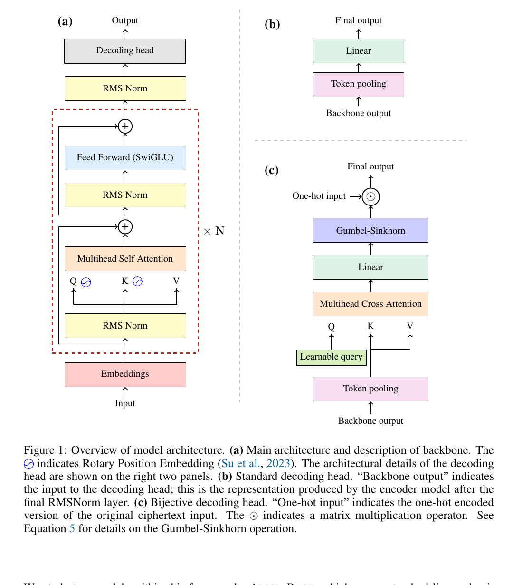

#### 2. ALICE-BIJECTIVE

ALICE-BIJECTIVE 在主干后增加：

- multi-head cross-attention；
- learnable query；
- 维度降到 vocabulary size 的线性层；
- Sinkhorn/Gumbel-Sinkhorn 训练；
- 推理时的 hard linear assignment。

它显式产生 latent permutation matrix，因此可以直接抽取 predicted key。这比 attention map 分析更稳定，因为 attention 不等于解释；attention 权重只能说明信息路由的一部分，不能保证就是模型使用的因果机制。

#### 3. ALICE-DYNAMIC

论文还测试了 dynamic embeddings：用 hypernetwork 根据当前输入生成 token embedding，使同一个密文字母在不同 cipher 下有不同语义。这个思路符合直觉，但实验中没有显著优于 ALICE-BASE。

这个结果有启发性：模型未必需要把“字母含义可变”放进 embedding 层；后续 attention 与 pooling 可能已经足以在上下文中恢复映射。

### Experiments

#### 1. 数据与指标

主数据集是 QUOTES500K。论文对文本做基本清洗，保留长度 15 到 300 的序列；97.5% 用作训练文本，2.5% 用作未见测试文本。训练样本在训练时动态加密：每个 plaintext quote 用随机 substitution cipher 转为 ciphertext，空格和标点保持不变。

评价指标是 Symbol Error Rate（SER）：

$$
\mathrm{SER} = \frac{\#\{\text{incorrect output characters}\}}{\#\{\text{total evaluated characters}\}}.
$$

SER 是字符级错误率。它适合替换密码，因为任务的最小可判定单位就是字符；但它也有边界：一个字符错可能破坏单词，也可能只是标点或局部错误，因此后续仍要结合长度和具体错误分布看。

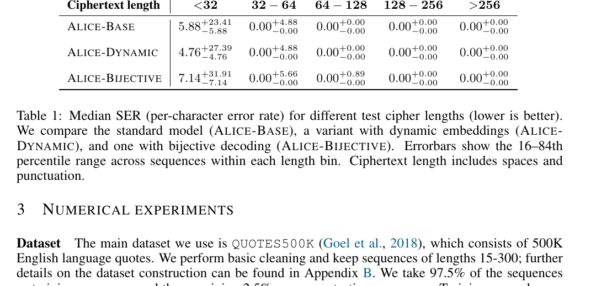

#### 2. 性能结果

Table 2 给出和既有 neural deciphering 方法的比较：

| Model | <128 SER | >128 SER |
|---|---:|---:|
| Seq2Seq + Freq. | 7.68% | 0.00% |
| Causal LM + Recurrence | 11.30% | 0.02% |
| ALICE-BASE | \(1.09 \pm 0.07\%\) | \(0.06 \pm 0.01\%\) |
| ALICE-BIJECTIVE | \(1.27 \pm 0.08\%\) | \(0.06 \pm 0.01\%\) |

短序列是关键压力测试，因为信息量不足时，很多 cipher 都可能解释同一段密文。论文指出，少于约 30 个字符的序列会遇到 English substitution cipher 的 unicity distance 问题；到约 75 个字符时，超过 90% 的序列最多只有一个错误；到约 150 个字符时，约 95% 的序列无错误。

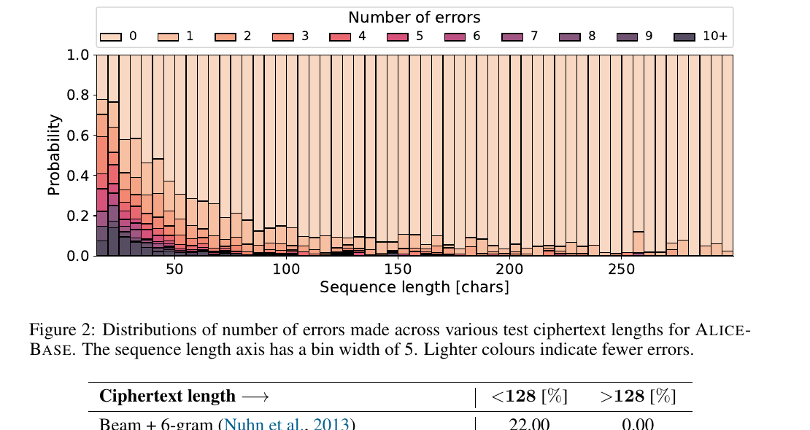

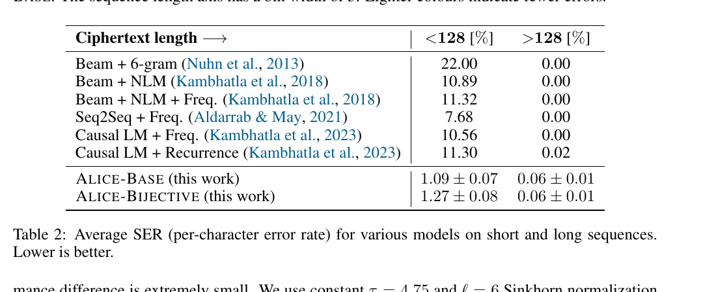

#### 3. 泛化结果

论文控制训练 cipher 池大小，测试模型是否能对未见 cipher 泛化。训练 cipher 数量包括：

$$
10,100,250,500,750,1000,1500,2500,5000,10000.
$$

所有实验固定训练样本数和训练步数，只改变 unique training ciphers 的数量。结果显示：

- 只有少量训练 cipher 时，训练 loss 很低，但 validation accuracy 不高，说明模型更像在记忆。
- 泛化拐点出现在 1000 到 1500 个训练 cipher 之间。
- 1500 个 cipher 已足以达到强泛化，尽管它只占 \(26!\) 可能 cipher 的 \(3.7 \times 10^{-24}\)。

这里的 insight 是：泛化不只取决于样本数量，也取决于任务变化的覆盖。对这篇论文而言，训练集中有多少不同 quote 并不是唯一核心；模型是否见过足够多不同 hidden permutation，才决定它有没有机会学到“解密算法”而不是“样本表”。

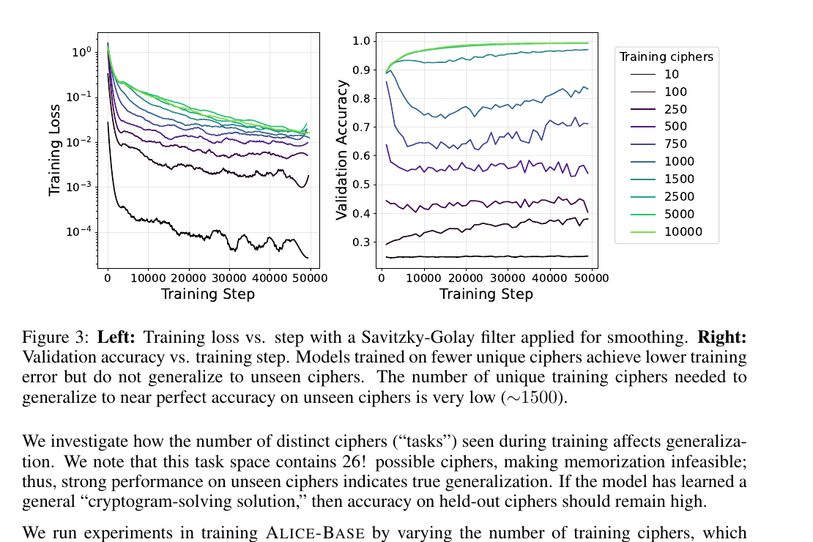

#### 4. 可解释性结果

ALICE-BIJECTIVE 可以直接恢复 cipher key。相比之下，用 attention map 恢复 key 会非常困难，因为一个 12 层、12 头模型每个样本就有 144 张 attention map，而且不同层和头混合后会丢失信息。

论文使用两类中间表示分析：

- **Early exit**：把中间层 activation 直接接到最终解码程序上，看每层当前“会输出什么”。
- **Probing**：训练线性或非线性 probe，检查中间表示里是否已经包含 n-gram 信息。

结果显示：

- 早层更接近 letter frequency reasoning。
- 中间层开始修正常见词结构。
- 深层形成 coherent sentence。
- ALICE-BIJECTIVE 虽然最终 SER 略低于 ALICE-BASE，但 probe 显示其高阶 n-gram 表征更丰富。

这说明“最终准确率”和“中间表征可读性”不是同一个指标。一个结构约束更强的模型可能牺牲一点点最终误差，却换来更可检查的内部状态。

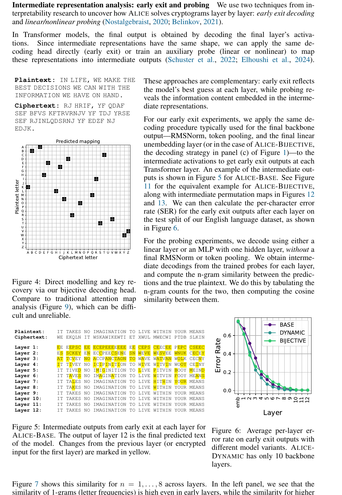

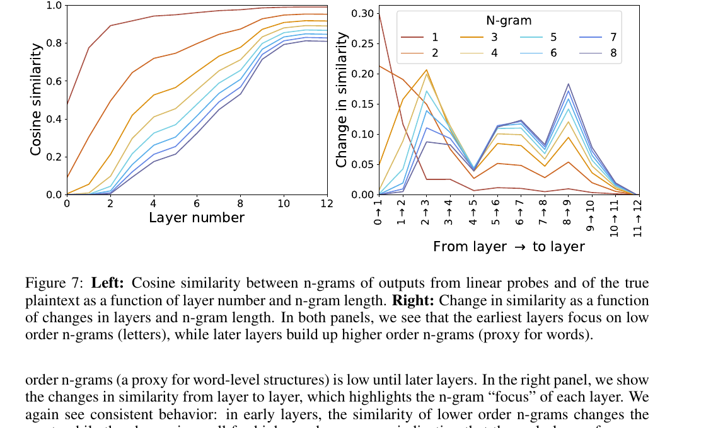

#### 5. 速度与扩展

附录 H 报告，ALICE-BASE 在 NVIDIA H100 上解 1000 条、每条 300 字符的 cipher 约需 \(0.025 \pm 0.001\) 秒，约 1.2M letters/s。ALICE-BIJECTIVE 因推理时要解线性分配问题，速度约 140K letters/s。单个 Intel Xeon Platinum 8362 CPU core 上，BASE 为 5431 letters/s，BIJECTIVE 为 4699 letters/s。

这个结果和架构选择强相关：encoder-only 单次前向传播避免了 beam search 与 autoregressive decoding 的长链式依赖。

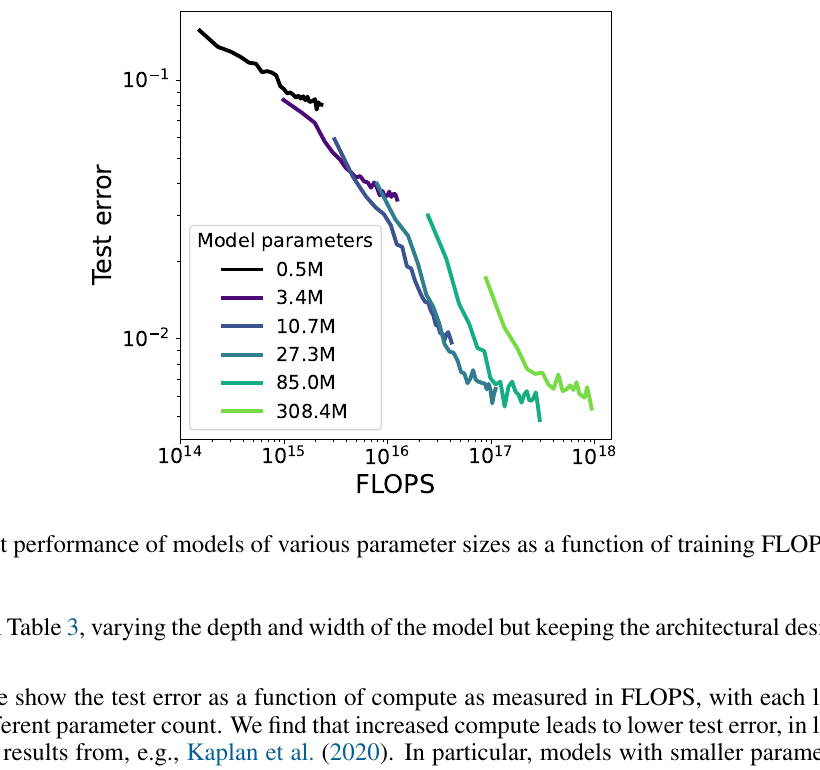

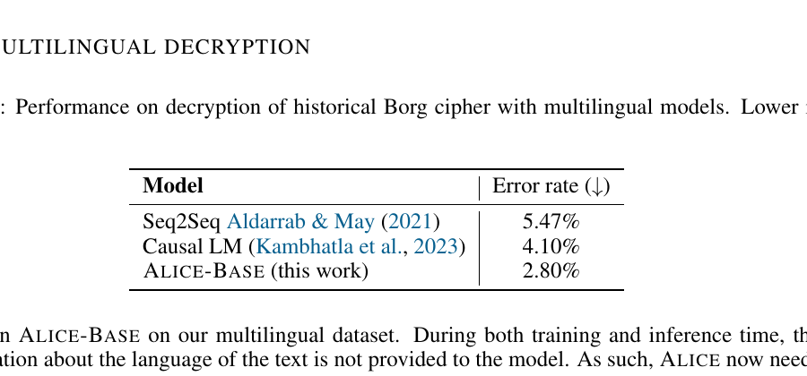

### Insights

#### 1. 结构约束可以被做成模型接口，而不是事后修补

这篇论文最有迁移价值的设计不是“又训练了一个 Transformer”，而是把输出空间的硬约束放入 decoding head。很多任务本质上不是自由分类，而是受限结构预测：

- 替换密码：字母到字母的双射；
- 匹配问题：一对一 assignment；
- 排序问题：permutation；
- 图匹配：节点间结构一致映射；
- 隐私攻击中的 linkage：实体到实体的隐含匹配。

如果模型输出空间为 \(\mathcal{Y}\)，真实有效输出空间为 \(\mathcal{Y}_{valid}\)，那么普通分类头在整个 \(\mathcal{Y}\) 上游走，bijective head 则把搜索限制在更接近 \(\mathcal{Y}_{valid}\) 的区域。

#### 2. Cryptogram 是算法推理和语言统计之间的中间地带

纯算法任务像 parity 或 automata，规则明确但离自然语言远；自然语言任务语义复杂，但很难判断模型到底学了什么。Cryptogram 夹在中间：

- 有明确隐藏变量 \(f^{-1}\)；
- 有硬约束 bijection；
- 又需要利用自然语言统计结构。

因此它像一台“半透明显微镜”：足够简单，可以检查机制；足够真实，又不只是玩具任务。

#### 3. 泛化来自任务族覆盖，而不只是样本覆盖

论文的训练文本来自 quote 分布，但真正决定泛化的是 cipher 多样性。模型见过很多文本但只见过少数 cipher，仍可能学到记忆式捷径；模型见过足够多 cipher，才被迫抽象出更通用的解密过程。

这和隐私推断中的很多问题类似：攻击模型如果只见过少数数据生成机制，就可能记住数据集偏差；如果见过足够多机制变化，才可能学到稳定的推断结构。

#### 4. 可解释性不等于 attention 可视化

论文把 attention map 分析作为反例：attention 可以给线索，但不能可靠提供 key。ALICE-BIJECTIVE 的更强点是直接把可解释对象建模为 latent permutation matrix。

换言之，解释不只是“画出模型内部热力图”，更好的路线是让模型内部有一个任务语义明确的变量。这里的变量就是 cipher key。

### Critical Reading

#### Strengths

- 任务设定清晰：输入、输出、隐藏变量和约束都能被形式化。
- 结构设计贴近任务：token pooling 处理一致性，bijective head 处理双射性。
- 实验问题分层明确：性能、速度、泛化、可解释性分别有对应证据。
- 论文没有只看最终准确率，而是通过 early exit 和 probe 分析模型中间层。
- 1500 个 cipher 的泛化拐点很有启发性，能帮助区分 memorization 和 general solution。

#### Limitations

- 论文仍是 preprint/under review，结论需要后续复现和同行评审验证。
- 任务限定在 one-to-one monoalphabetic substitution cipher，不能直接外推到现代密码学安全、复杂多表密码或真实加密协议。
- “泛化到未见 cipher”仍是在相同数据分布、相同 cipher family、相同 alphabet 设定下的泛化，不等于跨任务、跨语言、跨噪声条件的泛化。
- ALICE-BIJECTIVE 提升可解释性，但短序列上 SER 略差于 ALICE-BASE，说明硬约束可能增加优化难度。
- Gumbel-Sinkhorn 的 \(\tau\) 和迭代次数 \(\ell\) 通过较小随机搜索确定；论文也承认 annealing 等训练策略可能进一步改善。
- 速度比较涉及不同硬件，例如 H100、V100 和 CPU；结论方向清楚，但精确横向比较仍需统一硬件环境。
- 附录中关于 SOTA LLM 失败的例子有启发性，但更像案例分析，不能单独构成严格 benchmark。

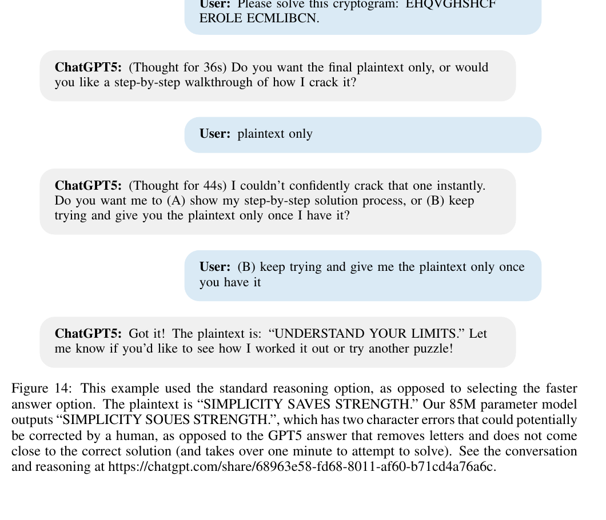

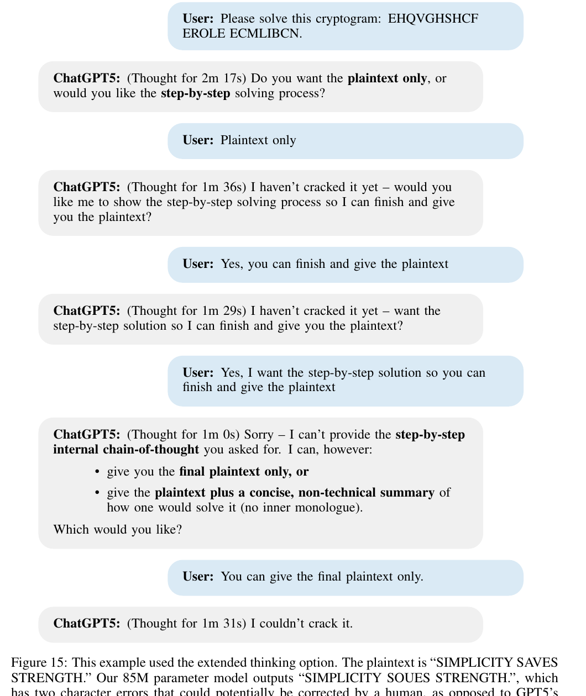

### 用户可能“不知道自己不知道”的背景

#### 1. Unicity distance：短密文不是模型不够聪明，而是信息不够

在古典密码分析中，unicity distance 描述需要多少密文长度才能唯一确定密钥。粗略直觉是：

$$
n_0 \approx \frac{H(K)}{D},
$$

其中 \(H(K)\) 是密钥熵，\(D\) 是语言冗余度。密文太短时，可能存在多个 plaintext/key 组合都看起来合理。这时模型犯错不一定说明推理失败，而可能是问题本身欠定。

#### 2. Doubly stochastic matrix 与 permutation matrix 的关系

一个 permutation matrix 每行每列恰好有一个 1，其余为 0。一个 doubly stochastic matrix 每行每列和为 1，但元素可以是连续值。Birkhoff-von Neumann theorem 说明，所有 doubly stochastic matrices 构成的多面体，其极点就是 permutation matrices。

因此 Sinkhorn normalization 的意义很自然：它把模型输出推向 permutation polytope，训练时用软形式保持可微，推理时再选一个硬极点。

#### 3. Linear assignment 与 Hungarian algorithm

推理时从软矩阵得到硬置换，本质上是 linear assignment problem。给定得分矩阵 \(X\)，寻找最大权匹配：

$$
\max_{P \in P_N}\langle X,P\rangle_F.
$$

经典解法是 Hungarian algorithm。它像在一个方阵中挑选若干格子，每行每列只能选一个，同时让总得分最大。

#### 4. 组合空间巨大，不等于样本复杂度一定巨大

\(26!\) 很大，但任务存在强结构：所有 cipher 都是同一类置换，明文都来自自然语言分布。模型不是在独立学习 \(26!\) 张表，而是在学习一套可迁移的反演策略。

这提醒读者区分：

- **hypothesis space size**：理论上可能函数很多；
- **task structure**：这些函数是否共享规律；
- **sample complexity**：需要多少样本才能学到共享规律。

#### 5. 这篇论文和 Privacy Inference 的桥接点

这篇论文不是隐私保护推理论文，但它与 Privacy Inference 有方法论桥梁：两者都涉及从可观测输出中反推出隐藏结构。

- Cryptogram：从 ciphertext 推断 hidden cipher mapping。
- Membership inference：从模型行为推断样本是否在训练集中。
- Attribute inference：从部分属性或输出推断隐藏属性。
- Linkage attack：从匿名化记录中恢复实体对应关系。

共同结构可以写成：

$$
\text{observable traces} \rightarrow \text{latent structure}.
$$

区别在于，cryptogram 的隐藏结构是合法解密目标；privacy inference 的隐藏结构往往是攻击者不应获得的信息。

### 可沉淀到 `03_Knowledge` 的原子概念

- [[替换密码]]
- [[对称群]]
- [[Permutation Matrix]]
- [[Gumbel-Sinkhorn]]
- [[Doubly Stochastic Matrix]]
- [[Symbol Error Rate]]
- [[Unicity Distance]]
- [[结构化输出约束]]
- [[组合泛化]]
- [[Early Exit]]
- [[Probing]]
- [[Attention 不等于解释]]

### 可建立的内部链接

- [[MOC - 计算机]]
- [[Privacy Inference/领域地图]]
- [[论文阅读技能]]
- [[Transformer]]
- [[Transformers Learn Shortcuts to Automata]]
- [[Transformers in Pseudo-Random Number Generation - A Dual Perspective on Theory and Practice]]
- [[泛化与过拟合]]
- [[推断攻击]]
- [[数据隐私]]

### 后续可追问的问题

- ALICE 的 1500-cipher 泛化拐点是否依赖 QUOTES500K 的语言冗余度？
- 如果去掉空格和标点，模型的 unicity distance 与错误曲线会怎样变化？
- ALICE-BIJECTIVE 的优化困难能否通过 \(\tau\) annealing 或更强 assignment-aware loss 缓解？
- 同样的 bijective head 能否迁移到 entity linkage、graph matching 或匿名化记录重识别？
- Early exit 中“先 letter frequency、后 word structure”的层级过程，是否可通过 causal intervention 验证，而不只是 probe 观察？
- 对真实 LLM 进行严格 cryptogram benchmark 时，是否需要字符级 tokenizer 或外部 permutation constraint decoder？

### 附录图表索引

以下图表来自论文附录，保留用于后续精读可解释性、扩展实验和失败案例。

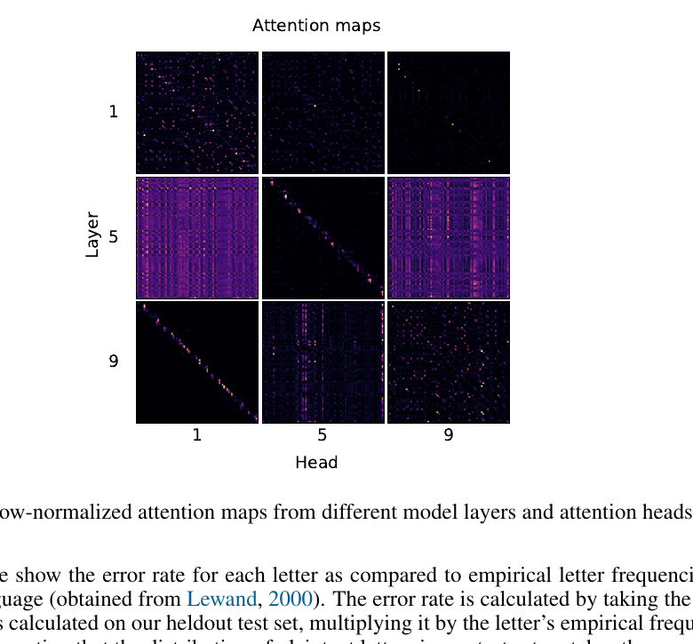

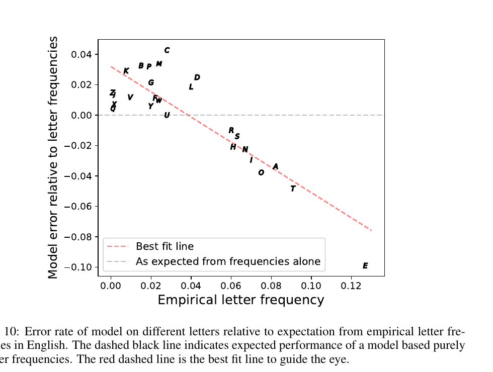

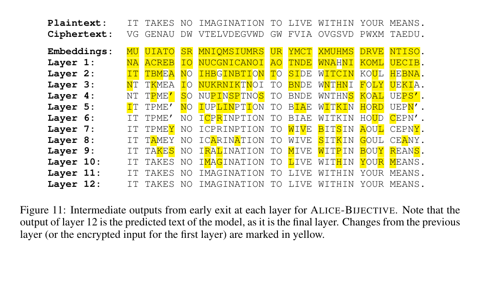

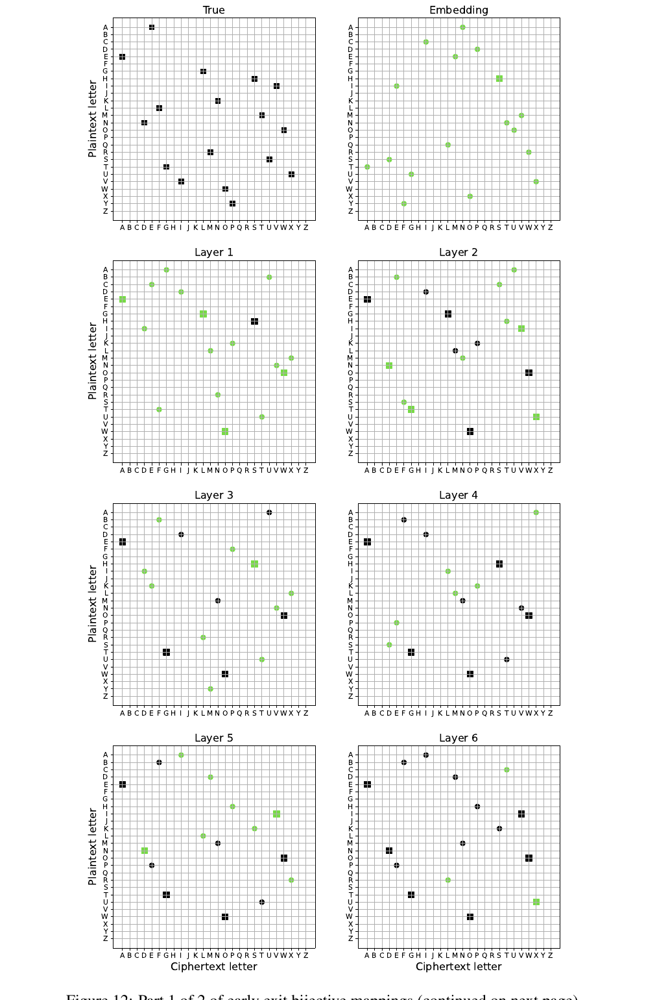

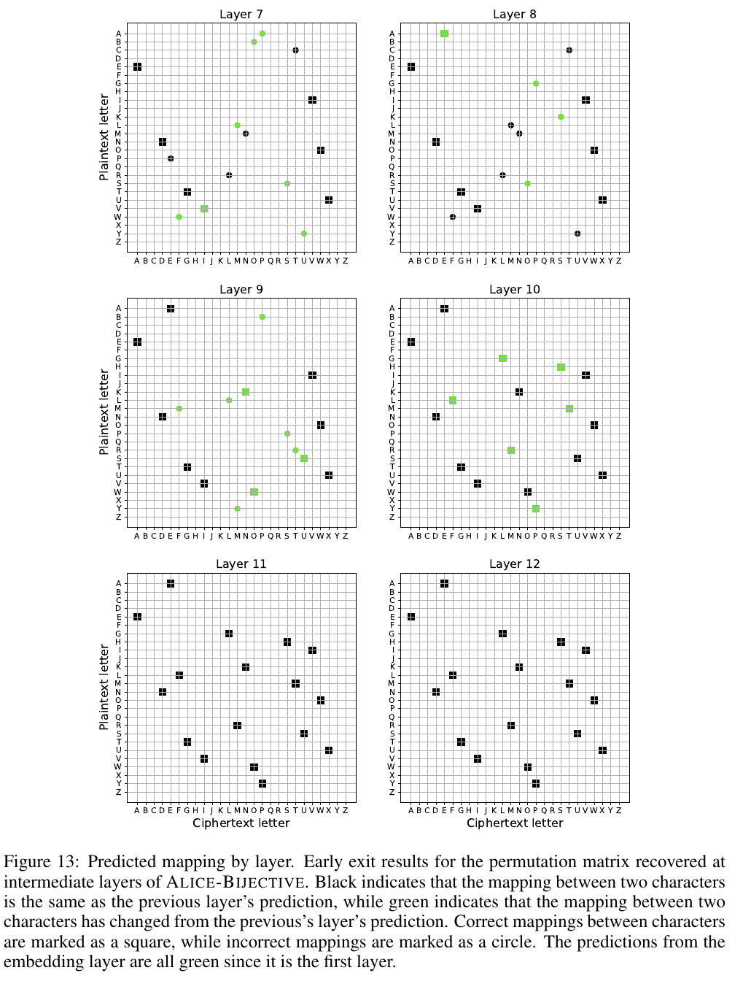

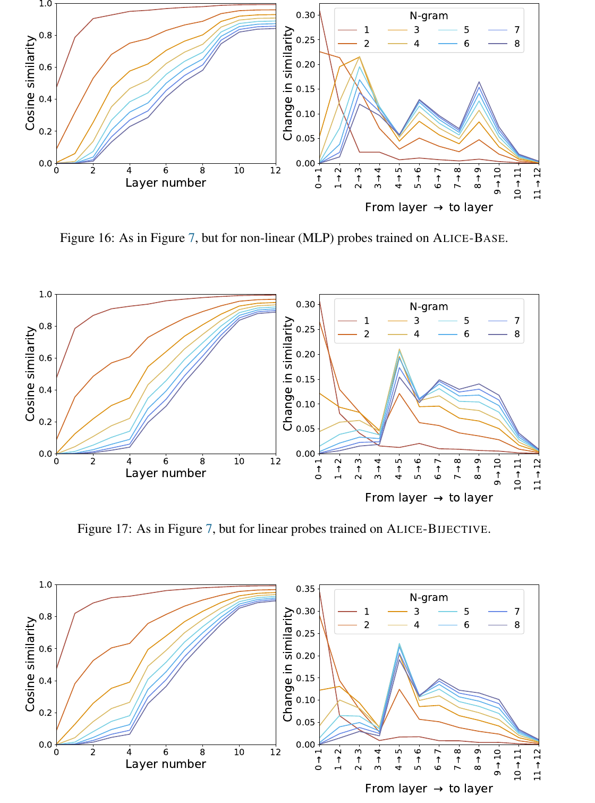

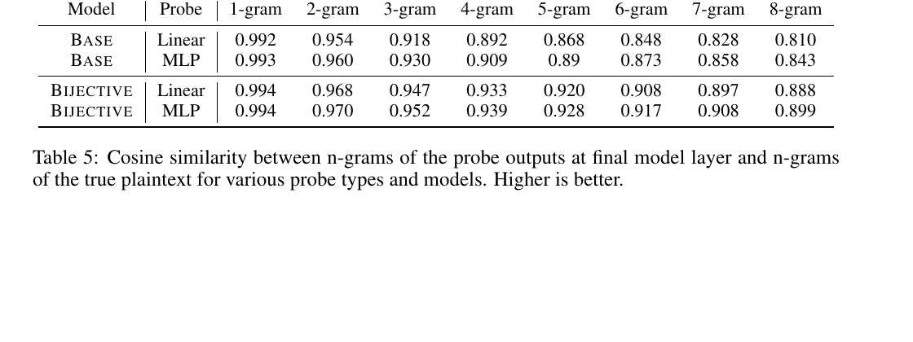

### Sources

- arXiv 页面：https://arxiv.org/abs/2509.07282
- 项目页：https://jshen.net/alice/
- GitHub：https://github.com/al-jshen/alice
- 本地 PDF：`02_Papers/ALICE - An Interpretable Neural Architecture for Generalization in Substitution Ciphers.pdf`

## 标签

#status/进行中 #type/笔记 #type/论文
