# Assessing Geometric Security of AES Neural Realizations: Linear-Time Key Recovery via Neural Leakage

原始 PDF 已按标题重命名为：[Assessing Geometric Security of AES Neural Realizations - Linear-Time Key Recovery via Neural Leakage.pdf](./Assessing%20Geometric%20Security%20of%20AES%20Neural%20Realizations%20-%20Linear-Time%20Key%20Recovery%20via%20Neural%20Leakage.pdf)

线上核对：Google/网络检索未返回可访问的公开元信息页；本笔记的题名、作者、摘要和实验结论以本地 PDF 首页和正文为准。

上位地图：[[MOC - 计算机]] · [[Research on Cryptographic Neurons]] · [[Neural Cryptanalysis]]

相关主题：[[AES]]、[[ReLU Network]]、[[Deep Neural Cryptography]]、[[Geometric Security]]、[[Activation Boundary Leakage]]、[[Synthetic Oracle]]、[[Implementation Security]]

### Abstract

这篇论文研究一个与 [[Deep Neural Cryptography]] 紧密相邻的问题：如果把 AES-128/192/256 用 ReLU-based DNN 的 **natural sum-of-corners construction** 实现，并允许攻击者对这个 DNN 输入实数值，而不只是标准 bit，那么这个实现是否仍然安全？

标准 AES 是离散函数：

$$
E_k:\{0,1\}^{128}\rightarrow\{0,1\}^{128}.
$$

自然 ReLU-DNN 实现则把它扩展成连续分段线性函数：

$$
D_k:\mathbb{R}^{128}\rightarrow\mathbb{R}^{128}.
$$

这不是语法层面的实现差异，而是安全模型被改变了。标准 AES 只回答“路口”上的 bit 输入；ReLU-DNN AES 把路口之间的连续地形也暴露出来。攻击者不再只能问 \(0/1\)，还可以问 $-\epsilon$、\(\epsilon\)、\(1-\epsilon\)、\(1+\epsilon\) 这类靠近 Boolean corner 的实数点。论文认为，这些非标准点会泄露 ReLU activation boundary 的几何信息。

论文的核心攻击点是 **AddRoundKey 的自然 XOR 实现**。自然 XOR 可以写成：

$$
\mathrm{NN}_{\mathrm{XOR}}(x_1,x_2)
=
\mathrm{ReLU}(x_2-x_1)+\mathrm{ReLU}(x_1-x_2)
=
|x_1-x_2|.
$$

在 Boolean 输入上它确实等价于 XOR；但在实数输入上，它变成一个 V 形的分段线性距离函数。密钥 bit 被嵌入 XOR 层后，会决定局部线性区域的位置。攻击者通过构造对称扰动 pair，观察 oracle 输出是否保持不变，就能判断扰动是否跨过 ReLU 边界，从而恢复 key bit。

一句话概括：

> AES 本身没有被破解；被攻击的是把 AES 自然延拓为 ReLU-DNN 后，又允许实数 oracle 查询所产生的几何泄露面。

论文声称的实验结果是：

- AES-128：在自然 DNN black-box oracle 下，1,000 个随机 key 全部恢复成功；
- AES-192 / AES-256：在 synthetic intermediate-state oracle 下，利用 GenPairssym 恢复 master key，1,000 次实验成功；
- GenPairschange 在 AES-192/256 扩展中表现明显弱于 GenPairssym；
- 攻击复杂度被表述为 \(O(128R)\) 级别，其中 \(R\) 与轮数/round-key 暴露方式相关。

### Knowledge

#### 1. Boolean security 与 geometric security 的差别

传统密码学关心 Boolean oracle：

$$
O:\{0,1\}^n\rightarrow\{0,1\}^m.
$$

攻击者只能输入合法 bit 串。若把同一个功能实现成 ReLU-DNN，实际暴露的是：

$$
O_{\mathrm{DNN}}:\mathbb{R}^n\rightarrow\mathbb{R}^m.
$$

这个扩展会出现新的安全问题：Boolean 点上正确，不代表 Boolean 点之间的几何地形安全。一个直观类比是，标准 AES 像一台只接受硬币的售票机，攻击者只能投 0 或 1；DNN-AES 像把机器内部轨道换成透明玻璃，还允许攻击者用任意厚度的金属片试探轨道缝隙。

论文把这类安全称为 **geometric security**：不仅要在离散点上输出正确，还要在连续空间的局部线性区域、边界、斜率和激活模式上不泄露 secret material。

#### 2. Natural XOR：正确性与泄露来自同一个结构

自然 XOR 的实现是：

$$
C_1=\mathrm{ReLU}(x_2-x_1),\qquad
C_2=\mathrm{ReLU}(x_1-x_2),
$$

$$
\mathrm{NN}_{\mathrm{XOR}}=C_1+C_2.
$$

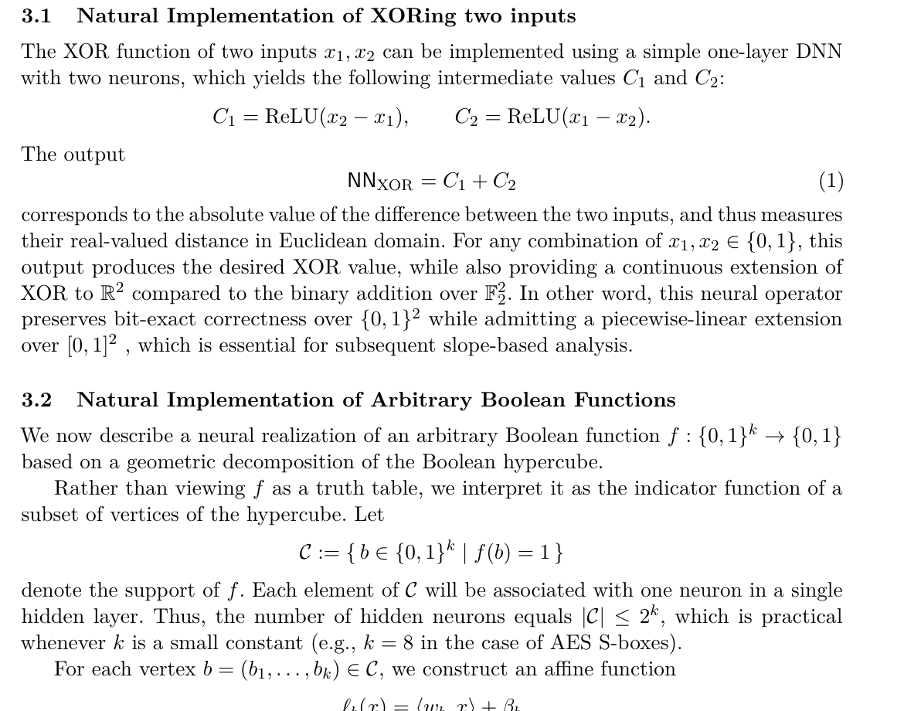

在 \(\{0,1\}^2\) 上：

| \(x_1\) | \(x_2\) | \(|x_1-x_2|\) | XOR |
| --- | --- | --- | --- |
| 0 | 0 | 0 | 0 |
| 0 | 1 | 1 | 1 |
| 1 | 0 | 1 | 1 |
| 1 | 1 | 0 | 0 |

所以它 bit-exact。但在实数线上，\(|x_1-x_2|\) 的折点就是 \(x_1=x_2\)。当 \(x_2\) 是 key bit 时，折点位置被 key 决定。攻击者不需要知道梯度，只要比较两个精心挑选的扰动输出是否相等，就可能判断是否跨过折点。

这就是本文的核心洞察：**正确实现 XOR 的几何结构，同时也是泄露 key bit 的边界结构。**

#### 3. Sum-of-corners：把任意 Boolean function 做成 ReLU 网络

对一个 Boolean function：

$$
f:\{0,1\}^k\rightarrow\{0,1\},
$$

设 active corners 为：

$$
C=\{b\in\{0,1\}^k:f(b)=1\}.
$$

每个 active corner \(b=(b_1,\ldots,b_k)\) 对应一个 ReLU neuron：

$$
\mathrm{corner}_{c,b}(x)
=
\mathrm{ReLU}
\left(
\sum_{i:b_i=1}x_i+
\sum_{i:b_i=0}(1-x_i)-k+c
\right),
$$

其中 \(0<c\le 1\)。然后：

$$
\Sigma_C(x)=\sum_{b\in C}\mathrm{corner}_{c,b}(x).
$$

它在 Boolean corner 上像一个“只在指定顶点亮灯”的指示器，但在实数空间中，每个灯的亮灭边界都是由 affine hyperplane 和 ReLU 共同决定的。这些边界在常规 Boolean 模型中不可见，在实数查询模型中却变成可探测对象。

#### 4. XOR-first condition：攻击能否直接生效的关键

论文的 bit test 依赖一个结构条件：攻击者控制的输入首先遇到的 key-dependent operation 必须是自然 XOR：

$$
x\mapsto x\oplus k.
$$

AES 初始 AddRoundKey 满足：

$$
x_0=p\oplus rk_0.
$$

所以在 AES-128 的自然 DNN oracle 中，攻击者对 plaintext 的小扰动会直接到达 key-dependent XOR 层。后续轮里的 round key 则不同：扰动先经过 SubBytes、ShiftRows、MixColumns 等变换，再遇到下一个 AddRoundKey，XOR-first 条件被破坏。

这解释了论文里一个很重要的限制：

- 标准 black-box DNN oracle 下，直接攻击的是 \(rk_0\)；
- AES-192/256 的更深 round-key 恢复需要 synthetic intermediate-state oracle；
- 因此该论文对 AES-192/256 的完整 key 恢复不是标准 AES black-box 攻击，而是更强 oracle 模型下的结构性验证。

### Overview

#### 论文方法框架

论文先把 AES 的每个 Boolean component 改写成 ReLU-DNN：

- AddRoundKey：bitwise natural XOR；
- SubBytes：每个 S-box output bit 用 sum-of-corners；
- ShiftRows：置换；
- MixColumns：有限域线性变换和 XOR 组合。

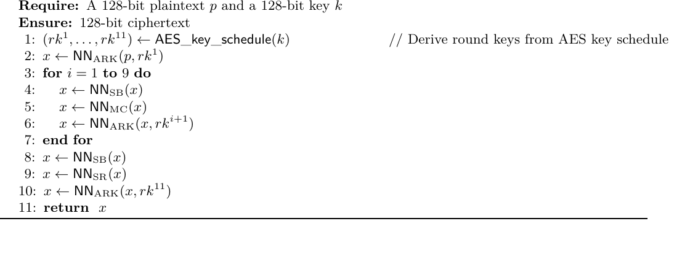

随后，作者将密钥恢复写成一个 bitwise procedure：对每个未恢复 key bit，生成候选 \(v\in\{0,1\}\) 的扰动 pair，查询 oracle，并检测输出是否保持不变。

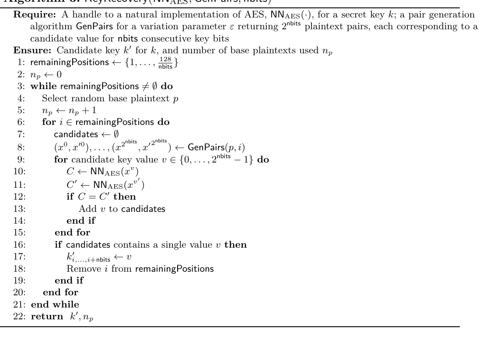

核心测试可以抽象为：

$$
O(x_v)=O(x'_v)
\quad\Longrightarrow\quad
v\text{ is consistent with the hidden key bit}.
$$

如果只有一个候选 \(v\) 满足该不变性，就确定该 bit。

#### 与经典搜索的差别

论文把经典离散 oracle search 与 DNN-based search 对比为：

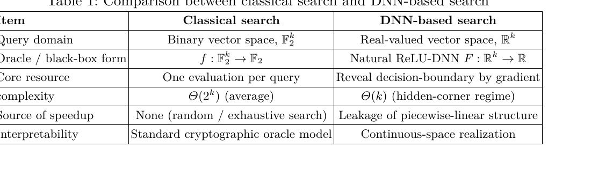

经典搜索在 \(\mathbb{F}_2^k\) 中试 key，平均复杂度是指数级。DNN-based search 不再只看 Boolean 点，而是利用 \(\mathbb{R}^k\) 中的 piecewise-linear boundary 信息。这个比较的关键不是“神经网络更会搜索”，而是“oracle 暴露了更多结构”。

一个更严谨的说法是：

$$
\text{same Boolean function}
\not\Rightarrow
\text{same oracle leakage}.
$$

#### 两种 pair generation

论文比较了两类 pair：

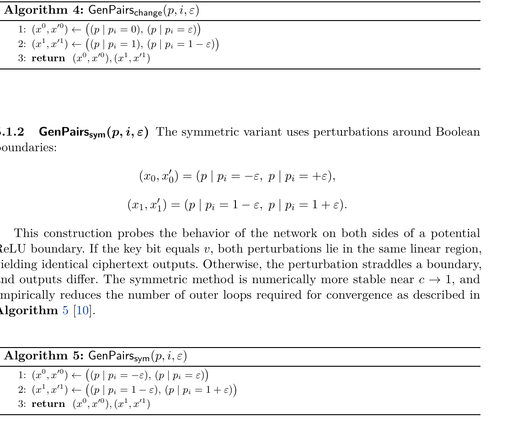

GenPairschange 是非对称扰动：

$$
(x_0,x'_0)=(p|p_i=0,\;p|p_i=\epsilon),
$$

$$
(x_1,x'_1)=(p|p_i=1,\;p|p_i=1-\epsilon).
$$

GenPairssym 是对称扰动：

$$
(x_0,x'_0)=(p|p_i=-\epsilon,\;p|p_i=+\epsilon),
$$

$$
(x_1,x'_1)=(p|p_i=1-\epsilon,\;p|p_i=1+\epsilon).
$$

对称扰动更像拿一根细针从边界两侧同时试探：如果 key hypothesis 正确，两个点落在同一个局部线性区；如果错误，两个点跨过边界，输出发生变化。

### Main Results

#### 1. Local separability lemma

论文的核心技术陈述是：当第一层 key-dependent operation 是 natural XOR，且 \(c<1\)、\(\epsilon\) 足够小时，两个候选扰动中恰好有一个保持在同一 ReLU 线性区域内。

形式上可以理解为：

$$
\exists\delta(c)>0,\quad 0<\epsilon<\delta(c),
$$

使得正确 key bit \(k_i\) 对应的 pair 满足：

$$
O(x_{k_i})=O(x'_{k_i}),
$$

而错误候选 \(1-k_i\) 对应的 pair 跨过边界：

$$
O(x_{1-k_i})\ne O(x'_{1-k_i}).
$$

这就是 bitwise recovery 的理论支点。

#### 2. AES-128 black-box natural DNN oracle

AES-128 的自然 DNN oracle 先执行初始 AddRoundKey，因此 plaintext perturbation 首先遇到 key-dependent XOR。论文给出 AES-128 oracle 和已知答案测试：

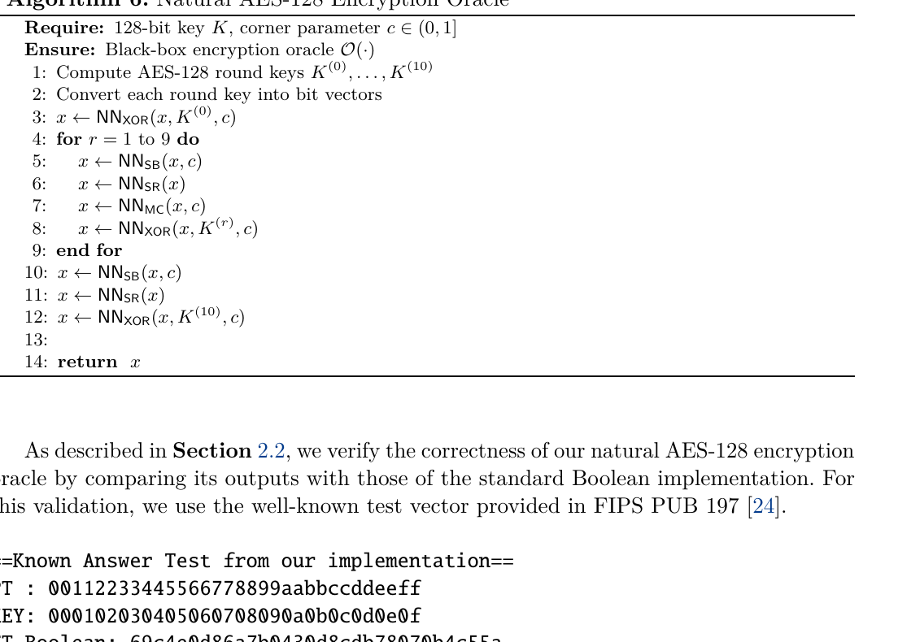

然后用 bitwise key recovery 程序恢复 \(128\) 个 key bit：

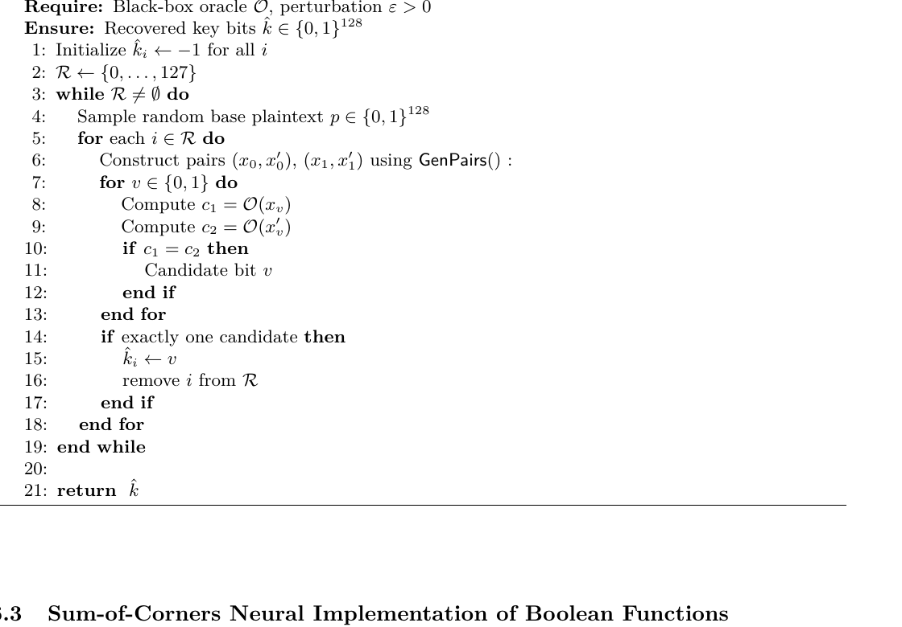

实验结果部分报告：

- \(c=0.5,\epsilon=0.01\)；
- 1,000 个 independent random AES-128 keys；
- recovered key 与 selected key 完全一致；
- GenPairschange 与 GenPairssym 在 AES-128 测试中都报告 100% success；
- 参数扫描中 \(c\) 接近 1、\(\epsilon\) 很小时 outer loop 变多，但正确性未消失。

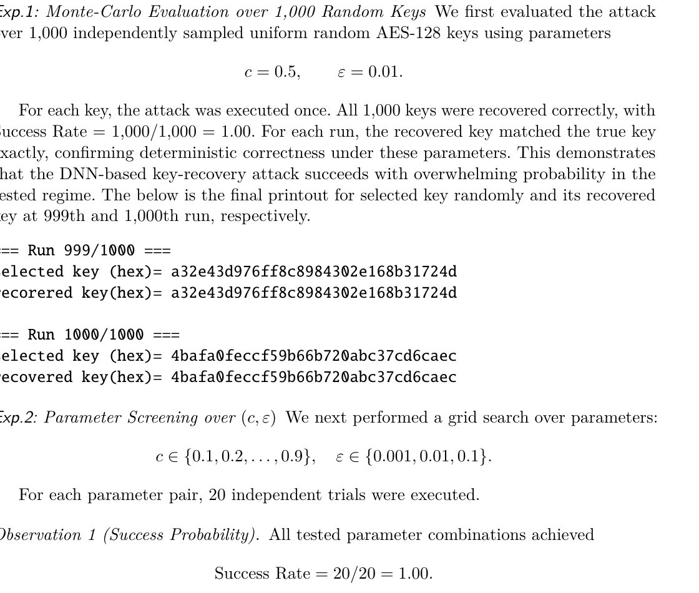

#### 3. AES-192 / AES-256 synthetic oracle

AES-192/256 的完整 master-key recovery 依赖 synthetic intermediate-state oracle。该 oracle 人为暴露 round \(r\) 的 AddRoundKey 前状态，让计算重新满足 XOR-first condition：

$$
O_r(z)=E_K^{(r\to N_r)}(z\oplus rk_r).
$$

论文先比较 AES-128/192/256 key schedule：

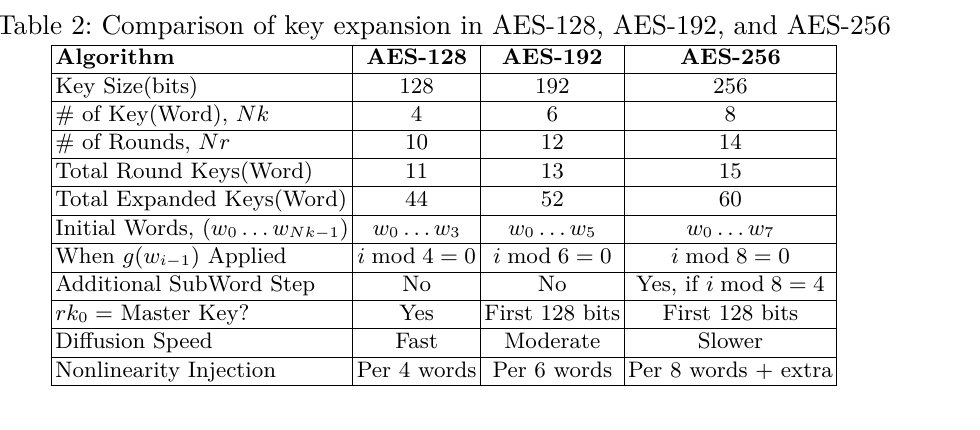

对 AES-192，作者给出 bitwise synthetic recovery 算法，并展示 GenPairssym 输出成功：

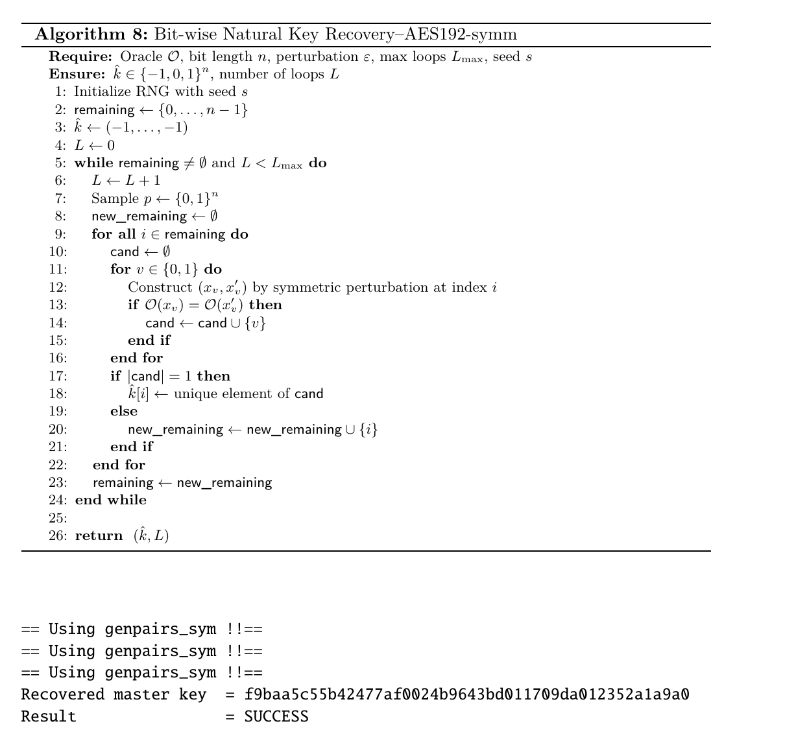

GenPairssym 与 GenPairschange 的差异被总结为：

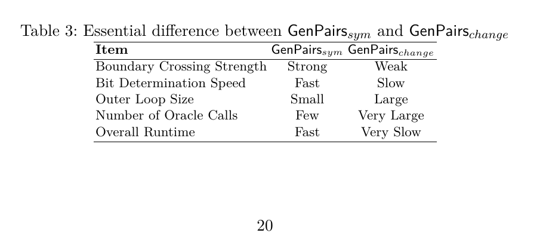

对 AES-256，论文报告 rk0、rk1、rk2 及 master key check 均为 True：

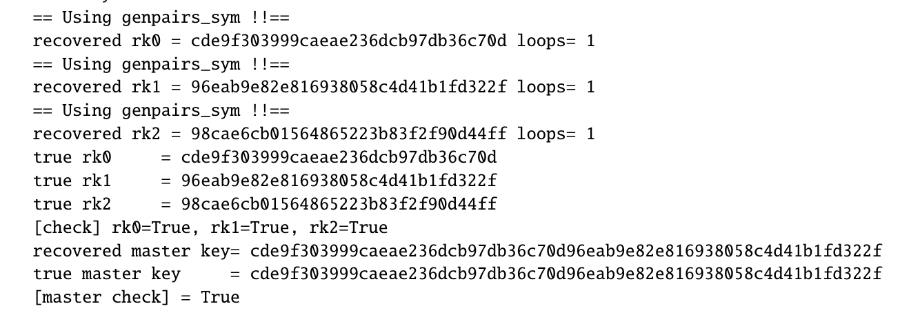

这里需要再次强调：AES-192/256 的完整恢复是 synthetic oracle 模型下的结论，不应被简化成“标准 AES-192/256 black-box 被破解”。

### Method

#### 1. 自然实现的 correctness

自然 ReLU 实现必须满足：

$$
D_k(x)=E_k(x),\qquad x\in\{0,1\}^{128}.
$$

也就是说，它在所有合法 Boolean 输入上等价于 AES。论文还用 FIPS PUB 197 的 known-answer test 验证 natural AES-128 oracle 输出与标准 AES 一致。

这一步建立的是“功能正确性”，不是安全性。功能正确性只检查路口，不检查路口之间的地形。

#### 2. 攻击过程

对每个 key bit \(i\)，流程是：

1. 采样 base plaintext \(p\)；
2. 对候选 \(v=0,1\) 分别构造 pair \((x_v,x'_v)\)；
3. 查询 \(O(x_v)\) 与 \(O(x'_v)\)；
4. 若输出相等，则候选 \(v\) 被保留；
5. 若唯一候选存在，则确定 \(k_i=v\)；
6. 对剩余 bit 重复。

复杂度直觉上是：

$$
O(2\cdot 128\cdot L),
$$

其中 \(L\) 是 outer-loop 次数。论文摘要将 round-aware 复杂度表述为：

$$
O(128R).
$$

与穷举：

$$
\Theta(2^{128})
$$

相比，这是巨大的模型差异。但这种差异不是来自 AES 弱，而是来自 oracle 暴露的连续几何结构。

#### 3. 为什么 \(c<1\) 重要？

Corner parameter \(c\) 控制 corner function 的激活区域和边界间隔。论文的 local separability lemma 要求 \(c<1\)。直观上，\(c\) 越接近 1，边界区分度越弱；\(\epsilon\) 越小，扰动越精细，但可能需要更多 outer loops。

实验观察中：

- \(c\) 接近 1 时 loop complexity 上升；
- \(\epsilon\) 很小时平均 loop 数也上升；
- 但测试范围内 success rate 仍为 100%。

这说明参数影响的是收敛成本，而不是论文实验中的可恢复性。

### Experiments

#### AES-128

实验设置：

- natural sum-of-corners AES-128 DNN；
- targets first round key / master key；
- GenPairschange 与 GenPairssym 两类 pair；
- 1,000 个随机 key；
- 参数扫描 \((c,\epsilon)\)。

主要结果：

- Monte Carlo：1,000/1,000 成功；
- coarse grid：20/20 成功；
- high-\(c\) precision sweep：20/20 成功；
- loop 数随 \(c\to1\)、\(\epsilon\to0\) 增大。

#### AES-192

关键限制：

- 标准 black-box 下，初始 \(rk_0\) 满足 XOR-first，因此可被该测试直接攻击；
- \(rk_1\) 前面已有 SubBytes/ShiftRows/MixColumns，破坏 XOR-first；
- synthetic oracle 人为暴露 round AddRoundKey 前状态，从而恢复 XOR-first。

实验报告：

- GenPairssym 利用 rk0/rk1/rk2 synthetic oracles 恢复 192-bit master key；
- 1,000 trials 成功；
- GenPairschange 失败或极慢。

#### AES-256

AES-256 与 AES-192 round function 相同，差异主要在 key schedule：

- key size \(N_k=8\)；
- rounds \(N_r=14\)；
- key expansion 有额外 SubWord 步骤。

由于 synthetic oracle 直接隔离 AddRoundKey，这些 key schedule 差异不改变 symmetry-based bit test。论文报告 AES-256 下 rk0/rk1/rk2 和 master key check 均成功。

### Insights

#### 1. “正确实现密码函数”不等于“安全实现密码函数”

自然 DNN AES 在 Boolean 输入上可以 bit-exact；但一旦暴露实数输入，DNN 的连续空间会泄露额外信息。这个结论对所有“把离散密码原语嵌入神经网络”的设计都很重要。

#### 2. 这类攻击更像 implementation-side leakage，而不是 classical cryptanalysis

经典 AES 攻击试图从合法明密文关系中找结构弱点。本文攻击利用的是 DNN realization 的 ReLU activation boundary。更像 side-channel：泄露来自实现介质，而不是 AES 抽象规范。

#### 3. Synthetic oracle 是强假设，不能忽略

AES-192/256 的完整 master-key recovery 建立在 synthetic intermediate-state oracle 上。这个 oracle 在真实黑盒 AES 服务中通常不存在。它更适合作为安全边界测试：如果某个系统暴露中间 state、white-box interface、debug hook 或可查询的 layer output，那么风险会显著上升。

#### 4. 与 Deep Neural Cryptography 的关系

前一篇 [[Deep Neural Cryptography]] 已指出自然 ReLU-DNN cryptographic implementation 存在 domain extension 风险，并给出 secure transformation。本文更像针对 AES-128/192/256 的具体攻击验证和扩展实验，重点放在 AddRoundKey 的 natural XOR 泄露、pair generation 设计和 key-size 扩展。

#### 5. “更长 key”不能修复这个问题

论文强调漏洞不依赖 key size，而依赖 XOR-first 暴露。AES-256 比 AES-128 有更长 key、更复杂 key schedule、更多 rounds，但如果攻击者获得 synthetic AddRoundKey oracle，单个 bit 的边界测试仍然成立。

这说明防御方向不是“把 key 变长”，而是避免暴露带 key 的自然 XOR 几何边界。

### Critical Reading

#### 1. 标准 AES 没有被破坏

笔记中必须保留这个边界：本文攻击对象是 ReLU-DNN neural realization，且需要 real-valued oracle；AES-192/256 完整恢复还需要 synthetic intermediate-state oracle。这不是对 FIPS AES 标准黑盒安全性的反例。

#### 2. 论文实验强，但 threat model 偏专门

AES-128 的 black-box natural DNN oracle 已经比标准 AES oracle 强，因为输入空间从 \(\{0,1\}^{128}\) 扩展到 \(\mathbb{R}^{128}\)。AES-192/256 的 synthetic oracle 更强，因为它允许攻击者从某个中间 round 的 AddRoundKey 前状态开始查询。

这种模型在研究实现安全时合理，但在传播结论时必须避免过度泛化。

#### 3. 图片和表格显示的是算法与输出，不是独立可复现实验曲线

论文给出了 printout、参数扫描文字和成功率，但缺少更系统的图表，例如 loop distribution、数值误差曲线、不同 floating precision 下的边界稳定性。这些会影响工程复现者判断攻击鲁棒性。

#### 4. GenPairssym 的优势需要更细粒度解释

表 3 总结 GenPairssym 更快、更强、更少 oracle calls，但理论层面可以进一步量化：对称扰动为何在 \(c\to1\) 或 floating precision 变化时更稳定？这一点仍可以被形式化加强。

#### 5. 防御启示比攻击本身更重要

最直接的防御不是修改 AES，而是修改神经实现：

- 不暴露实数输入 oracle；
- 对输入做 sanitization；
- 对输出做 masking；
- 避免 key-dependent natural XOR 作为首个可探测层；
- 采用可证明安全的 DNN cryptographic implementation。

### 用户可能“不知道自己不知道”的背景

#### 1. Natural implementation 是“最自然”，但不一定“最安全”

把 XOR 写成 \(|x-y|\)，把 S-box 写成 sum-of-corners，这在表达上很直接，也容易证明 Boolean correctness。但密码实现安全从来不只看功能等价。就像同一段 AES C 代码，常数时间实现与有 timing leak 的实现功能一样，安全性却完全不同。

#### 2. Activation boundary 是 ReLU 网络的折痕

ReLU：

$$
\mathrm{ReLU}(z)=\max(0,z)
$$

在 \(z=0\) 处有折点。一个 ReLU 网络由许多 affine hyperplanes 把空间切成 linear regions。攻击者如果能查询这些区域边界，就像能摸到一张折纸的折痕；折痕的位置如果由 secret key 决定，就构成泄露。

#### 3. Oracle model 不是小细节，而是密码学结论的边界

密码学中的攻击结论强弱高度依赖 oracle：

| 模型 | 攻击者能做什么 | 结论强度 |
| --- | --- | --- |
| 标准 AES black-box | 输入合法 plaintext，看到 ciphertext | 最接近常规密码安全 |
| DNN real-valued oracle | 输入实数向量，看到实数输出 | 更强，能探测连续几何 |
| synthetic intermediate-state oracle | 从中间状态/round 输入开始 | 更强，接近 white-box / leakage |

忽略 oracle 差异，很容易把 implementation attack 误读成 primitive break。

#### 4. Key schedule diffusion 不一定能保护实现泄露

AES key schedule 让 master key 扩展到 round keys。直觉上，AES-192/256 的 key schedule 更复杂，似乎更难攻击。但如果 synthetic oracle 已经隔离某个 AddRoundKey 层，那么攻击直接面对：

$$
z\mapsto z\oplus rk_r.
$$

此时 key schedule 的复杂性被绕开了；攻击点变成局部 XOR 层的几何泄露。

#### 5. Boolean correctness 与 continuous extension 的“不继承性”

如果两个函数在 Boolean 点上相等：

$$
f(x)=g(x),\qquad x\in\{0,1\}^n,
$$

它们在 \(\mathbb{R}^n\) 上的延拓可以完全不同：

$$
\tilde f(x)\ne \tilde g(x),\qquad x\in\mathbb{R}^n\setminus\{0,1\}^n.
$$

安全性质通常不自动从离散域继承到连续域。这是 neural cryptography 中最容易被低估的坑。

### 可沉淀到 `03_Knowledge` 的原子概念

- [[Geometric Security]]：连续神经实现中的局部区域、边界和斜率安全。
- [[Activation-Boundary Leakage]]：由 ReLU 激活边界位置泄露 secret 的现象。
- [[Natural XOR Implementation]]：\(\mathrm{ReLU}(x-y)+\mathrm{ReLU}(y-x)\) 形式的 XOR 实现。
- [[Sum-of-Corners Construction]]：用 active Boolean corners 的 ReLU 指示器表达任意小维 Boolean function。
- [[XOR-first Condition]]：攻击者扰动首先遇到 key-dependent XOR 层的结构条件。
- [[Synthetic Intermediate-State Oracle]]：人为暴露某一轮中间状态以隔离 round-key 层的 oracle。
- [[Implementation Security]]：同一抽象算法在不同实现介质下的安全差异。

### Sources

- Kwangjo Kim. *Assessing Geometric Security of AES Neural Realizations: Linear-Time Key Recovery via Neural Leakage*. Local PDF, generated 2026-04-15.
- 本地 PDF：[Assessing Geometric Security of AES Neural Realizations - Linear-Time Key Recovery via Neural Leakage.pdf](./Assessing%20Geometric%20Security%20of%20AES%20Neural%20Realizations%20-%20Linear-Time%20Key%20Recovery%20via%20Neural%20Leakage.pdf)
- Online check: exact-title web search was attempted, but no accessible public metadata page was found in the search result available to this environment.

## 标签

#paper-note #NeuralCryptanalysis #AES #ReLUNetwork #GeometricSecurity #ActivationBoundaryLeakage #SyntheticOracle #ImplementationSecurity
