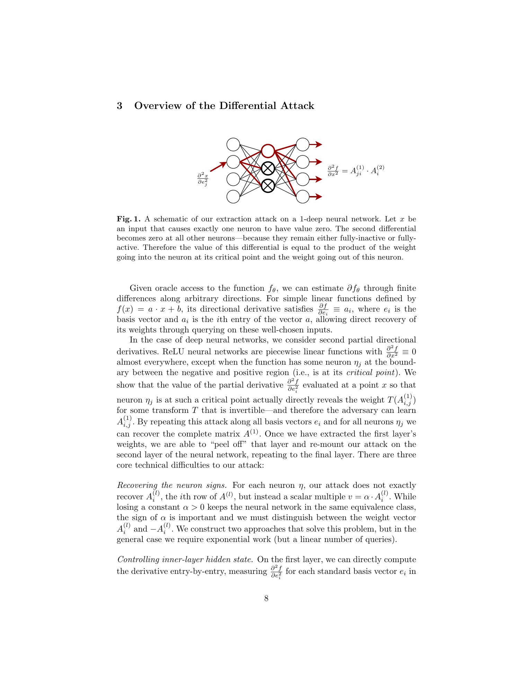
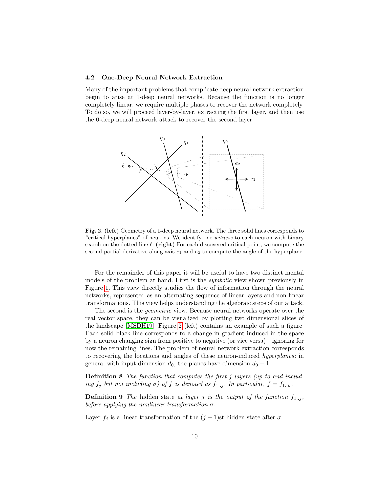
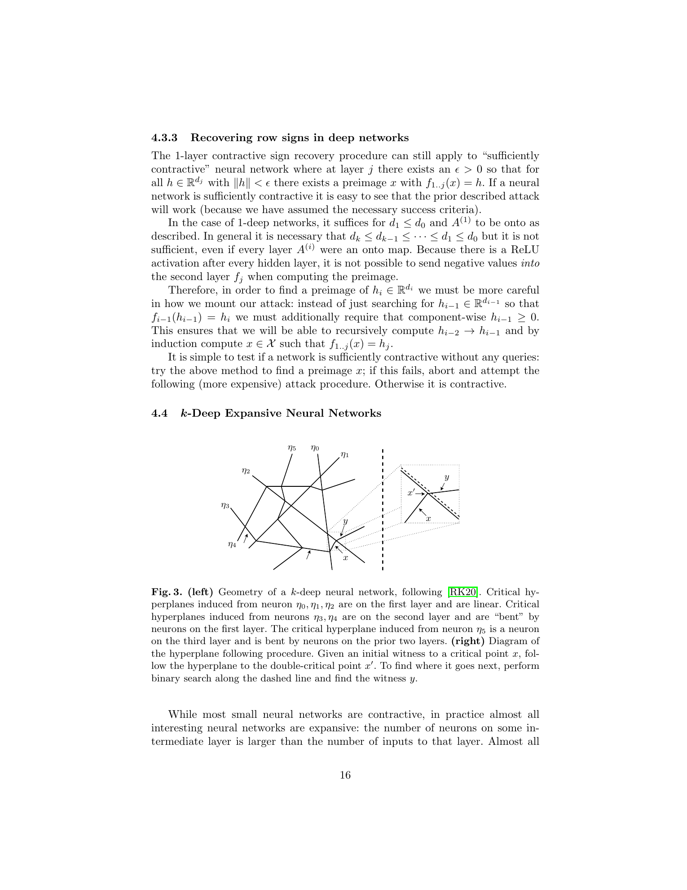
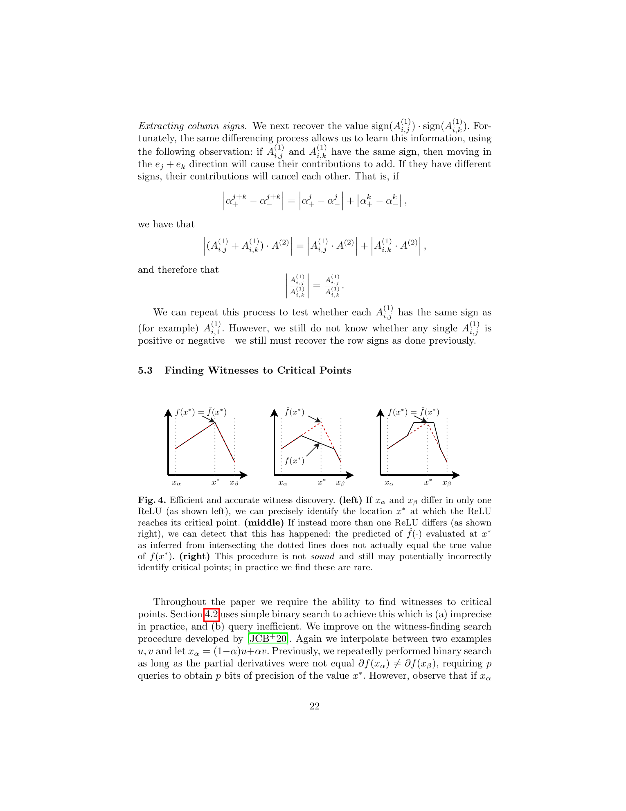
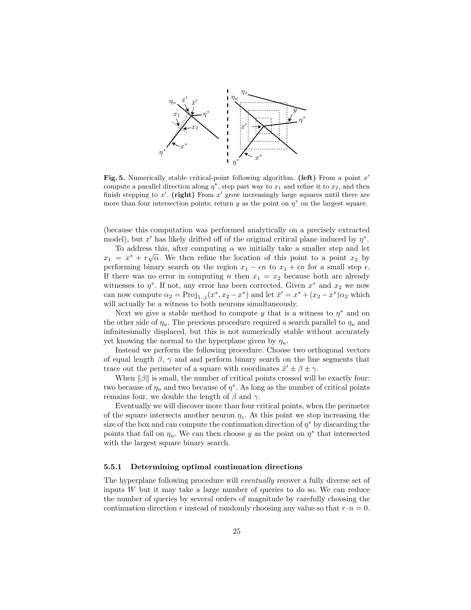
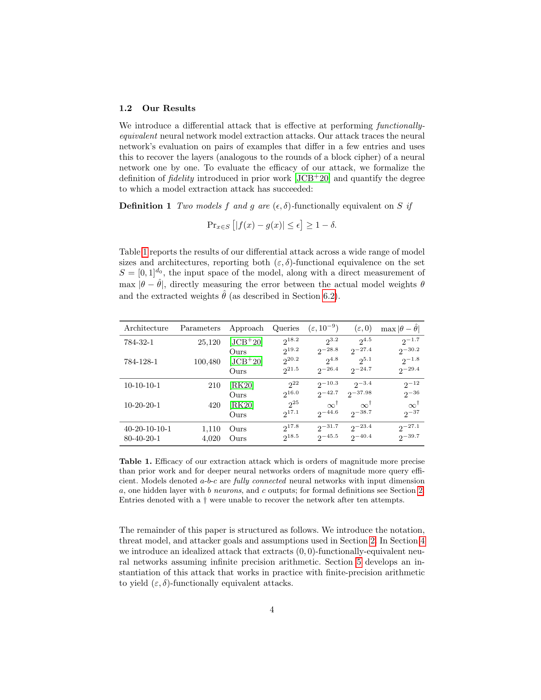

# Cryptanalytic Extraction of Neural Network Models

原论文链接：[arXiv:2003.04884](https://arxiv.org/abs/2003.04884)

本地 PDF：[Cryptanalytic Extraction of Neural Network Models.pdf](./Cryptanalytic%20Extraction%20of%20Neural%20Network%20Models.pdf)

代码仓库：[google-research/cryptanalytic-model-extraction](https://github.com/google-research/cryptanalytic-model-extraction)

上位地图：[[MOC - 计算机]] · [[Research on Cryptographic Neurons]] · [[Neural Cryptanalysis]]

相关主题：[[Model Extraction]]、[[Cryptanalytic Extraction]]、[[ReLU Network]]、[[Critical Point]]、[[Piecewise Linear Function]]、[[Secure Inference]]、[[Deep Neural Cryptography]]、[[Hard-Label Cryptanalytic Model Extraction]]

## Abstract

这篇 CRYPTO 2020 论文提出一个非常关键的视角转换：神经网络模型提取不是普通的机器学习“抄作业”问题，而是一个伪装成机器学习问题的密码分析问题。攻击者面对的不是训练过程，也不是训练数据，而是一个只允许查询的 oracle。模型参数就像 block cipher 的 secret key，攻击者通过自适应选择输入并观察输出，试图恢复隐藏参数。

论文研究的对象是 ReLU-based neural networks。ReLU 网络的根本性质是分段线性：在不跨过任何 ReLU 激活边界的小区域内，整个网络就是一个 affine function；一旦跨过某个神经元的边界，梯度发生突变。作者利用这个突变，把 ReLU 的 critical points 当作密码分析中的“泄露点”。在这些点附近做差分查询，可以恢复网络的权重与偏置，精度可接近浮点表示。

一句话概括：

> 这篇论文把 ReLU 网络的几何折痕变成了密钥恢复面；攻击者不需要训练数据，只需要可查询的精确输出 oracle。

这篇论文和后续 [[Deep Neural Cryptography]]、[[Assessing Geometric Security of AES Neural Realizations - Linear-Time Key Recovery via Neural Leakage]] 的关系非常直接。后两篇关注“把密码原语实现成 ReLU-DNN 后，密钥如何从连续几何中泄露”；这篇则是更早的基础工作，关注“普通 ReLU-DNN 模型参数如何从连续几何中被提取”。二者共享同一条主线：连续分段线性几何不是中性的实现细节，而可能是隐藏参数的泄露通道。

## Knowledge

### 1. Model extraction 为什么可以看成 cryptanalysis

传统 block cipher 可以抽象为 keyed function：

$$
E_k:\mathcal X\rightarrow\mathcal Y.
$$

攻击者通过 chosen-plaintext queries 得到：

$$
(x_i,E_k(x_i)).
$$

目标是恢复 secret key：

$$
k.
$$

神经网络也可以看成 parameterized function：

$$
f_\theta:\mathcal X\rightarrow\mathcal Y.
$$

攻击者通过 chosen-input queries 得到：

$$
(x_i,f_\theta(x_i)).
$$

目标是恢复 hidden parameters：

$$
\theta.
$$

这就是论文最重要的类比。密码分析里，key 是隐藏在黑盒实现中的 secret material；模型提取里，weights 和 biases 也是隐藏在黑盒实现中的 secret material。二者的差别在于，block cipher 被设计成抵抗 chosen-plaintext key recovery，而普通神经网络并没有被设计成抵抗 chosen-input parameter recovery。

可以把这个类比想象成两台售货机。密码学售货机不仅卖饮料，还被专门设计成无论顾客怎样投币、按键，都无法从输出反推出内部钥匙；普通神经网络售货机只被设计成按键后给出预测结果，并没有假设顾客会用一套密码分析式的探针去测内部弹簧位置。

### 2. Functionally equivalent extraction：不一定逐字节相同，但行为足够相同

论文不是只关心参数文件逐位复制，而是定义了功能等价意义上的模型提取。两个模型在集合 `S` 上如果满足：

$$
\Pr_{x\in S}
\left[
|f(x)-g(x)|\le \epsilon
\right]
\ge
1-\delta,
$$

就称它们是：

$$
(\epsilon,\delta)\text{-functionally equivalent}.
$$

这里的 `epsilon` 控制输出误差，`delta` 控制允许失败的输入比例。若：

$$
\delta=0,
$$

则要求在整个测试域上都有最坏情况误差界。若：

$$
\delta=10^{-9},
$$

则表示除了极小概率输入外都要近似一致。

这个定义很重要，因为神经网络有很多等价自由度。例如同一层神经元可以重新排列；某个 ReLU neuron 的 incoming weights 乘以正数 `c`，下一层对应 outgoing weight 除以 `c`，网络函数不变。因此，模型提取的目标不一定是恢复训练 checkpoint 中完全同序、同尺度的参数，而是恢复一个 oracle 行为等价的模型。

### 3. ReLU 网络的泄露来自 piecewise linear geometry

论文只研究 ReLU 激活：

$$
\sigma(z)=\max(z,0).
$$

一个第 `j` 层 affine layer 可以写成：

$$
f_j(x)=A^{(j)}x+b^{(j)}.
$$

完整网络是 affine layer 与 ReLU 交替组合而成。只要固定每个 ReLU 是 active 还是 inactive，网络就退化成一个局部 affine function。因此输入空间被许多超平面切成 linear regions。

某个神经元 `eta` 的 pre-activation 记作：

$$
V(\eta;x).
$$

当：

$$
V(\eta;x)=0,
$$

该输入 `x` 就是这个神经元的 critical point，论文也称它为 witness。直观上，这就是 ReLU 折纸上的折痕：折痕一侧神经元 active，另一侧神经元 inactive。攻击者如果能找到折痕，并测量折痕两侧的梯度差，就能反推出生成这条折痕的权重方向。

这个概念和后续 `Assessing Geometric Security` 的 activation-boundary leakage 是同一类现象。区别是本文恢复的是普通模型参数，`Assessing` 恢复的是 AES neural realization 中由 key-dependent XOR 暴露的 key bit。

### 4. Threat model：强 oracle，但没有 side channel

论文的攻击模型非常清楚。攻击者拥有 oracle access：

$$
O(x)=f_\theta(x).
$$

并且已知网络 architecture。论文显式做了几个假设：

| 假设 | 含义 | 对攻击强度的影响 |
| --- | --- | --- |
| architecture knowledge | 攻击者知道层数、每层维度和结构 | 强假设，但许多 API 或部署模型结构可被猜测或侧信道获得 |
| full-domain inputs | 攻击者可以输入任意实数向量 | 很强，类似后续 DNN-AES 的 real-valued oracle |
| complete outputs | oracle 返回原始数值输出，而不是只返回 top label | 这是 raw-output setting；后续 hard-label 论文正是放松这个假设 |
| 64-bit floating point | 模型以高精度浮点计算 | 使 critical point 和有限差分更可测 |
| scalar outputs | 输出可简化成一维 | 作者认为不失一般性 |
| ReLU activations | 激活函数是 ReLU 或分段线性类 | 这是最根本假设；非分段线性激活会破坏攻击核心 |

这些假设意味着本文不是“现实中任意模型 API 都马上可被偷走”的结论。更准确的说法是：如果一个 ReLU 模型暴露了足够精确、足够连续、足够完整的黑盒输出，那么仅靠输出并不足以保护参数。

### 5. Critical point 与 finite difference 的关系

对于没有隐藏层的 linear model：

$$
f(x)=A^{(1)}x+b^{(1)}.
$$

任意小扰动 `delta` 满足：

$$
f(x+\delta)-f(x)
=
A^{(1)}\delta.
$$

若 `delta` 是第 `i` 个标准基向量：

$$
\delta=e_i,
$$

则：

$$
f(x+e_i)-f(x)
=
A_i^{(1)}.
$$

也就是说，线性层的权重可以直接由差分读出来。深层 ReLU 网络的难点在于网络不是全局线性的；但在每个 linear region 内，它仍然是局部线性的。攻击的核心就是找到 region 边界，并用边界两侧的梯度跳变恢复造成跳变的神经元权重。

## Overview

### 1. 一层 ReLU 网络攻击的核心图景

论文最适合先从一层网络理解。设一层 ReLU 网络为：

$$
f(x)
=
A^{(2)}
\operatorname{ReLU}
\left(
A^{(1)}x+b^{(1)}
\right)
+
b^{(2)}.
$$

如果攻击者找到了某个输入：

$$
x^\star\in W(\eta_j),
$$

也就是第 `j` 个神经元正好处在 critical point，则在 `x^\star` 附近只有这个神经元的 active/inactive 状态发生变化，其他神经元保持不变。于是对两侧做有限差分时，其他路径的贡献会互相抵消，只剩下经过这个临界神经元的路径贡献。

论文用二阶偏导的直觉解释这一点。ReLU 网络在普通点二阶导为零；只有跨过 ReLU 折点时，梯度出现不连续。因此，若测量方向 `i` 上的正负侧梯度：

$$
\alpha_+^i
\quad\text{and}\quad
\alpha_-^i,
$$

则梯度差大致暴露：

$$
\alpha_+^i-\alpha_-^i
=
A_{j,i}^{(1)}A_j^{(2)}.
$$

对另一个方向 `k` 也做同样测量：

$$
\alpha_+^k-\alpha_-^k
=
A_{j,k}^{(1)}A_j^{(2)}.
$$

二者相除后，outgoing weight 被消去：

$$
\frac{
\alpha_+^k-\alpha_-^k
}{
\alpha_+^i-\alpha_-^i
}
=
\frac{
A_{j,k}^{(1)}
}{
A_{j,i}^{(1)}
}.
$$

于是可以恢复第 `j` 个 neuron 的 incoming weight row，至少恢复到一个 scalar multiple。再利用 critical point 条件：

$$
A_j^{(1)}x^\star+b_j^{(1)}=0,
$$

可以恢复 bias：

$$
b_j^{(1)}
=
-
A_j^{(1)}x^\star.
$$

这就是整篇论文的局部机制。它像在墙上找裂缝：裂缝位置告诉攻击者墙的法向量；沿不同方向敲击裂缝，回声差异告诉攻击者裂缝背后的支撑结构。

### 2. Critical hyperplane 的几何视角

论文区分 symbolic view 和 geometric view。Symbolic view 看网络中信息如何沿边传播；geometric view 看输入空间被 ReLU critical hyperplanes 如何切分。

图中每条黑线都是某个神经元的 critical hyperplane。在高维空间中，这些线对应维度为：

$$
d_0-1
$$

的超平面。攻击者沿随机线扫描，找到导数不连续的位置；这个位置就是 witness。找到 witness 后，通过有限差分估计超平面的法向量，从而恢复权重方向。

### 3. 从一层到多层：peel-off attack

一层网络恢复后，攻击者可以把第一层“剥离”掉：用已恢复的第一层把输入映射到下一层 hidden state，然后把剩下的网络当作更浅的网络继续提取。这类似 block cipher cryptanalysis 中的 round-by-round recovery：先恢复第一轮密钥，再把第一轮消掉，继续攻击后面的轮。

但深层网络带来两个困难。

第一，后层神经元的 critical hyperplane 在原始输入空间中不再是直线，而会被前面层的 ReLU 折叠成弯曲的分段线性边界。

第二，某些隐藏层维度可能扩张。若中间层 neuron 数多于输入维度，攻击者需要在更复杂的 polytope boundary 上追踪边界，才能得到足够多的 witness。

### 4. Contractive 与 expansive 的区别

论文把多层网络分成 contractive 和 expansive 两类直觉场景。Contractive 情况中，中间表示维度没有变得更大，攻击者可以较容易地反求 preimage，从而控制 hidden state。Expansive 情况更难，因为某些层的维度增加，攻击者无法随意指定下一层 hidden vector 的所有坐标。

论文引入 layer polytope 概念。给定输入 `x`，第 `j` 层 polytope 是所有不会改变前 `j` 层 activation pattern 的点：

$$
P_j(x)
=
\left\{
x+\delta:
\operatorname{sign}V(\eta;x)
=
\operatorname{sign}V(\eta;x+\delta),
\forall \eta,\ L(\eta)\le j
\right\}.
$$

这一定义说明，攻击者不是在完整空间里随意行走，而是在由前若干层 ReLU 折痕围出来的局部多面体内移动。攻击的几何任务变成：找到 polytope 的边界，沿边界追踪，收集某一层的 critical witnesses。

### 5. 有限精度实现不是小细节

理想化攻击假设无限精度实数计算。但实际模型用 64-bit floating point，差分步长太小会被数值误差吞掉，步长太大又会跨过多个 ReLU 边界。论文第 5 节的主要贡献之一，就是把理想攻击变成可运行攻击。

作者还给出 critical-point following 的稳定方法。由于沿着某条 critical hyperplane 移动时数值误差会让点慢慢漂离原始超平面，算法需要反复修正位置，并用逐步放大的局部搜索框寻找下一段边界。

这些细节解释了为什么这篇论文是后续工作的基线。它不仅指出“临界点泄露参数”，还把这个思路落到了实际浮点模型上。

## Method

### 1. 攻击目标与资源

论文中的攻击者目标是输出一组参数：

$$
\hat\theta,
$$

使得：

$$
f_{\hat\theta}(x)
\approx
f_\theta(x)
$$

在目标输入域上成立。攻击资源主要有两个：

$$
\text{query complexity}
$$

和：

$$
\text{computational complexity}.
$$

这一点也是它与密码分析最像的地方。一个攻击不是只问“能不能恢复”，而要问“需要多少 chosen queries、多少计算量、能恢复到多高精度”。

### 2. 找 witness：从随机线到 critical point

攻击者沿输入空间中的随机线搜索导数不连续点。若沿线两个端点的局部导数不同，则中间至少跨过某个 ReLU boundary。最朴素方法是二分搜索，直到定位：

$$
x^\star
$$

使某个神经元满足：

$$
V(\eta;x^\star)=0.
$$

这个点就是 witness。找到 witness 后，攻击者在多个标准基方向上测量两侧梯度差，从而恢复该神经元对应的权重比例。

### 3. 恢复权重方向、符号与偏置

在一层网络中，梯度跳变给出的是某个 incoming weight row 和 outgoing weight 的乘积。通过方向间比值，可以恢复 incoming weight row 到比例因子；通过 critical point 条件，可以恢复 bias 到同样比例因子；通过额外构造输入点，可以恢复 row sign。

神经网络的一个特殊等价性是正缩放不改变函数：

$$
A_j^{(1)}
\leftarrow
cA_j^{(1)},
$$

$$
A_j^{(2)}
\leftarrow
\frac{1}{c}A_j^{(2)},
$$

其中：

$$
c>0.
$$

所以恢复到正比例因子通常足以获得功能等价模型。但负号不能随便吸收，因为 ReLU 不是奇函数：

$$
\operatorname{ReLU}(-z)
\ne
-
\operatorname{ReLU}(z).
$$

因此 row sign recovery 是必要步骤。

### 4. 深层恢复：剥离、聚类与统一 partial solutions

深层网络中，一个 witness 可能只让某些 hidden coordinates 非零。此时一次 least-squares recovery 只能恢复一部分权重坐标。论文用 unification procedure 把多个 partial recoveries 拼成完整 row。

若两个 witness 对应同一个 neuron，它们恢复出的 partial vectors 在交集坐标上应当相差同一个标量：

$$
r_1[t_1\cap t_2]
=
c\cdot
r_2[t_1\cap t_2].
$$

只要交集足够大，就能判断它们是否属于同一 neuron，并把它们合并。这一步很像拼图：每块碎片只露出一部分边，只有重叠边缘能对齐，才能确定它们来自同一块原图。

在有限精度下，论文进一步用 graph clustering 处理 noisy gradients。每个 partial vector 是图中的顶点；若两个向量足够一致，就连边；连通分量对应同一个 neuron 的多个 partial recoveries。

### 5. 评估功能等价

论文用两种方式评估提取模型和原 oracle 的差异。

第一是经验抽样，估计：

$$
(\epsilon,10^{-9})\text{-functional equivalence}.
$$

作者采样大量输入，寻找使下式成立的最小误差阈值：

$$
\Pr_{x\in S}
\left[
|f(x)-\hat f(x)|\le \epsilon
\right]
\ge
1-10^{-9}.
$$

第二是最坏情况：

$$
(\epsilon,0)\text{-functional equivalence}.
$$

直接计算最坏情况误差很难，论文讨论了两种上界方法：一种是对齐 neuron permutation 和 positive scaling 后做误差传播；另一种是把 ReLU 网络编码成 mixed-integer linear program，但 MILP 只适合小网络。

误差传播的基本形式是：

$$
e_{i+1}
\le
s_i e_i
+
\|\tilde b^{(i)}-b^{(i)}\|_2,
$$

其中 `s_i` 是当前层权重误差矩阵的最大奇异值相关界，`e_i` 是进入第 `i` 层的误差界。

## Experiments

论文实验报告了多种 fully connected ReLU networks，包括 MNIST 输入维度 `784` 的网络，以及更小但更深的 synthetic architectures。最关键的实验结果汇总在 Table 1。

表格的读法如下：

| 观察点 | 含义 |
| --- | --- |
| `784-32-1` 和 `784-128-1` | MNIST 维度输入的一隐藏层网络，参数量约 25k 与 100k |
| `10-10-10-1` 与更深网络 | 多隐藏层网络，用来测试深层提取能力 |
| `Queries` | 攻击所需 oracle queries，以 2 的指数形式报告 |
| `(epsilon, 10^-9)` | 经验意义上极高概率输入的输出误差 |
| `(epsilon, 0)` | 最坏情况或上界意义上的输出误差 |
| `max |theta - theta_hat|` | 原参数与提取参数对齐后的最大误差 |

论文摘要中强调两个标志性结果：

$$
2^{21.5}
$$

queries 可以在一小时内提取一个约 `100,000` 参数的 MNIST 网络，并让最坏情况输出误差达到大约：

$$
2^{-25}.
$$

对于约 `4,000` 参数模型，攻击用：

$$
2^{18.5}
$$

queries 达到约：

$$
2^{-40.4}
$$

的最坏情况误差。

与先前工作相比，论文声称该攻击达到：

$$
2^{20}
$$

倍更高精度，并减少约：

$$
100\times
$$

queries。需要注意，实验仍然建立在 raw-output、known-architecture、full-domain query 和 ReLU activation 的设定上。

## 与后续论文的关系

### 1. 对 EUROCRYPT 2024 polynomial-time extraction 的铺垫

这篇论文已经把 neural network extraction 建模成 cryptanalytic extraction，并指出 ReLU critical points 是主要泄露源。但它在某些深层场景中仍可能需要指数计算或指数搜索。后续 `Polynomial Time Cryptanalytic Extraction of Neural Network Models` 正是沿着这条线推进，把部分指数瓶颈推进到多项式时间。

### 2. 对 hard-label extraction 的铺垫

本文假设 complete outputs，也就是攻击者能看到原始数值输出。后续 `Hard-Label Cryptanalytic Extraction of Neural Network Models` 和 `Polynomial Time Cryptanalytic Extraction of Deep Neural Networks in the Hard-Label Setting` 放松这个假设，只允许攻击者看到最终 label。那条线的核心困难是：梯度和 logits 不可见后，攻击者只能从 decision boundary 的几何形状反推内部 activation boundary。

### 3. 对 Deep Neural Cryptography 的铺垫

[[Deep Neural Cryptography]] 和 [[Assessing Geometric Security of AES Neural Realizations - Linear-Time Key Recovery via Neural Leakage]] 可以看作把本文的“ReLU 几何泄露参数”思想迁移到密码原语神经实现上。本文中的 hidden parameters 是普通 DNN weights；后续 AES neural realization 中，secret material 是 key bits 或 round keys。共同点是：

$$
\text{piecewise-linear geometry}
\quad\Longrightarrow\quad
\text{secret-dependent boundaries}
\quad\Longrightarrow\quad
\text{extractable information}.
$$

这也是为什么本文是阅读 `Deep Neural Cryptography` 之前非常重要的基础文献。

## Insights

### 1. “只给 API 输出”不是安全边界

secure inference 领域常见隐含假设是：如果服务端只返回预测输出，不暴露模型参数，那么模型权重就仍然保密。本文指出，在 raw-output oracle 下，这个假设不成立。输出本身可能已经携带足够几何信息。

这和密码学中的 lesson 非常像：接口行为本身就是攻击面。一个加密模块即使不泄露 key 文件，只要 chosen-plaintext 输出中有可利用结构，key 仍可能被恢复。

### 2. ReLU 的“折痕”既是表达能力来源，也是泄露来源

ReLU 网络强大的一部分原因是它把空间切成大量 linear regions；每个 region 内简单，整体上却能表达复杂函数。但同一个结构也给了攻击者路标。critical hyperplanes 就像地图上的等高线，如果等高线的位置由参数决定，足够多的查询就能重建地形。

这里的对偶概念是 smooth activation。若激活函数不是 piecewise linear，临界边界不再以同样方式产生梯度跳变，本文攻击核心会失效。但这不等于 smooth activation 自动安全，只是该攻击的几何抓手消失。

### 3. 功能等价比参数相等更适合讨论神经网络提取

神经网络存在排列、缩放等对称性，因此直接比较参数不是最自然的安全目标。功能等价更接近攻击者真正想要的能力：复制 oracle 行为。这个观点后来在 hard-label extraction 中更重要，因为 hard-label 场景下恢复原 checkpoint 更难，但恢复功能等价模型仍然具有安全意义。

### 4. 这篇论文不是 side-channel attack，但和 side-channel 思维很近

论文显式假设没有 timing 或其他 side channels。泄露来自数学 oracle 的输出，而不是硬件时间、cache、电磁或功耗。但思维方式和 side-channel 很像：攻击者没有直接读参数，而是利用实现介质的细微响应恢复隐藏状态。

可以把它称为 geometry-channel：通道不是物理噪声，而是函数的连续几何结构。

## Critical Reading

### Strengths

论文的最大贡献是重新定义问题。它把模型提取从经验安全问题提升到密码分析问题，使 query complexity、computational complexity、oracle model 和 functional equivalence 都变成可以严肃讨论的对象。

第二个优点是机制清晰。攻击不依赖训练数据分布，也不依赖模型语义，只依赖 ReLU 网络作为分段线性函数这一结构事实。这使结论具有很强的概念穿透力。

第三个优点是实现细节充分。有限精度、witness discovery、critical-point following、partial solution unification 和 equivalence evaluation 都被认真处理，因此它不是只停留在黑板上的攻击。

### Limitations

论文的 threat model 很强。攻击者需要 full-domain real-valued inputs、complete raw outputs、known architecture 和高精度浮点输出。许多实际 API 只返回 top-k label、概率被截断或经过 rate limiting，因此不能直接套用本文攻击。

攻击主要针对 fully connected ReLU networks。卷积、残差、归一化、注意力结构、量化部署和非 ReLU 激活都需要额外分析。后续 side-channel 和 PReLU 论文正是在扩展这些边界。

论文没有提出防御，只在结论中提到可能的方向，例如检测攻击、加噪、只返回 label。这意味着它更像一篇奠基性攻击论文，而不是完整攻防闭环。

### 需要避免的误读

不能把本文结论简化为“所有神经网络 API 都能被精确复制”。更准确的边界是：

$$
\text{known-architecture ReLU network}
+
\text{precise raw-output oracle}
+
\text{full-domain queries}
\Longrightarrow
\text{parameters may be extracted}.
$$

也不能把它理解为训练数据泄露论文。本文恢复的是模型参数；模型 inversion 或 membership inference 关注的是训练数据隐私。二者可能互相强化，但不是同一个问题。

## 用户可能“不知道自己不知道”的背景

### 1. ReLU 网络不是“黑箱曲线”，而是很多 affine maps 拼起来的折纸

许多读者把神经网络想成连续但复杂的黑箱曲面。ReLU 网络更准确的直觉是高维折纸：每个小面都是平的，复杂性来自折痕数量。本文攻击不是在学习黑箱曲面，而是在恢复折痕的位置和方向。

### 2. Critical point 不是优化里的 critical point

机器学习优化中，critical point 常指梯度为零的点。本文中的 critical point 指某个 ReLU pre-activation 为零的点：

$$
V(\eta;x)=0.
$$

它是激活状态切换边界，不是损失函数驻点。混淆这两个概念会严重误读论文。

### 3. Raw-output 与 hard-label 是两个完全不同的 oracle

本文攻击依赖输出数值足够精确。若 oracle 只返回：

$$
\arg\max_j f_j(x),
$$

攻击者看到的是 hard label，而不是 logits 或 score。后续 hard-label cryptanalytic extraction 的难点正是如何在看不到连续输出的情况下，从 decision boundary 间接恢复几何信息。

### 4. Secure inference 不自动隐藏函数本身

secure inference 通常保证客户端输入不泄露给服务端、服务端模型不直接泄露给客户端。但标准安全定义往往允许客户端看到最终输出。本文提醒读者：如果输出序列本身足以恢复模型，那么“协议没有泄露中间值”仍不等于“模型保持机密”。

### 5. 参数提取和功能复制的安全后果不同

若攻击者恢复参数，可能进一步做白盒 adversarial examples、model inversion、模型盗版、规避检测等。若只恢复功能等价模型，很多攻击后果仍然成立。安全分析因此不能只保护 checkpoint 文件，还要考虑 oracle 行为是否足以复制功能。

## 可沉淀到 `03_Knowledge` 的原子概念

- [[Cryptanalytic Extraction]]
- [[Model Extraction]]
- [[Functionally Equivalent Extraction]]
- [[ReLU Network]]
- [[Piecewise Linear Function]]
- [[Critical Point]]
- [[Critical Hyperplane]]
- [[Witness to Critical Point]]
- [[Finite Difference Attack]]
- [[Geometry-Channel Leakage]]
- [[Secure Inference]]
- [[Raw-Output Oracle]]
- [[Hard-Label Oracle]]

## Sources

- arXiv：https://arxiv.org/abs/2003.04884
- DOI：https://doi.org/10.48550/arXiv.2003.04884
- Code：https://github.com/google-research/cryptanalytic-model-extraction
- 本地 PDF：`./Cryptanalytic Extraction of Neural Network Models.pdf`
- 本地提取文本：`./Cryptanalytic Extraction of Neural Network Models.txt`

## 标签

#status/进行中 #type/笔记 #type/论文 #topic/cryptanalytic-extraction #topic/ReLU #topic/model-extraction #topic/secure-inference #topic/neural-network-security
