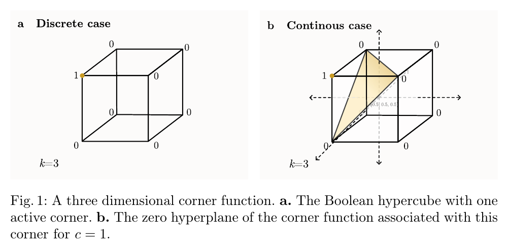
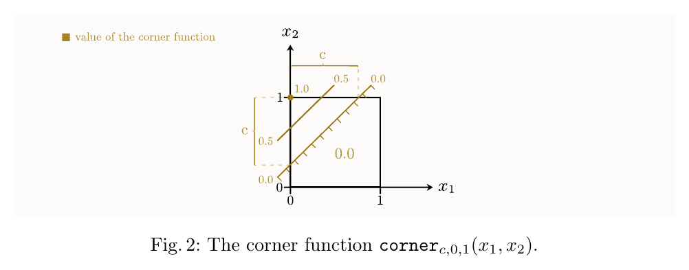
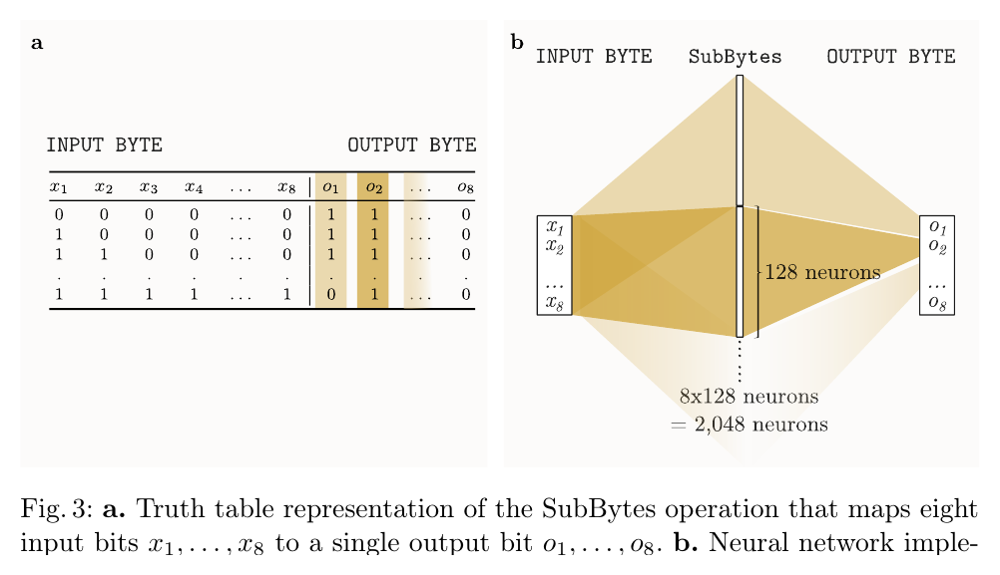
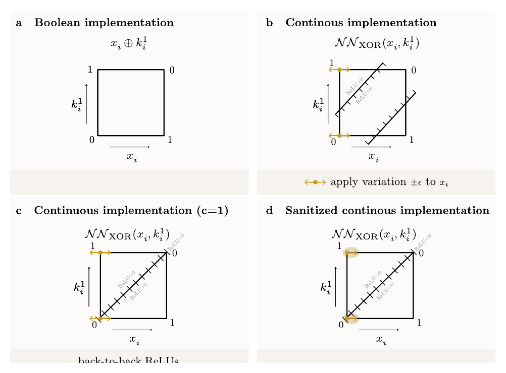
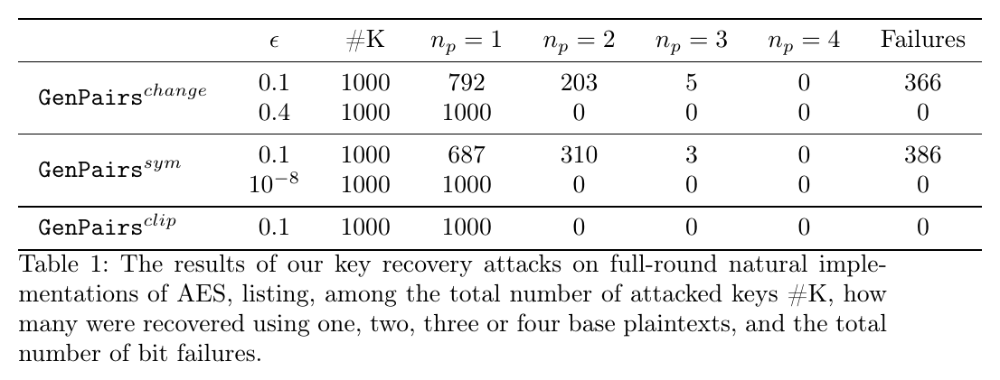
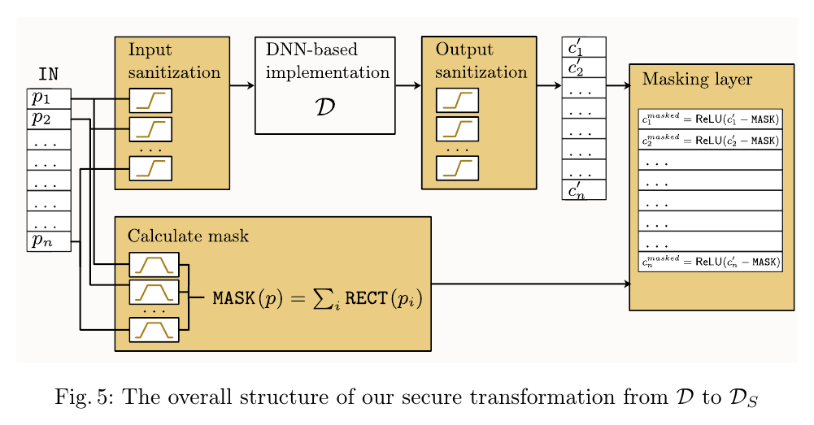
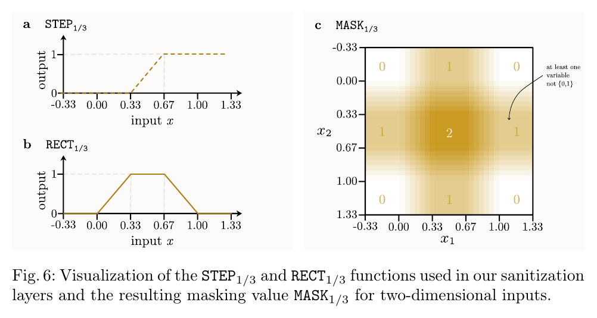
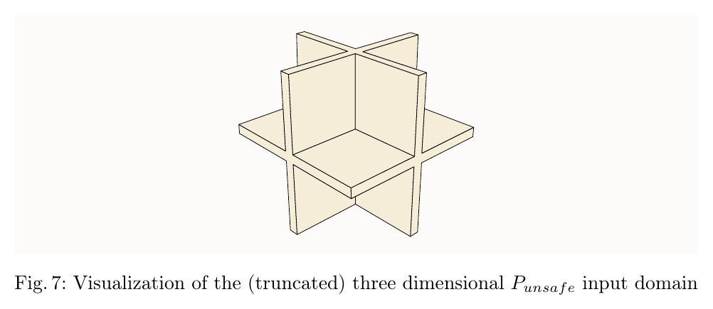
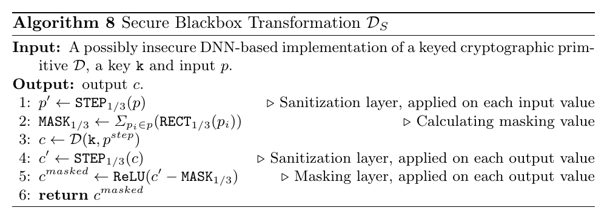

# Deep Neural Cryptography

原论文链接：[Springer DOI](https://link.springer.com/chapter/10.1007/978-3-032-25333-0_18)

本地 PDF：[Deep Neural Cryptography.pdf](./Deep%20Neural%20Cryptography.pdf)

上位地图：[[MOC - 计算机]] · [[Research on Cryptographic Neurons]]

相关主题：[[ReLU Network]]、[[AES]]、[[Domain Extension]]、[[Implementation Security]]、[[Cryptanalytic Model Extraction]]、[[Neural Cryptography]]、[[Secure Implementation]]

### Abstract

这篇 EUROCRYPT 2026 论文研究一个很容易被低估的问题：如果把一个标准密码算法实现成 ReLU-based DNN，它在 DNN 的连续实数输入模型下还安全吗？

标准 AES 是离散函数：

$$
E_k:\{0,1\}^{128}\rightarrow\{0,1\}^{128}.
$$

ReLU-DNN 天然是连续分段线性函数：

$$
D_k:\mathbb{R}^{128}\rightarrow\mathbb{R}^{128}.
$$

二者的差异不是语法层面的实现语言差异，而是计算域发生了扩张。标准 AES 只需要回答合法 bit 输入；DNN-AES 必须对 \(0.3\)、\(-7\)、\(\pi\)、\(1+\epsilon\) 这类非标准“bit”也给出输出。攻击者可以利用这些实数输入在连续几何中做微扰分析，从而恢复密钥。

论文的核心结论有两部分：

1. **负面结果**：自然的 ReLU-DNN block cipher 实现是不安全的。作者在 full-round AES-128 的自然 DNN 实现上实验，1000 个随机密钥全部被成功恢复。
2. **正面结果**：作者提出一个通用安全转换 \(D\mapsto D_S\)，通过 input/output sanitization 与 output masking，使任意 real-valued 查询不会泄露比二进制 oracle 更多的密钥信息。

一句话概括：

> AES 没有被破解；被破解的是“把 AES 自然延拓成 ReLU-DNN 后暴露给实数查询”的实现方式。

### Knowledge

#### 1. Domain extension：从 bit 到 real 不是无害变化

论文反复强调，问题不在于 ReLU 网络能不能表达 AES，而在于表达后暴露了一个更强 oracle：

$$
\{0,1\}^{128}
\quad\leadsto\quad
\mathbb{R}^{128}.
$$

这个过程叫 domain extension。许多问题一旦改变定义域，难度会剧烈变化：

| 原问题 | 扩展后 | 难度变化直觉 |
| --- | --- | --- |
| integer programming | linear programming over reals | 可从 NP-hard 变成多项式可解 |
| bit circuits | qubit circuits | factoring 可被 Shor 算法多项式求解 |
| Boolean crypto primitive | ReLU continuous extension | 标准安全性不自动继承 |

形象地说，标准 AES 像只允许在城市路口行走的地图；ReLU-DNN AES 把路口之间的地形也连续铺开。攻击者以前只能看路口输出，现在可以沿着道路斜坡走，观察折点、斜率和对称性。

#### 2. Natural implementation：把 Boolean 函数拼成 ReLU 网络

论文首先说明，任意小 Boolean 函数可以被自然地写成 ReLU 网络。最基础例子是 XOR：

$$
x\oplus y = |x-y|
=
\operatorname{ReLU}(x-y)+\operatorname{ReLU}(y-x),
\quad x,y\in\{0,1\}.
$$

更一般地，对 Boolean function：

$$
f:\{0,1\}^k\rightarrow\{0,1\},
$$

作者用 active corner 的 sum-of-corners construction。若 \(b=(b_1,\ldots,b_k)\) 是一个 active corner，即 \(f(b)=1\)，定义 corner function：

$$
\operatorname{corner}_{c,b}(x)
=
\operatorname{ReLU}
\left(
\frac{1}{c}
\left(
\sum_{i:b_i=1}x_i
+
\sum_{i:b_i=0}(1-x_i)
-k+c
\right)
\right),
\quad 0<c\le 1.
$$

它在对应 Boolean corner 上输出 1，在其他 Boolean corners 上输出 0。

这里的危险之处是：Boolean 顶点上的正确性不约束顶点之间的连续地形。corner function 在 \(\{0,1\}^k\) 上是合法逻辑门，但在 \(\mathbb{R}^k\) 中会暴露超平面位置和斜率。

#### 3. AES 的自然 DNN 实现

论文将 AES-128 拆成标准组件并自然实现：

- `AddRoundKey`：128-bit XOR；
- `SubBytes`：S-box truth table；
- `ShiftRows`：置换；
- `MixColumns`：有限域线性运算，可由 XOR 与查表类 Boolean 函数组合。

对 AES S-box，每个输出 bit 是一个 8 输入 Boolean 函数。因为 S-box balanced，每个输出 bit 有 128 个 active corners，所以一个 output bit 需要 128 个 corner neurons；8 个输出 bit 共：

$$
8\times 128 = 2048
$$

个 hidden neurons。

这说明自然实现并不难：只要把 Boolean 组件逐块翻译成 ReLU 网络即可。难的是这种“正确实现”在更强的实数 oracle 下是否安全。

### Overview

#### 1. 自然 DNN-AES 为什么会被攻击

论文攻击的核心是第一轮 `AddRoundKey`：

$$
z_i=x_i\oplus k_i.
$$

在自然 ReLU 实现中，它变成某种连续函数。攻击者不能改变密钥 bit \(k_i\)，但可以对明文坐标 \(x_i\) 做极小扰动：

$$
x_i+\epsilon,\qquad x_i-\epsilon.
$$

如果这个扰动在第一层 XOR 处被阻断，最终 ciphertext 不变；如果扰动通过，后续 AES 的 avalanche effect 通常会让输出变化。于是输出是否变化就泄露了 key bit 的信息。

Fig.4 对应三类攻击：

| 情况 | 攻击直觉 |
| --- | --- |
| separated ReLUs, \(c<1\) | 在两个 inactive corners 附近，微扰被 ReLU 阻断；由哪一对 plaintext pair 不变来判断 key bit |
| back-to-back ReLUs, \(c=1\) | 利用 \(|x-k|\) 关于 \(k\) 的对称性，通过 \(k-\epsilon\)、\(k+\epsilon\) 对称查询判断 key bit |
| clipped/sanitized input | 即使输入被裁到 \([0,1]\)，仍可转向 S-box preimage 攻击，按 byte 恢复 key |

#### 2. 为什么 ClippedReLU 不是完整防御

自然的想法是先把输入裁到 \([0,1]\)：

$$
\operatorname{ClippedReLU}(x)
=
\operatorname{ReLU}(x)-\operatorname{ReLU}(x-1).
$$

它能把 \(x<0\) 变成 0，把 \(x>1\) 变成 1，并保持 \(0\le x\le 1\) 不变。这个做法能阻止某些需要跑出 \([0,1]\) 的对称攻击，但论文展示了新的 S-box 攻击：攻击者可以围绕 AES S-box 的特殊 preimage 做微扰，识别第一轮 S-box 输入，从而按 byte 恢复 key。

这说明“裁剪输入范围”并不等于恢复了 Boolean 安全模型。ReLU 连续几何仍会在 \([0,1]\) 内部泄漏结构。

### Main Results

#### 1. Natural AES-DNN 可被线性时间恢复 key

攻击复杂度与 key bit 数量线性相关。对 AES-128，攻击者按 bit 或 byte 构造候选 plaintext pairs，并检查对应 ciphertext 是否相同。失败是可检测的：如果多个候选都导致相同 ciphertext，攻击者知道这次 base plaintext 不好，可以换一个再试。

论文的关键实验结果如下：

表中三个策略都对 1000 个随机 AES-128 keys 成功恢复：

| 攻击策略 | 条件 | 结果 |
| --- | --- | --- |
| `GenPairschange` | separated ReLUs | \(\epsilon=0.4\) 时 1000/1000 首次恢复 |
| `GenPairssym` | back-to-back ReLUs | \(\epsilon=10^{-8}\) 时 1000/1000 首次恢复 |
| `GenPairsclip` | clipped/sanitized inputs | 1000/1000 首次恢复 |

这里的 failures 不是最终失败，而是某些 bit 在某个 base plaintext 下出现可检测的不确定性。换一个 base plaintext 或调整 \(\epsilon\) 即可消除。

#### 2. 安全转换的目标不是让 DNN 不连续，而是让实数查询可模拟

ReLU-DNN 无法实现真正的 discontinuous step function。作者没有试图强行做不可能的事，而是构造一个连续的安全转换：

$$
D \mapsto D_S.
$$

目标是：攻击者对 \(D_S\) 做任意 real-valued 查询时，得到的信息都能由一个只访问 binary oracle \(B\) 的模拟器产生。形式上，Theorem 1 说，对任意 PPT adversary \(A\)，存在 PPT adversary \(A'\)，使二者输出分布 statistical distance 为 0：

$$
\Delta(A^{D_S},A'^B)=0.
$$

直观解释：如果实数查询的回答可以完全由二进制 oracle 模拟，那么实数域没有额外泄漏。

### Method

#### 1. 安全转换框架

安全转换由三部分组成：

1. **Input sanitization**：把安全区域中的实数输入连续地推向 0 或 1；
2. **Output sanitization**：把输出也限制到 \([0,1]\) 相关区域；
3. **Output masking**：如果输入落在 unsafe 区域，则把所有输出归零。

这个框架的思想是：合法 binary input 保持正确；安全域中的实数 input 被舍入到对应 binary point；不安全域中的 input 不返回有用输出。这样攻击者不能通过“站在 bit 和 bit 之间”探测 secret geometry。

#### 2. STEP、RECT 与 MASK

理想 step function 不连续，ReLU 网络无法实现。因此作者使用近似 step。取 \(\epsilon=1/3\) 时：

$$
\operatorname{STEP}_{1/3}(x)
=
3\cdot
\left(
\operatorname{ReLU}(x-1/3)
-
\operatorname{ReLU}(x-2/3)
\right).
$$

它把 \(x\le 1/3\) 映到 0，把 \(x\ge 2/3\) 映到 1，中间区域线性过渡。

为了检测输入是否落在 unsafe 区域，作者定义 \(\operatorname{RECT}_{1/3}\)，它在 \([1/3,2/3]\) 近似为 1，在安全区域外为 0：

$$
\operatorname{RECT}_{1/3}(x)
=
3\cdot
\left(
\operatorname{ReLU}(x)
-
\operatorname{ReLU}(x-1/3)
-
\operatorname{ReLU}(x-2/3)
+
\operatorname{ReLU}(x-1)
\right).
$$

然后定义 mask：

$$
\operatorname{MASK}_{1/3}(p)
=
\sum_i \operatorname{RECT}_{1/3}(p_i).
$$

若任意输入坐标落在 unsafe strip 中，mask 会变为正，从而 output masking layer 会把输出压成 0。

#### 3. Unsafe domain 的几何

Fig.7 展示三维中的 \(P_{\mathrm{unsafe}}\)：

这张图的关键不是具体三维形状，而是高维直觉：在每个坐标的中间带 \((1/3,2/3)\) 附近，会形成一组 unsafe slabs。攻击者若试图用非 Boolean 值站在中间区域探测斜率，输出会被 masking 归零。

#### 4. Secure blackbox transformation

作者将完整转换写成 Algorithm 8：

简化成公式就是：

$$
p'=\operatorname{STEP}_{1/3}(p),
$$

$$
\operatorname{MASK}_{1/3}(p)=\sum_i\operatorname{RECT}_{1/3}(p_i),
$$

$$
c=D(k,p'),
$$

$$
c'=\operatorname{STEP}_{1/3}(c),
$$

$$
c^{\mathrm{masked}}
=
\operatorname{ReLU}\left(c'-\operatorname{MASK}_{1/3}(p)\right).
$$

若 \(p\in\{0,1\}^n\)，则 \(p'=p\)，mask 为 0，所以正确性保持：

$$
D_S(p)=D(p).
$$

若 \(p\) 在 unsafe 区域，mask 足以把输出清零。若 \(p\) 在 safe 但非 binary 的区域，它会被映射到同一个 orthant 中的 binary point，因此回答可由 binary oracle 模拟。

### Experiments

#### 1. Full-round AES-128 key recovery

论文实现了 full-round AES-128 的自然 ReLU-DNN，并测试三类攻击。所有实验都恢复了完整 128-bit key：

- separated ReLUs, \(c=0.5\)：1000 个随机 keys 全部恢复；
- back-to-back ReLUs, \(c=1\)：1000 个随机 keys 全部恢复；
- back-to-back ReLUs + ClippedReLU sanitization：1000 个随机 keys 全部恢复。

最重要的读法是：这不是 toy AES round，也不是 reduced-round AES，而是 full-round AES-128 的自然 DNN 实现。

#### 2. failures 的含义

表中的 failures 不是攻击失败，而是某些 key bit 在某个 base plaintext 下出现差分抵消。AES 的 avalanche effect 通常会放大扰动，但偶尔后续 S-box 可能把差分抵消。论文指出这类情况：

- 可检测；
- 概率很低；
- 换 base plaintext 可以解决；
- 调整 \(\epsilon\) 可消除。

这很像密码分析中的“坏明文”或 side-channel 中的异常 trace：不是理论障碍，而是实验流程中可重试的噪声。

### Insights

#### 1. 正确性不等于安全性

自然 DNN-AES 在所有 Boolean 输入上都可以完全正确：

$$
\forall x\in\{0,1\}^{128},\quad D_k(x)=E_k(x).
$$

但安全性要求的是对攻击 oracle 的所有可用查询都不泄露额外信息。若攻击者可以查询 \(\mathbb{R}^{128}\)，Boolean 正确性远远不够。

#### 2. 连续几何会泄露实现细节

在 Boolean 顶点之间，ReLU 网络必须给出某种连续插值。这个插值的折点、斜率、对称性、平坦区都可能依赖密钥。攻击者利用的不是 AES 规范本身，而是自然 ReLU 实现的几何副产品。

#### 3. Sanitization 需要配合 masking

简单 clipping 只是把输入限制在 \([0,1]\)，但 \([0,1]\) 内部仍有大量非 Boolean 点。作者的安全转换不是只做 clipping，而是区分 safe/unsafe 区域，并对 unsafe 查询归零。它关注的是“实数查询能否被二进制 oracle 模拟”，而不是表面上把数值压到某个范围。

#### 4. 这篇论文和 side-channel 很像，但泄漏来源不同

side-channel 泄漏来自时间、功耗、cache、电磁辐射等物理现象。本文泄漏来自计算模型本身：连续域、ReLU 折线、corner hyperplane、输出是否变化。它可以被看作一种 **model-channel** 或 **geometry-channel**。

### Critical Reading

#### Strengths

- 问题定义清楚：区分 Boolean cryptographic primitive 与 ReLU-DNN domain extension。
- 负面结果强：full-round AES-128 的自然 DNN 实现被 1000/1000 恢复密钥。
- 防御不是经验 patch，而是给出可模拟性形式的安全论证。
- 图示非常有帮助：corner function、XOR 攻击、安全转换、STEP/RECT/MASK 都能直接解释核心机制。
- overhead 表述实用：常数层数、线性 neuron 数，且对 AES 这类大实现相对开销小。

#### Limitations

- 攻击对象是“自然合成”的 ReLU-DNN 密码实现，不是标准软件/硬件 AES。
- 安全转换保护的是 real-valued query 不额外泄露密钥，但不会让密码 primitive 本身比原始 binary 版本更安全。
- 论文主要围绕 ReLU；其他激活函数或量化网络需要重新分析。
- 实际部署中还涉及有限精度、输入检查、API 限流、随机化等工程条件，论文主要在理论模型与合成实现中讨论。
- 防御会改变非 Boolean 输入上的输出语义；这对某些希望 DNN 同时处理自然连续数据和密码逻辑的系统可能需要额外设计。

### 用户可能“不知道自己不知道”的背景

#### 1. ReLU-DNN 无法实现真正的 step function

ReLU 和仿射层组合出来的函数总是连续的。真正把所有非 \(\{0,1\}\) 输入硬映射到 0 或 1，需要不连续点。论文的 STEP 只能是连续近似，所以必须配合 MASK 来处理过渡区域。

#### 2. “训练一个 DNN 学 AES”和“合成一个 DNN 实现 AES”不同

AES 被设计成难以从样本泛化。训练 DNN 学会 AES 基本不可行。本文讨论的是把 AES 的 Boolean 电路逐块翻译成 ReLU 网络，即 synthesis，而不是 gradient descent 学习 AES。

#### 3. Natural implementation 是安全弱点，不是表达能力弱点

ReLU 网络确实能表达 AES。问题正是因为表达得太自然：XOR、S-box、corner functions 的连续延拓把内部逻辑结构暴露给了实数查询。

#### 4. Perfect simulation 是很强的安全表述

Theorem 1 的含义不是“攻击者很难利用实数查询”，而是“实数查询的回答可以被只访问 binary oracle 的模拟器完全复现”。这比经验上没有找到攻击更强。

### 可沉淀到 `03_Knowledge` 的原子概念

- [[Deep Neural Cryptography]]
- [[Domain Extension]]
- [[ReLU Network]]
- [[Corner Function]]
- [[Natural DNN Implementation]]
- [[DNN-AES]]
- [[Implementation Security]]
- [[ClippedReLU]]
- [[Input Sanitization]]
- [[Output Masking]]
- [[Perfect Simulation]]
- [[Geometry-Channel Leakage]]

### Sources

- Springer：https://link.springer.com/chapter/10.1007/978-3-032-25333-0_18
- DOI：https://doi.org/10.1007/978-3-032-25333-0_18
- 本地 PDF：`./Deep Neural Cryptography.pdf`

## 标签

#status/进行中 #type/笔记 #type/论文 #topic/deep-neural-cryptography #topic/AES #topic/ReLU #topic/implementation-security
