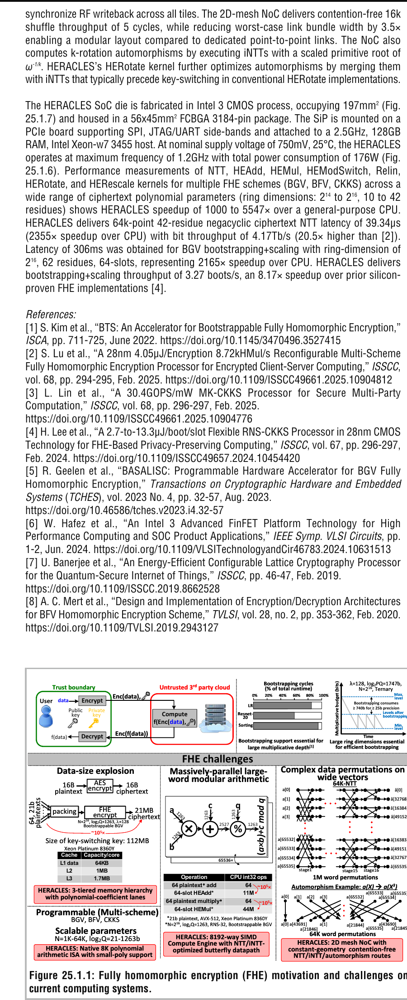
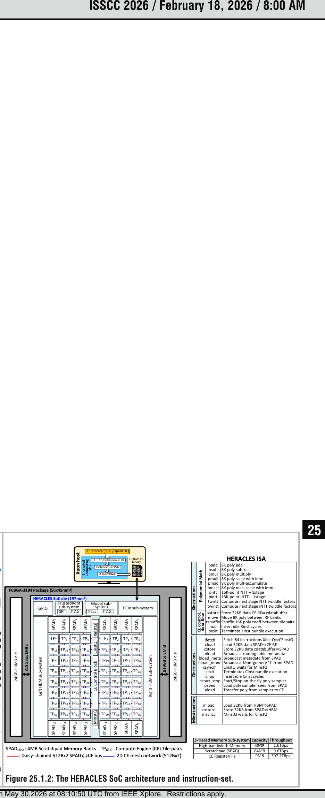
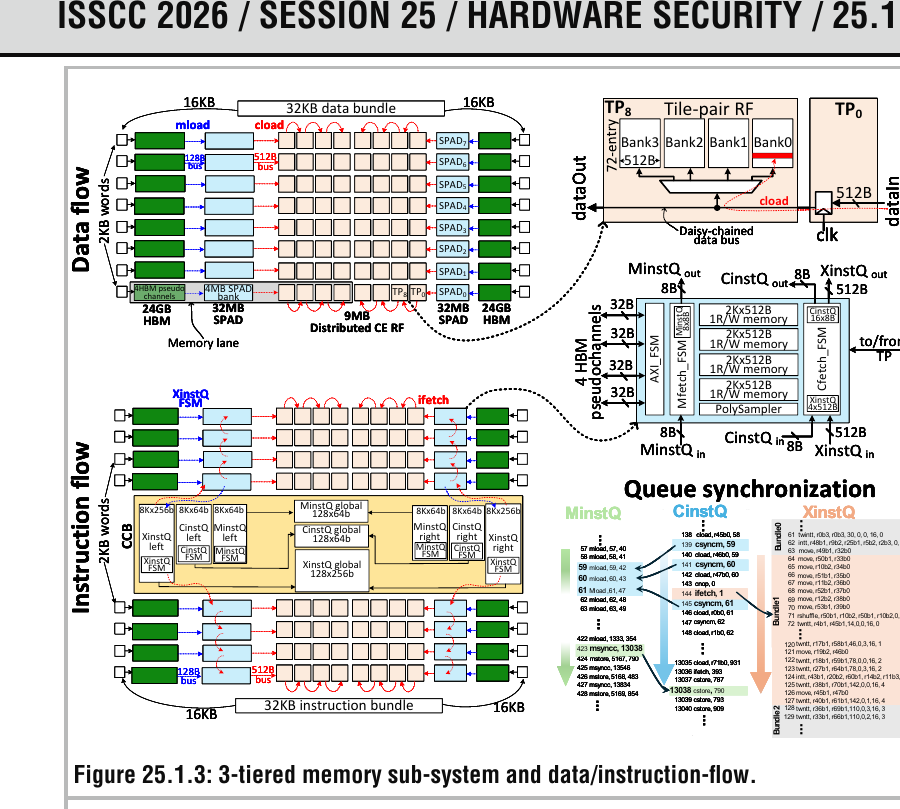
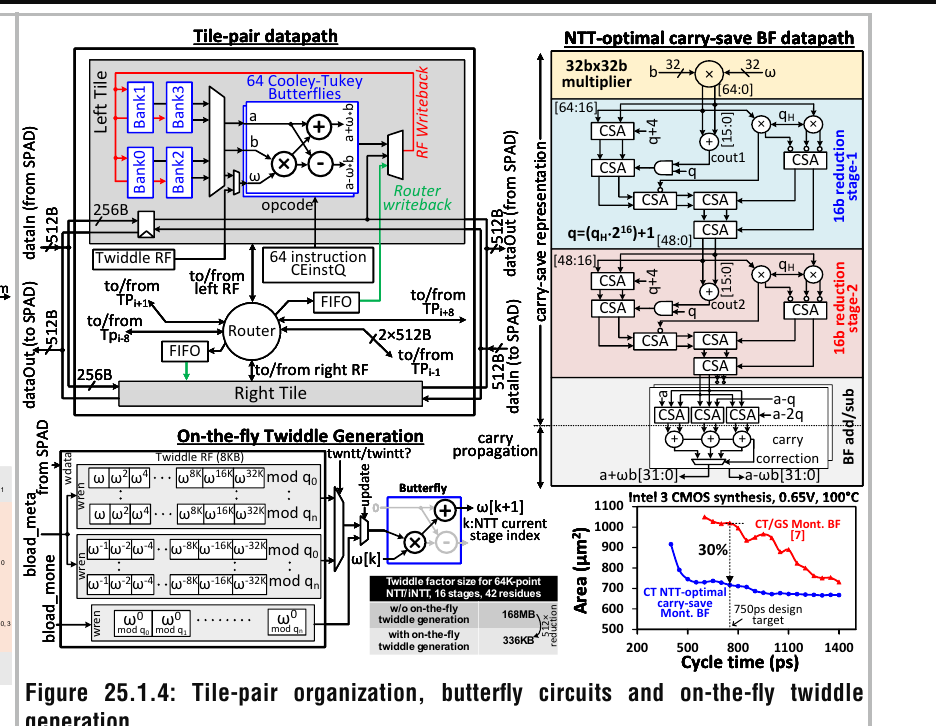
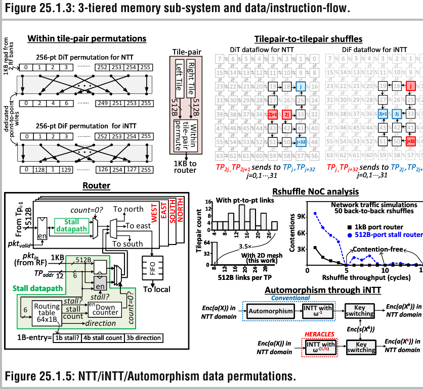
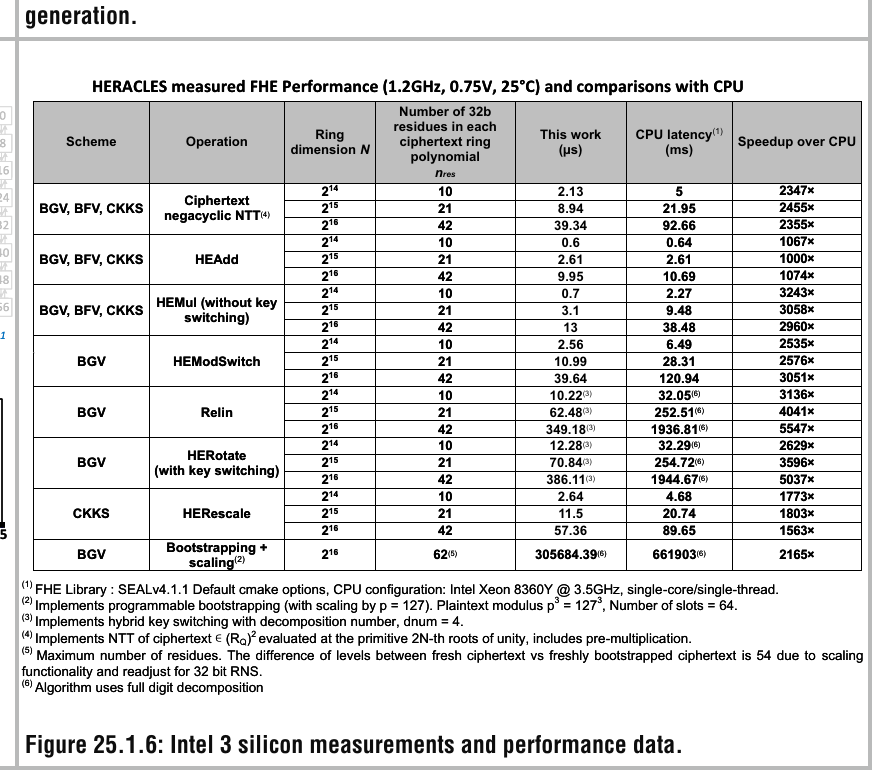
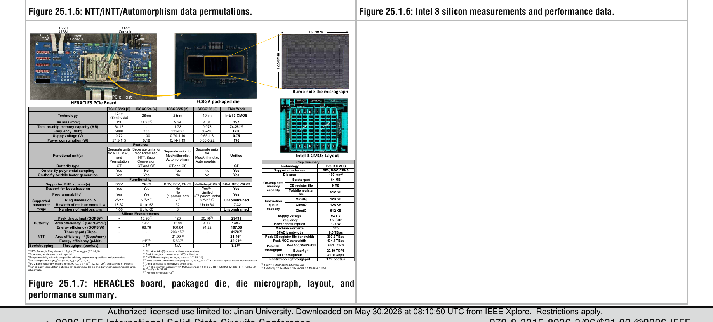

# HERACLES: 8192-Way SIMD Programmable Scalable Fully-Homomorphic Encryption SoC for Privacy-Preserving Cloud Computing in Intel 3 CMOS

原论文链接：[DOI](https://doi.org/10.1109/ISSCC49663.2026.11409291) · [ISSCC 2026 官方 Advance Program](https://submissions.mirasmart.com/ISSCC2026/PDF/ISSCC2026AdvanceProgram.pdf) · [本地 PDF](../HERACLES_8192-Way_SIMD_Programmable_Scalable_Fully-Homomorphic_Encryption_SoC_for_Privacy-Preserving_Cloud_Computing_in_Intel_3_CMOS.pdf)

上位地图：[[Privacy Computing]] · [[Fully Homomorphic Encryption]] · [[Hardware Accelerator]] · [[Number Theoretic Transform]]

### Abstract

HERACLES 是 Intel 在 Intel 3 CMOS 工艺上实现的可编程全同态加密（Fully Homomorphic Encryption, FHE）加速 SoC。它不是只加速某一个固定参数或单一密码学算子，而是面向 BGV、BFV、CKKS 等多种 FHE scheme，提供可编程多项式指令集、8192-way SIMD 向量计算引擎、三级存储体系、片上 2D mesh NoC、在线 twiddle factor 生成和在线多项式采样。

论文的核心目标是解决一个系统级问题：FHE 的困难并不只是“乘法太慢”，而是密文膨胀、模运算密集、NTT/iNTT 频繁、置换复杂、bootstrapping 昂贵，并且数据搬运量极大。如果仅仅增加乘法器数量，计算单元会因存储带宽和置换网络不足而空转。

HERACLES 在 $0.75\text{ V}$、$1.2\text{ GHz}$、$25^\circ\text{C}$ 下测得：

$$
29.49\ \text{TOPS}
$$

的 butterfly 峰值吞吐，并在论文测试范围内实现相较通用 CPU 最高：

$$
5547\times
$$

的 FHE 性能提升。

#### 一句话结论

HERACLES 将 FHE 加速器设计成一座面向多项式流水线的数据中心：8192 个并行 butterfly 是计算工人，HBM、scratchpad 与本地 RF 是三级仓储，2D mesh NoC 是置换物流网络，而静态调度的多类指令流负责让数据搬运、算术运算与跨 tile 通信重叠执行。

#### 所要解决的问题

- FHE 密文尺寸可相对明文膨胀约 $10^5$ 倍，如何避免数据搬运压垮计算引擎？
- 多项式乘法依赖 NTT/iNTT，如何支持高吞吐 butterfly 与跨 stage 置换？
- bootstrapping 占总体运行时间的 60% 到 95%，如何支持可用的 bootstrappable 参数？
- 不同 FHE scheme、环维度、模数数量和 residue bitwidth 不同，如何避免加速器只能运行固定参数？
- twiddle factor、key-switch hint 和新鲜密文采样会消耗大量存储，哪些数据可以在线生成而不是长期存储？

### Knowledge

#### 1. FHE：让数据在密文状态下继续计算

传统加密主要保护两种状态：

- data at rest：存储中的数据；
- data in transit：传输中的数据。

但云端计算还存在第三种状态：

- data in use：正在被处理的数据。

普通加密通常要求计算前先解密。FHE 则允许服务器直接对密文执行运算：

$$
\operatorname{Dec}_{sk}
\left(
\operatorname{Eval}_{pk}(f,\operatorname{Enc}_{pk}(x))
\right)
=
f(x).
$$

服务器执行 $\operatorname{Eval}$ 时不需要持有用户私钥 $sk$。它像一名戴着不透明手套的操作员：可以完成指定加工，却无法看到原料内容。

#### 2. BGV、BFV 与 CKKS：支持的“数值语义”不同

HERACLES 支持三类常见 FHE scheme：

| Scheme | 主要语义 | 适合场景 |
| --- | --- | --- |
| BGV | 精确整数模运算 | 数据库、离散逻辑、精确计数 |
| BFV | 精确整数模运算 | 加密整数计算、批处理 |
| CKKS | 近似实数或复数运算 | 机器学习、信号处理、近似数值分析 |

CKKS 的“近似”并不是实现缺陷，而是一种设计选择。它允许将实数计算映射为带缩放因子的密文运算，类似浮点数用有限位宽近似连续数值。BFV/BGV 更像整数计算器，CKKS 更像加密浮点向量计算器。

#### 3. 多项式环：FHE 的基本数据容器

许多 lattice-based FHE scheme 在如下商环中计算：

$$
R_Q = \mathbb{Z}_Q[X]/(X^N + 1).
$$

其中：

- $N$ 是 ring dimension；
- $Q$ 是大模数；
- 一个 ring element 是次数低于 $N$ 的多项式；
- 模掉 $X^N+1$ 对应 negacyclic 结构。

如果写成：

$$
a(X)=a_0+a_1X+\cdots+a_{N-1}X^{N-1},
$$

则一次密文运算往往需要处理成千上万个系数。HERACLES 的 8192-way SIMD 正是针对这种高度规则的系数级并行性。

#### 4. RNS / CRT：把一个大模数拆成多个小模数

FHE 中的大模数 $Q$ 通常被拆成若干互素小模数：

$$
Q = \prod_{i=0}^{L-1} q_i.
$$

根据中国剩余定理（Chinese Remainder Theorem, CRT），模 $Q$ 的一个数可以表示为多个 residue：

$$
x \bmod Q
\longleftrightarrow
\left(
x \bmod q_0,\ldots,x \bmod q_{L-1}
\right).
$$

这种 Residue Number System（RNS）表示把一个超宽整数运算拆成多路较窄模运算。它像将一件超大货物拆分到多个标准集装箱：每个小模数通道可以并行处理，最后再按 CRT 规则重建整体语义。

HERACLES 利用的是 coefficient-residue-level parallelism：多项式系数与 residue 维度都可以被拆成独立工作项。

#### 5. 两类 SIMD 不应混淆

FHE 语境中存在两种不同层面的 SIMD：

| 层面 | 含义 | HERACLES 中的位置 |
| --- | --- | --- |
| 密码学 batching / slot SIMD | 一个密文编码多个逻辑槽位，可并行执行相同操作 | BGV、BFV、CKKS 的应用层语义 |
| 硬件 coefficient-residue SIMD | 多个多项式系数和 residue 在物理 datapath 上同时计算 | HERACLES 的 8192-way CE |

HERACLES 标题中的 `8192-way SIMD` 主要指第二类。它不等于“一个 CKKS 密文一定有 8192 个逻辑槽位”，也不等于应用层直接获得 8192 倍端到端加速。

#### 6. NTT：把多项式乘法变成逐点乘法

朴素多项式乘法复杂度约为：

$$
O(N^2).
$$

Number Theoretic Transform（NTT）是有限域版本的 FFT。它将多项式变换到频域，在频域执行逐点乘法，再通过 iNTT 返回：

$$
c
=
\operatorname{iNTT}
\left(
\operatorname{NTT}(a)
\odot
\operatorname{NTT}(b)
\right).
$$

复杂度下降为：

$$
O(N\log N).
$$

NTT 中的基本单元是 butterfly。一个简化的 Cooley-Tukey butterfly 可以写成：

$$
u = a,
\qquad
v = b\omega \bmod q,
$$

$$
y_0 = u+v \bmod q,
\qquad
y_1 = u-v \bmod q.
$$

$\omega$ 是 twiddle factor。butterfly 同时涉及模乘、模加和模减，因此既是算术核心，也是面积与时序优化的重点。

#### 7. Bootstrapping：密文噪声的“刷新”

FHE 密文中包含噪声。连续乘法会让噪声不断增长。一旦超过阈值，解密结果将失效。

bootstrapping 的作用是同态执行一次“刷新”过程，将高噪声密文转换为低噪声密文。直观上，它像在不打开密封箱的情况下更换内部缓冲材料。代价是极其昂贵：论文指出 bootstrapping 可占总体运行时间的 60% 到 95%。

因此，只能执行浅层乘法链的加速器与真正支持深层 FHE 工作负载的加速器之间存在明显差距。HERACLES 特别强调 bootstrappable parameters。

#### 8. 常见 FHE 内核

| 内核 | 作用 |
| --- | --- |
| `HEAdd` | 密文加法 |
| `HEMul` | 密文乘法 |
| `HEModSwitch` | 切换到更小模数，控制噪声与开销 |
| `HERescale` | CKKS 中调整 scale，维持数值范围 |
| `Relin` | relinearization，压缩乘法后扩张的密文结构 |
| `HERotate` | 旋转打包槽位，用于向量置换、矩阵运算与聚合 |
| Bootstrapping | 刷新密文噪声预算，延长可计算深度 |

### Overview

#### 1. 系统总览：不是单个加速核，而是可编程 FHE SoC

HERACLES 使用 Encrypted Computing SDK 将基于 OpenFHE 或 SEAL 编写的应用拆解为优化后的算子 binary，例如 `HEAdd`、`HEMul` 和 `HERotate`。执行 bundle 通过 PCIe 进入两颗封装内的 24GB HBM3 die，再进入 scratchpad 与 CE。

核心组织如下：

| 模块 | 规模或带宽 | 角色 |
| --- | --- | --- |
| HBM3 | $48\text{ GB}$，约 $1.6\text{ TB/s}$ | 容纳大型 ciphertext、key material 与程序 bundle |
| Scratchpad | $64\text{ MB}$，约 $9.6\text{ TB/s}$ | 片上工作集缓冲 |
| CE register file | $9\text{ MB}$，约 $307.2\text{ TB/s}$ | 紧耦合本地操作数供给 |
| 2D mesh NoC | 峰值约 $134.4\text{ TB/s}$ | tile-pair 间置换与数据交换 |
| CE | 8192-way SIMD | 执行多项式模运算、NTT/iNTT 与 MAC |

这个层次类似 GPU 的显存、共享内存和寄存器，但 HERACLES 的数据流专门围绕 FHE 多项式、RNS residue 和 NTT 置换设计。

#### 2. 三级存储：将搬运延迟与计算调度解耦

FHE workload 的瓶颈往往不是单一算术单元，而是巨大的 ciphertext 与 key-switch 数据流。HERACLES 使用三级存储：

$$
\text{HBM}
\rightarrow
\text{SPAD}
\rightarrow
\text{CE RF}.
$$

一个 $32\text{ kB}$ 数据 word 对应一个 8k polynomial，并被分散到 16 条并行 memory lane。每条 lane 包含：

- 4 个 HBM pseudo-channel；
- 1 个 4MB SPAD bank；
- 4 个 CE tile-pair。

论文将程序拆成三类执行 stream：

| 指令流 | 负责范围 | 直观类比 |
| --- | --- | --- |
| `MinstQ` | HBM $\leftrightarrow$ scratchpad | 远程仓储调拨 |
| `CinstQ` | scratchpad $\leftrightarrow$ CE | 车间送料 |
| `XinstQ` | 向量多项式计算与 CE 控制 | 工位加工 |

`cload` / `cstore` 可以与 `XinstQ` 数学操作重叠，从而隐藏 SPAD 访问延迟。设计使用预先知道延迟和依赖关系的静态 trace，而不是复杂动态 scoreboarding。

### Solution

#### 1. 8192-way SIMD Vector Compute Engine

CE 被组织为：

$$
8\times8 = 64
$$

个 tile-pair。每个 tile-pair 有左右两个 tile，每个 tile 包含 64 个 butterfly：

$$
64\ \text{tile-pair}
\times
2\ \text{tile/tile-pair}
\times
64\ \text{butterfly/tile}
=
8192\ \text{butterfly}.
$$

每个 butterfly 支持 32-bit 模加、模减、模乘、MAC、NTT 与 iNTT。每周期可以完成 8192 路多项式系数运算，因此：

$$
8192
\times
1.2\text{ GHz}
=
9.83\text{ TOPS}.
$$

若将一个 butterfly 计为 1 次模乘、1 次模加和 1 次模减，共 3 OP，则：

$$
3
\times
9.83
=
29.49\text{ TOPS}.
$$

#### 2. Butterfly 优化

论文给出三项关键优化。

##### A. Cooley-Tukey butterfly 复用

常见实现会为 NTT 和 iNTT 使用不同 butterfly 形式，例如 Cooley-Tukey（CT）与 Gentleman-Sande（GS）。HERACLES 通过切换 stage 间的 Decimation-in-Time / Decimation-in-Frequency（DiT / DiF）shuffle，让 NTT 和 iNTT 都复用 CT butterfly。

这样减少了 datapath 配置复杂度，也避免显式 coefficient reorder。

##### B. Montgomery reduction 优化

模乘需要计算：

$$
a\cdot b \bmod q.
$$

Montgomery reduction 将昂贵除法替换为乘法、加法和移位。HERACLES 进一步约束模数为 NTT-friendly 形式：

$$
q = q_H 2^{16} + 1.
$$

借助这个结构，两级 reduction 中的 $16\times32$-bit 乘法可被替换为更窄的 16-bit 乘法，降低面积与关键路径压力。

##### C. Carry-save representation

普通加法器每次都要传播 carry。carry-save 表示暂时保留冗余形式，将昂贵的 carry propagation 推迟到最终加减阶段。

它像结账前暂不逐项兑换零钱：中间步骤保留“金额分解”，直到最后一次性归并。论文报告，NTT-optimized carry-save CT butterfly 相比 CT/GS non-redundant Montgomery butterfly 在 iso-delay 下减少 30% 面积。

#### 3. On-the-fly Twiddle Factor Generation

NTT/iNTT 需要大量 twiddle factor。对 42-residue、64k ring，若全部存储，需要约：

$$
168\text{ MB}.
$$

HERACLES 只保存 primitive root $\omega$ 与 $\omega^{-1}$ 的连续平方项，将 metadata 压缩到：

$$
336\text{ kB}.
$$

存储减少：

$$
512\times.
$$

其余 twiddle factor 由 CE 在线生成。这是典型的“用计算换存储”：当 butterfly 算力充足、片上 SRAM 昂贵时，实时重算比反复搬运更划算。

#### 4. 2D Mesh NoC：将 NTT Shuffle 变成路由问题

NTT stage 之间需要重新排列 coefficient。规模增大后，置换网络会成为布线与带宽瓶颈。

HERACLES 将 shuffle 分为两步：

1. tile-pair 内部通过专用 point-to-point wire 完成 256-point DiT / DiF permutation；
2. tile-pair 之间通过 2D mesh NoC 完成跨 tile shuffle。

NoC 使用预编程、无冲突路由：

- 每个 packet 为 512B；
- tile-pair 之间通过相邻 link 多跳传递；
- router 根据 routing table 选择输出方向；
- 长跳 packet 优先，短跳 packet 可暂存；
- 目标侧通过 4-deep FIFO 对齐 writeback。

结果是：

- 16k shuffle 吞吐为 5 cycle；
- worst-case link bundle width 相比专用 point-to-point link 降低 $3.5\times$；
- 布局更模块化，更适合扩展。

#### 5. Automorphism 与 HERotate

slot rotation 在 FHE 中非常常见。例如，将一个加密向量中的元素循环移动，可以构造求和、矩阵乘法和卷积。

HERACLES 使用带缩放 primitive root 的 iNTT 执行 $k$-rotation automorphism，并将 automorphism 合并到 key-switching 前通常已经存在的 iNTT 中。核心思想是：如果两条流水线都需要经过类似变换，就尽量合并中间步骤，避免一次额外搬运和转换。

### Measurements

#### 1. 芯片与系统参数

| 指标 | HERACLES |
| --- | --- |
| 工艺 | Intel 3 CMOS |
| Die area | $197\text{ mm}^2$ |
| Package | $56\times45\text{ mm}^2$ FCBGA，3184 pin |
| 支持 scheme | BGV、BFV、CKKS |
| 供电电压 | $0.75\text{ V}$ |
| 频率 | $1.2\text{ GHz}$ |
| 功耗 | $176\text{ W}$ |
| On-chip data memory | $74.25\text{ MB}$ |
| SPAD bandwidth | $9.6\text{ TB/s}$ |
| CE RF bandwidth | $307.2\text{ TB/s}$ |
| NoC bandwidth | $134.4\text{ TB/s}$ |
| ModAdd / ModMul / ModSub 峰值 | $9.83\text{ TOPS}$ |
| Butterfly 峰值 | $29.49\text{ TOPS}$ |
| NTT throughput | $4170\text{ Gbps}$ |
| Bootstrapping + scaling | $3.27\text{ boots/s}$ |

#### 2. 关键性能结果

论文测量了 NTT、`HEAdd`、`HEMul`、`HEModSwitch`、`Relin`、`HERotate` 和 `HERescale`，覆盖 BGV、BFV、CKKS 与多组参数。

核心结果包括：

- 在论文测试范围内，相较通用 CPU 加速 $1000\times$ 到 $5547\times$；
- 64k-point、42-residue negacyclic ciphertext NTT 延迟为 $39.34\ \mu s$；
- 对应 bit throughput 为 $4.17\text{ Tb/s}$；
- 相较 CPU，该 NTT 获得 $2355\times$ 加速；
- NTT throughput 相比文献 [2] 高 $20.5\times$；
- BGV bootstrapping + scaling 延迟为 $306\text{ ms}$；
- 对应吞吐为 $3.27\text{ boots/s}$；
- 相较 CPU，加速 $2165\times$；
- 相较先前 silicon-proven FHE 实现 [4]，bootstrapping 吞吐提升 $8.17\times$。

### Insights

#### 1. FHE 加速首先是数据流设计，其次才是算术堆叠

HERACLES 最值得关注的地方不是 8192 个 butterfly 本身，而是整条数据供给链：

$$
\text{HBM}
\rightarrow
\text{SPAD}
\rightarrow
\text{RF}
\rightarrow
\text{CE}
\leftrightarrow
\text{NoC}.
$$

如果 RF 和 SPAD 带宽不足，增加 butterfly 只会增加等待数据的空闲单元。论文将三类指令流、三级存储和 NoC 一起设计，是为了让计算引擎长期保持忙碌。

#### 2. 可编程性是一种系统成本，也是一种部署价值

固定功能 ASIC 可以针对单一 scheme 与参数集极致优化，但真实 FHE 工作负载仍在快速变化。HERACLES 选择：

- 支持 BGV、BFV、CKKS；
- 支持可变 ring dimension；
- 支持 17 到 32 bit residue modulus；
- 支持不同 residue 数量；
- 支持多项式采样、NTT、iNTT、automorphism 与复合内核。

这牺牲了部分专用化收益，却提升了算法演进期间的可用性。

#### 3. On-the-fly generation 是硬件设计中的重要反向思维

直觉上，为了加速应尽量预计算并存储所有结果。但当数据量过大时，预计算会转化成 SRAM 面积和内存带宽负担。

HERACLES 对 twiddle factor 与多项式采样采取在线生成，说明在高并行 datapath 中：

$$
\text{recompute cost}
<
\text{storage cost}
+
\text{movement cost}.
$$

#### 4. 置换应当被视为一等公民

NTT、iNTT、rotation 与 automorphism 都包含大规模数据重排。对 FHE 而言，置换不是算术之后的附属步骤，而是决定系统能否扩展的核心工作负载。

HERACLES 的 2D mesh NoC 将置换显式纳入 ISA 与路由表，使其从“固定布线副作用”变成“可规划的数据流操作”。

### Critical Review

#### Strengths

- 芯片是实测 silicon，而非仅 RTL synthesis 或仿真。
- 设计覆盖 BGV、BFV、CKKS，并支持 bootstrapping，而不是只展示浅层算术。
- 论文同时处理计算、存储、NoC、调度、twiddle factor 与 automorphism，系统边界完整。
- 三级存储和静态 trace 体现了对 FHE data movement 的针对性理解。
- Figure 25.1.7 给出了与先前 silicon 工作的详细对比维度。

#### Limitations

- ISSCC digest 只有 3 页，适合展示芯片贡献，但不足以完整复现微架构、编译器、SDK 与安全参数选择。
- `29.49 TOPS` 是 butterfly 口径：一个 butterfly 被计为 3 个模运算。它不能直接与通用 AI TOPS 横向比较。
- 最高 `5547×` 是特定 kernel 与参数下相较 CPU 的结果，不代表所有应用端到端都能获得相同加速。
- `3.27 boots/s` 对应 BGV bootstrapping + scaling。不同论文可能使用 CKKS、不同 ring dimension、不同 residue 数量、不同 packing 与安全参数，跨论文比较需要谨慎。
- `197\text{ mm}^2` die 与 `176\text{ W}` 功耗体现了高性能服务器级定位，不适合直接类比低功耗 edge accelerator。
- “参数 unconstrained”表示架构可编程，不等于任意参数都能在固定容量、固定延迟与固定吞吐下高效运行。

### 不知道自己不知道

#### 1. TOPS 不是统一货币

不同芯片论文中的 OP 定义可能不同。HERACLES 明确规定：

$$
1\ \text{OP}
=
1\ \text{ModAdd}
\ \text{or}\
1\ \text{ModMul}
\ \text{or}\
1\ \text{ModSub},
$$

$$
1\ \text{butterfly}
=
1\ \text{ModMul}
+
1\ \text{ModAdd}
+
1\ \text{ModSub}
=
3\ \text{OP}.
$$

因此，读者应优先比较同类 kernel 延迟、吞吐、参数和功耗，而不是只比较 TOPS。

#### 2. Bootstrapping 的可比性高度依赖参数

bootstrapping 性能至少受到以下因素影响：

- scheme：BGV、BFV 或 CKKS；
- ring dimension $N$；
- residue 数量；
- residue bitwidth；
- packing slot 数；
- secret-key distribution；
- 是否包含 scaling、key switching 或其他前后处理；
- 安全级别。

脱离这些上下文，`boots/s` 只能提供方向性信息。

#### 3. 48GB HBM 与 74.25MB on-chip memory 是不同层次

HBM3 位于封装内存层次中，容量大、带宽高，但仍不同于 die 内部 SRAM。Figure 25.1.7 的 on-chip data memory 为：

$$
64\text{ MB SPAD}
+
9\text{ MB CE RF}
+
512\text{ kB twiddle RF}
+
768\text{ kB instruction queues}
=
74.25\text{ MB}.
$$

读者不应将 48GB HBM 与片上 SRAM 混为一谈。

#### 4. SIMD 宽度不等于有效利用率

8192-way 描述峰值并行 datapath。实际利用率仍取决于：

- ring dimension 是否足够大；
- residue 数量；
- memory lane 是否均衡；
- NoC 路由是否形成气泡；
- kernel 是否包含不可并行部分；
- host、PCIe 与 HBM 调度。

峰值吞吐是上限，不是所有 workload 的平均表现。

#### 5. 静态调度依赖 workload 可预测性

HERACLES 使用先验已知的延迟与依赖关系构造静态 trace，减少动态 scoreboarding 开销。这很适合规则化 FHE kernel。但如果未来 workload 出现更强的数据依赖、动态分支或不规则稀疏结构，静态调度可能需要新的编译策略。

### 阅读后可追问的问题

- HERACLES SDK 如何将 OpenFHE / SEAL 算子映射到 `MinstQ`、`CinstQ` 和 `XinstQ`？
- 端到端隐私推理中，bootstrapping、key switching、rotation 与线性代数各占多少时间？
- 面向 CKKS Transformer 推理时，HERACLES 的最优参数、packing 策略和吞吐如何变化？
- 2D mesh NoC 的路由表能否适配更多 tile，还是会出现新的拥塞与同步瓶颈？
- 在线 twiddle generation 的功耗成本与 SRAM 节省之间如何定量权衡？
- 在相同安全级别和功能边界下，HERACLES 与 GPU、FPGA、CPU 及其他 ASIC 的 energy-delay-product 如何比较？

### Metadata Verification

- PDF 元数据确认：标题、ISSCC 2026、DOI `10.1109/ISSCC49663.2026.11409291`。
- ISSCC 2026 官方 Advance Program 确认：论文位于 2026-02-18 08:00 的 Session 25 `Hardware Security`，编号为 25.1。
- Google 在线搜索已执行，但搜索页触发反自动化拦截；元数据改由 DOI、PDF 元数据和 ISSCC 官方 Program 交叉核对。
