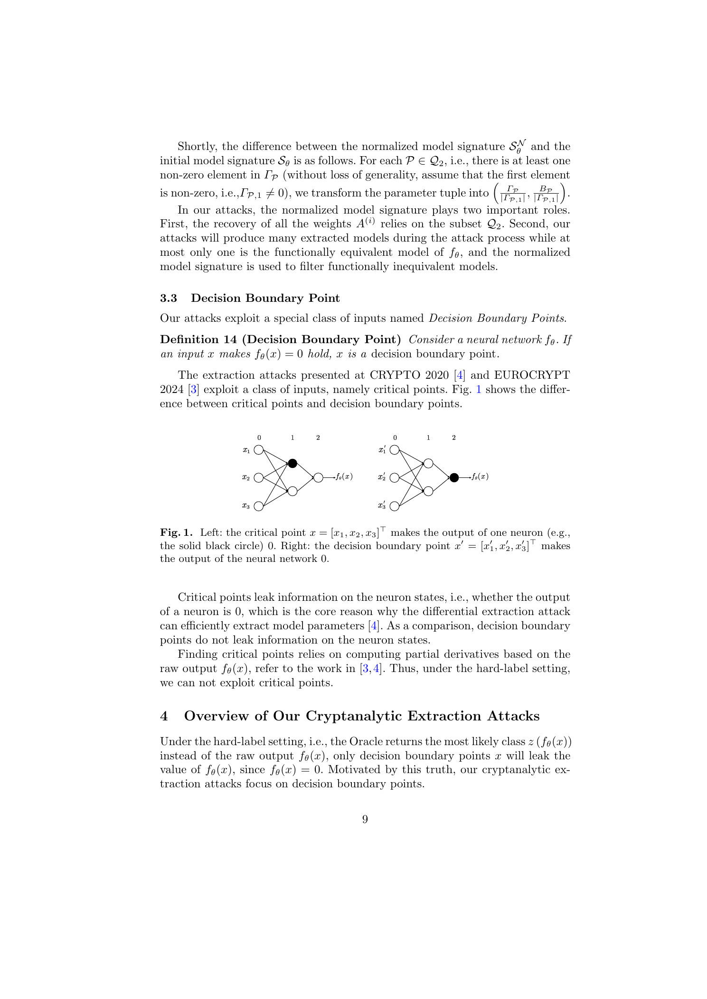
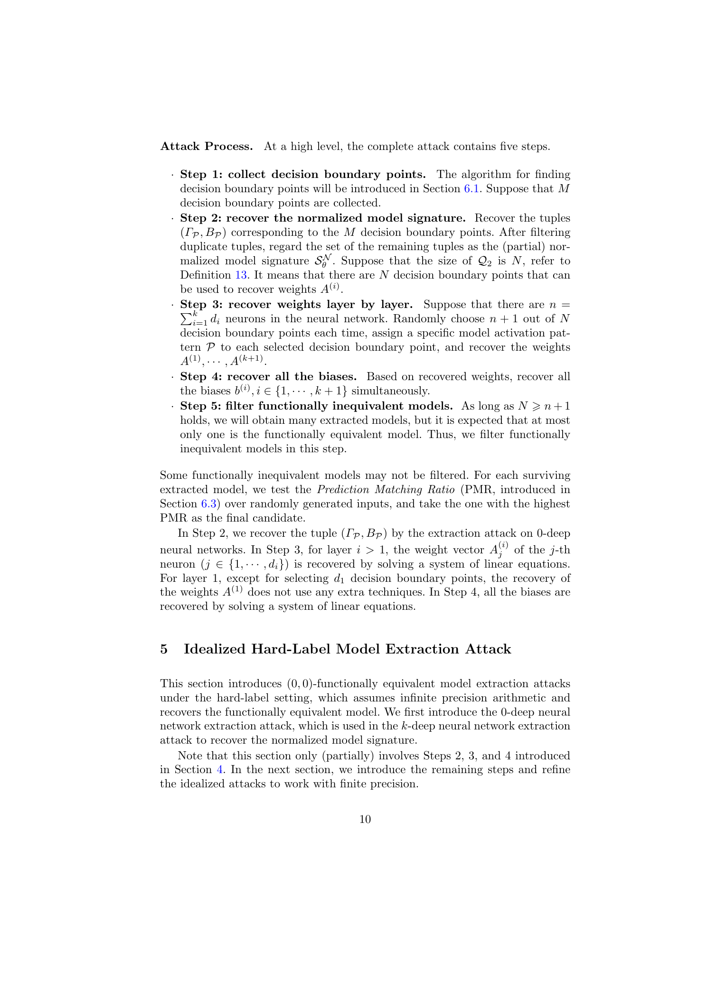
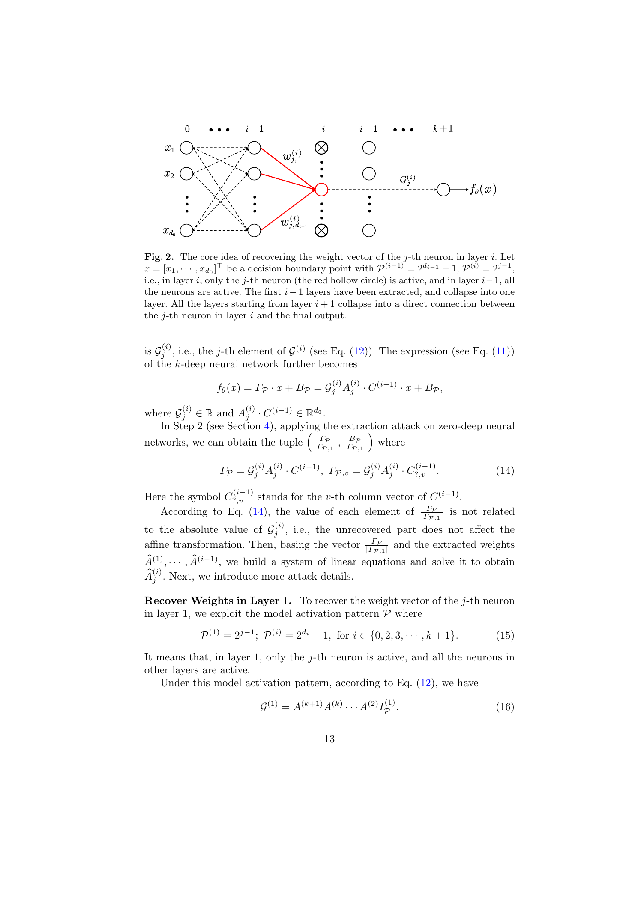
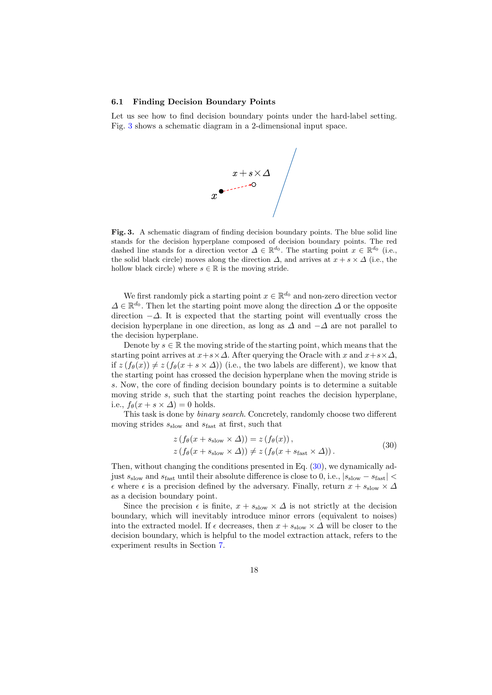
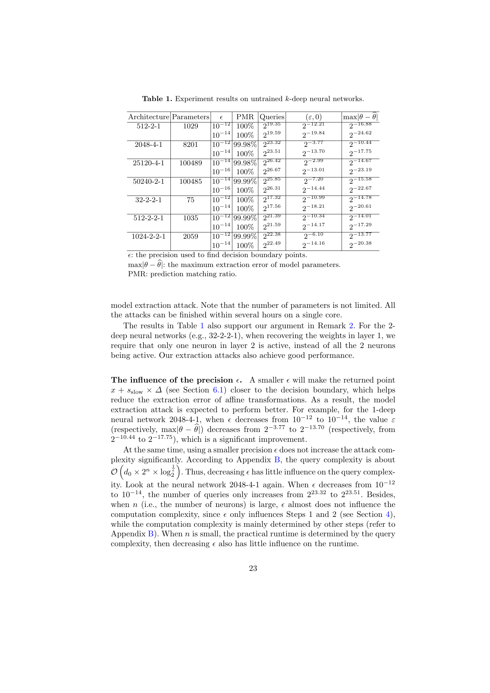
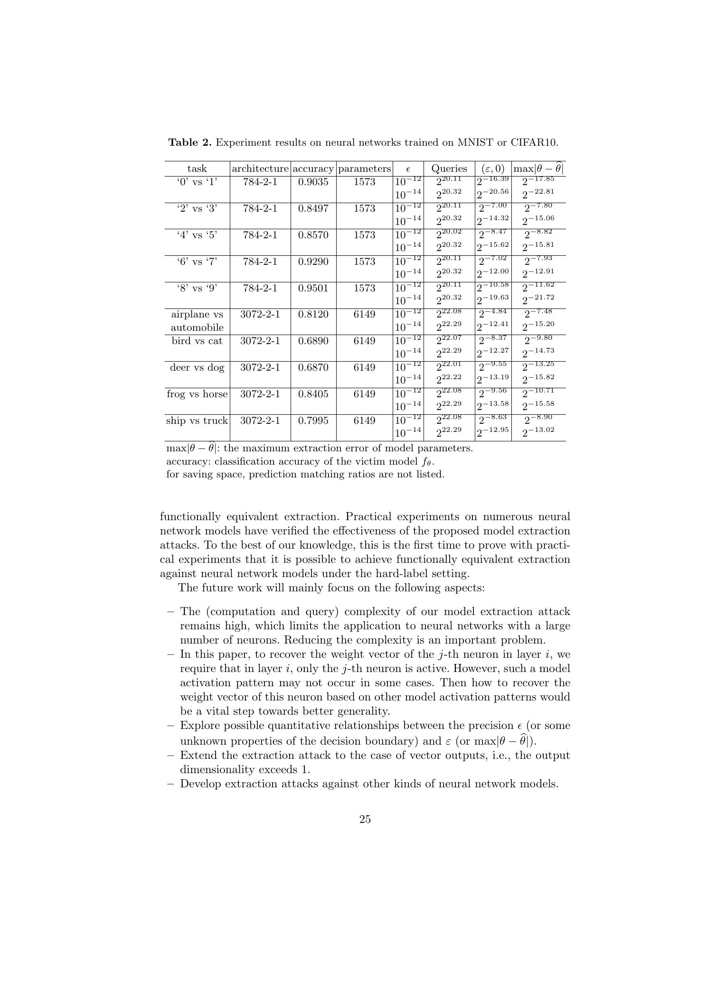
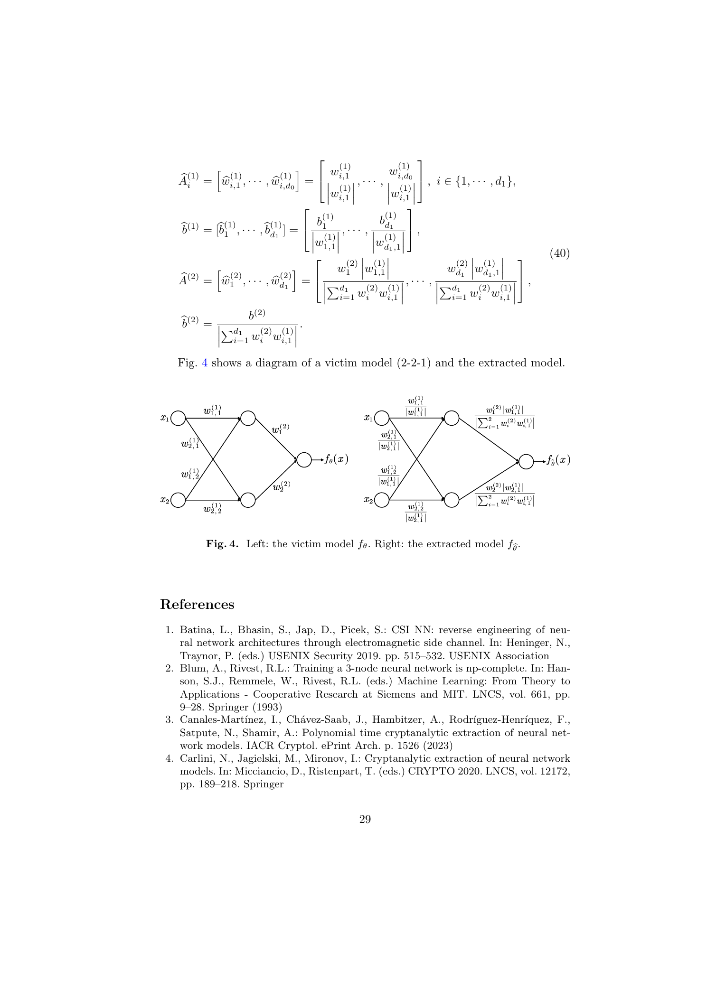

# Hard-Label Cryptanalytic Extraction of Neural Network Models

原论文链接：[arXiv:2409.11646](https://arxiv.org/abs/2409.11646)

本地 PDF：[Hard-Label Cryptanalytic Extraction of Neural Network Models.pdf](./Hard-Label%20Cryptanalytic%20Extraction%20of%20Neural%20Network%20Models.pdf)

本地提取文本：[Hard-Label Cryptanalytic Extraction of Neural Network Models.txt](./Hard-Label%20Cryptanalytic%20Extraction%20of%20Neural%20Network%20Models.txt)

上位地图：[[MOC - 计算机]] · [[Research on Cryptographic Neurons]] · [[Neural Cryptanalysis]]

相关主题：[[Hard-Label Oracle]]、[[Decision Boundary]]、[[Cryptanalytic Extraction]]、[[Model Extraction]]、[[ReLU Network]]、[[Functionally Equivalent Extraction]]、[[Raw-Output Oracle]]、[[Critical Point]]

## Abstract

这篇 ASIACRYPT 2024 论文把前两篇阅读过的 cryptanalytic extraction 线推进到一个更弱、也更接近现实 API 的 oracle 设置：攻击者不再看到 neural network 的 raw output、logits 或 score，而只能看到最终 hard-label。

前两篇的核心路线是：

$$
\text{raw output}
\Longrightarrow
\text{finite difference}
\Longrightarrow
\text{critical points}
\Longrightarrow
\text{weights and signs}.
$$

本文改成：

$$
\text{hard label}
\Longrightarrow
\text{decision boundary points}
\Longrightarrow
\text{affine transformations}
\Longrightarrow
\text{functionally equivalent model}.
$$

这个转向非常关键。CRYPTO 2020 和 EUROCRYPT 2024 都依赖 raw output，因此可以在 ReLU 的 critical point 两侧测量导数突变。hard-label setting 下，攻击者只知道分类结果是否变化，看不到输出值，更看不到导数。本文指出：即便如此，decision boundary 上仍有一个泄露点，因为对 scalar output 来说，决策边界满足：

$$
f_\theta(x)=0.
$$

也就是说，虽然 hard-label 隐藏了输出数值，但当攻击者通过二分查找逼近 label 翻转点时，攻击者间接知道“这个点的 raw output 约为零”。本文正是围绕这个零值信息构造 extraction。

一句话概括：

> 这篇论文把泄露源从 ReLU 内部折点 critical point，换成了模型最终输出的零等值面 decision boundary。

论文声称提出了第一个在 hard-label setting 下理论上实现 functionally equivalent extraction 的 ReLU 神经网络攻击，并在 untrained networks 以及 MNIST/CIFAR10 二分类网络上做了实验验证。需要同时注意边界：本文解决的是 hard-label 可行性问题，不是多项式复杂度问题。其 query complexity 和 computation complexity 仍然随神经元数量指数增长。

## Knowledge

### 1. Hard-label oracle 到底隐藏了什么

前两篇 raw-output extraction 中，oracle 返回：

$$
O(x)=f_\theta(x).
$$

本文 hard-label setting 中，oracle 返回：

$$
O(x)=z(f_\theta(x)).
$$

对于 scalar output，hard-label 被定义为：

$$
z(f_\theta(x))
=
\begin{cases}
1, & f_\theta(x)>0,\\
0, & f_\theta(x)\le 0.
\end{cases}
$$

对于 vector output，hard-label 是最大坐标：

$$
z(f_\theta(x))
=
\arg\max_j f_{\theta,j}(x).
$$

但本文的实际攻击假设 scalar output：

$$
Y=\mathbb R.
$$

这点很重要。用户读这篇时不能把它直接理解为完整多分类 logits 被 hard-label 后仍可提取。论文实验中的 MNIST/CIFAR10 也被改成若干二分类任务，使输出维度为 1。

可以用密码学类比理解：raw output 像完整密文，hard-label 像密文上的一个比较位。前两篇能读到完整密文，因此可以做很细的差分；本文只看到一个比较位，只能通过大量查询定位这个比较位从 0 翻到 1 的边界。

### 2. Extended functionally equivalent extraction

标准 functionally equivalent extraction 要求提取模型与 victim model 完全同函数：

$$
\hat f_\theta(x)=f_\theta(x),
\quad
\forall x\in X.
$$

本文使用扩展定义，允许一个正比例缩放：

$$
\hat f_\theta(x)=c\cdot f_\theta(x),
\quad
c>0,
\quad
\forall x\in X.
$$

为什么 `c>0` 可以被接受？因为 hard-label 只看符号：

$$
f_\theta(x)>0
\Longleftrightarrow
c\cdot f_\theta(x)>0.
$$

若 `c` 为负，label 会整体翻转；若 `c` 为正，decision boundary 和二分类标签完全不变。因此在 hard-label setting 下，恢复到正比例缩放是自然的功能等价。

本文也扩展了 `(epsilon, delta)-functional equivalence`：

$$
\Pr_{x\in S}
\left[
\left|\hat f_\theta(x)-c f_\theta(x)\right|\le \epsilon
\right]
\ge
1-\delta.
$$

这可以理解为：攻击者不一定恢复原始 checkpoint 的每个浮点数，而是恢复一个在输出空间中只差一个正比例因子的替身模型。对 hard-label 任务而言，这个替身模型已经足够危险。

### 3. Critical point 与 decision boundary point 的区别

前两篇依赖的是 critical point。某个 ReLU 神经元 `eta` 的 pre-activation 为：

$$
V(\eta;x).
$$

critical point 满足：

$$
V(\eta;x)=0.
$$

这表示内部某个神经元正在从 inactive 切换到 active。它泄露的是内部 neuron state。

本文依赖的是 decision boundary point。对于 scalar output，decision boundary point 满足：

$$
f_\theta(x)=0.
$$

这表示最终模型输出正在从 label 0 切换到 label 1。它泄露的是最终分类边界。

直观类比：critical point 像机器内部某个齿轮卡到临界位置，decision boundary point 像机器最终指针从左侧跳到右侧。hard-label 设置下，攻击者看不到齿轮，只能盯着指针翻转。

### 4. Model activation pattern：全网 ReLU 开关状态

论文引入 `model activation pattern` 描述所有隐藏层神经元的 active/inactive 状态。若第 `i` 层有 `d_i` 个神经元，第 `j` 个神经元状态记为：

$$
P_j^{(i)}(x)\in\mathbb F_2.
$$

其中：

$$
P_j^{(i)}(x)=1
$$

表示 active；

$$
P_j^{(i)}(x)=0
$$

表示 inactive。

整个网络在输入 `x` 上的 activation pattern 是：

$$
P(x)=
\left(
P^{(1)}(x),
\ldots,
P^{(k)}(x)
\right).
$$

在固定 `P` 的区域内，ReLU 网络退化为 affine transformation：

$$
f_\theta(x)
=
\Gamma_P x+B_P.
$$

这和前两篇中的 linear neighbourhood 是同一个几何事实的另一种表达。区别是：前两篇通过 raw output 直接测量局部 affine map；本文通过 decision boundary 上的零值约束间接恢复这些 affine maps。

### 5. Model signature 与 normalized model signature

本文中的 `model signature` 和 EUROCRYPT 2024 中的 neuron signature 不是同一个概念。EUROCRYPT 2024 的 signature 是单个神经元权重行的比例；本文的 model signature 是所有 activation patterns 对应的 affine transformations 集合：

$$
S_\theta
=
\left\{
(\Gamma_P,B_P)
\text{ for all }P
\right\}.
$$

由于 hard-label 只允许恢复到正比例缩放，本文使用 normalized model signature。若：

$$
\Gamma_{P,1}\ne 0,
$$

则把：

$$
(\Gamma_P,B_P)
$$

归一化为：

$$
\left(
\frac{\Gamma_P}{|\Gamma_{P,1}|},
\frac{B_P}{|\Gamma_{P,1}|}
\right).
$$

normalized model signature 在攻击中有两个作用：第一，它为恢复权重提供材料；第二，它用来过滤 functionally inequivalent extracted models。可以把它理解为模型所有局部线性碎片的“指纹库”，只不过每个指纹都被除去了一个正尺度。

## Overview

### 1. 攻击总流程

论文把完整攻击分为五步：

1. 收集 decision boundary points。
2. 对每个 decision boundary point 恢复对应 affine transformation，并组成 normalized model signature。
3. 随机选取 `n+1` 个 decision boundary points，给它们分配特定 model activation patterns，逐层恢复 weights。
4. 基于已恢复 weights，同时解出所有 biases。
5. 过滤 functionally inequivalent models，再用 prediction matching ratio 选最终候选。

这个流程看起来像“拼拼图”。每个 decision boundary point 提供一个局部 affine 约束，但攻击者不知道它来自哪块 activation region。于是攻击者收集很多边界点，尝试把其中某些点分配给特定 activation patterns，再检查拼出来的模型是否与已知 signature 库一致。

### 2. 为什么 decision boundary point 有用

若 `x` 是 decision boundary point，则：

$$
f_\theta(x)=0.
$$

在固定 activation pattern `P` 的局部区域内：

$$
f_\theta(x)=\Gamma_P x+B_P.
$$

因此边界点给出线性约束：

$$
\Gamma_P x+B_P=0.
$$

对一个 zero-deep affine function 来说，足够多的边界点就能恢复超平面的法向量比例。对深层 ReLU 网络来说，攻击者先恢复这些局部 affine transformations，再利用特定 activation pattern 的结构把权重逐层拆出来。

### 3. 这篇与前两篇的关系

三篇论文的关系可以这样整理：

| 论文 | Oracle | 主要几何对象 | 复杂度主线 |
| --- | --- | --- | --- |
| CRYPTO 2020 | raw output | ReLU critical points | 可提取但部分步骤指数 |
| EUROCRYPT 2024 | raw output | critical points + sign recovery | 把 sign recovery 推到多项式时间 |
| ASIACRYPT 2024 | hard label | decision boundary points | 首次 hard-label 功能等价提取，但复杂度仍指数 |

因此，本文不是第二篇的简单加强版。它放松了 oracle 输出，但牺牲了复杂度。准确说，它回答的是“hard-label 是否仍然可能 functionally equivalent extraction”，而不是“hard-label 下是否已经高效提取大规模网络”。

## Method

### 1. 0-deep affine extraction：整篇攻击的基础模块

zero-deep neural network 就是 affine function：

$$
f_\theta(x)
=
A^{(1)}x+b^{(1)}.
$$

设：

$$
A^{(1)}
=
\left[
w_1^{(1)},\ldots,w_{d_0}^{(1)}
\right].
$$

若 `x` 是 decision boundary point，则：

$$
A^{(1)}x+b^{(1)}=0.
$$

#### 恢复权重符号

令 `e_i` 为第 `i` 个标准基向量。把边界点沿 `e_i` 方向移动：

$$
x+s e_i.
$$

若 oracle 返回 label 1，则：

$$
f_\theta(x+s e_i)>0.
$$

由于：

$$
f_\theta(x+s e_i)
=
f_\theta(x)+s w_i^{(1)}
=
s w_i^{(1)},
$$

所以：

$$
z(f_\theta(x+s e_i))=1
\Longrightarrow
s w_i^{(1)}>0.
$$

于是权重符号由 `s` 的符号决定：

$$
\operatorname{sign}(w_i^{(1)})
=
\operatorname{sign}(s).
$$

#### 恢复权重比例

假设：

$$
w_1^{(1)}\ne 0.
$$

先从边界点沿 `e_1` 移动到：

$$
x+s_1e_1.
$$

再沿 `e_i` 移动到另一个边界点：

$$
x+s_1e_1+s_i e_i.
$$

因为两个点都在边界上，有：

$$
s_1 w_1^{(1)}
+
s_i w_i^{(1)}
=0.
$$

因此可恢复比例：

$$
\frac{w_i^{(1)}}{w_1^{(1)}}
=
-\frac{s_1}{s_i}.
$$

最后偏置由边界条件恢复：

$$
\hat b^{(1)}
=
-\hat A^{(1)}x.
$$

这说明 hard-label 并非完全无信息。只要攻击者能定位边界点，就能把分类边界当作超平面测量工具。

### 2. k-deep extraction：把网络局部折叠成 affine map

对 `k` 层隐藏层网络，在固定 activation pattern `P` 下：

$$
f_\theta(x)
=
\Gamma_Px+B_P.
$$

恢复第 `i` 层时，论文把网络写成：

$$
f_\theta(x)
=
G^{(i)}A^{(i)}C^{(i-1)}x+B_P.
$$

其中：

| 符号 | 含义 |
| --- | --- |
| `C^{(i-1)}` | 已恢复的前 `i-1` 层折叠结果 |
| `A^{(i)}` | 当前要恢复的权重层 |
| `G^{(i)}` | 未恢复的后缀网络折叠成的输出系数 |
| `B_P` | 当前 activation pattern 下的 affine bias 项 |

关键是选择一种特殊 activation pattern：

$$
P^{(i-1)}
=
2^{d_{i-1}}-1,
$$

表示第 `i-1` 层所有神经元 active；同时：

$$
P^{(i)}
=
2^{j-1},
$$

表示第 `i` 层只有第 `j` 个神经元 active。

在这个模式下，输出只保留目标神经元通过后续网络到最终输出的通路：

$$
f_\theta(x)
=
G_j^{(i)}A_j^{(i)}C^{(i-1)}x+B_P.
$$

通过 zero-deep extraction 可得到 normalized affine vector：

$$
\frac{\Gamma_P}{|\Gamma_{P,1}|}.
$$

其中：

$$
\Gamma_P
=
G_j^{(i)}A_j^{(i)}C^{(i-1)}.
$$

归一化之后，未知后缀比例 `G_j^{(i)}` 的绝对值被消掉。再利用已恢复的 `C^{(i-1)}`，构造线性方程组求出当前权重向量。

### 3. 为什么仍然要猜符号

在第 `i` 层，论文指出同层的 `G_j^{(i)}` 符号可被看成一致，只需猜一个符号。对每一层都要猜一次，所以存在：

$$
2^k
$$

种符号组合。

但更大的瓶颈不是这 `2^k`，而是攻击者并不知道 collected decision boundary points 对应的真实 activation patterns。于是需要从收集到的 `N` 个边界点中不断选取 `n+1` 个并尝试分配模式。

这就是本文复杂度高的根本原因：hard-label 只让攻击者看到最终边界，隐藏了内部 ReLU 开关模式。前两篇通过 critical point 直接触碰内部开关，本文则只能从外部边界反推。

### 4. 恢复 biases

当所有 weights 已恢复后，攻击者取：

$$
n+1
$$

个 decision boundary points。由于这些点满足：

$$
\hat f_\theta(x)=0,
$$

可以把所有 unknown biases 放进一个线性方程组中同时求解。

此时得到的 extracted model 满足：

$$
\hat f_\theta(x)
=
\frac{1}{C_\theta}
f_\theta(x),
$$

其中 `C_theta` 是由原模型参数决定的正比例因子。论文中的形式为：

$$
\hat f_\theta(x)
=
\frac{1}
{
\sum_{v=1}^{d_k}
w_v^{(k+1)}C_{v,1}^{(k)}
}
f_\theta(x).
$$

因此提取模型与 victim model 是扩展意义上的 functionally equivalent。

### 5. 有限精度下寻找 decision boundary points

理想攻击要求找到精确满足：

$$
f_\theta(x)=0
$$

的点。但实际只有 hard-label，因此只能通过二分查找逼近。

随机选起点 `x` 和方向 `Delta`，若存在两个步长 `s_slow` 和 `s_fast` 使：

$$
z(f_\theta(x+s_{\text{slow}}\Delta))
=
z(f_\theta(x)),
$$

且：

$$
z(f_\theta(x+s_{\text{slow}}\Delta))
\ne
z(f_\theta(x+s_{\text{fast}}\Delta)),
$$

则说明区间内跨过 decision boundary。二分直到：

$$
|s_{\text{slow}}-s_{\text{fast}}|<\epsilon.
$$

返回近似边界点：

$$
x+s_{\text{slow}}\Delta.
$$

这里的 `epsilon` 是实际攻击精度的核心超参数。越小，边界点越准，参数误差越低；但查询次数只按 `log(1/epsilon)` 增长。

### 6. 过滤错误候选模型

由于攻击者不知道真实 activation patterns，攻击过程中会生成大量错误模型。论文使用三类过滤：

| 过滤方法 | 核心判断 |
| --- | --- |
| normalized model signature | 提取模型产生的 signature 是否覆盖收集到的 signature |
| weight signs | 计算出的 `G_j^{(i)}` 符号是否与猜测一致 |
| prediction matching ratio | 随机输入上 hard-label 是否与 victim model 匹配 |

prediction matching ratio 定义为：

$$
\operatorname{PMR}
=
\frac{N_2}{N_1},
$$

其中 `N_1` 是随机测试输入数，`N_2` 是 extracted model 与 victim model 输出相同 hard-label 的数量。

PMR 是最后一道经验过滤。它不证明功能等价，但能在实际候选中选择最像 victim model 的模型。

### 7. 复杂度

设隐藏层神经元总数为：

$$
n=\sum_{i=1}^{k}d_i.
$$

输入维度为：

$$
d_0.
$$

边界搜索精度为：

$$
\epsilon.
$$

论文给出的 oracle query complexity 约为：

$$
O\left(
d_0
\times
2^n
\times
\log_2\frac{1}{\epsilon}
\right).
$$

computation complexity 约为：

$$
O\left(
n
\times
2^{n^2+n+k}
\right).
$$

这组复杂度是阅读本文时必须记住的边界。本文证明 hard-label 不等于绝对防御，但它并没有像 EUROCRYPT 2024 那样得到 polynomial-time extraction。它更像是打开了一扇门：hard-label setting 下也存在理论提取路径，只是门后还有指数级搜索。

## Experiments

### 1. 实验设置

论文在两类网络上测试：

| 类型 | 内容 |
| --- | --- |
| untrained networks | 随机生成参数，不同输入维度、层数、神经元数量 |
| trained networks | MNIST 和 CIFAR10 的二分类 ReLU 网络 |

模型记法为：

$$
d_0-d_1-\cdots-d_{k+1}.
$$

例如：

$$
784-2-1
$$

表示 MNIST 输入维度 784，一个隐藏层 2 个神经元，scalar output。

实验中 PMR 使用：

$$
10^6
$$

个随机输入估计。

### 2. Untrained networks

Table 1 展示了随机参数网络上的结果。模型包括 `512-2-1`、`2048-4-1`、`25120-4-1`、`50240-2-1` 以及若干 2-deep 网络。

几个关键观察：

| 观察 | 含义 |
| --- | --- |
| PMR 经常达到 100% | hard-label 行为可在实验输入上完全匹配 |
| `epsilon` 越小，误差通常越低 | 边界点越接近真实边界，affine transformation 恢复越准 |
| queries 约在 `2^17` 到 `2^26` | 低神经元数下可在单核数小时完成 |
| 参数量不是主要瓶颈 | 复杂度主要受神经元数 `n` 控制，而不是参数总数 |

例如在 `2048-4-1` 上，当：

$$
\epsilon
$$

从：

$$
10^{-12}
$$

降到：

$$
10^{-14},
$$

功能等价误差从约：

$$
2^{-3.77}
$$

改善到：

$$
2^{-13.70}.
$$

参数最大误差从约：

$$
2^{-10.44}
$$

改善到：

$$
2^{-17.75}.
$$

### 3. MNIST / CIFAR10 trained networks

论文把 MNIST 和 CIFAR10 都拆成 5 个二分类任务。MNIST 使用：

$$
784-2-1,
$$

CIFAR10 使用：

$$
3072-2-1.
$$

实验任务包括：

| 数据集 | 任务 |
| --- | --- |
| MNIST | `0 vs 1`、`2 vs 3`、`4 vs 5`、`6 vs 7`、`8 vs 9` |
| CIFAR10 | airplane vs automobile、bird vs cat、deer vs dog、frog vs horse、ship vs truck |

表中一个重要现象是，trained networks 上攻击仍然能得到较小 `(epsilon,0)` 误差；但不同任务的误差差异明显。作者认为这与 decision boundary 的几何性质和二分精度有关，但没有给出清晰定量关系。

### 4. 提取模型与 victim model 的缩放等价

附录 C 用一个 `2-2-1` victim model 展示 extracted model 的参数形式。图中可见，提取模型的边权被按若干比例重新缩放，但整体函数只差正比例因子。

这张图有助于理解为什么本文不追求逐参数相同。ReLU 网络天然存在缩放对称性，而 hard-label 又进一步允许全局正比例缩放。

## Critical Reading

### Strengths

第一，本文真正击中了 hard-label 这个前两篇留下的关键防御假设。CRYPTO 2020 和 EUROCRYPT 2024 都把 hard-label 视为阻断 raw-output differential extraction 的方向；本文证明 hard-label 并不自动意味着功能等价提取不可能。

第二，decision boundary point 的利用非常自然。hard-label oracle 最少只泄露一个 bit，但 label 翻转边界本身携带了 `f(x)=0` 这种等式信息。本文把这个零值等式转化为 affine recovery 的入口。

第三，论文诚实地展示了复杂度边界。实验规模主要限制在神经元数很少的网络上，但参数量可以较大，例如 `25120-4-1` 有约 100k 参数。这个结果说明瓶颈不是参数数量，而是 activation pattern 组合数。

### Limitations

第一，复杂度仍然指数级。查询复杂度含有：

$$
2^n,
$$

计算复杂度甚至含有：

$$
2^{n^2+n+k}.
$$

因此本文不是 practical large-DNN extraction。与 EUROCRYPT 2024 的 polynomial-time raw-output attack 相比，它放松了 oracle，却付出了指数搜索代价。

第二，输出维度限制很强。论文明确假设 scalar output：

$$
Y=\mathbb R.
$$

MNIST/CIFAR10 实验也被做成二分类，而不是原始 10-class vector output。这意味着它还没有解决一般多分类 hard-label API 的完整提取。

第三，攻击需要特定 activation patterns，例如恢复第 `i` 层第 `j` 个神经元时要求：

$$
P^{(i)}=2^{j-1},
$$

即该层只有目标神经元 active。作者也承认这种 pattern 未必总会出现，这是未来工作。

第四，仍然需要 full-domain real-valued inputs 和 architecture knowledge。实际图像 API 往往限制输入范围、归一化、格式和查询次数；这些都会削弱攻击。

### 容易误读的点

不能把本文理解成“hard-label 已经被完全攻破”。更准确的结论是：

$$
\text{hard-label}
\ne
\text{impossibility of functionally equivalent extraction}.
$$

但同时：

$$
\text{this attack}
\ne
\text{polynomial-time large-model extraction}.
$$

本文和后续 `Polynomial Time Cryptanalytic Extraction of Deep Neural Networks in the Hard-Label Setting` 的关系也在这里：后者试图把 hard-label 进一步推进到多项式时间，而再后续的 `Is the Hard-Label... Really Polynomial?` 又审视这个 claim 的隐藏假设。

## 用户可能“不知道自己不知道”的背景

### 1. Decision boundary 不是 activation boundary

activation boundary 是内部某个 ReLU 的边界：

$$
V(\eta;x)=0.
$$

decision boundary 是最终分类边界：

$$
f_\theta(x)=0.
$$

前者告诉攻击者内部开关位置，后者只告诉攻击者最终输出符号翻转位置。hard-label 下只能稳定观察后者。

### 2. Hard-label 只隐藏数值，不隐藏边界形状

即使 oracle 不返回 score，攻击者仍可以用 label flips 定位边界。这和只给“高于/低于海平面”的回答类似：不知道具体海拔，但沿着路线不断二分，仍能画出海岸线。本文的攻击就是把 decision boundary 当作可测海岸线。

### 3. 参数量大不一定是瓶颈，神经元数才是

本文实验中 `25120-4-1` 有约 100k 参数，但隐藏神经元数只有 4，因此可攻击。相反，如果神经元数量大，activation pattern 数量爆炸，即使参数总量不夸张，也会变难。

### 4. PMR 高不等于严格证明功能等价

PMR 是经验测试：

$$
\operatorname{PMR}
=
\frac{\text{matching labels}}{\text{tested inputs}}.
$$

它能帮助筛选候选模型，但不是形式化证明。论文的理论部分证明理想条件下功能等价；实验部分用 PMR 和误差传播评估有限精度实现。

### 5. 全局正缩放在 hard-label 下不可区分

如果：

$$
\hat f(x)=c f(x),
\quad
c>0,
$$

那么二分类 hard-label 完全一致。攻击者不需要也无法从 hard-label oracle 中恢复这个正比例因子的绝对值。这不是漏洞，而是 oracle 信息本身的不可辨识性。

## Takeaways

1. 本文是 hard-label cryptanalytic extraction 线的起点，证明只返回 label 并不能从理论上阻止 ReLU 模型功能等价提取。
2. 论文把攻击几何对象从 internal critical points 换成 final decision boundary points。
3. 核心方法是先用边界点恢复 normalized model signature，再通过特定 activation patterns 逐层解权重和偏置。
4. 本文攻击仍然指数复杂，且只处理 scalar output，因此不能与 EUROCRYPT 2024 的 polynomial-time raw-output extraction 直接等同。
5. 后续阅读重点应放在 hard-label polynomial-time 工作如何试图降低复杂度，以及反驳论文如何指出 persistent neurons 和 cross-layer extraction 问题。

## 可沉淀到 `03_Knowledge` 的原子概念

- [[Hard-Label Oracle]]
- [[Decision Boundary Point]]
- [[Activation Boundary]]
- [[Critical Point]]
- [[Model Activation Pattern]]
- [[Model Signature]]
- [[Normalized Model Signature]]
- [[Functionally Equivalent Extraction]]
- [[Prediction Matching Ratio]]
- [[Boundary Search]]
- [[ReLU Network]]
- [[Cryptanalytic Extraction]]

## Sources

- arXiv：https://arxiv.org/abs/2409.11646
- DOI：https://doi.org/10.48550/arXiv.2409.11646
- 本地 PDF：`./Hard-Label Cryptanalytic Extraction of Neural Network Models.pdf`
- 本地提取文本：`./Hard-Label Cryptanalytic Extraction of Neural Network Models.txt`

## 标签

#status/进行中 #type/笔记 #type/论文 #topic/hard-label #topic/decision-boundary #topic/cryptanalytic-extraction #topic/model-extraction #topic/ReLU #topic/neural-network-security
