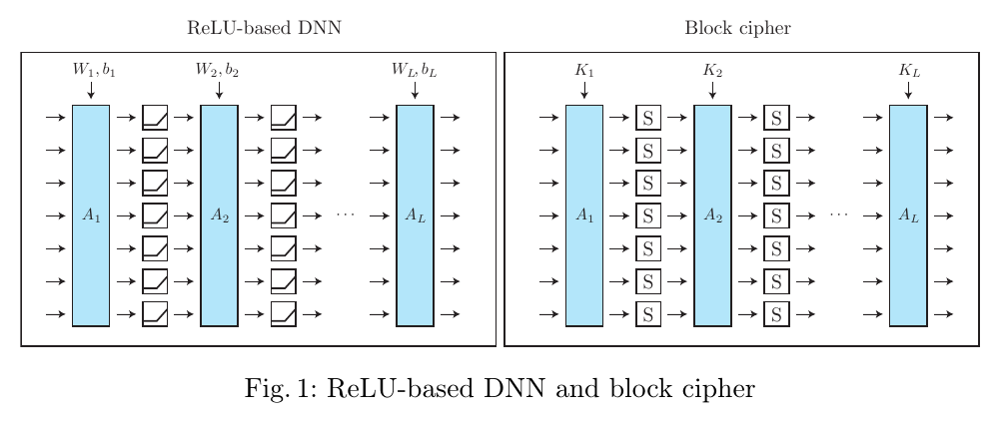
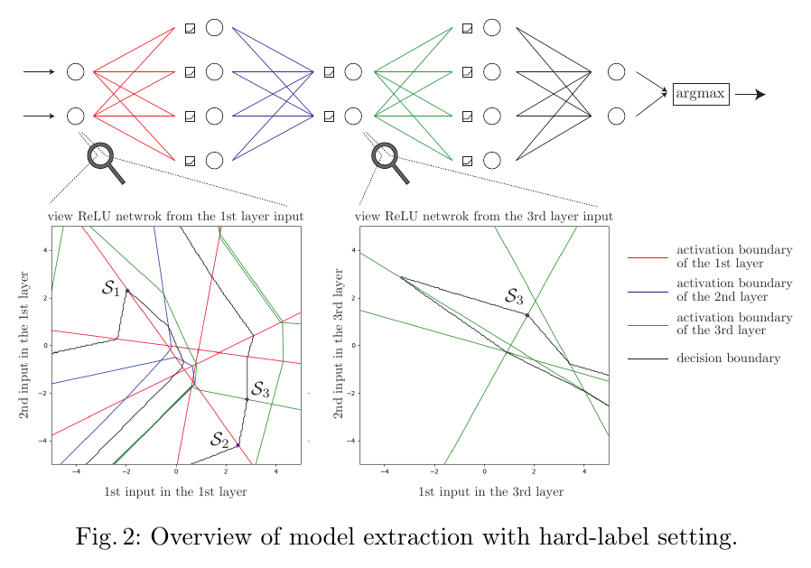
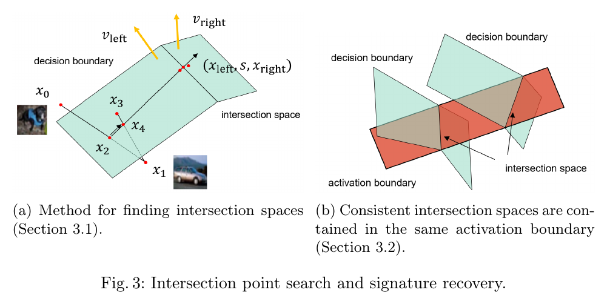
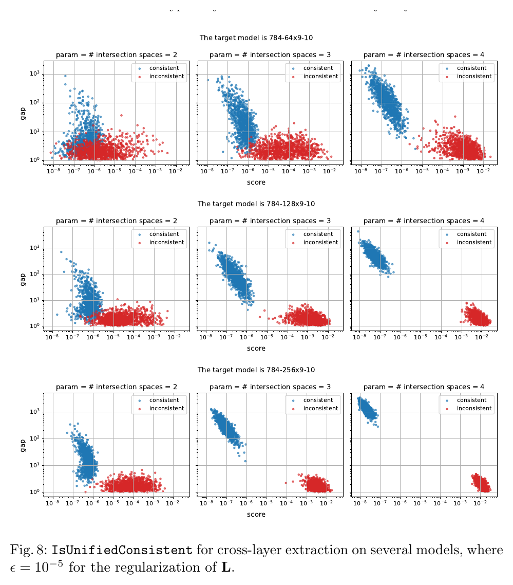
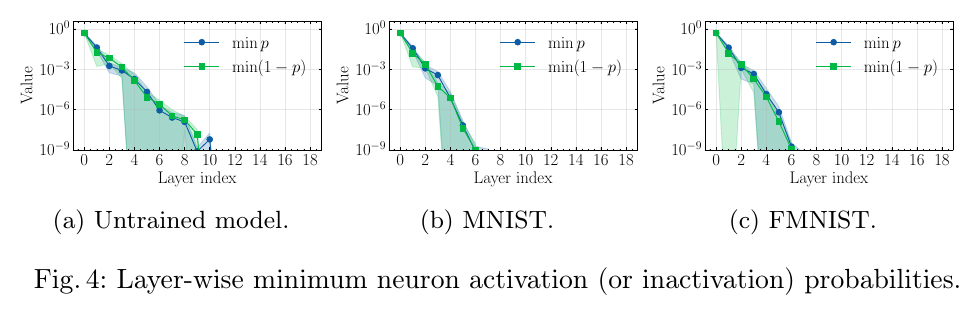
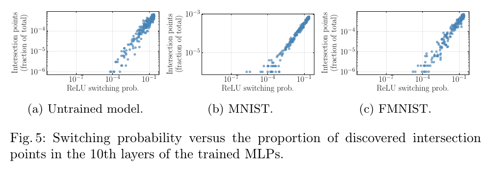
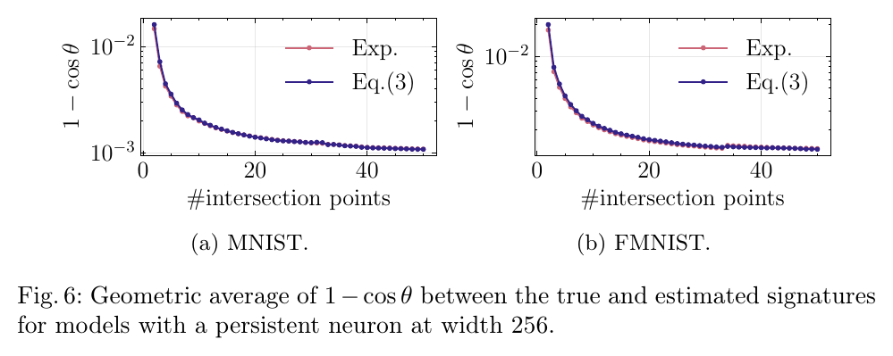
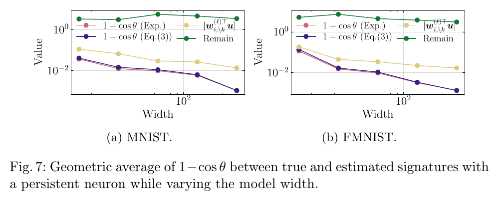
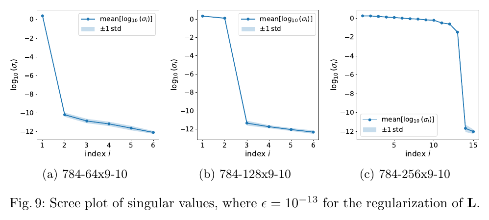

# Is the Hard-Label Cryptanalytic Model Extraction Really Polynomial?

原论文链接：[arXiv:2510.06692](https://arxiv.org/abs/2510.06692)

本地 PDF：[Is the Hard-Label Cryptanalytic Model Extraction Really Polynomial.pdf](./Is%20the%20Hard-Label%20Cryptanalytic%20Model%20Extraction%20Really%20Polynomial.pdf)

上位地图：[[MOC - 计算机]] · [[Research on Cryptographic Neurons]]

相关主题：[[Model Extraction]]、[[Hard-Label Attack]]、[[ReLU Network]]、[[Cryptanalytic Model Extraction]]、[[Persistent Neuron]]、[[Dead Neuron]]、[[Cross-Layer Extraction]]、[[Query Complexity]]

### Abstract

这篇论文重新审视 Carlini 等人在 EUROCRYPT 2025 提出的 hard-label ReLU 网络模型提取攻击。前序结论很强：即使攻击者只看到最终分类标签，也就是 hard label，而不是 logits 或置信度，也能在多项式时间内恢复 ReLU MLP 的参数。

作者的核心反驳是：这个“多项式时间”结论依赖一个隐含采样假设，即攻击者能用多项式数量的查询，为每个目标神经元收集足够多的 activation boundary 与 decision boundary 的交点。这个假设在深层训练网络中会失效。某些神经元可能几乎永远 active，称为 **persistent neurons**；也可能几乎永远 inactive，称为 **dead neurons**。如果一个 persistent neuron 很少切换状态，那么观察到它自己的 boundary 可能需要指数级查询。

一句话结论：

> Hard-label extraction 的真正瓶颈不只是“看不到 logits”，而是深层 ReLU 网络中有些内部边界在攻击者可查询分布下几乎不可达。

论文不是单纯否定旧攻击。作者进一步提出 **cross-layer extraction**：既然 persistent neuron 自己的边界看不到，就从下一层神经元的 activation boundary 中恢复它留下的线性组合。这个方法通常恢复的是 persistent weights 的 span 或功能等价表示，而不是原始 checkpoint 中逐个神经元的唯一参数。

### Knowledge

#### 1. 为什么 ReLU 网络可以被密码分析式地提取

ReLU MLP 可以写成：

$$
f^{(\ell)}(x)
=
\sigma\left(W^{(\ell)}f^{(\ell-1)}(x)+b^{(\ell)}\right),
$$

其中：

$$
\sigma(t)=\max(0,t).
$$

论文把 ReLU DNN 和 block cipher 做结构类比：

这个类比中：

- ReLU 网络的 affine layer 对应 block cipher 的线性或仿射层；
- ReLU 对应 block cipher 中的非线性 S-box；
- 权重和偏置对应需要被保护的 secret material；
- black-box query 对应只能通过 oracle 观察输入输出。

但二者有一个关键差异。block cipher 的 S-box 是离散非线性，而 ReLU 网络是 **piecewise linear**。在不跨过 ReLU 激活边界的小邻域内，网络就是局部仿射函数：

$$
f(x+\delta)=F_x\delta+f(x).
$$

这意味着攻击者可以通过微小扰动探索网络的“折痕”。一个形象类比是：block cipher 像离散城市路口图，攻击者只能站在路口观察；ReLU 网络像一张高维折纸，攻击者可以沿着纸面滑动，寻找折痕的方向和交点。

#### 2. Hard-label attack 直接看到什么，看不到什么

logit 或 soft-label setting 中，攻击者看到连续输出分数。hard-label setting 中，攻击者只看到：

$$
\arg\max_j f_j(x).
$$

因此，攻击者直接可见的是 **decision boundary**，也就是最终标签改变的位置。真正想恢复的是内部 **activation boundary**，也就是某个 ReLU 从 inactive 切到 active 的位置。

前序攻击依赖二者相交的位置：

$$
\text{intersection space}
=
\text{decision boundary}
\cap
\text{activation boundary}.
$$

这就是 Fig.2 的核心含义：

左侧从输入空间看，深层 activation boundary 是弯曲的、分段的、被前面层的 ReLU 折叠过；右侧如果已经剥离前面层，从中间层看同一个边界又变成线性超平面。旧攻击的层层剥离正是利用这个事实：先恢复前层，再把网络“从更深处重新看一遍”。

#### 3. Signature 是权重方向，而不一定是原始参数

论文把某个神经元权重向量的非零倍数称为 signature。若第 \(\ell\) 层第 \(k\) 个神经元的权重向量是 \(w_k^{(\ell)}\)，则：

$$
\operatorname{signature}(w_k^{(\ell)})
=
\alpha w_k^{(\ell)},
\qquad
\alpha\in\mathbb{R}\setminus\{0\}.
$$

这提醒读者：神经网络提取经常先恢复方向或等价类，而不是训练文件中的逐字节参数。ReLU 网络本身有缩放、排列等等价自由度。攻击的目标可能是：

- 精确参数复刻；
- 功能等价模型；
- 在高概率输入区域上行为一致的模型；
- 足以继续提取后续层的中间表示。

这四者不是同一件事。

#### 4. Dead neuron 与 persistent neuron

给定输入分布 \(p_x\)，第 \(\ell\) 层第 \(i\) 个神经元的 pre-activation 是：

$$
a_i^{(\ell)}(x)
=
{w_i^{(\ell)}}^\top f^{(\ell-1)}(x)+b_i^{(\ell)}.
$$

若：

$$
\Pr_{x\sim p_x}\left[\sigma(a_i^{(\ell)}(x))>0\right]\le \epsilon,
$$

则它是 \(\epsilon\)-dead neuron。若：

$$
\Pr_{x\sim p_x}\left[\sigma(a_i^{(\ell)}(x))=0\right]\le \epsilon,
$$

则它是 \(\epsilon\)-persistent neuron。

两者是概率意义上的对偶概念，但对攻击影响并不对称：

| 类型 | 状态 | 对攻击的含义 |
| --- | --- | --- |
| dead neuron | 几乎总是 inactive | 输出近似 0，忽略它通常问题较小 |
| persistent neuron | 几乎总是 active | 输出持续进入后续层，忽略它会删除非零贡献 |

dead neuron 像长期关闭的通道；persistent neuron 像一直开启但看不到开关的通道。攻击者看不到开关切换，不代表这条通道对下游没有贡献。

### Overview

#### 1. EC25 hard-label extraction 的基本流程

旧攻击大致有三步：

1. 在 decision boundary 上搜索弯折位置，收集 intersection points 和 intersection spaces。
2. 判断哪些 intersection spaces 属于同一个 activation boundary。
3. 从同一个 activation boundary 上的多个 intersection spaces 恢复该神经元的 signature，再恢复 sign 和 bias。

论文用 Fig.3 展示了这条流程：

左图说明如何沿 decision boundary 找 intersection space。右图说明若多个 intersection spaces 都落在同一个 activation boundary 上，就可以恢复该 activation boundary 的法向量，也就是神经元 weight 的方向。

这像只看见道路边界的人，试图从道路突然转弯的位置反推地下断层。若断层一直不与可见道路相交，旧方法就没有直接证据。

#### 2. 本文真正挑战的不是线性代数步骤，而是采样前提

若某个神经元的状态切换概率为 \(\epsilon\)，那么看到一次切换所需查询数的量级约为：

$$
O(1/\epsilon).
$$

更具体地，\(N\) 次查询后仍没看到切换的概率近似为：

$$
(1-\epsilon)^N\approx e^{-N\epsilon}.
$$

若深层中某些神经元满足：

$$
\epsilon\approx e^{-cL},
$$

则需要：

$$
N\approx e^{cL}
$$

次查询才有常数概率看到切换。这里 \(L\) 是攻击深度。于是，旧攻击的线性代数步骤即使是多项式，整体查询复杂度也会被 rare event sampling 拖成指数级。

### Main Results

#### 1. 旧多项式 claim 的隐含条件不稳

作者并不是说 EC25 算法的每一步都错了，而是指出一个更隐蔽的问题：它假设所有神经元都能以足够大概率在查询中切换状态。这个假设在训练后的深层 MLP 中并不自然。

实验显示，随着层数加深，最小激活概率或最小失活概率可能指数级下降。这意味着某些神经元越来越接近 dead 或 persistent。对 hard-label attacker 来说，这些神经元的 boundary 不只是“难找”，而是可能在实际查询预算内完全不可见。

#### 2. Persistent neuron 不能像 dead neuron 一样忽略

若一个 dead neuron 一直输出 0，把它忽略近似等价于删除一个无贡献坐标。若一个 persistent neuron 一直 active，它的输出是线性项：

$$
z_j^{(\ell)}
=
{w_j^{(\ell)}}^\top z^{(\ell-1)}+b_j^{(\ell)}.
$$

这项会继续进入下一层。如果攻击者因为看不到 boundary 而把它当成 0，就相当于把一个非零坐标从局部线性映射中擦掉。

作者的 Theorem 1 表明，当第 \(k\) 个 persistent neuron 在上一层未被恢复时，下一层 signature recovery 等价于在删除第 \(k\) 个坐标后的 reduced space 中求解：

$$
\min_{\lVert w_{\setminus k}\rVert=1}
w_{\setminus k}^{\top}
\left(
\sum_j
F_{j,\setminus k}^{(\ell-1)}N_j
\left(F_{j,\setminus k}^{(\ell-1)}N_j\right)^\top
\right)
w_{\setminus k}.
$$

这像用二维投影恢复三维法向量：某个坐标被擦掉后，真实方向的投影未必仍然是低维优化问题的最优解。

Theorem 2 给出 signature discrepancy 的误差上界。最值得记住的影响项是：

$$
\left|{w_{i,\setminus k}^{(\ell)}}^\top\beta\right|.
$$

若缺失 persistent neuron 的贡献方向与待恢复 signature 在统计上不正交，误差就会进入估计。训练网络中的神经元不是彼此独立漂浮的随机向量；它们被同一数据、同一损失函数、同一前向传播耦合，所以不能轻易假设这个内积为 0。

#### 3. Cross-layer extraction 恢复的是跨层线性痕迹

cross-layer extraction 的想法是：既然第 \(\ell\) 层 persistent neuron 自己的 activation boundary 不可见，就看第 \(\ell+1\) 层某个神经元的 activation boundary。

若 \(P\) 是第 \(\ell\) 层 persistent neurons 的索引集合，第 \(\ell+1\) 层第 \(k\) 个神经元的边界满足：

$$
{w_k^{(\ell+1)}}^\top z^{(\ell)}+b_k^{(\ell+1)}=0.
$$

对 \(j\in P\)，因为 persistent neuron 始终 active：

$$
z_j^{(\ell)}
=
{w_j^{(\ell)}}^\top z^{(\ell-1)}+b_j^{(\ell)}.
$$

代入后会出现 persistent weights 的线性组合：

$$
\sum_{j\in P} w_{k,j}^{(\ell+1)}w_j^{(\ell)}.
$$

作者构造：

$$
w_{\mathrm{cross}}
=
\begin{pmatrix}
w_{k,\bar P}^{(\ell+1)} \\
\sum_{j\in P} w_{k,j}^{(\ell+1)}w_j^{(\ell)}
\end{pmatrix}.
$$

多个边界点之间的差分都与 \(w_{\mathrm{cross}}\) 正交，因此可以用深层 boundary points 恢复这个方向。若有多个 persistent neurons，通常只能恢复它们权重向量张成的 span。

### Method

#### 1. Unified consistency algorithm

普通 consistency check 成对比较 intersection spaces 是否来自同一个 activation boundary。cross-layer extraction 中，相关矩阵更容易低秩，简单 rank-deficiency 检查会产生伪阳性。因此作者提出 unified consistency algorithm。

给定变换矩阵 \(M_i\) 和 intersection space basis \(N_i\)，令：

$$
L_i=M_iN_i,
\qquad
L=\sum_i L_iL_i^\top,
\qquad
M=\sum_i M_iM_i^\top.
$$

然后求广义特征值问题：

$$
Mv=\lambda Lv.
$$

算法关注两个统计量：

| 统计量 | 含义 |
| --- | --- |
| score | 候选方向与 transformed intersection spaces 的正交程度 |
| gap | 最大与次大广义特征值的分离度，越大越稳定 |

Fig.8 展示了这个算法在不同模型宽度和 intersection spaces 数量下对 consistent/inconsistent sets 的区分效果：

蓝点和红点越分离，说明算法越能稳定地区分“来自同一跨层结构”的 intersection spaces 与错误混入的 spaces。论文报告，在 hidden units 为 128 或 256 时，3 个 intersection spaces 已经足以高置信地区分；64 hidden units 时通常需要 4 个。

#### 2. 单个 persistent neuron 与多个 persistent neurons

若只有一个 persistent neuron，cross-layer vector 中直接包含该 neuron 的 signature。由于它始终 active，恢复模型中可以移除对应 ReLU，把它视作线性通道。

若存在多个 persistent neurons，则恢复到的是：

$$
\operatorname{span}\{w_j^{(\ell)}:j\in P\}.
$$

这不是原始 basis 的唯一恢复。原因在于多个始终 active 的通道在下一层中会以线性组合形式混合；只要不出现切换事件，攻击者没有信息把这个 span 分解回原始每个 neuron。

因此，cross-layer extraction 的目标更接近 **functional equivalence**：在 persistent/dead 状态保持成立的输入区域内，恢复模型与原模型输出一致。若有 \(n\) 个 \(\epsilon\)-persistent neurons 和 \(m\) 个 \(\epsilon\)-dead neurons，论文给出的正确概率为：

$$
(1-\epsilon)^{n+m}.
$$

### Experiments

#### 1. 深层网络中确实出现指数级小概率事件

实验设置：

- 模型：20-layer MLP；
- hidden width：256；
- 数据集：MNIST 与 Fashion-MNIST；
- 初始化：Kaiming normal；
- bias：0；
- optimizer：Adam；
- learning rate：\(10^{-5}\)；
- epochs：30；
- test accuracy：MNIST 约 \(94.7\%\)，Fashion-MNIST 约 \(84.8\%\)。

Fig.4 展示每层最小 activation probability 与最小 inactivation probability：

读图方式很直接：纵轴是 log scale。越往深层，曲线越容易掉到 \(10^{-6}\)、\(10^{-9}\) 等极小概率区间。对攻击者而言，这意味着某些 activation boundary 在查询中几乎不会被撞上。

#### 2. 切换概率越小，越难发现 intersection points

作者进一步考察 switching probability：

$$
2p_i^{(\ell)}(1-p_i^{(\ell)}).
$$

如果 \(p_i^{(\ell)}\) 接近 0，它接近 dead；如果 \(p_i^{(\ell)}\) 接近 1，它接近 persistent；二者都会让 switching probability 变小。

Fig.5 展示 switching probability 与 discovered intersection fraction 的关系：

图中的正相关关系说明：旧攻击能发现多少 intersection points，强烈依赖神经元是否会频繁切换。这个结果把“persistent/dead neuron 是经验现象”推进成“它们会直接控制查询复杂度”。

#### 3. Persistent neuron 导致 signature estimation error 饱和

作者在第 9 层假设有一个 persistent neuron 未恢复，然后尝试恢复第 10 层神经元 signature。误差使用：

$$
1-\cos\theta
$$

度量，其中 \(\theta\) 是真实 signature 与估计 signature 的夹角。

Fig.6 展示随着 intersection points 数量增加，误差如何变化：

曲线先下降，随后趋于饱和。这说明仅靠收集更多同类 intersection points，不能完全消除 missing persistent neuron 带来的结构性误差。

#### 4. 宽度变大可以缓解误差，但不是根治

Fig.7 展示不同模型宽度下的误差变化：

论文观察到误差大约按：

$$
O(1/d)\ \text{到}\ O(1/(d\sqrt d))
$$

下降，其中 \(d\) 是模型宽度。这个结果的含义不是“宽模型就安全”，而是：宽度会稀释某些方向性误差，但攻击者通常无法控制 victim model 的宽度，也不能据此恢复旧攻击的多项式保证。

#### 5. Cross-layer extraction 能恢复 persistent span

Fig.9 是 span recovery 的效果图。作者考虑第 4 层分别含有 1、2、13 个 persistent neurons 的模型，并从第 5 层 intersection spaces 进行 cross-layer extraction。

scree plot 中明显的 rank deficiency 对应 persistent neurons 的数量。论文还比较 recovered span 与 true persistent-neuron span 的 principal angles，最大 principal angle 约为：

$$
10^{-8}.
$$

这说明在该实验条件下，cross-layer extraction 可以非常精确地恢复 persistent weights 张成的子空间。

### Insights

#### 1. 多项式复杂度结论常常藏着采样分布假设

一个算法的代数步骤可以是多项式，但它需要的“有用样本”是否能以多项式查询拿到，是另一回事。本文的关键洞见是：hard-label extraction 卡住的地方不是最后的特征向量求解，而是能不能看到足够多真实 boundary events。

#### 2. Hard-label 比 soft-label 少的不只是数值

soft-label/logit 给攻击者连续观察面；hard-label 只给离散标签区域。攻击者只能通过 decision boundary 的弯折推断 activation boundary，因此特别依赖边界可达性。隐藏 logits 可以降低攻击者信息量，但不自动等于安全。

#### 3. Dead 与 persistent 是对偶概念，却不是对称风险

dead neuron 和 persistent neuron 都难以被状态切换定位。但 dead neuron 的输出近似为 0；persistent neuron 的输出是持续进入后续层的线性通道。前者像消失的坐标，后者像看不见但仍在工作的坐标。

#### 4. Cross-layer extraction 的哲学是“从下游痕迹恢复上游结构”

persistent neuron 自己的边界不可见，但它在下一层边界中留下线性组合。cross-layer extraction 不再追求直接打开这扇门，而是从下一层的投影中恢复门背后的方向。这解释了为什么它恢复 span，而不是唯一原始参数。

### Critical Reading

#### Strengths

- 精准指出 EC25 hard-label extraction 的关键隐含假设，而不是泛泛地说 hard-label 更难。
- 将 persistent/dead neurons 从经验现象提升为查询复杂度瓶颈。
- 分析了 persistent neuron 为什么会在后续层造成不可避免误差。
- 提出 cross-layer extraction，给出建设性补救。
- 图和实验链条清楚：Fig.4-5 证明边界难找，Fig.6-7 证明误差会传播和饱和，Fig.8-9 证明新方法可区分一致空间并恢复 span。

#### Limitations

- 实验主要是 MLP、MNIST、Fashion-MNIST，距离 CNN、ViT、残差结构和现代大模型仍有距离。
- 攻击仍依赖连续输入查询、足够精确的 boundary search 和架构知识。
- cross-layer extraction 的工程鲁棒性、数值稳定性、真实 API 场景适配仍需要更多验证。
- persistent/dead 是分布相关概念；换一个 query distribution，神经元状态统计可能改变。
- 对 GELU、SiLU、normalization、residual connection 等非纯 ReLU MLP 结构，结论需要重新分析。

### 用户可能“不知道自己不知道”的背景

#### 1. Activation boundary 不是 decision boundary

activation boundary 是内部神经元切换状态的边界；decision boundary 是最终输出标签改变的边界。hard-label attacker 只能直接看见后者。intersection point 的意义在于，它是内部折痕在外部可见边界上的投影。

#### 2. 查询复杂度由罕见事件主导

若事件概率为 \(\epsilon\)，看到一次的期望采样次数约为：

$$
1/\epsilon.
$$

如果 \(\epsilon\) 随深度指数下降，多项式步骤算法也会因为采样事件太稀有而整体退化为指数查询。

#### 3. “恢复等价模型”和“恢复原模型”不同

cross-layer extraction 对 persistent neurons 恢复的是 span 或功能等价结构，而不一定是原始神经元逐项参数。对于攻击者来说，如果目标是复制预测行为，这可能已经足够；如果目标是恢复训练 checkpoint，则不一定足够。

#### 4. 输出 hard label 不是完整防御

把 logits 隐藏起来可以降低泄漏，但模型服务若仍允许任意实数输入、稳定 deterministic 输出、无限或大量查询，几何攻击面仍然存在。安全接口需要同时考虑输出格式、输入域、查询预算、随机化、离散化和异常输入检测。

### 可沉淀到 `03_Knowledge` 的原子概念

- [[Hard-Label Attack]]
- [[Model Extraction]]
- [[Cryptanalytic Model Extraction]]
- [[ReLU Network]]
- [[Activation Boundary]]
- [[Decision Boundary]]
- [[Intersection Space]]
- [[Signature Recovery]]
- [[Persistent Neuron]]
- [[Dead Neuron]]
- [[Cross-Layer Extraction]]
- [[Query Complexity]]
- [[Functional Equivalence]]

### Sources

- arXiv：https://arxiv.org/abs/2510.06692
- arXiv PDF：https://arxiv.org/pdf/2510.06692
- 相关工作 Carlini et al.：https://arxiv.org/abs/2410.05750
- 本地 PDF：`./Is the Hard-Label Cryptanalytic Model Extraction Really Polynomial.pdf`

## 标签

#status/进行中 #type/笔记 #type/论文 #topic/model-extraction #topic/hard-label-attack #topic/relu-network
