# Polynomial Time Cryptanalytic Extraction of Deep Neural Networks in the Hard-Label Setting

原论文链接：[arXiv:2410.05750](https://arxiv.org/abs/2410.05750)

本地 PDF：[Polynomial Time Cryptanalytic Extraction of Deep Neural Networks in the Hard-Label Setting.pdf](./Polynomial%20Time%20Cryptanalytic%20Extraction%20of%20Deep%20Neural%20Networks%20in%20the%20Hard-Label%20Setting.pdf)

本地提取文本：[Polynomial Time Cryptanalytic Extraction of Deep Neural Networks in the Hard-Label Setting.txt](./Polynomial%20Time%20Cryptanalytic%20Extraction%20of%20Deep%20Neural%20Networks%20in%20the%20Hard-Label%20Setting.txt)

上位地图：[[MOC - 计算机]] · [[Research on Cryptographic Neurons]] · [[Neural Cryptanalysis]]

相关主题：[[Hard-Label Oracle]]、[[Decision Boundary]]、[[Dual Point]]、[[Critical Point]]、[[Cryptanalytic Extraction]]、[[Model Extraction]]、[[ReLU Network]]、[[Signature Recovery]]、[[Sign Recovery]]

## Abstract

这篇论文接在 ASIACRYPT 2024 的 `Hard-Label Cryptanalytic Extraction of Neural Network Models` 之后，目标非常明确：把 hard-label setting 下的 ReLU-DNN 提取从“多项式查询但指数时间”推进为“多项式查询且多项式时间”。

前三篇的路线可以压缩成一张谱系图：

$$
\text{CRYPTO 2020}
\Longrightarrow
\text{raw-output critical point extraction}
$$

$$
\text{EUROCRYPT 2024}
\Longrightarrow
\text{raw-output polynomial-time sign recovery}
$$

$$
\text{ASIACRYPT 2024}
\Longrightarrow
\text{hard-label decision-boundary extraction, exponential time}
$$

本文声称进一步得到：

$$
\text{hard-label}
\Longrightarrow
\text{decision-boundary geometry}
\Longrightarrow
\text{polynomial-time DNN extraction}.
$$

核心概念是 `dual point`：它既在 decision boundary 上，也在某个 ReLU 神经元的 critical hyperplane 上。hard-label oracle 无法直接观察 ordinary critical points，因为攻击者只看到 label，不看到 logits 或导数；但如果沿着 decision boundary 移动，边界局部方向突然改变，就说明穿过了某个 ReLU 的 critical hyperplane。这个交点就是 dual point。

一句话概括：

> 这篇论文的关键洞察是：hard-label 隐藏了 logits，但没有隐藏 decision boundary 的形状；decision boundary 的折弯位置仍可间接暴露内部 ReLU hyperplanes。

论文在 CIFAR10 上展示了一个约 935,370 参数、832 个隐藏神经元的 fully connected ReLU 网络提取实验。模型结构为：

$$
3072-256-256-256-64-10.
$$

作者称该网络在 hard-label setting 下可被提取，而 ASIACRYPT 2024 的方法在类似宽度上会面临约：

$$
2^{256}
$$

的符号搜索。

## Knowledge

### 1. hard-label 下真正可观察的是什么

hard-label oracle 不返回 logits：

$$
f_\theta(x)\in\mathbb R^{d_{r+1}}.
$$

它只返回最大 logit 的坐标：

$$
z(f_\theta(x))
=
\arg\max_i f_\theta(x)_i.
$$

所以攻击者看不到：

$$
\nabla f_\theta(x),
$$

也看不到普通 critical point 两侧的 slope jump。与 raw-output setting 相比，攻击者从“能读仪表盘上的连续数值”退化成“只能看红灯还是绿灯”。

但 red/green 的分界线仍然存在。若两个类别 `a` 和 `b` 的 logit 相等：

$$
f_\theta(x)_a=f_\theta(x)_b,
$$

则 `x` 落在这两个类别之间的 decision boundary 上。这个边界在每个 ReLU linear region 内是一个超平面；当穿过某个 ReLU critical hyperplane 时，它的局部方向会改变。

### 2. critical point、transition point、dual point

论文区分三种点：

| 概念 | 数学条件 | hard-label 下是否直接可见 | 泄露内容 |
| --- | --- | --- | --- |
| critical point | 某个神经元 `eta` 满足 `V(eta;x)=0` | 不可直接观察 | 内部 ReLU 边界 |
| transition point | hard-label 发生类别切换 | 可观察 | 最终 decision boundary |
| dual point | 同时是 transition point 和 critical point | 可通过边界折弯间接寻找 | 内部 ReLU 边界与最终边界的交集 |

形式化地，dual point 满足：

$$
z(f(d+\epsilon))
\ne
z(f(d-\epsilon))
$$

并且存在某个神经元 `eta`：

$$
V(\eta;d)=0.
$$

可以把 ordinary critical point 想象成地下管线的位置，把 decision boundary 想象成地表裂缝。hard-label 下看不到地下管线，但如果地表裂缝走向突然拐弯，就能推断地下管线穿过了这里。dual point 就是这种“地表裂缝与地下管线相交”的位置。

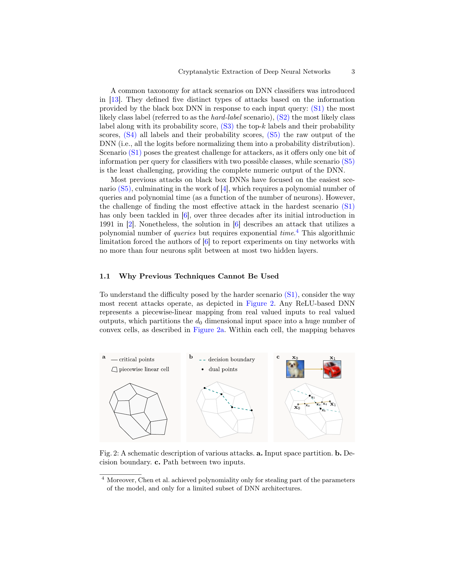

### 3. 为什么 dual point 能替代 critical point

在固定 ReLU activation pattern 的 linear region 内，网络是 affine map，decision boundary 是平的。若沿 decision boundary 移动时发现局部平面方向改变，通常说明跨过了某个 ReLU 边界。

假设 decision boundary 的两个相邻 patch 分别有局部法向量：

$$
m_{\text{off}}
$$

和：

$$
m_{\text{on}}.
$$

这两个 patch 的交集给出一个维度为：

$$
d_0-2
$$

的 dual space。这个 dual space 位于某个神经元的 critical hyperplane 内。若输入维度是三维，两个 decision boundary patch 是两个面，它们的交线就是一条 dual line。

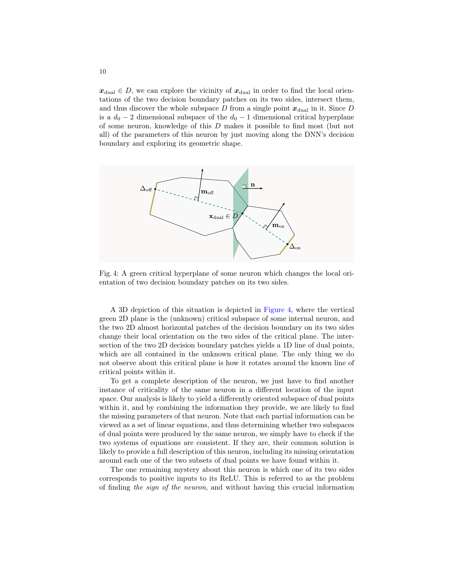

直觉上，这像用两张折纸面片的折线反推折痕所在的平面。攻击者没有直接看到 ReLU hyperplane，但能看到 decision boundary 在它两侧的形状变化。

### 4. 论文中的两大恢复目标：signature 与 sign

与 EUROCRYPT 2024 一样，本文把每层恢复拆成两步：

$$
\text{signature recovery}
\Longrightarrow
\text{sign recovery}.
$$

signature recovery 恢复某个神经元 critical hyperplane 的法向量，允许未知比例：

$$
\operatorname{sig}(\eta)
=
\alpha A_\eta.
$$

这里 `alpha` 可以是任意非零标量。positive scaling 可在 ReLU 网络中吸收，不改变函数；但 negative scaling 会改变 ReLU 的 active side，因此 sign recovery 仍是必须步骤。

sign recovery 的目标是判断 critical hyperplane 哪一侧对应：

$$
V(\eta;x)>0.
$$

换句话说，signature 确定“墙在哪里、朝向大致是什么”，sign 确定“墙的哪一侧有门打开”。

## Overview

### 1. DNN 与 block cipher 类比

论文继续沿用 cryptanalytic extraction 的大类比：DNN 和 block cipher 都由交替的线性层与非线性层组成。DNN 的线性层参数是 weights/biases，block cipher 的线性或 key mixing 结构中隐藏的是 round keys。

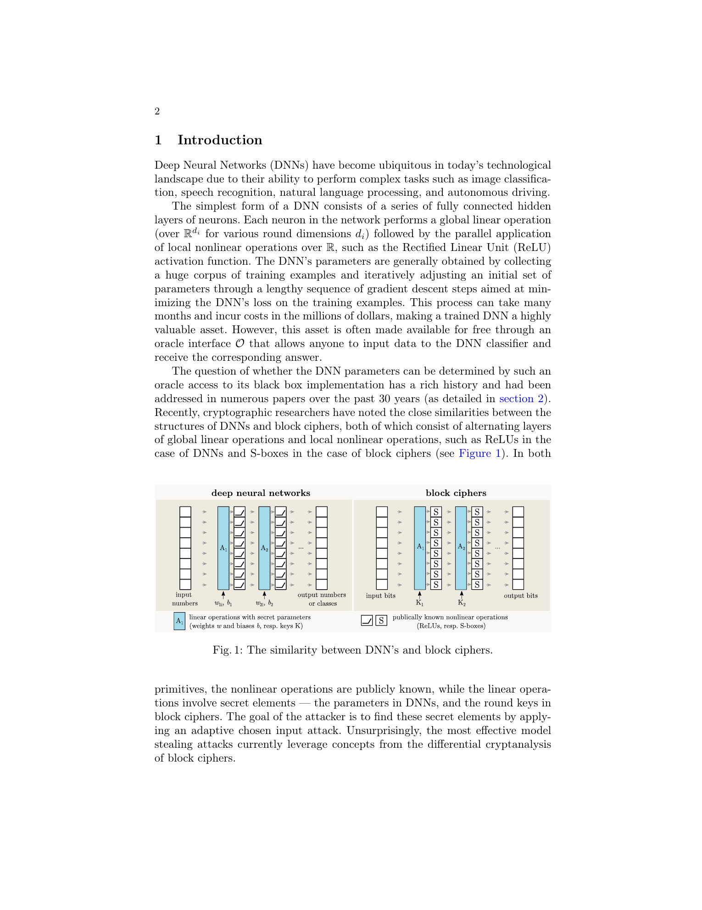

这个类比不是修辞，而是指导攻击设计：攻击者通过 chosen input 查询 oracle，观察输出行为，从而恢复 secret parameters。只是 DNN 中的泄露通道不是传统差分分布表，而是 piecewise-linear geometry。

### 2. 层级恢复框架

恢复第 `i` 层时，网络被拆成三段：

$$
f
=
f_{r+1}\circ\sigma\circ\cdots\circ\sigma\circ f_i\circ\cdots\circ f_1.
$$

攻击者假设前 `i-1` 层已经恢复，当前目标是 `f_i`，后续层仍未知。

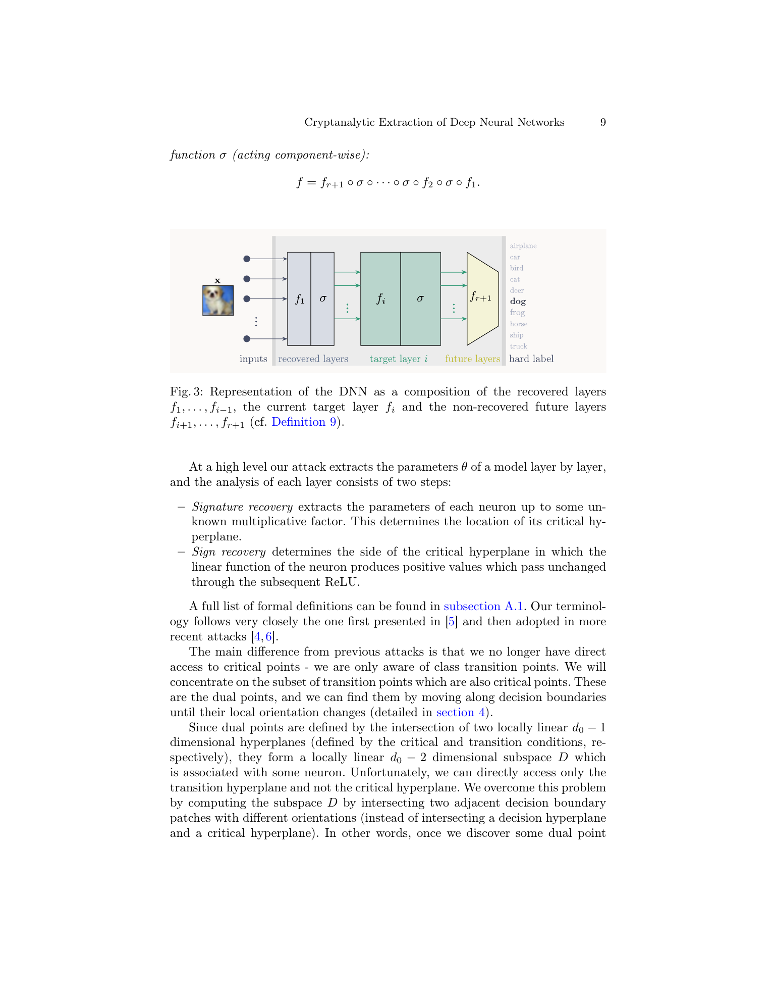

这与 CRYPTO 2020 / EUROCRYPT 2024 的 peel-off attack 思路一致。差别是，本文不再通过 raw-output finite difference 找 critical points，而是通过 dual points 间接恢复 critical hyperplanes。

### 3. 本文相对 ASIACRYPT 2024 的核心改进

ASIACRYPT 2024 用 decision boundary points 恢复 affine constraints，但由于不知道 activation pattern，需要组合搜索，sign recovery 仍指数。本文的改进是：

| 问题 | ASIACRYPT 2024 | 本文 |
| --- | --- | --- |
| oracle | hard-label | hard-label |
| 可处理输出 | 主要 scalar/binary | 多类 hard-label |
| signature recovery | restricted architecture 下可行 | dual points + dual space clustering，多项式 |
| sign recovery | 穷举符号组合 | 距离到 future toggle 的统计投票，多项式 |
| 实验规模 | 最多几个隐藏神经元 | CIFAR10，832 hidden neurons，约 0.9M 参数 |

Table 1 直接给出这个比较。

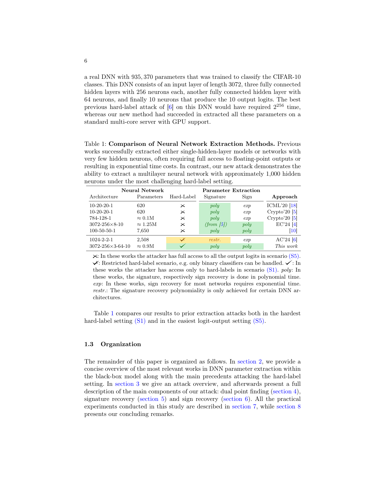

## Method

### 1. Dual point finding

dual point finding 的目标是沿 decision boundary 找到局部方向发生改变的位置。论文给出五步：

1. 找到一个 decision boundary point。
2. 从边界点做随机 excursion。
3. 再找到另一个 decision boundary point。
4. 沿 decision boundary patch 移动，直到该 patch 发生偏离。
5. 重新投影回 decision boundary，得到 crossing 后的边界点。

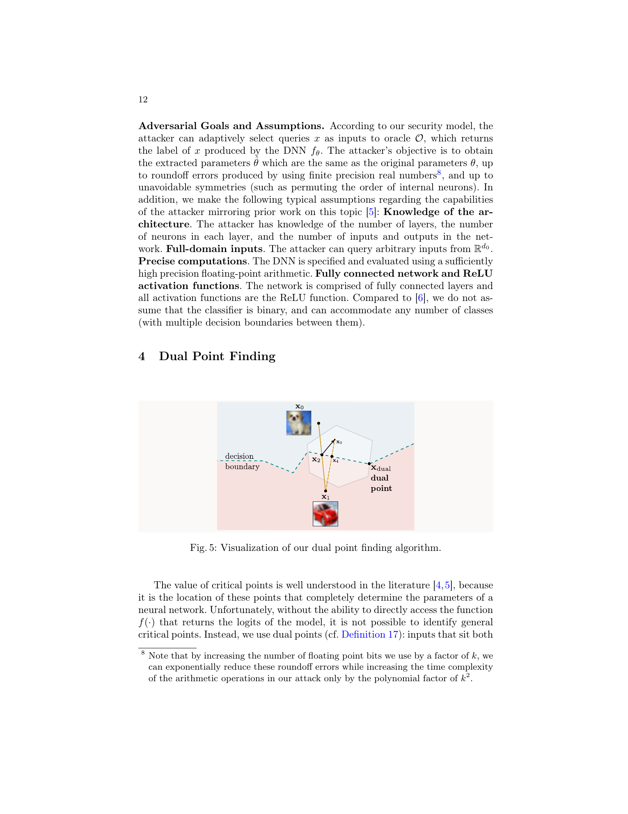

第一步仍使用二分搜索。若两个输入 `x_0` 和 `x_1` hard-label 不同，则沿线段二分可以找到类别切换点：

$$
z(f(x_0))\ne z(f(x_1)).
$$

由于 hard-label 只能定位边界到有限精度，若精度为 `epsilon`，查询开销大致为：

$$
\log_2\frac{1}{\epsilon}.
$$

本文的关键不是“找到一个边界点”，而是“沿边界移动直到边界不再是同一个平面”。这个折弯就是 ReLU critical hyperplane 与 decision boundary 相交的证据。

### 2. 从 dual point 恢复第一层 signature

对第一层某个神经元，它的 critical hyperplane 法向量就是该神经元权重行：

$$
A_j^{(1)}.
$$

在 raw-output 攻击中，可以通过 finite difference 直接测量这个法向量。hard-label 下不能这么做。本文改用 dual space。

若有一个 dual point，其两侧 decision boundary patch 的局部超平面交集为：

$$
D_\eta.
$$

那么：

$$
D_\eta
\subset
\left\{
x: A_j^{(1)}x+b_j^{(1)}=0
\right\}.
$$

单个 dual space 只有 `d_0-2` 维，仍缺一个维度。若找到同一神经元的两个不同 dual spaces：

$$
D_\eta^{(0)}
\quad\text{and}\quad
D_\eta^{(1)},
$$

把它们合并后，一般可恢复该神经元 critical hyperplane 的 `d_0-1` 维结构，从而得到法向量，即 signature。

算法页如下：

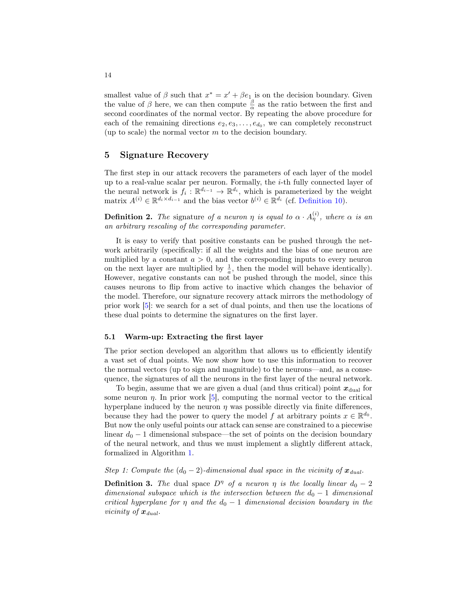

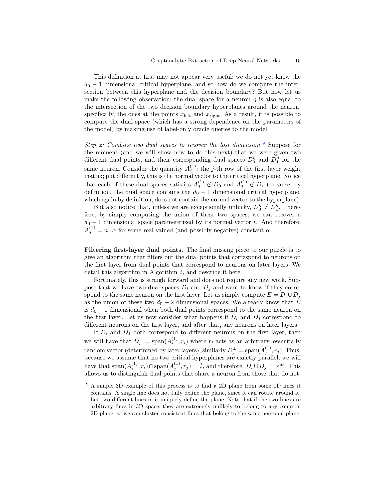

### 3. 更深层 signature recovery：一致性、聚类与 unification

对更深层，攻击者已恢复前面层，因此可以把 dual point 映射到第 `i` 层隐藏空间中。设前缀映射为：

$$
f_{1..i}.
$$

对 dual point `x_dual`，计算隐藏状态：

$$
\hat x_{\text{dual}}
=
f_{1..i}(x_{\text{dual}}).
$$

同时把 decision boundary normal vector 也通过局部线性映射送到隐藏空间。之后判断两个 dual points 是否属于同一个目标神经元，核心是 rank test：如果两个 dual spaces 来自同一个 neuron，它们的 union 不会达到可达到的最高 rank；若来自不同 neuron，则通常 rank 达到满秩。

论文定义：

$$
\operatorname{Rank}(D)<X
\Longrightarrow
\text{consistent}.
$$

其中 `X` 是两点中至少一个 active 的 hidden coordinates 数量。

随后把 dual points 建成图：每个 dual point 是一个节点，若二者 consistent 就连边。同一个 neuron 的 dual points 应形成 clique。然后对每个 clique 统一 dual spaces，恢复该 neuron 的 signature。

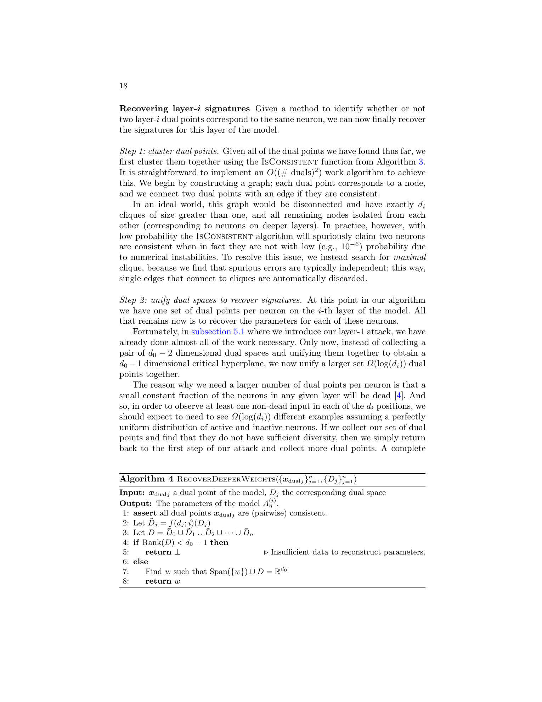

这里的直觉像拼同一条裂缝的多个局部切片。每个 dual space 只给出 critical hyperplane 的一部分信息；多个来自同一神经元的切片叠起来，才能恢复完整方向。

### 4. Sign recovery：用 distance-to-toggle 替代 output slope

EUROCRYPT 2024 的 sign recovery 能比较 logits 在两侧的变化速度；hard-label 下 logits 不可见。本文用另一个可测 proxy：沿 decision boundary patch 走到下一个 future neuron toggle 的距离。

直觉是：若目标神经元在 on-side，它会参与后续层变化，future neurons 的值变化更快，因此更快遇到下一个 toggle；若在 off-side，目标神经元被 ReLU 截断，后续变化较慢，走得更远才遇到 toggle。

论文写成：

$$
s_{\text{on}}
\propto
\|v_{\text{on}}\|,
$$

$$
s_{\text{off}}
\propto
\|v_{\text{off}}\|.
$$

其中：

$$
\|v_{\text{on}}\|
\approx
\left\|
\left(
\pm\frac{\epsilon}{\sqrt d},
\ldots,
\epsilon,
\ldots,
\pm\frac{\epsilon}{\sqrt d}
\right)
\right\|,
$$

而：

$$
\|v_{\text{off}}\|
\approx
\left\|
\left(
\pm\frac{\epsilon}{\sqrt d},
\ldots,
0,
\ldots,
\pm\frac{\epsilon}{\sqrt d}
\right)
\right\|.
$$

所以通常：

$$
s_{\text{on}}>s_{\text{off}}.
$$

速度更快意味着到下一次 future toggle 的距离更短：

$$
\Delta_{\text{on}}<\Delta_{\text{off}}.
$$

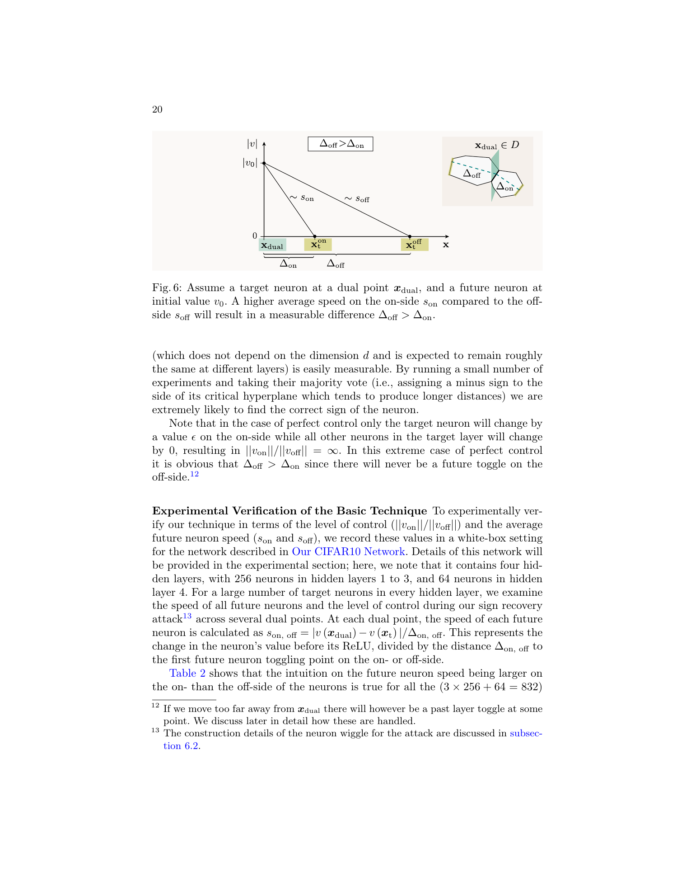

白盒验证结果显示，这个直觉在 CIFAR10 网络所有目标神经元上成立，平均速度比约在 `1.2` 附近，最差神经元也仍有可统计差异。

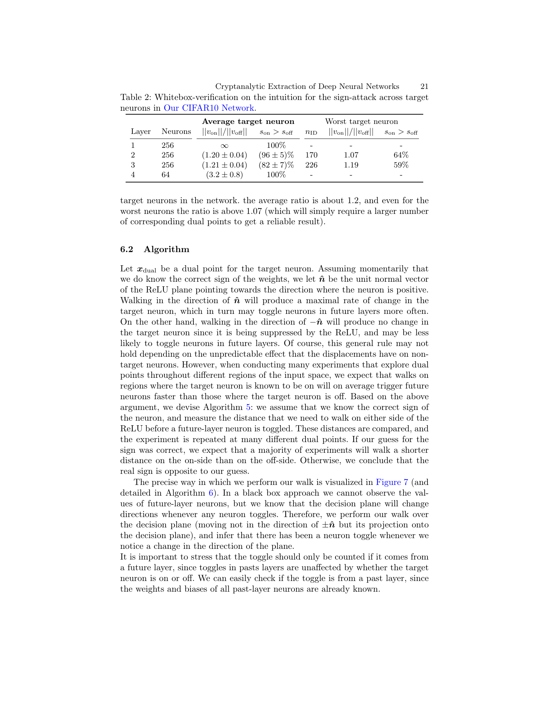

### 5. DistanceToToggle 与投票

实际 hard-label 攻击不能观察 future neuron 的值，只能观察 decision boundary patch 的方向是否改变。因此算法沿 decision boundary 上投影后的 `+n` 和 `-n` 方向移动，测量两侧到下一个方向变化的距离。

若：

$$
\Delta_+<\Delta_-,
$$

则投票支持当前 sign 猜测；反之支持相反 sign。重复多次 dual points 后多数投票。

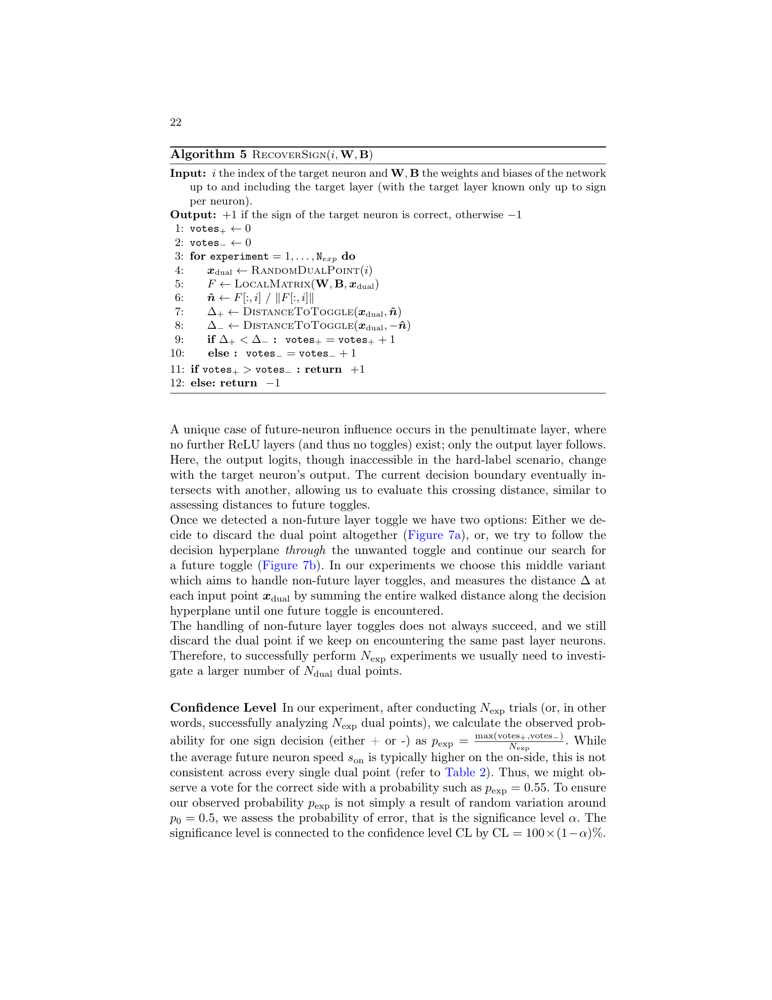

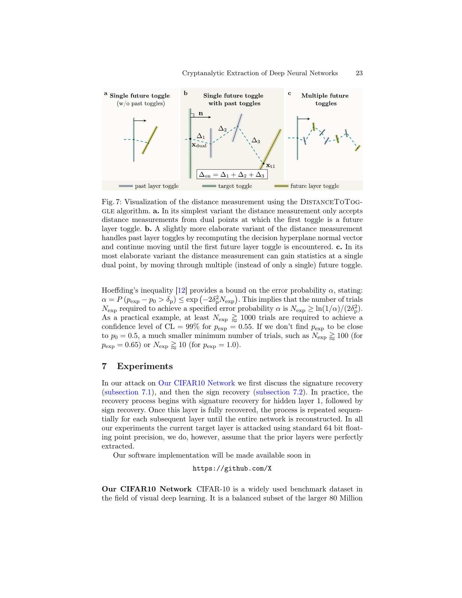

置信度用二项投票显著性描述。若单次实验正确概率为：

$$
p_{\text{exp}}>0.5,
$$

做 `N_exp` 次实验后，错误概率可用 Hoeffding bound 控制：

$$
\alpha
\le
\exp(-2\delta_p^2 N_{\text{exp}}).
$$

这解释了为什么难神经元需要更多 dual points，而容易神经元只需很少样本。

## Experiments

### 1. CIFAR10 网络

实验模型是 fully connected ReLU 网络：

$$
3072-256-256-256-64-10.
$$

参数量约为：

$$
935,370.
$$

隐藏神经元数量为：

$$
3\times256+64=832.
$$

测试准确率约：

$$
0.52.
$$

这与纯 fully connected ReLU 网络在 CIFAR10 上的预期性能相符。论文也承认这不是现代视觉 SOTA，而是为了验证 extraction attack 的结构化实验对象。

### 2. Signature recovery 实验

signature recovery 的总时间分解为：

$$
t_{\text{signatures}}
=
t_{\text{dual}}
+t_{\text{cluster}}
+t_{\text{unify}}.
$$

作者的 proof-of-concept 实现没有计入 `n^2` pairwise clustering 的实际运行时间，理由是该步骤原则上多项式，但未经优化时对百万级 dual points 会很慢。作者还使用 symbolic gradient 代替部分二分搜索来获得常数级加速。

实验支撑图包括：

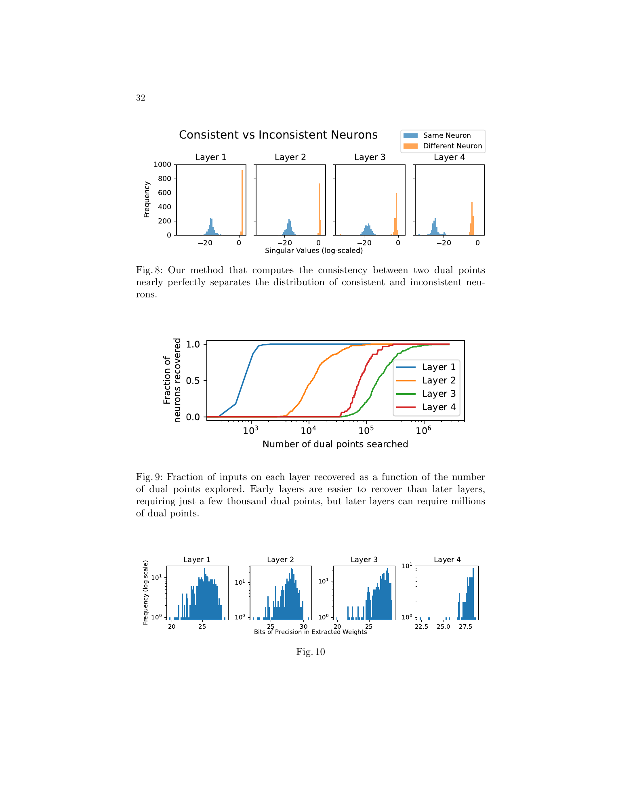

重要观察：

| 图 | 结论 |
| --- | --- |
| Fig.8 | 同一 neuron 与不同 neuron 的 consistency singular values 几乎可分 |
| Fig.9 | 越深层需要越多 dual points，后层可能需要百万级 |
| Fig.10 | signature recovery 的权重精度通常达到 18 bits 以上 |

论文报告该 proof-of-concept signature recovery 在 256-core + GPU 支持机器上约需：

$$
16\text{ hours}.
$$

### 3. Sign recovery 实验

sign recovery 的单神经元总时间写为：

$$
t_{\text{sign}}
=

(t_{\text{dual}}+t_m+t_{\text{vote}})
\times
N_{\text{dual}}.
$$

在实现中，作者假设 dual points 和 decision hyperplane normal vectors 已经预先获得，因为这些与 signature recovery 共用。

Table 3 汇总 sign recovery：

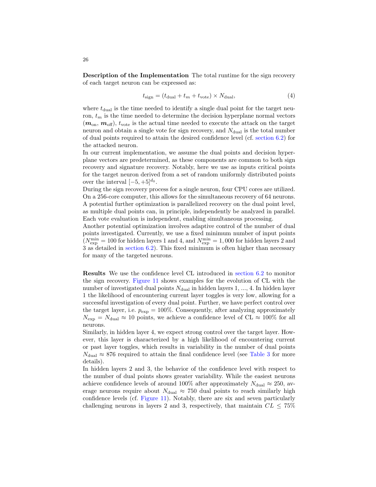

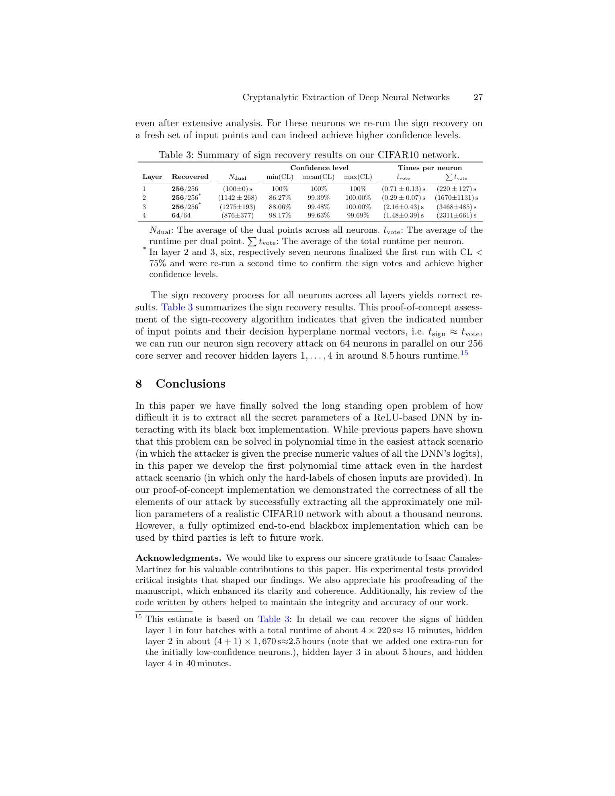

所有层 sign recovery 都成功：

$$
256/256,\quad
256/256,\quad
256/256,\quad
64/64.
$$

其中第 2、3 层有少数低置信度神经元需要 fresh input points 重跑。

Fig.11 展示置信度随 dual points 数量增长：

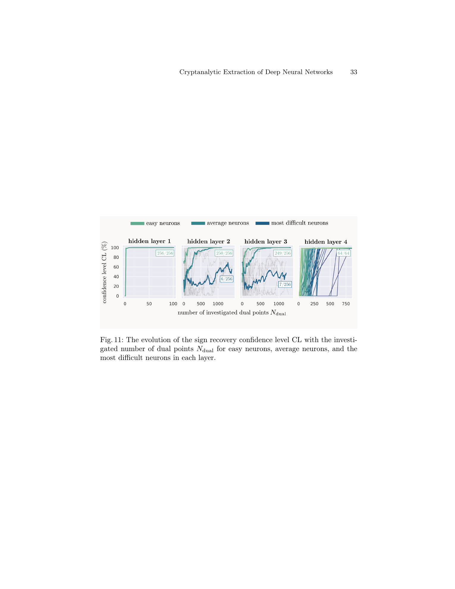

作者估计在 256-core 机器上，sign recovery 可约：

$$
8.5\text{ hours}
$$

完成。

### 4. 总体实验边界

论文的结论部分强调：所有组成模块已被 proof-of-concept 验证，可提取约百万参数 CIFAR10 网络；但 fully optimized end-to-end blackbox implementation 留给未来工作。

这句话非常重要。它说明本文的贡献是算法与实验验证层面的突破，但不是一个立即可运行、全自动、第三方可复现实用攻击工具。

## 与前三篇的关系

### 1. 与 ASIACRYPT 2024 的关系

ASIACRYPT 2024 的核心对象是 decision boundary point，但由于不知道 activation patterns，它需要组合搜索。本文引入 dual point，让攻击者能从 decision boundary 的形状变化中定位内部 ReLU critical hyperplane，从而绕过大规模 activation pattern 穷举。

可概括为：

$$
\text{decision boundary point}
\quad
\text{only says output boundary}
$$

$$
\text{dual point}
\quad
\text{says output boundary and internal ReLU boundary}
$$

因此 dual point 比普通 decision boundary point 信息密度更高。

### 2. 与 EUROCRYPT 2024 的关系

EUROCRYPT 2024 的 sign recovery 用 logits 的数值变化做信号；本文用到下一次 future toggle 的距离做 proxy。二者共享同一核心直觉：

$$
\text{target neuron on-side}
\Longrightarrow
\text{future computation changes faster}.
$$

不同在于：

| 论文 | 可测量量 |
| --- | --- |
| EUROCRYPT 2024 | raw logits 的左右差分 |
| 本文 | decision boundary 上到 future toggle 的距离 |

这就是本文最漂亮的迁移：把不可见的 output slope 换成可见的 boundary geometry。

### 3. 与后续反驳论文的关系

本目录中已有后续工作 `Is the Hard-Label Cryptanalytic Model Extraction Really Polynomial`。阅读本文时应保留一个审慎视角：本文声称 polynomial-time hard-label extraction，但其 proof-of-concept 里存在一些实现层面的理想化，例如 prior layers perfectly extracted、dual point/normal vectors 预先获得或共用、clustering 未完整计入优化实现等。后续反驳论文正是围绕这些隐藏条件、persistent neurons、cross-layer extraction 等问题展开。

因此，这篇应被读作“hard-label polynomial-time claim 的提出者”，而下一篇应被读作“对该 claim 的压力测试”。

## Critical Reading

### Strengths

第一，dual point 是一个很强的几何抽象。它把 hard-label 可见的 transition boundary 与 ReLU 内部 critical hyperplane 连接起来，使 hard-label oracle 不再只是一个最终分类器，而变成可探测内部折痕的几何仪器。

第二，signature recovery 与 sign recovery 的替换都很有针对性。signature recovery 用 dual spaces 和 rank/consistency 聚类替换 finite difference；sign recovery 用 distance-to-toggle 替换 output slope。这不是简单套用前作，而是把前作每个 raw-output 依赖点都找到了 hard-label 几何替代物。

第三，实验规模比 ASIACRYPT 2024 大得多。832 个隐藏神经元、约 0.9M 参数的 CIFAR10 网络，是这条 hard-label 线的重要跃迁。

### Limitations

第一，实验实现还不是完整端到端黑盒攻击。论文自己指出 fully optimized end-to-end blackbox implementation 留待未来工作；signature recovery 中的 pairwise clustering 也未在 proof-of-concept 中完整计入运行时间。

第二，攻击仍依赖强条件：known architecture、full-domain real-valued inputs、high precision floating point、fully connected ReLU。现实 API 的输入约束、rate limits、随机化、防御性平滑、量化或非 ReLU 结构都会改变难度。

第三，dual point 的可发现性对网络几何有隐含要求。作者也承认，如果某个 neuron 不参与 decision boundary 的形状，它就可能不可恢复。这与后续 persistent neurons 批评关系密切。

第四，sign recovery 是统计启发式。论文提供白盒验证和显著性控制，但核心假设仍是 on-side future neuron speed 通常更快。对 adversarially generated 或高度退化网络，这个假设可能失效。

### 容易误读的点

不能把本文理解为“任意 hard-label API 都能被高效偷走”。更准确的边界是：

$$
\text{known fully connected ReLU architecture}
+
\text{full-domain high-precision queries}
+
\text{decision boundary geometry accessible}
\Longrightarrow
\text{polynomial-time extraction claim}.
$$

也不能忽略 proof-of-concept 与 production attack 的距离。本文证明了关键几何机制，并在 CIFAR10 网络上验证模块可行；但完整工程化仍未完成。

## 用户可能“不知道自己不知道”的背景

### 1. hard-label 不是没有几何，只是没有数值

hard-label 不告诉攻击者 logits 的高度，但告诉攻击者不同类别区域的边界在哪里。边界形状本身是一种连续几何信息。本文的核心就是把这个几何信息当作 side-channel 来用。

### 2. dual point 是比 decision boundary point 更强的对象

普通 decision boundary point 只说明两个 class logits 相等；dual point 还说明某个 ReLU 神经元正好翻转。因此 dual point 同时连接输出层语义边界和内部激活边界。

### 3. 多项式时间 claim 与实现成熟度是两回事

复杂度意义上的 polynomial time 表示算法步骤随神经元数多项式增长。但 proof-of-concept 仍可包含巨大常数、未优化模块或依赖预处理。判断这类论文时，要区分“理论复杂度主张”和“现实可复现工具”。

### 4. sign recovery 的本质是把 slope 换成 distance

raw-output 下能直接测 slope；hard-label 下不能。本文的技巧是：速度越快，到下一次边界折弯的距离通常越短。于是距离成为 slope 的替代观测量。

### 5. 后续反驳不等于本文没有价值

即使后续论文指出本文 polynomial claim 有隐藏假设，dual point 和 decision-boundary geometry 的思想仍然重要。它给出了 hard-label 下从边界形状反推内部 ReLU 结构的一条新路径。

## Takeaways

1. 本文提出 dual point，把 hard-label 可见的 decision boundary 与内部 ReLU critical hyperplane 连接起来。
2. signature recovery 通过 dual space intersection、rank test、consistent clustering 和 unification 完成。
3. sign recovery 通过 distance-to-toggle 统计投票完成，用边界距离替代不可见的 output slope。
4. 实验在约 0.9M 参数、832 hidden neurons 的 CIFAR10 ReLU-DNN 上验证了核心模块。
5. 本文是 hard-label polynomial-time extraction claim 的关键论文，但应与后续 `Is the Hard-Label... Really Polynomial?` 对照阅读。

## 可沉淀到 `03_Knowledge` 的原子概念

- [[Hard-Label Oracle]]
- [[Decision Boundary]]
- [[Transition Point]]
- [[Dual Point]]
- [[Critical Hyperplane]]
- [[Dual Space]]
- [[Signature Recovery]]
- [[Sign Recovery]]
- [[Distance to Toggle]]
- [[Neuron Wiggle]]
- [[Piecewise Linear Function]]
- [[ReLU Network]]
- [[Cryptanalytic Extraction]]

## Sources

- arXiv：https://arxiv.org/abs/2410.05750
- DOI：https://doi.org/10.48550/arXiv.2410.05750
- 本地 PDF：`./Polynomial Time Cryptanalytic Extraction of Deep Neural Networks in the Hard-Label Setting.pdf`
- 本地提取文本：`./Polynomial Time Cryptanalytic Extraction of Deep Neural Networks in the Hard-Label Setting.txt`

## 标签

#status/进行中 #type/笔记 #type/论文 #topic/hard-label #topic/polynomial-time #topic/dual-point #topic/decision-boundary #topic/cryptanalytic-extraction #topic/ReLU #topic/model-extraction
