# Polynomial Time Cryptanalytic Extraction of Neural Network Models

原论文链接：[arXiv:2310.08708](https://arxiv.org/abs/2310.08708)

本地 PDF：[Polynomial Time Cryptanalytic Extraction of Neural Network Models.pdf](./Polynomial%20Time%20Cryptanalytic%20Extraction%20of%20Neural%20Network%20Models.pdf)

本地提取文本：[Polynomial Time Cryptanalytic Extraction of Neural Network Models.txt](./Polynomial%20Time%20Cryptanalytic%20Extraction%20of%20Neural%20Network%20Models.txt)

上位地图：[[MOC - 计算机]] · [[Research on Cryptographic Neurons]] · [[Neural Cryptanalysis]]

相关主题：[[Cryptanalytic Extraction]]、[[Model Extraction]]、[[ReLU Network]]、[[Sign Recovery]]、[[Neuron Wiggle]]、[[Space of Control]]、[[Deep Neural Cryptography]]、[[Hard-Label Cryptanalytic Model Extraction]]

## Abstract

这篇 EUROCRYPT 2024 论文的核心贡献很集中：它接续 Carlini、Jagielski、Mironov 在 CRYPTO 2020 提出的 `Cryptanalytic Extraction of Neural Network Models`，专门解决其中最硬的一块瓶颈，即每个神经元权重行的正负号恢复。CRYPTO 2020 的攻击已经能通过 critical points 和 differential queries 恢复神经元的 signature，也就是权重比例信息；但如果某层有 `d_i` 个神经元，仍可能需要在 `2^{d_i}` 种符号组合中搜索。本文的目标就是把这一指数搜索替换成多项式时间算法。

一句话概括：

> 本文不是推翻 CRYPTO 2020，而是把 CRYPTO 2020 的“几何上能看到参数”推进为“计算上能高效恢复参数”。

更具体地说，CRYPTO 2020 已经指出 ReLU-DNN 的 piecewise-linear 几何边界会泄露参数。本文则指出，真正让深层网络提取不实用的，不是找不到几何边界，而是签名恢复之后还不知道每个神经元应该选 `+` 还是 `-`。本文引入三种 sign-recovery 技术：

| 方法 | 主要适用层 | 核心思想 | 复杂度意义 |
| --- | --- | --- | --- |
| SOE Sign-Recovery | 前两层或自由度足够大的层 | 用一个线性方程组同时解出整层神经元的符号 | 查询最优，时间多项式 |
| Neuron Wiggle | 中间层 | 在隐藏层构造让目标神经元变化最大的微小扰动，再比较 critical point 两侧输出 | 查询和时间均为多项式，是本文主方法 |
| Last Hidden Layer Sign-Recovery | 最后一层隐藏层 | 利用输出层系数不再随机变化的事实，通过二阶差分恢复符号 | 只适用于最后隐藏层 |

论文最有代表性的实验是 CIFAR10 上的全连接 ReLU 网络：

$$
3072 - 256^{(8)} - 10.
$$

这个网络有 3072 维输入、8 个隐藏层、每层 256 个神经元、10 维输出，总参数量约为：

$$
1,249,802.
$$

在这个设置下，CRYPTO 2020 风格的符号穷举会面对宽度 256 的指数空间：

$$
2^{256}.
$$

本文用 SOE、Neuron Wiggle 和 Last Hidden Layer 组合，把恢复时间降到一台 256-core 机器约 30 分钟量级。这就是题名中 `Polynomial Time` 的真实含义：它不是说攻击假设更弱，而是说在同样强 oracle 模型下，原来卡在指数时间的步骤被替换成了多项式算法。

## Knowledge

### 1. 这篇论文和 CRYPTO 2020 的精确关系

CRYPTO 2020 可以理解为“找到 ReLU 折痕并读取折痕法向量”的攻击。它给出了一个几何事实：在 ReLU 神经元预激活等于零的地方，网络的一阶导数会发生突变，这个突变携带了权重信息。

本文承接的模型是：

$$
f = f_{r+1}\circ\sigma\circ f_r\circ\cdots\circ\sigma\circ f_1,
$$

其中每一层全连接层为：

$$
f_i(x)=A^{(i)}x+b^{(i)},
$$

ReLU 为：

$$
\sigma(x)=\max(x,0).
$$

CRYPTO 2020 的第一步可以恢复某个神经元权重行的比例信息。若第 `i` 层第 `j` 个神经元的权重行为：

$$
A_j^{(i)}=(a_1,a_2,\ldots,a_\ell),
$$

论文中的 signature 是：

$$
\operatorname{sig}(A_j^{(i)})
=
\left(
\frac{a_1}{a_1},
\frac{a_2}{a_1},
\ldots,
\frac{a_\ell}{a_1}
\right).
$$

这个 signature 对整体取负不敏感：

$$
\operatorname{sig}(A_j^{(i)})
=
\operatorname{sig}(-A_j^{(i)}).
$$

但 ReLU 对正负号极其敏感，因为：

$$
\operatorname{ReLU}(-z)\ne -\operatorname{ReLU}(z).
$$

所以攻击者即使知道了权重行的比例，仍必须决定它到底是：

$$
A_j^{(i)}
$$

还是：

$$
-A_j^{(i)}.
$$

这就是 sign recovery。读者可以把它类比成复原一张地形图：CRYPTO 2020 已经画出了山脊线的方向，但每条山脊还可能被翻到背面。本文要解决的是，怎样不用枚举所有翻面组合，就判断每条山脊的正反面。

### 2. Polynomial queries 不等于 polynomial time

这篇论文尤其值得注意的一点是，它区分了两个经常被混在一起的概念：

$$
\text{query complexity}
$$

和：

$$
\text{computational complexity}.
$$

CRYPTO 2020 的攻击在某些情形下已经只需要多项式数量的 oracle queries，但内部计算可能仍然需要指数搜索。本文摘要中的“polynomial-time”正是针对后者。

这类似密码分析中的常见区分：一个攻击也许只需要少量 chosen plaintexts，但如果离线阶段要穷举 `2^{128}` 个密钥，它仍然不是实用攻击。对于本文，oracle queries 像“实验次数”，time complexity 像“拿到实验数据之后的推理成本”。本文的贡献是把这两者都压到多项式范围内。

### 3. Critical point：不是优化驻点，而是 ReLU 开关边界

论文中使用的 critical point 和优化中的 critical point 不是同一个东西。优化里 critical point 通常指损失函数梯度为零；本文中 critical point 指某个神经元的 pre-activation 恰好为零。

若神经元 `eta` 在输入 `x` 处的 ReLU 前值记为：

$$
V(\eta;x),
$$

则：

$$
V(\eta;x)>0
$$

表示 active；

$$
V(\eta;x)=0
$$

表示 critical；

$$
V(\eta;x)<0
$$

表示 inactive。

直观上，critical point 是 ReLU 折纸上的折痕点。折痕一侧神经元打开，另一侧神经元关闭。攻击者通过在折痕两侧轻轻探测输出差异，就能听出折痕背后的权重方向。

### 4. Linear neighbourhood：局部区域内网络退化为 affine map

若输入 `x` 和附近输入 `u` 让所有 ReLU 神经元保持同样状态，则 `u` 落在 `x` 的 linear neighbourhood 中。在这个区域内，网络不再是复杂非线性函数，而是一个 affine map。

设 `F_i` 表示前 `i` 层加 ReLU 后的映射。固定 ReLU 开关状态后，前 `i` 层可以折叠为：

$$
F_i(x')=\Gamma x' + \beta.
$$

因此，对足够小、且不跨越前面层边界的输入扰动 `Delta`，有：

$$
F_i(x+\Delta)-F_i(x)=\Gamma\Delta.
$$

这个事实是全文的工程底座。攻击者不是在全局理解神经网络，而是在每个小区域内把神经网络暂时当成线性系统来测量。

### 5. Space of control：攻击者在隐藏层里还能推动哪些方向

本文引入的 `space of control` 是理解 Neuron Wiggle 的关键。恢复第 `i` 层符号时，攻击者已经知道前 `i-1` 层，因此可以把输入扰动通过前面层推到第 `i` 层入口。问题是，经过许多 ReLU 后，并不是所有隐藏层方向都还能由输入扰动产生。

论文定义第 `i` 层在输入 `x` 附近的控制空间为：

$$
V_x^{(i-1)}=\operatorname{range}\left(F_x^{(i-1)}\right).
$$

其维度，即自由度数量，为：

$$
d_x^{(i-1)}
=
\operatorname{rank}\left(F_x^{(i-1)}\right).
$$

可以把 `space of control` 想成一个操纵杆系统。输入空间中攻击者原本能往任意方向推动，但每经过一个 inactive ReLU，就像某个机械方向被锁死。线性层又会旋转和缩放剩余方向，所以自由度不会简单地每层减半，可能会在若干层后稳定下来。

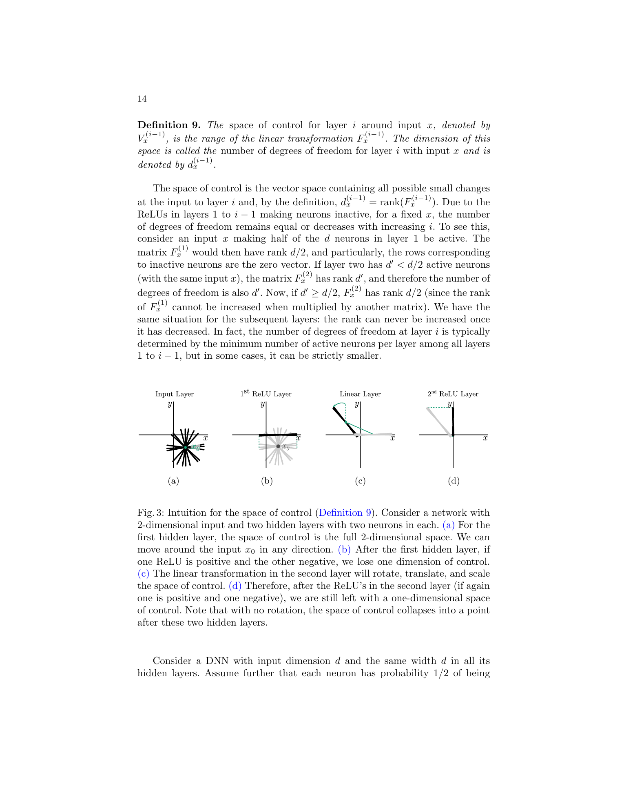

### 6. 本文攻击模型：强 oracle，但不是 side channel

本文的攻击者拥有黑盒 oracle：

$$
O(x)=f_\theta(x).
$$

其目标是输出一组参数：

$$
\hat\theta,
$$

使得：

$$
f_{\hat\theta}(x)
\approx
f_\theta(x).
$$

关键假设包括：

| 假设 | 含义 | 影响 |
| --- | --- | --- |
| full-domain inputs | 攻击者可查询任意实数输入 | 很强，类似 chosen-input oracle |
| complete outputs | oracle 返回完整数值输出，不只是 label | 是 differential/finite difference 能工作的基础 |
| fully connected ReLU | 网络为全连接 ReLU-DNN | piecewise-linear 几何是核心 |
| high precision | 理论部分假设无限精度，实验考虑浮点实现 | 让 critical point 和差分测量可行 |
| signature availability | 假设每个神经元的 signature 已知且唯一 | 本文聚焦 sign recovery，而不是重做 signature extraction |

因此，本文不是说任意现实 API 都会被 30 分钟提取。更准确的边界是：

$$
\text{known architecture}
+
\text{precise raw-output oracle}
+
\text{available signatures}
\Longrightarrow
\text{sign recovery can be polynomial time}.
$$

## Overview

### 1. 框架图：把已恢复部分、目标层、未知后缀分开

恢复第 `i` 层时，攻击者把网络分成三段：

$$
f = G_{i+1}\circ\sigma\circ f_i\circ F_{i-1}.
$$

其中：

| 部分 | 状态 | 作用 |
| --- | --- | --- |
| `F_{i-1}` | 已恢复 | 攻击者能精确计算前缀映射 |
| `f_i` | signature 已知，sign 未知 | 本文要恢复的目标层 |
| `G_{i+1}` | 未知 | 后续层作为黑盒后缀影响输出 |

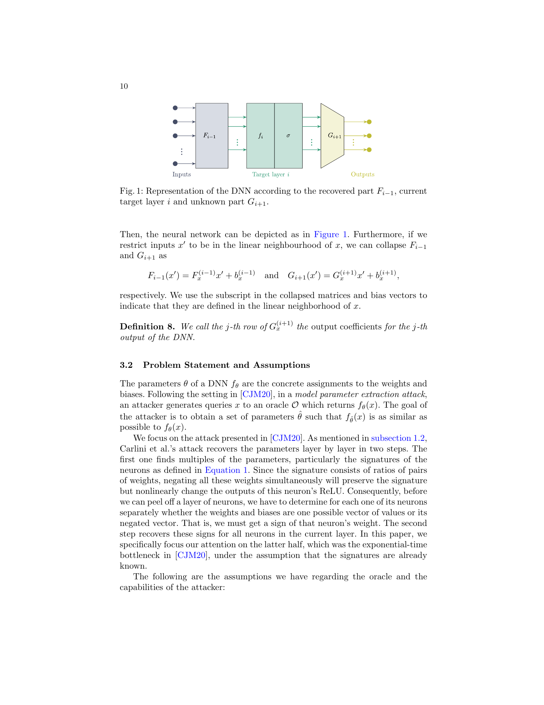

这个分解非常重要。本文的大多数方法并不要求知道后续层的全部参数，而是通过 oracle 输出和局部线性结构间接绕过未知后缀。

### 2. 输入空间被 ReLU 切成许多 linear neighbourhoods

ReLU-DNN 是 piecewise-linear function。输入空间会被大量 ReLU 边界切成许多局部线性区域。攻击者沿着输入空间中的线段探测输出，如果发现函数斜率发生突变，就说明线段穿过了某个 ReLU critical boundary。

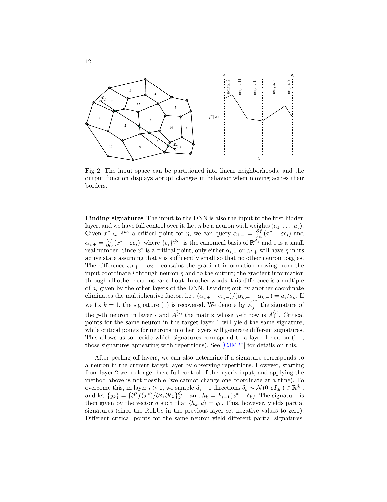

这和密码分析里的差分观察类似：攻击者不是直接读取内部状态，而是构造输入扰动，让内部状态的一个开关翻转，再从输出变化中反推内部结构。

### 3. 三种 sign recovery 方法的分工

本文的整体攻击是一个组合拳：

| 层位置 | 主要方法 | 为什么适用 |
| --- | --- | --- |
| 第 1、2 隐藏层 | SOE | 自由度通常足够，线性方程组可解 |
| 中间隐藏层 | Neuron Wiggle | 自由度可能不足以解整层方程，但仍能为目标神经元构造强信号 |
| 最后一层隐藏层 | Last Hidden Layer | 输出层线性系数在最后隐藏层后保持常量，可用二阶差分 |

这种分工本身就是本文的一个 insight：没有一种单一技术在所有层都最优。前层可用代数，后层可用输出层结构，中间层则需要概率化的几何扰动。

## Method

### 1. SOE Sign-Recovery：用一个方程组同时恢复整层符号

SOE 是 `System Of Equations`。当第 `i` 层附近的自由度足够大时，攻击者可以选取一组输入扰动 `Delta_k`，直接查询输出差：

$$
f(x+\Delta_k)-f(x).
$$

在局部线性区域内，这个差值可写成：

$$
f(x+\Delta_k)-f(x)
=
G_x^{(i+1)} I_x^{(i)} A^{(i)} F_x^{(i-1)}\Delta_k.
$$

令：

$$
y_k=A^{(i)}F_x^{(i-1)}\Delta_k,
$$

以及：

$$
c=G_x^{(i+1)}I_x^{(i)}.
$$

若 oracle 观测到的输出差为：

$$
z_k=f(x+\Delta_k)-f(x),
$$

则可得到线性方程：

$$
c\cdot y_k=z_k.
$$

这里的关键是，若某个神经元在 `x` 附近 inactive，那么 ReLU 会把它的贡献置零，因此对应系数满足：

$$
c_j=0.
$$

求解这个线性系统后，攻击者可以判断哪些神经元在该局部区域中被 ReLU 关闭，从而选择正确符号。

SOE 的查询数量为：

$$
d_i+1.
$$

时间复杂度来自解线性方程组，标准方法为：

$$
O(d_i^3).
$$

它的局限也很清楚：这些方程必须线性独立。如果控制空间维度太低，方程组就不够秩。论文指出 SOE 在前两层尤其好用，但在中间层会因为自由度下降而失败。

### 2. Neuron Wiggle：本文主方法，给目标神经元“定向轻推”

Neuron Wiggle 的直觉很形象：在第 `i` 层入口处，攻击者希望构造一个小扰动，让目标神经元 `j` 的 pre-activation 变化尽可能大，而其他神经元变化尽可能小。这样在 critical point 两侧比较输出时，目标神经元贡献就像信号，其他神经元贡献像噪声。

设第 `i` 层的一个 wiggle 为：

$$
\delta\in\mathbb R^{d_{i-1}}.
$$

若第 `k` 个神经元权重行的已恢复 signature 记为：

$$
\hat A_k^{(i)},
$$

则该 wiggle 对神经元 `k` 的值变化为：

$$
e_k=\left\langle \hat A_k^{(i)},\delta\right\rangle.
$$

对某个输出坐标，设后续未知网络在局部线性区中的输出系数为 `c_k`。所有 active 神经元的输出差可写成：

$$
\sum_{k\in I} c_k e_k.
$$

为了让目标神经元 `j` 的信号最大，论文选择让 `delta` 与 `\hat A_j^{(i)}` 平行，并投影到当前的 space of control：

$$
\delta
=
\operatorname{Proj}_{V^{(i-1)}}\left(\hat A_j^{(i)}\right),
$$

然后缩放到足够小，使扰动仍停留在需要的 linear neighbourhood 中。再通过前缀映射 `F_{i-1}` 求它在原始输入空间中的 preimage：

$$
F^{(i-1)}(\Delta)\approx\delta.
$$

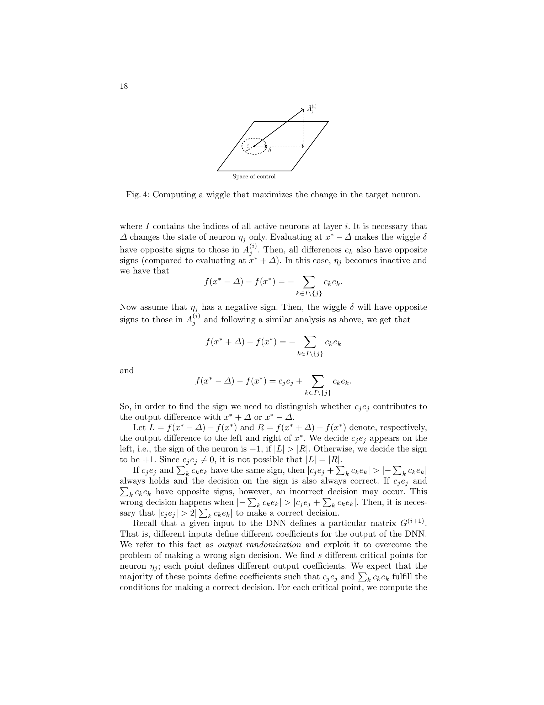

### 3. Neuron Wiggle 如何判别正负号

设 `x^\star` 是目标神经元 `eta_j` 的 critical point。攻击者构造扰动 `Delta`，并比较左右两侧输出差：

$$
L
=
f(x^\star-\Delta)-f(x^\star),
$$

$$
R
=
f(x^\star+\Delta)-f(x^\star).
$$

若目标神经元真实符号为正，则一侧会让目标神经元 active，另一侧会让它 inactive。论文中的理想形式是：

$$
f(x^\star+\Delta)-f(x^\star)
=
c_j e_j+\sum_{k\in I\setminus\{j\}}c_k e_k,
$$

$$
f(x^\star-\Delta)-f(x^\star)
=
-\sum_{k\in I\setminus\{j\}}c_k e_k.
$$

若目标神经元真实符号为负，则目标贡献出现在相反一侧：

$$
f(x^\star+\Delta)-f(x^\star)
=
-\sum_{k\in I\setminus\{j\}}c_k e_k,
$$

$$
f(x^\star-\Delta)-f(x^\star)
=
c_j e_j+\sum_{k\in I\setminus\{j\}}c_k e_k.
$$

所以判别规则是比较左右输出差的范数：

$$
|L|>|R|
\Longrightarrow
\operatorname{sign}(\eta_j)=-1,
$$

$$
|R|>|L|
\Longrightarrow
\operatorname{sign}(\eta_j)=+1.
$$

这个规则不是绝对不会错，因为其他 active 神经元带来的噪声项：

$$
\sum_{k\in I\setminus\{j\}}c_k e_k
$$

可能抵消目标信号：

$$
c_j e_j.
$$

因此作者引入 output randomization：同一个目标神经元选择多个 critical points。不同 critical point 对应后续未知网络的局部输出系数不同，噪声方向也不同。若多数 critical points 投票给同一个符号，就认为该符号可信。

设 `s_-` 和 `s_+` 分别为投票为负和正的 critical points 数量，则置信度可写为：

$$
\alpha_-=\frac{s_-}{s},
$$

$$
\alpha_+=\frac{s_+}{s}.
$$

若最大置信度低于阈值 `alpha_0`，作者不直接接受结果，而是把该神经元标为 borderline，并在更新高置信度符号后重新分析。这是实验中“fixable”列的含义。

Neuron Wiggle 的单个神经元查询复杂度为：

$$
3s.
$$

整层 `d_i` 个神经元的查询复杂度为：

$$
3sd_i.
$$

若：

$$
d=\max(d_0,d_i),
$$

整层时间复杂度为：

$$
O(sd_i d^3).
$$

### 4. Last Hidden Layer：用二阶差分恢复最后隐藏层

最后一层隐藏层有特殊结构。输出层 `f_{r+1}` 是 affine transformation，后面不再接 ReLU。因此从最后隐藏层到输出的系数是固定的，不会像中间层那样随着输入局部区域变化。

设最后隐藏层输出为 `y^{(r)}`，输出可写为：

$$
f(x)
=
c_1 y_1^{(r)}
+\cdots+
c_{d_r}y_{d_r}^{(r)}
+b^{(r+1)}.
$$

作者利用 ReLU 在折点处的二阶差分。对 critical point `x^\star` 和小扰动 `Delta`：

$$
f(x^\star+\Delta)
-2f(x^\star)
+f(x^\star-\Delta)
=
\pm\left\langle F_k^{(i)},\Delta\right\rangle c_k.
$$

若选择 `Delta` 与已恢复方向平行，就可以恢复输出系数 `c_k`。随后对随机输入构造线性方程组，求解最后隐藏层每个神经元的符号。

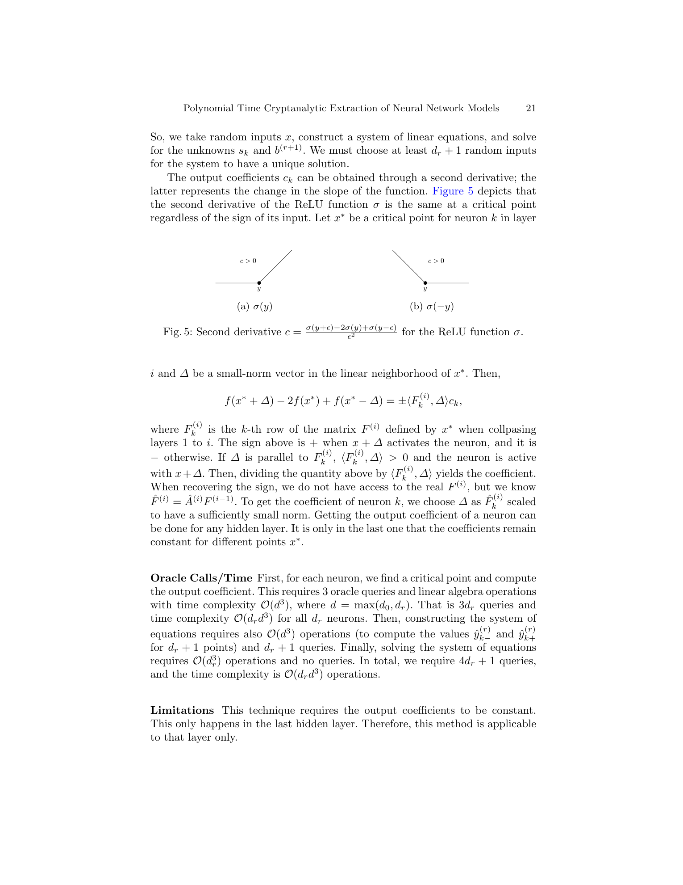

该方法的查询复杂度为：

$$
4d_r+1.
$$

时间复杂度为：

$$
O(d_r d^3).
$$

局限也直接：输出系数必须保持常量，因此它只适用于最后隐藏层。

### 5. FindCriticalPoints：实际攻击仍依赖可靠找折点

虽然本文的理论焦点是 sign recovery，但实验实现仍需要持续找到 critical points。附录中的 `FindCriticalPoints` 算法沿着输入线段检查函数是否线性，若发现非线性，再递归分割区间，定位只有一个 critical point 的小区间。

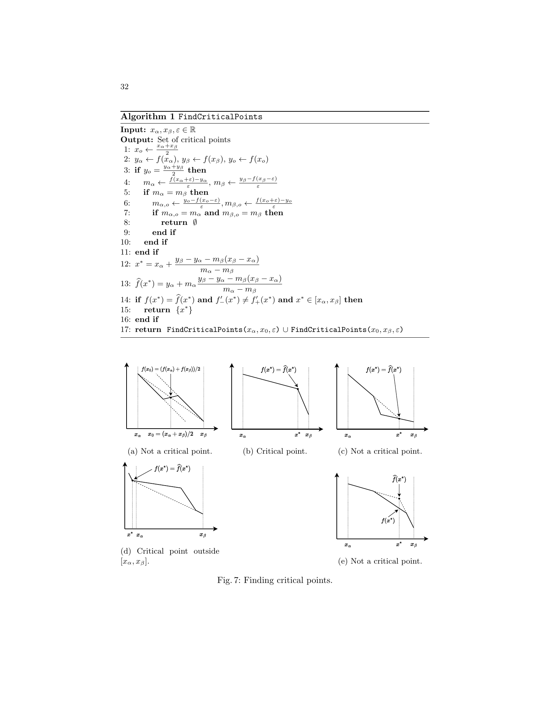

这解释了为什么实验时间里有大量成本花在 critical point discovery 上。CIFAR10 网络不是理想随机网络，存在 always-off 或 almost-always-off 神经元，导致某些 critical points 很难遇到。

## Experiments

### 1. CIFAR10 模型规模

作者使用一个全连接 ReLU 网络分类 CIFAR10。模型结构为：

$$
3072 - 256^{(8)} - 10.
$$

其中：

| 项目 | 数值 |
| --- | --- |
| 输入维度 | 3072 |
| 隐藏层数 | 8 |
| 每层隐藏神经元 | 256 |
| 总隐藏神经元 | 2048 |
| 输出维度 | 10 |
| 参数量 | 1,249,802 |
| CIFAR10 test accuracy | 0.5249 |

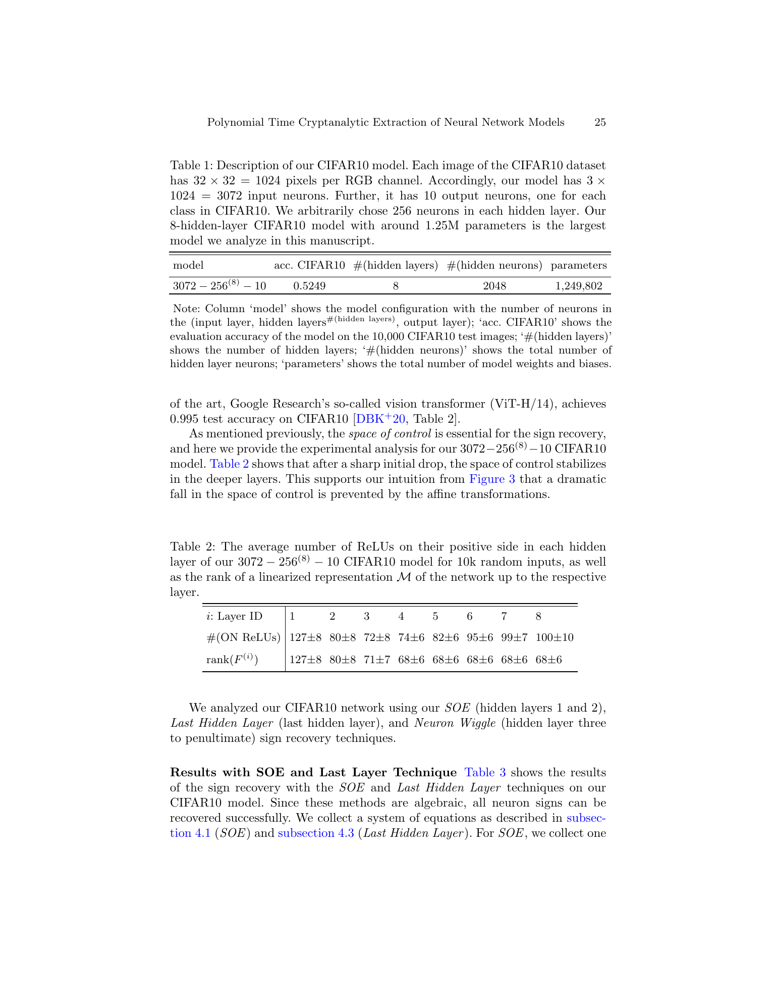

这不是现代高精度视觉模型，而是为了符合 fully connected ReLU-DNN 攻击模型的实验对象。作者也明确指出，更现代的 ViT 等架构可以取得远高得多的 CIFAR10 accuracy，但那不是本文攻击模型的目标。

### 2. Space of control 的实验观察

Table 2 报告了每层平均 ON ReLUs 和 `rank(F^{(i)})`。关键现象是：第一层后自由度从 3072 急剧下降到大约 127，第二层约 80，之后稳定在约 68，而不是继续指数式塌缩。

可以用下式概括：

$$
\operatorname{rank}(F^{(1)})\approx127,
$$

$$
\operatorname{rank}(F^{(2)})\approx80,
$$

$$
\operatorname{rank}(F^{(4)})\approx
\operatorname{rank}(F^{(8)})
\approx68.
$$

这支持了论文在方法部分的直觉：ReLU 会删除自由度，但线性层会旋转空间，使剩余自由度不一定每层继续减半。这个现象对 Neuron Wiggle 很重要，因为只要 space of control 没有塌缩到太小，目标神经元仍可被定向扰动。

### 3. SOE 和 Last Hidden Layer 的结果

Table 3 展示了代数型方法的结果：

| 方法 | 层 | 查询数 | 时间 | 正确性 |
| --- | --- | --- | --- | --- |
| SOE | 1, 2 | `256+1` | `16 ± 1 s` | 全部符号恢复 |
| Last Hidden Layer | 8 | `256+10` | `189 ± 40 s` | 全部符号恢复 |

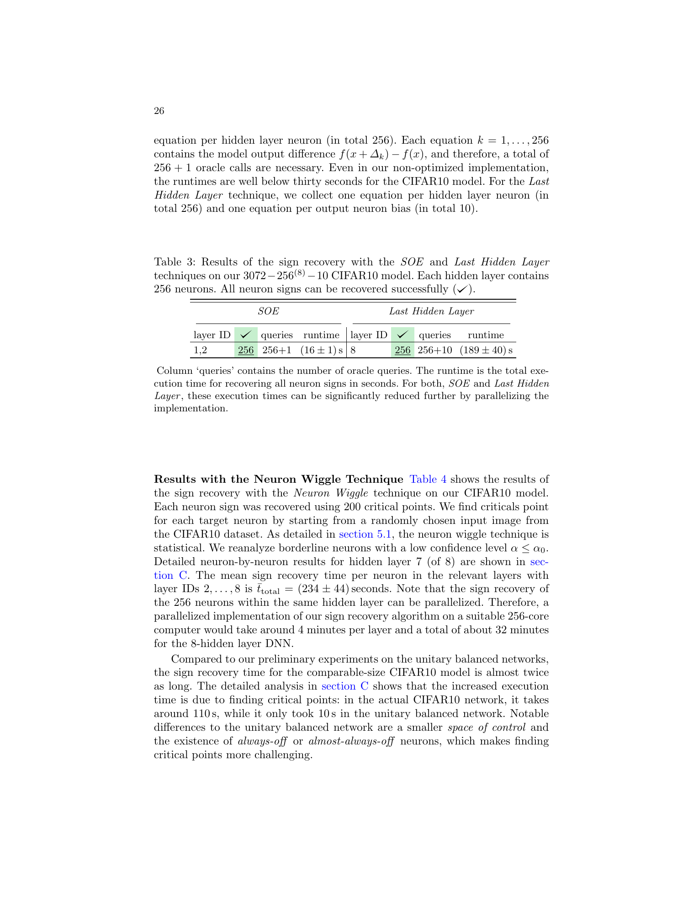

SOE 快是因为它一次解整层；Last Hidden Layer 稍慢，因为需要先通过二阶差分恢复输出系数，再构造符号方程组。

### 4. Neuron Wiggle 的结果

作者对每个神经元使用：

$$
s=200
$$

个 critical points。Table 4 报告了隐藏层 1 到 8 的 Neuron Wiggle 结果。虽然实际组合攻击中层 1、2 更适合 SOE，层 8 更适合 Last Hidden Layer，作者仍给出 Neuron Wiggle 全层结果以展示方法稳定性。

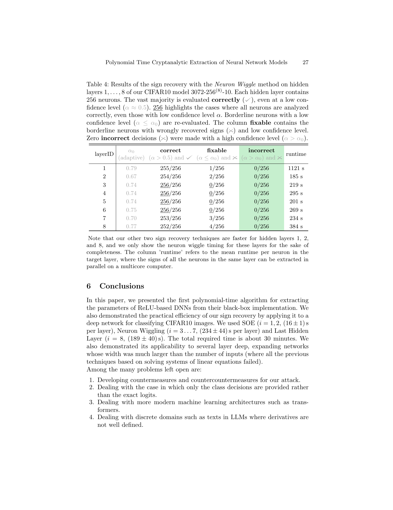

关键读法：

| 观察 | 含义 |
| --- | --- |
| `correct` | `alpha > 0.5` 后多数投票正确的数量 |
| `fixable` | 低置信度且初始符号错误，可通过重分析修复 |
| `incorrect` | 高置信度但错误的数量 |
| `runtime` | 单个神经元平均恢复时间，同层神经元可并行 |

最重要的实验事实是：

$$
\text{high-confidence incorrect decisions}=0.
$$

也就是说，出错的神经元都表现出低置信度，从而可以被识别并重分析。这让 Neuron Wiggle 从一个“概率启发式”更接近实用攻击组件：它不仅给答案，还知道哪些答案不可靠。

### 5. Runtime scaling 和置信度阈值

作者对 Neuron Wiggle 使用自适应阈值 `alpha_0`，重分析最不自信的 10% sign recoveries。Figure 6 同时展示了低置信度样本分布和 runtime scaling。

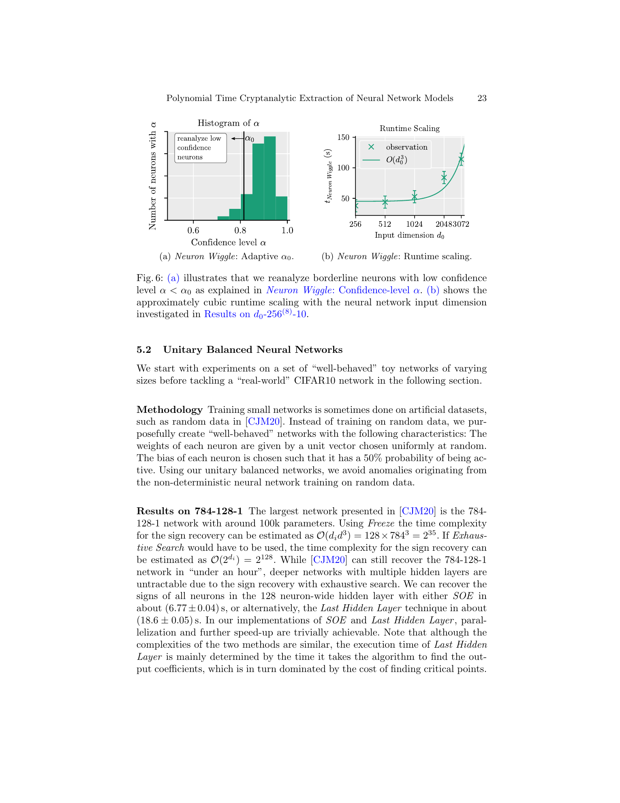

runtime scaling 大致符合：

$$
O(d_0^3).
$$

这和方法部分的线性代数成本一致，因为计算 wiggle、投影和 preimage 需要矩阵运算。

### 6. 总攻击时间

论文结论部分给出的组合攻击时间为：

| 层 | 方法 | 时间 |
| --- | --- | --- |
| 1, 2 | SOE | `16 ± 1 s` per layer |
| 3 到 7 | Neuron Wiggle | `234 ± 44 s` per layer |
| 8 | Last Hidden Layer | `189 ± 40 s` |

总体约为：

$$
30\text{ minutes}.
$$

正文对 256-core 并行实现的估计是，单层 256 个神经元可并行恢复，因此 8 层总时间约：

$$
32\text{ minutes}.
$$

这两个数值表述的是同一个量级：在 256-core 条件下，百万参数级 fully connected ReLU-DNN 的符号恢复不再是指数不可行问题。

### 7. 详细神经元级结果

附录 C 给出了第 7 层逐神经元结果，包括 `s_-`、`s_+`、置信度 `alpha`、critical point 搜索时间和总时间。这个表不是主结论，但它很有价值，因为它显示低置信度样本确实集中在少数神经元上。

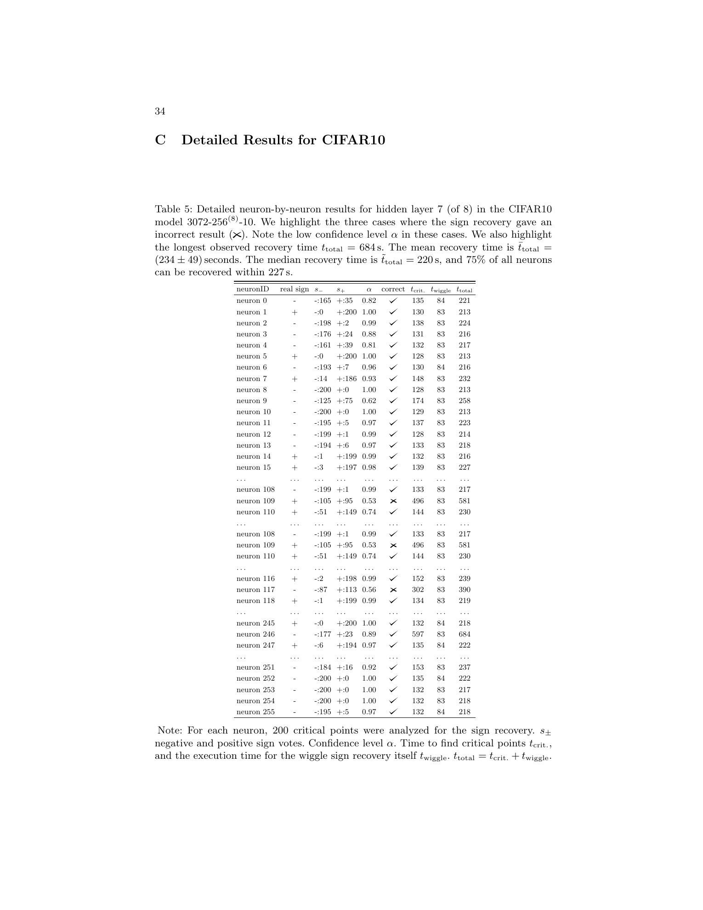

## 与前后文献的关系

### 1. 对 CRYPTO 2020 的补全

这篇论文可以视为 CRYPTO 2020 的补全实现和复杂度优化，但需要加一个精确限定：它补全的是 `sign recovery` 这个瓶颈，而不是重新提出 signature extraction。

CRYPTO 2020 的思路是：

$$
\text{critical points}
\Longrightarrow
\text{signatures}
\Longrightarrow
\text{parameters up to signs}
\Longrightarrow
\text{peel off layers}.
$$

本文把其中最后一个困难步骤推进为：

$$
\text{known signatures}
\Longrightarrow
\text{polynomial-time sign recovery}
\Longrightarrow
\text{layer peeling becomes efficient}.
$$

所以用户此前的判断“Assessing 是对 Deep Neural 的补充实现和优化”可以类比到这里：本文确实是对 CRYPTO 2020 extraction 攻击链条中最重要瓶颈的补充实现与优化。

### 2. 对 hard-label 后续工作的铺垫

本文仍依赖 complete outputs。也就是说，攻击者看到的是 logits 或完整数值输出，而不是最终类别。

若 oracle 只返回：

$$
\arg\max_j f_j(x),
$$

则攻击者进入 hard-label setting。此时 critical point 附近的一阶差分和二阶差分都不再直接可见。后续 hard-label cryptanalytic extraction 论文正是在这个方向继续推进：如何只从 decision boundary 的几何形状恢复内部 ReLU 边界。

### 3. 和 Deep Neural Cryptography / Assessing Geometric Security 的关系

本文与 `Deep Neural Cryptography` 和 `Assessing Geometric Security of AES Neural Realizations` 共享一个深层主题：

$$
\text{piecewise-linear neural computation}
\Longrightarrow
\text{secret-dependent geometry}
\Longrightarrow
\text{extractable structure}.
$$

不同点在于：

| 论文线 | 隐藏对象 | 泄露机制 |
| --- | --- | --- |
| CRYPTO 2020 / EUROCRYPT 2024 extraction | DNN weights and biases | ReLU critical boundaries 泄露模型参数 |
| Deep Neural Cryptography | neural cryptographic construction 的学习到的机制 | 神经网络是否能学习加密通信 |
| Assessing Geometric Security | AES neural realization 中的 key bits | key-dependent activation geometry 泄露密钥 |

因此，本文更像基础攻击工具箱；`Assessing` 则把类似几何泄露思想迁移到神经化密码实现的 key recovery 上。

## Critical Reading

### Strengths

第一，本文把一个清晰的复杂度缺口补上了。CRYPTO 2020 已经证明 ReLU-DNN 的几何边界可以泄露参数，但深层网络里的符号搜索会爆炸。本文用三种方法覆盖不同层位，把 sign recovery 推到多项式时间。

第二，Neuron Wiggle 的直觉很强。它不是试图一次性解出整层所有符号，而是把目标神经元的扰动调到最大，把其他神经元贡献当成噪声，再通过多个 critical points 做投票。这种“信号放大加随机化降噪”的思路很像差分密码分析中的多明文统计。

第三，实验规模比 toy example 更有说服力。CIFAR10 网络虽然不是现代视觉 SOTA，但 3072 输入、8 层、约 125 万参数已经足以证明算法不是只在小维度黑板模型上成立。

### Limitations

第一，攻击模型仍然很强。它需要 full-domain real-valued queries、complete outputs、known architecture，以及已经获得的 signature。若真实系统只返回 label、截断概率、加噪 logits 或限制查询，本文攻击不能直接照搬。

第二，本文主要面向 fully connected ReLU-DNN。卷积层可以形式上写成特殊全连接层，但实际结构、稀疏性、参数共享和维度规模都会改变攻击工程难度。Transformer、LLM 文本离散输入等更是作者在结论中明确列出的开放问题。

第三，浮点精度和几乎不激活的神经元会影响实际稳定性。论文也承认 always-off 或 almost-always-off neurons 会让 critical point 难以发现。后续工作如果要把这条攻击线推向现实 API，需要认真处理数值精度、输入域约束和输出接口限制。

### 容易误读的点

不能把本文理解为“所有神经网络 API 都能被 30 分钟复制”。本文的结论是有边界的：

$$
\text{fully connected ReLU}
+
\text{known architecture}
+
\text{complete high-precision outputs}
+
\text{available signatures}
\Longrightarrow
\text{polynomial-time sign recovery}.
$$

也不能把本文理解为训练数据泄露。本文提取的是模型参数或功能等价模型，不是 membership inference，也不是 model inversion。参数提取可以进一步帮助其他攻击，但它本身解决的是 oracle function 的复制问题。

## 用户可能“不知道自己不知道”的背景

### 1. Signature 和 sign 是两层信息

很多读者会以为恢复权重比例就等于恢复权重。对 ReLU 来说不是。因为整体取负不会改变权重比例，却会改变 ReLU 打开方向。signature 解决的是“这条边界朝哪个方向倾斜”，sign 解决的是“边界哪一侧是打开”。

### 2. 中间层最难，不是因为看不到它，而是因为控制不了它

中间层困难的根源不是完全不可观测，而是 space of control 变窄。攻击者在原始输入空间能随意移动，但通过前面层和 ReLU 后，到目标层入口处可实现的方向只剩一个子空间。Neuron Wiggle 的高明之处，就是在这个受限子空间里选最有利的方向。

### 3. 随机化不是训练随机性，而是输出系数随机性

本文说的 output randomization 不是重新训练网络，也不是加随机噪声，而是不同 critical points 落在后续未知网络的不同 linear neighbourhoods 中，使输出系数 `c_k` 变化。攻击者利用这种变化让噪声多次洗牌，从而用多数投票稳定恢复符号。

### 4. Functional equivalence 比 checkpoint equality 更自然

神经网络有神经元重排、正比例缩放等对称性。攻击者不一定要恢复原始 checkpoint 的逐位相同参数，只要恢复一个行为等价的模型，就已经实现 model extraction 的安全后果。

### 5. “多项式时间”不是“无条件现实可用”

多项式时间是复杂度理论上的重大改进，但现实可用性还取决于常数、并行资源、数值精度、query budget 和 API 输出。本文展示的 30 分钟结果是在特定 CIFAR10 fully connected ReLU 设置和高并行资源下成立的。

## Takeaways

1. 本文是 CRYPTO 2020 cryptanalytic extraction 攻击线的关键推进，解决了 sign recovery 的指数时间瓶颈。
2. SOE、Neuron Wiggle、Last Hidden Layer 分别覆盖前层、中间层和最后隐藏层，组合后可在 CIFAR10 规模网络上完成多项式时间符号恢复。
3. Neuron Wiggle 的核心是把目标神经元变化最大化，并用多个 critical points 的输出随机化来抵消未知后缀网络的噪声。
4. 实验中最关键的安全信号是高置信度错误为零，低置信度错误可被识别并重分析。
5. 本文仍依赖强 oracle 假设，后续 hard-label、现代架构、离散输入和防御机制是自然延展方向。

## 可沉淀到 `03_Knowledge` 的原子概念

- [[Cryptanalytic Extraction]]
- [[Model Extraction]]
- [[ReLU Network]]
- [[Piecewise Linear Function]]
- [[Critical Point]]
- [[Linear Neighbourhood]]
- [[Signature Recovery]]
- [[Sign Recovery]]
- [[Space of Control]]
- [[Neuron Wiggle]]
- [[Output Randomization]]
- [[Hard-Label Oracle]]
- [[Raw-Output Oracle]]
- [[Functional Equivalence]]

## Sources

- arXiv：https://arxiv.org/abs/2310.08708
- DOI：https://doi.org/10.48550/arXiv.2310.08708
- 本地 PDF：`./Polynomial Time Cryptanalytic Extraction of Neural Network Models.pdf`
- 本地提取文本：`./Polynomial Time Cryptanalytic Extraction of Neural Network Models.txt`

## 标签

#status/进行中 #type/笔记 #type/论文 #topic/cryptanalytic-extraction #topic/ReLU #topic/model-extraction #topic/sign-recovery #topic/neuron-wiggle #topic/neural-network-security
