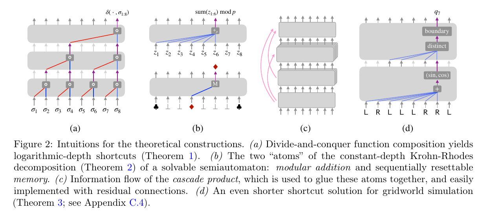
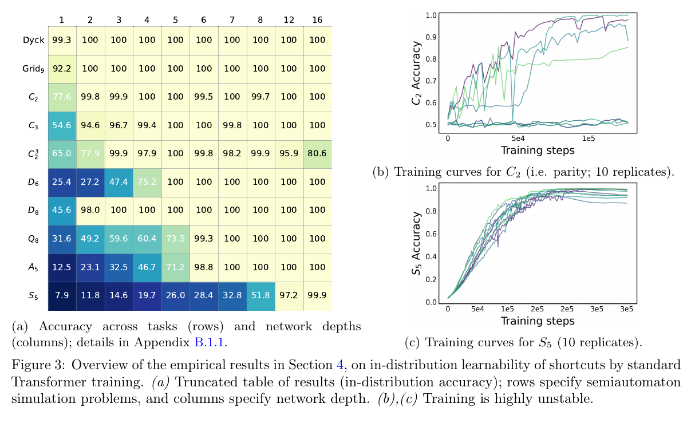
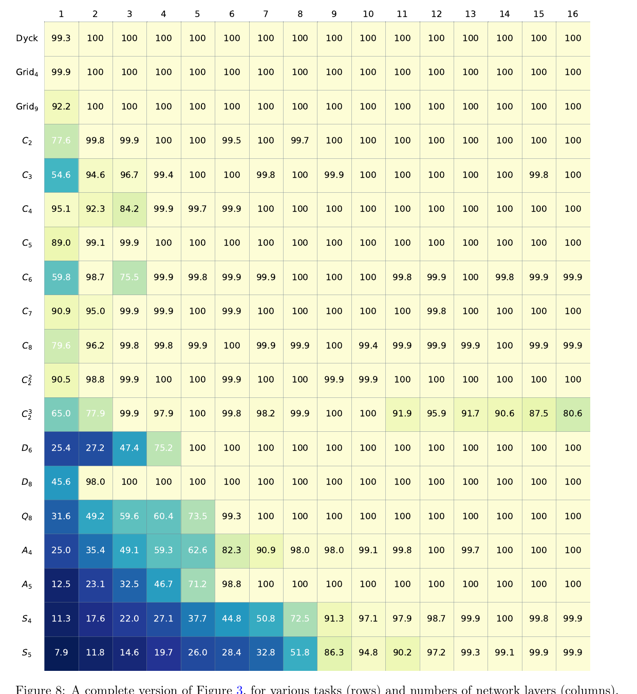
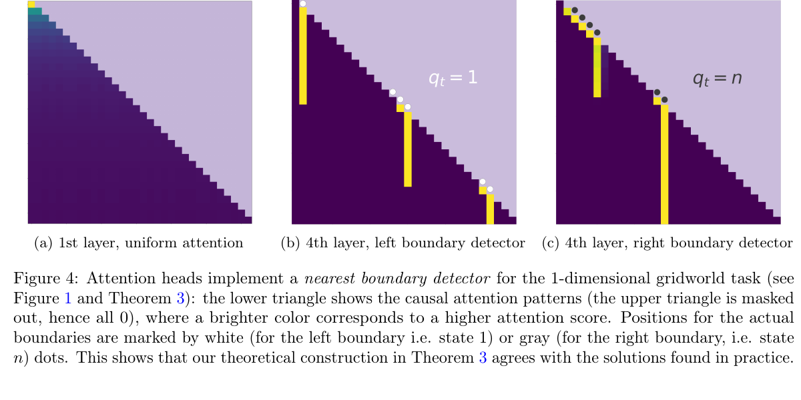
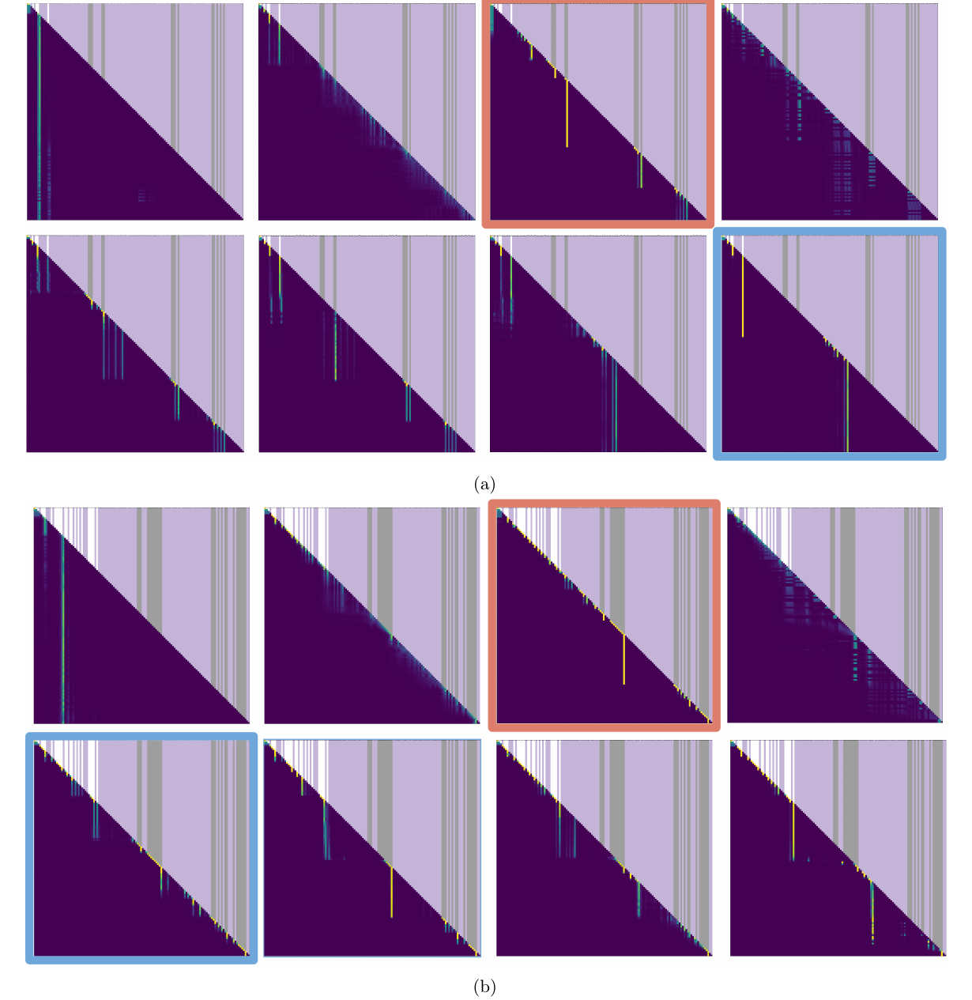
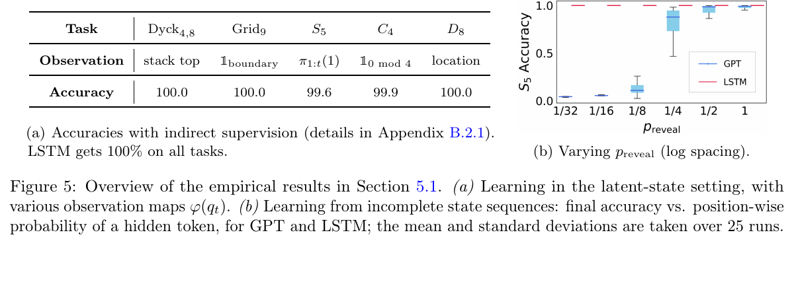
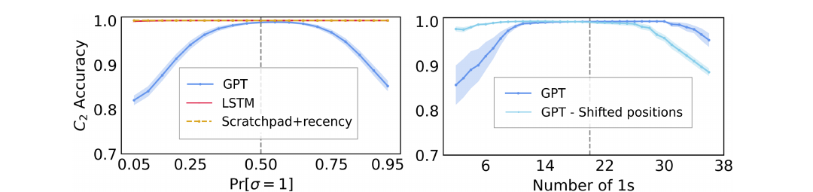

# Transformers Learn Shortcuts to Automata

原论文链接：[arXiv:2210.10749](https://arxiv.org/abs/2210.10749)

本地 PDF：[Transformers Learn Shortcuts to Automata.pdf](./Transformers%20Learn%20Shortcuts%20to%20Automata.pdf)

上位地图：[[MOC - 计算机]] · [[Transformer Mechanistic Understanding]] · [[Algorithmic Reasoning]]

相关主题：[[Finite-State Automata]]、[[Semiautomata]]、[[Shortcut Learning]]、[[Circuit Complexity]]、[[Krohn-Rhodes Theory]]、[[OOD Generalization]]、[[Length Generalization]]

### Abstract

这篇论文研究一个看似反直觉的问题：**Transformer 没有显式 recurrence，却能在很多算法推理任务上用远少于序列长度 \(T\) 的层数完成本来应该逐步迭代的计算。它到底学到了什么？**

作者把问题压到一个干净的对象上：有限状态自动机的底层动力学，也就是 **semiautomata**。一个 semiautomaton 可以写成：

$$
A=(Q,\Sigma,\delta),
$$

其中 \(Q\) 是有限状态集合，\(\Sigma\) 是输入字母表，\(\delta:Q\times\Sigma\to Q\) 是状态转移函数。给定输入序列 \(\sigma_1,\ldots,\sigma_T\)，状态按递归规则更新：

$$
q_t=\delta(q_{t-1},\sigma_t).
$$

如果用 RNN 来做，这个递推非常自然：每一步吃一个 token，更新一次 hidden state。RNN 像沿着台阶一级一级上楼，计算深度自然是 \(\Theta(T)\)。而 Transformer 没有这种逐步更新结构，它更像把整段楼梯铺在桌面上，一次性看见所有台阶，然后试图找一条“斜切”的捷径。

论文的核心观点是：Transformer 往往不是朴素地模拟 recurrence，而是在学习 **shortcut solutions**。所谓 shortcut，并不是“投机取巧”的贬义，而是指用浅层并行电路重参数化整个递归过程：

$$
D(f_T)=o(T),
$$

也就是模型深度严格小于线性序列长度。作者证明：

1. 所有有限状态自动机都存在 \(O(\log T)\) 深度的 Transformer shortcut；
2. 对一大类可解的 semiautomata，甚至存在与 \(T\) 无关的常数深度 shortcut；
3. 对一维 gridworld，存在极短的 depth-2 shortcut；
4. 但非可解结构一般不能被常数深度 Transformer 模拟，除非复杂度理论中的 \(TC^0=NC^1\) 这类重大开放问题坍塌。

实验部分进一步显示：标准训练确实能让 Transformer 学到这些 shortcut，在许多自动机任务上达到接近 100% 的 in-distribution accuracy；但这些 shortcut 往往很脆，对分布偏移、稀疏监督和更长序列泛化表现不如 RNN 或带 scratchpad 的递归式解法。

一句话概括：

> Transformer 可以把“逐步执行的有限状态算法”重写成“浅层并行电路”，但这种重写带来的高效性不自动等价于真正稳健的算法泛化。

### Knowledge

#### 1. Semiautomata：只保留“状态如何变”的自动机骨架

普通 finite-state automaton 通常包含状态、输入、转移、接受状态或输出规则。Semiautomaton 更像自动机的“发动机”：它只关心状态如何随输入变化，不关心最终是否 accept 或输出什么标签。

$$
A=(Q,\Sigma,\delta),\qquad
\delta:Q\times\Sigma\to Q.
$$

论文用很多例子说明这种对象足够表达常见的算法推理结构：parity counter、memory unit、gridworld、二维 gridworld，甚至 Rubik's Cube 的巨大非交换 transformation semigroup。

这里最重要的直觉是：semiautomaton 是一个**有限记忆的算法**。Parity counter 只记“当前是奇数还是偶数”；gridworld 只记“当前位置”；括号匹配的有界版本只记“当前栈状态”。这些任务不像普通分类任务那样只看局部模式，而是需要在长序列上持续维护状态。

#### 2. 为什么 Transformer 能绕开 recurrence？

逐步递推可以写成函数复合：

$$
q_t
=
\delta_{\sigma_t}\circ\delta_{\sigma_{t-1}}\circ\cdots\circ\delta_{\sigma_1}(q_0),
$$

其中

$$
\delta_{\sigma}(\cdot):=\delta(\cdot,\sigma).
$$

RNN 的自然做法是从左到右逐个复合。Transformer 的 shortcut 思路则是：不要先算 \(q_1\)、再算 \(q_2\)、再算 \(q_3\)，而是先把每个输入符号对应的 transition function 编码出来，再用并行前缀计算或代数分解来组合这些函数。

这像做加法：

- 串行做法：从左到右一个数一个数累加；
- 并行 shortcut：先两两相加，再四个一组，再八个一组，深度从 \(T\) 降到 \(\log T\)；
- 更激进的 shortcut：如果结构特殊，比如模计数，可以一次性做 prefix sum，再用一个非线性模块取模。

图 2 是整篇论文理论框架最重要的图：

- (a) divide-and-conquer composition：用分治方式组合 transition functions，得到 \(O(\log T)\) 深度；
- (b) Krohn-Rhodes decomposition 的两个“原子”：modular counter 和 resettable memory；
- (c) cascade product：把这些原子像流水线一样粘起来；
- (d) gridworld 的更短 shortcut：attention 可以做 nearest boundary detector。

#### 3. Shortcut solution 不是普通 memorization

论文定义 shortcut solution 时要求：

$$
D(f_T)=o(T).
$$

但如果只要求深度小，很容易出现无意义解：例如用常数深度网络记住所有 \(|\Sigma|^T\) 个输入序列。这不是作者想讨论的 shortcut。论文关心的是**宽度、参数量、权重范数、精度也要合理增长**的浅层模拟。

一个必要区分：

| 概念 | 直观含义 | 是否是本文关心的 shortcut |
| --- | --- | --- |
| brute-force memorization | 把所有输入到输出的表格背下来 | 否 |
| chunked simulation | 每层模拟一大块 recurrence，但宽度指数爆炸 | 通常否 |
| parallel prefix / algebraic decomposition | 利用自动机转移结构重写计算 | 是 |
| learned statistical hack | 只适配训练分布的伪规律 | 实验中可能出现，需要警惕 |

Shortcut 更像“换一种算法实现同一个函数”。它可能非常聪明，也可能非常脆弱。论文的价值正在于把这两面同时展示出来。

#### 4. Transformation semigroup：输入符号生成的“动作集合”

每个输入符号 \(\sigma\) 都定义一个状态变换：

$$
\delta(\cdot,\sigma):Q\to Q.
$$

所有这些变换在函数复合下生成一个 transformation semigroup：

$$
T(A)=\langle \delta(\cdot,\sigma):\sigma\in\Sigma\rangle.
$$

如果把状态空间 \(Q\) 想成一个棋盘，输入符号就是棋子移动规则。Semigroup 就是“所有规则反复组合后能产生的动作集合”。它不一定有逆操作，所以比 group 更一般；如果每个动作都可逆，就接近 permutation group。

这点很关键：Transformer 学的不是单步规则本身，而可能是这个 semigroup 的全局代数结构。也就是说，它可能不是“像 RNN 一样走路”，而是在学习一张关于所有可组合动作的高速公路图。

### Overview

#### 理论问题：浅层 Transformer 能否模拟递归计算？

经典 recurrence：

$$
q_t=\delta(q_{t-1},\sigma_t)
$$

看起来天然要求 \(T\) 步。论文问的是：如果一个模型能同时看到 \(\sigma_1,\ldots,\sigma_T\)，是否能用少很多层直接输出：

$$
(q_1,\ldots,q_T)?
$$

作者的答案是：可以，而且经常可以。

#### 实验问题：SGD 会不会真的找到这些 shortcut？

理论只说明参数空间里存在解，不说明训练会找到。实验部分训练 GPT-2-like Transformer 去预测自动机的完整状态序列，并和不同深度 \(L\) 比较：

从 Figure 3 可以读出三个信息：

1. 许多任务一两层就能接近 100%，说明 Transformer 确实能学到浅层 shortcut；
2. 更复杂的非交换群任务，如 \(A_5,S_5\)，需要更深网络；
3. 训练曲线并不稳定，同一个任务不同随机种子可能差异很大。

附录完整最大准确率图进一步显示：随着层数增加，大部分任务都能达到很高 in-distribution accuracy，但 \(S_5\) 这类非可解结构明显更难。

#### 机制证据：attention head 学到 nearest boundary detector

对一维 gridworld，理论构造认为模型可以先计算 prefix displacement，再找到最近的边界状态，边界之后的历史可以被“重置”掉。实验中，作者可视化 attention head，确实看到一些 head 在关注最近边界：

更完整的 attention heads 全景图如下。亮黄色竖线对应高 attention score，灰白竖条标记边界状态；某些 head 的高亮位置与边界位置高度一致。

这不是完整的 mechanistic proof，但它说明至少在 gridworld 任务上，训练出来的解与理论 shortcut 有相当强的结构对齐。

### Main Results

#### Theorem 1：所有 semiautomata 都有 \(O(\log T)\) shortcut

任意有限状态自动机都能被 Transformer 用对数深度模拟：

$$
D=O(\log T).
$$

直觉是 parallel prefix。每个输入符号先变成一个状态变换，接着两两合并、四四合并、八八合并，直到得到所有 prefix composition。它类似并行扫描算法：

$$
(\delta_{\sigma_1},\delta_{\sigma_2},\ldots,\delta_{\sigma_T})
\quad\leadsto\quad
(\delta_{\sigma_1},\delta_{\sigma_2}\circ\delta_{\sigma_1},\ldots,\delta_{\sigma_T}\circ\cdots\circ\delta_{\sigma_1}).
$$

该结果说明 recurrence 并不等于必须线性深度；很多 sequential computation 可以被并行电路重排。

#### Theorem 2：可解 semiautomata 有常数深度 shortcut

对 solvable semiautomata，作者借助 Krohn-Rhodes decomposition 证明存在 depth 与 \(T\) 无关的 Transformer shortcut。形式上深度依赖 \(|Q|\)，而非序列长度：

$$
D=O(|Q|^2\log |Q|).
$$

这里的“solvable”来自群论。粗略说，如果一个群可以被逐层拆成比较简单的阿贝尔因子，它就是 solvable group。类比整数分解，Krohn-Rhodes 理论说很多自动机的行为可以拆成 modular counters 和 resettable memories 的级联。

一个重要但容易忽略的点：**这个构造是存在性结果，不等于给出了训练算法**。它像告诉读者“这座山一定有一条短路”，但没有直接给 GPS。实验发现 SGD 经常能找到短路，这反而是更惊人的部分。

#### Theorem 3：gridworld 有 depth-2 shortcut

一维 gridworld 的状态是位置，输入是向左或向右移动，但不能越界。看似每一步都依赖前一步位置，实际上 Transformer 可以通过 attention 找最近边界，然后只计算边界之后的净位移。

直观公式可以写成：

$$
\text{position}_t
\approx
\text{last boundary}
+
\sum_{i>\tau_{\text{boundary}}}^{t} \text{move}_i.
$$

这里 \(\tau_{\text{boundary}}\) 是最近一次碰到边界的位置。Attention 正好适合做这种“从所有历史位置里挑一个关键位置”的操作。

#### Theorem 4：非可解结构的常数深度下界

论文还给出反向结果：对于 non-solvable semiautomata，如果要求 Transformer 深度与 \(T\) 无关、宽度多项式、精度 \(O(\log T)\)，通常不能模拟，除非复杂度理论中的：

$$
TC^0=NC^1.
$$

这不是一个普通工程假设，而是复杂度理论中的重大开放问题。主流看法是两者不相等。因此这条结果可理解为：**不是所有 recurrence 都能被常数深度 attention shortcut 无代价地压平。**

### Method

#### 1. 把 recurrence 改写为 transition composition

自动机的关键不是状态标签，而是输入符号诱导的函数：

$$
\delta_\sigma:Q\to Q.
$$

状态序列可以看成这些函数的 prefix composition：

$$
q_t
=
(\delta_{\sigma_t}\circ\cdots\circ\delta_{\sigma_1})(q_0).
$$

Transformer 的 attention 层可以在位置之间移动和聚合信息，MLP 可以在有限集合上实现离散函数插值。因此模型可以先表示 \(\delta_\sigma\)，再并行组合这些 transition functions。

#### 2. 用 self-attention 做并行扫描

在硬注意力近似下，一个 attention head 可以近似从指定位置复制信息：

$$
\mathrm{Attn}(x)_t
\approx
x_{j(t)}.
$$

当 \(j(t)\) 被设计成分治树上的配对位置时，Transformer 就能做类似 parallel prefix sum 的操作。每一层把可组合的区间长度翻倍：

$$
1\to 2\to 4\to 8\to\cdots\to T.
$$

所以深度是：

$$
O(\log T).
$$

#### 3. 用 soft attention 做模计数

Parity 是最小的例子。若输入为 bit 序列，状态是前缀和模 2：

$$
q_t=\left(\sum_{i=1}^{t}\sigma_i\right)\bmod 2.
$$

Transformer 可以用 attention 聚合前缀中的所有 \(\sigma_i\)，得到类似：

$$
s_t=\sum_{i=1}^{t}\sigma_i,
$$

再用 MLP 实现：

$$
q_t=s_t\bmod 2.
$$

这就是 shortcut 的典型形态：模型没有一步一步翻转 parity bit，而是先算总数，再取模。

这个解法非常高效，但也埋下了 OOD 风险：如果训练只见过某些计数范围，MLP 的取模函数可能只在这些计数上正确；测试分布一变，未见过的 \(s_t\) 就会出错。

#### 4. 训练目标

实验中模型输入自动机的 input sequence，输出每个位置的状态预测。损失函数是 token-level cross entropy，可写作：

$$
\mathcal{L}(\theta)
=
\frac{1}{T}
\sum_{t=1}^{T}
\log\left(\frac{1}{Y_{t,q_t}}\right),
$$

其中 \(Y_{t,q_t}\) 是模型在位置 \(t\) 给真实状态 \(q_t\) 的概率。作者采用在线采样，序列长度主要设为 \(T=100\)，输入空间 \(|\Sigma|^{100}\) 极大，因此简单背训练集并不能解释高测试准确率。

### Experiments

#### 1. In-distribution：Transformer 确实能学 shortcut

实验涵盖 19 种 semiautomata，包括 cyclic groups、direct products、dihedral groups、quaternion group、Dyck language、gridworld、permutation groups \(A_5,S_5\) 等。

核心发现：

- 简单任务如 Dyck、Grid、\(C_2\) 很浅就能学好；
- 非交换群任务更难；
- \(A_5,S_5\) 这类非可解结构需要更多层；
- 最佳 run 可以很好，但训练稳定性不强。

这说明 Transformer 不是只会记忆局部模式，它确实能学某些全局状态更新规律。但“能在同分布上学会”不等于“学到了人类期待的递归算法”。

#### 2. Incomplete / indirect supervision：监督信号越稀疏，Transformer 越吃力

作者进一步研究两类更难设置：

1. indirect supervision：观测不是完整状态，而是状态的某个投影；
2. incomplete supervision：训练时只有部分位置暴露状态标签。

结果显示，Transformer 在某些 latent-state 设置中仍能达到高准确率，但当标签变稀疏时，RNN/LSTM 更稳。原因可以类比为：RNN 的归纳偏置天然逼近“逐步更新状态”，而 Transformer 的 shortcut 需要从稀疏信号中反推出一套全局并行算法，优化难度更高。

#### 3. OOD generalization：shortcut 的统计脆弱性

Parity 任务最能说明问题。如果训练分布中 \(\Pr[\sigma=1]\) 接近 0.5，模型学到的 prefix count 范围集中；当测试分布让 1 的数量变多或变少时，Transformer 的 shortcut 可能要在未见过的 count 上取模，于是准确率下降。

RNN 的解法是局部递推：

$$
q_t=q_{t-1}\oplus\sigma_t.
$$

它不关心前面总共有多少个 1，只关心当前 bit 和上一步 parity。因此只要单步规则学对，分布偏移通常不影响。这就是 recurrence bias 的价值。

#### 4. Length generalization：短序列 shortcut 不自动延伸到长序列

长度泛化同样暴露问题。训练在长度 40 左右，测试到更长序列时，普通 GPT-style Transformer 明显下降；修改 positional encoding 或使用 scratchpad 可以改善，但最稳的仍是显式递归式方案。

这里的关键信息是：Transformer 学到的 shortcut 可能绑定在训练长度、位置编码尺度、计数范围和局部分布上。它不是一个自动可外推的算法，除非训练或结构强迫它采用可外推的实现。

### Insights

#### 1. “会做题”不等于“按人类算法做题”

这篇论文给算法推理研究提供了一个重要警告：一个模型在自动机任务上达到高准确率，不意味着它内部执行了人类想象中的逐步算法。它可能学到的是另一种完全有效的并行算法。

这不是坏事。很多真实算法本来就有并行版本。问题在于：如果评测只覆盖同分布，研究者很难区分“稳健算法”与“训练分布上的并行捷径”。

#### 2. Transformer 的优势来自位置共享和全局通信

理论构造并不是说 MLP 完全做不到这些函数。任意通用逼近器足够大也能表示有限函数。Transformer 的特别之处在于：

- attention 让每个位置能读取历史位置；
- causal mask 保持自回归方向；
- 参数在位置上共享，避免每个位置单独学一套规则；
- soft attention 可以自然实现 prefix aggregation；
- residual connection 适合实现 cascade product。

换句话说，Transformer 不只是“大 MLP”，它的结构本身就偏向某些浅层并行计算。

#### 3. Shortcut 既是能力来源，也是泛化风险

Shortcut learning 在很多机器学习语境里是负面词，指模型利用伪相关。但本文中的 shortcut 更中性：它也可以是数学上正确的高效算法。真正的问题是：

$$
\text{shortcut on training support}
\neq
\text{algorithm valid on all supports}.
$$

如果 shortcut 只在训练分布覆盖的 latent variable 范围内正确，OOD 和 length shift 就会失败。

#### 4. RNN 的“慢”是一种归纳偏置

RNN 看起来笨，因为它必须一步一步走。但这种线性执行方式也强迫模型学局部状态转移：

$$
q_{t-1},\sigma_t\mapsto q_t.
$$

只要局部规则学会，序列长度增加时它仍然可以继续运行。Transformer 的 shortcut 则像预先铺好的高速路，跑得快，但高速路未必延伸到训练地图之外。

### Critical Reading

#### 1. 理论结果主要是 representability，不是 learnability

Theorem 1/2/3 说明某些 Transformer 参数存在，但没有完整解释 SGD 为什么能找到它们。实验显示 SGD 经常能找到 shortcut，但这仍是经验事实。真正的优化理论仍然缺失。

#### 2. 常数深度解可能有很大隐藏代价

Theorem 2 的深度不依赖 \(T\)，但宽度和参数规模可能对 \(|Q|\) 增长很快。对小型自动机这很漂亮；对真实程序、自然语言语义状态或巨大组合状态空间，是否可用仍是开放问题。

#### 3. “最佳 20 次 run”会高估稳定性

正文 Figure 3 和附录 Figure 8 常报告 20 次 run 中的最大准确率。这个指标适合证明“存在可训练成功的 run”，但不代表普通训练稳定。附录中 median accuracy 的差异也说明训练波动很大。

#### 4. 从有限状态自动机到真实推理还有距离

Semiautomata 是很好的理论试验台，但真实推理可能涉及：

- unbounded memory；
- compositional variable binding；
- search；
- external tools；
- continuous perception；
- noisy supervision；
- multi-step planning。

因此本文不能直接证明大语言模型“懂算法”，但它确实解释了一类可能机制：浅层并行 shortcut 可以模拟许多有限记忆推理。

#### 5. OOD 失败不是 Transformer 独有，但这里被机制化了

很多模型都会 OOD 失败。本文的特别之处是给出一个可解释机制：Transformer 可能先计算某个中间统计量，再在训练范围内用 MLP 拟合离散函数。分布一变，中间统计量落到训练支持之外，函数就外推失败。

### 用户可能“不知道自己不知道”的背景

#### 1. Automaton、semiautomaton、transducer 的区别

- automaton 通常关心状态转移和接受/输出；
- semiautomaton 只关心状态转移；
- transducer 还会把输入序列映射到输出序列。

本文选择 semiautomaton，是为了剥离任务外壳，聚焦“状态递推是否能被 Transformer 压平”。

#### 2. Semigroup 比 group 更一般

Group 要求有单位元和逆元；semigroup 只要求结合律。函数复合天然满足结合律：

$$
f\circ(g\circ h)=(f\circ g)\circ h.
$$

但很多状态转移不可逆，例如 reset 操作会把多个状态压到同一个状态，所以只能形成 semigroup。这正是自动机理论比单纯群论更贴近程序执行的地方。

#### 3. Krohn-Rhodes 是自动机理论中的“素因子分解”

Krohn-Rhodes theorem 可以粗略理解为：复杂 finite-state machine 能被分解成更基本的组件，例如 permutation groups 和 reset machines 的级联。它像整数分解：

$$
84=2^2\cdot3\cdot7,
$$

但对象不是整数，而是自动机的状态变换结构。本文借这个理论解释为什么很多 semiautomata 有常数深度 shortcut。

#### 4. \(TC^0\) 与 \(NC^1\) 是“浅层电路能做什么”的语言

复杂度类可以理解为不同电路资源下能计算的函数族：

- \(TC^0\)：常数深度、多项式大小、允许 threshold gates 的电路；
- \(NC^1\)：对数深度、多项式大小、扇入有限的布尔电路。

如果某个任务需要 \(NC^1\) 才能做，而不能被 \(TC^0\) 做，那么常数深度模型就不够。Theorem 4 正是把 non-solvable semiautomata 的模拟和这类深度分离联系起来。

#### 5. Positional encoding 不是无关细节

Transformer 没有 recurrence，需要位置编码告诉模型 token 在哪里。位置编码不仅是“标号”，还会影响模型能否外推到更长序列。本文的长度泛化实验显示，positional encoding 选择会显著改变 shortcut 的外推行为。

#### 6. Scratchpad 是把并行模型引回递归轨道

Scratchpad training 让模型显式生成中间状态或推理轨迹。对本文任务而言，它相当于把 hidden state 序列暴露出来，鼓励模型学：

$$
q_{t-1}\to q_t
$$

而不是直接从整段输入跳到输出。它牺牲推理长度上的并行性，换来更强的稳健泛化。

### 可沉淀到 `03_Knowledge` 的原子概念

- [[Semiautomata]]：有限状态系统的转移动力学骨架。
- [[Shortcut Solution]]：用 \(o(T)\) 深度模拟长度 \(T\) 递归过程的解。
- [[Transformation Semigroup]]：由输入符号诱导的状态变换在复合下生成的半群。
- [[Krohn-Rhodes Decomposition]]：把自动机行为分解成基本代数组件的结构定理。
- [[Parallel Prefix Computation]]：把线性前缀计算压到对数深度的并行算法。
- [[Algorithmic Generalization]]：模型是否学到可跨长度、跨分布执行的算法规则。
- [[Length Generalization]]：训练短序列、测试长序列时的外推能力。
- [[Recurrence Bias]]：RNN 这类结构对局部状态更新规则的归纳偏置。

### Sources

- Bingbin Liu, Jordan T. Ash, Surbhi Goel, Akshay Krishnamurthy, Cyril Zhang. *Transformers Learn Shortcuts to Automata*. arXiv:2210.10749v2, revised 2023-05-02. [https://arxiv.org/abs/2210.10749](https://arxiv.org/abs/2210.10749)
- 本地 PDF：[Transformers Learn Shortcuts to Automata.pdf](./Transformers%20Learn%20Shortcuts%20to%20Automata.pdf)

## 标签

#paper-note #Transformer #Automata #ShortcutLearning #AlgorithmicReasoning #CircuitComplexity #KrohnRhodes #OODGeneralization
