# Transformers Learn Shortcuts to Automata

原论文链接：[arXiv:2210.10749](https://arxiv.org/abs/2210.10749) · [ICLR 2023 页面](https://iclr.cc/virtual/2023/poster/11118) · [OpenReview](https://openreview.net/forum?id=De4FYqjFueZ) · [本地 PDF](../2210.10749v2.pdf)

上位地图：[[Transformer]] · [[Algorithmic Reasoning]] · [[Automata Theory]] · [[Circuit Complexity]]

### Abstract

论文研究了一个表面上的矛盾：许多算法天然需要逐步更新状态，类似 RNN 的递归过程；但是 Transformer 没有显式递归结构，却常常可以用远少于推理步数的层数完成任务。

作者将问题收缩到有限状态半自动机（semiautomata）：给定长度为 $T$ 的输入序列，系统按照状态转移函数逐步更新状态。论文证明，浅层 Transformer 不必像 RNN 那样老老实实执行 $T$ 次转移，而可以把递归动力学重新参数化为并行计算：

- 任意有限状态半自动机都存在深度为 $O(\log T)$ 的 Transformer 模拟器。
- 对可解（solvable）半自动机，存在深度与序列长度 $T$ 无关的 $O(1)$ 深度模拟器。
- 对一维 Gridworld 这一特殊类别，存在深度为 2 的更短 shortcut。
- 对不可解（non-solvable）半自动机，若仍希望使用与 $T$ 无关的常数深度 Transformer，则会碰到电路复杂度中的重大开放问题：除非 $\mathrm{TC}^0 = \mathrm{NC}^1$。

实验发现，标准梯度训练确实能找到 shortcut。但这种 shortcut 可能只在训练分布内表现良好；当输入分布或序列长度改变时，它比递归解更脆弱。

#### 一句话结论

Transformer 可以像并行前缀扫描（parallel prefix scan）一样，把一条长度为 $T$ 的递归状态链压缩成少量并行层；这种计算加速并非免费午餐，它可能把“逐步跟踪状态”替换成“统计中间变量后一次性解码”，从而牺牲分布外泛化。

#### 所要解决的问题

- 一个没有显式 recurrence 的浅层 Transformer，如何执行看似必须逐步运行的算法？
- Transformer 学到的是逐步状态转移，还是一种跳过中间步骤的 shortcut？
- 哪些有限状态计算总能被并行化到 $O(\log T)$ 深度？
- 哪些计算还能进一步压缩到 $O(1)$ 深度？
- shortcut 的表示能力、可学习性与分布外泛化能力是否一致？

### Knowledge

#### 1. 半自动机：只有动力学，没有最终输出解释器

一个半自动机写作：

$$
\mathcal{A} = (Q, \Sigma, \delta),
$$

其中：

- $Q$ 是有限状态集合；
- $\Sigma$ 是输入字母表；
- $\delta: Q \times \Sigma \rightarrow Q$ 是状态转移函数。

给定初始状态 $q_0$ 和输入序列 $(\sigma_1,\ldots,\sigma_T)$，状态轨迹满足：

$$
q_t = \delta(q_{t-1}, \sigma_t), \qquad t = 1,\ldots,T.
$$

半自动机可以被理解为一个只负责“更新内部状态”的控制器。普通有限状态自动机（automaton）在此基础上还带有输出映射或接受状态集合，用来解释状态的含义。两者的差别类似于：

- **半自动机**：只描述发动机如何运转；
- **自动机**：发动机加上仪表盘，能够将内部状态映射为可观察输出。

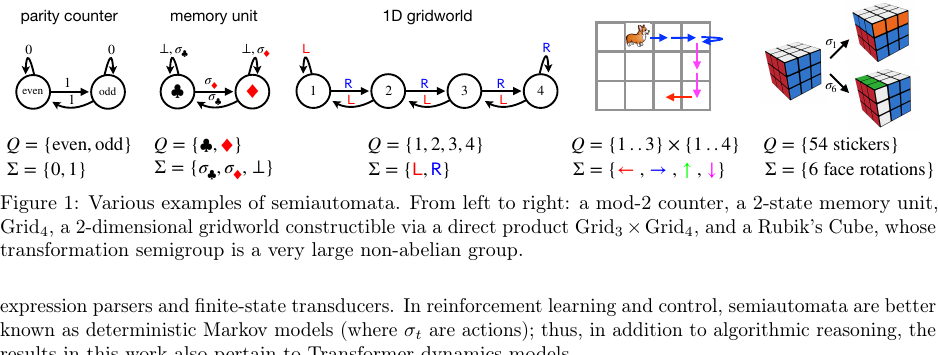

图 1 展示了从简单到复杂的动力学：

- parity counter 只有“偶数 / 奇数”两个状态；
- memory unit 可以保存最近一次写入的信息；
- 一维和二维 Gridworld 记录位置；
- 魔方旋转对应大型非阿贝尔群，说明有限状态系统并不等于“玩具问题”。

#### 2. 从逐步状态更新到变换复合

对每一个输入符号 $\sigma \in \Sigma$，都可以定义一个作用于状态集合的函数：

$$
\tau_{\sigma}: Q \rightarrow Q, \qquad \tau_{\sigma}(q) = \delta(q,\sigma).
$$

于是状态 $q_t$ 不必只被看作“前一个状态经过一步更新后的结果”，还可以写成一串函数复合：

$$
q_t =
\left(
\tau_{\sigma_t}
\circ
\tau_{\sigma_{t-1}}
\circ \cdots \circ
\tau_{\sigma_1}
\right)(q_0).
$$

这一步视角转换是全文的核心。RNN 直接携带状态 $q_t$ 向前走；Transformer 则可以先并行计算“多步转移函数的组合”，再将组合后的变换施加到 $q_0$ 上。

一个直观类比是：

- **RNN** 像逐站乘坐地铁，每到一站才知道下一站；
- **Transformer shortcut** 像先把若干段线路图合并成换乘表，再用树状归并快速算出每个位置对应的最终站点。

#### 3. 变换半群：自动机背后的代数指纹

所有由 $\{\tau_{\sigma} : \sigma \in \Sigma\}$ 经过函数复合生成的状态变换，构成变换半群（transformation semigroup）：

$$
\mathcal{T}(\mathcal{A})
=
\left\langle
\tau_{\sigma} : \sigma \in \Sigma
\right\rangle.
$$

这里的“半群”表示集合上存在满足结合律的运算。对本文而言，运算就是函数复合。几个相邻概念需要区分：

| 结构 | 额外要求 | 直观解释 |
| --- | --- | --- |
| Semigroup | 结合律 | 一组可以持续复合的操作 |
| Monoid | Semigroup + 单位元 | 除了操作外，还有“什么都不做” |
| Group | Monoid + 每个元素可逆 | 每个动作都可以撤销 |
| Abelian group | Group + 交换律 | 动作先后顺序可以交换 |

半群比群更一般，因为自动机中的状态更新未必可逆。例如，“将内存重置为 0”会抹去历史信息，无法从结果反推出之前的状态。

#### 4. Shortcut：计算深度小于显式递归深度

论文将 shortcut 定义为一族模拟器 $\{f_T\}_{T \geq 1}$。若 $f_T$ 可以模拟长度为 $T$ 的半自动机轨迹，并且网络深度满足：

$$
D(f_T) = o(T),
$$

则称其为 shortcut solution。

这里的 $o(T)$ 表示深度增长速度严格慢于线性增长。最典型的例子是：

$$
O(\log T) \ll O(T).
$$

需要注意，shortcut 是一个**计算复杂度定义**，并不自动意味着“模型投机取巧”。但是，论文后半部分进一步说明：计算意义上的 shortcut 可能演变为统计意义上的 shortcut。

#### 5. Parallel prefix scan：为什么 $O(\log T)$ 合理

函数复合满足结合律：

$$
(f \circ g) \circ h = f \circ (g \circ h).
$$

因此，一串长度为 $T$ 的变换可以用分治树并行归并。若每一层把相邻区间合并，区间长度将按 $1,2,4,8,\ldots$ 增长，所需层数为：

$$
\lceil \log_2 T \rceil.
$$

这与并行算法中的 prefix sum 或 scan 是同一种结构。区别在于，普通 prefix sum 合并的是数字加法；本文合并的是有限状态变换的函数复合。

#### 6. Krohn-Rhodes：自动机版本的“质因数分解”

Krohn-Rhodes 理论可以将有限半自动机分解为更简单的构件，再通过 cascade product 串接起来。本文最重要的两类“原子构件”是：

- modular counters：模加法计数器；
- resettable memory units：可以按条件重置的记忆单元。

整数 $60$ 可以分解为 $2^2 \times 3 \times 5$。Krohn-Rhodes 分解提供了类似的直觉：复杂自动机也可以被拆成有限状态动力学中的基本部件。但这种类比不能被过度延伸，因为半群分解比整数质因数分解复杂得多，而且论文使用的存在性分解并不等于一个易于执行的搜索算法。

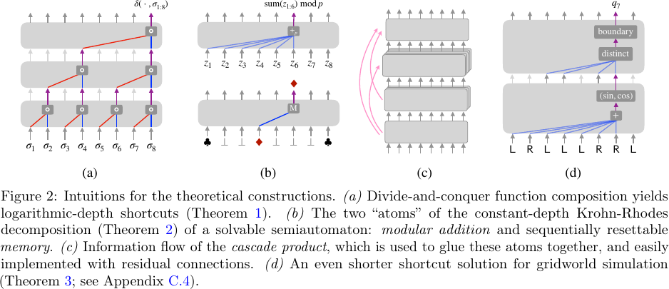

#### 7. “可解”不等于“容易求解”

可解群（solvable group）具有严格的代数含义：它可以通过一系列正规子群逐层拆解，直到每一层商群都足够简单。对有限可解群，这些简单因子最终是素数阶循环群。

因此：

- **solvable** 描述的是代数分解结构；
- **learnable** 描述的是训练算法能否从数据找到对应参数；
- **generalizable** 描述的是模型能否迁移到未见分布或更长序列。

三者不是同一个问题。论文的理论首先处理 representability，再用实验研究 learnability 与 generalization。

#### 8. 电路复杂度：深度为何是一种资源

论文使用电路复杂度解释 Transformer 深度边界：

$$
\mathrm{NC}^0
\subset
\mathrm{AC}^0
\subset
\mathrm{ACC}^0
\subseteq
\mathrm{TC}^0
\subseteq
\mathrm{NC}^1.
$$

| 复杂度类 | 主要特征 | 与本文的联系 |
| --- | --- | --- |
| $\mathrm{AC}^0$ | 常数深度、无界 fan-in AND/OR | 无法表示 parity |
| $\mathrm{ACC}^0$ | 在 $\mathrm{AC}^0$ 上增加 $\mathrm{MOD}_m$ 门 | 可表达模计数器 |
| $\mathrm{TC}^0$ | 增加 majority / threshold 门 | 可表达更强的常数深度阈值计算 |
| $\mathrm{NC}^1$ | $O(\log T)$ 深度、常数 fan-in | 覆盖高效并行计算 |

fan-in 可以理解为一个门同时读取多少个输入。无界 fan-in 像一个会议室中允许所有人同时投票；常数 fan-in 则像每次只能两两合并意见。后者若要聚合 $T$ 个输入，通常需要树状的 $O(\log T)$ 层。

### Theory

#### Theorem 1：任意半自动机都可以做对数深度并行模拟

任意半自动机 $\mathcal{A}=(Q,\Sigma,\delta)$ 在长度 $T$ 上都可以由 Transformer 模拟，其复杂度满足：

$$
\text{depth} = O(\log T),
$$

$$
\text{embedding dimension} = O(|Q|),
$$

$$
\text{attention width} = O(|Q|),
$$

$$
\text{MLP width} = O(|Q|^2).
$$

核心机制是分治式函数复合。每个 token 首先表示一个局部状态变换，然后注意力层按树状结构逐层组合更长区间的变换。

#### Theorem 2：可解半自动机存在常数深度 shortcut

对可解半自动机，Transformer 可以利用 Krohn-Rhodes 分解，将系统拆成 modular counters 与 memory units，再通过 cascade product 拼接。所得深度依赖 $|Q|$，但不依赖序列长度 $T$：

$$
\text{depth} = O(|Q|^2 \log |Q|).
$$

这里存在一个容易忽略的限制：常数深度并不等于低成本。论文给出的宽度界仍可能随 $|Q|$ 指数增长，并且某些 MLP 宽度项随 $T$ 增长。若允许周期激活函数，例如：

$$
x \mapsto \sin(x),
$$

则模运算可以更紧凑地实现。标准 ReLU 网络则往往需要通过更宽的网络记忆取模映射。

#### Theorem 3：一维 Gridworld 存在深度为 2 的 shortcut

Gridworld 的状态是一维线段上的位置，输入是“若可能则向左走”或“若可能则向右走”。边界会截断移动，因此它不是简单的整数求和。

论文构造了一个两层 shortcut：

1. 第一层并行计算前缀位移；
2. 第二层寻找最近一次触碰边界的位置，并据此恢复当前状态。

在允许 max-pooling 的条件下：

$$
\text{depth}=2,
\qquad
\text{embedding dimension}=O(1),
\qquad
\text{attention width}=O(n),
\qquad
\text{MLP width}=O(T).
$$

#### Theorem 4：不可解半自动机的常数深度障碍

若半自动机不可解，则在足够大的 $T$ 下，不存在同时满足以下条件的 Transformer：

- 深度与 $T$ 无关；
- 宽度至多为 $T$ 的多项式；
- 数值精度为 $O(\log T)$；
- 可以连续模拟该半自动机。

除非：

$$
\mathrm{TC}^0 = \mathrm{NC}^1.
$$

这一结论将模型表达能力边界连接到经典电路复杂度开放问题。最小的不可解群是 $A_5$，即 5 个元素的偶置换群，共有 60 个元素。

### Experiments

#### 1. 标准训练可以找到 shortcut

作者在 19 类半自动机上训练 GPT-2-like Transformer：

- 输入序列长度固定为 $T=100$；
- 网络深度 $L$ 从 1 到 16；
- 训练样本数量不超过 $10^6$；
- 输入空间规模为 $|\Sigma|^{100}$，无法依靠逐条记忆解决；
- 评价指标是对未见序列的状态轨迹预测准确率。

实验显示，所有测试半自动机都可以获得超过 99% 的分布内准确率。更复杂的非阿贝尔群通常需要更深网络，这与理论结构一致。

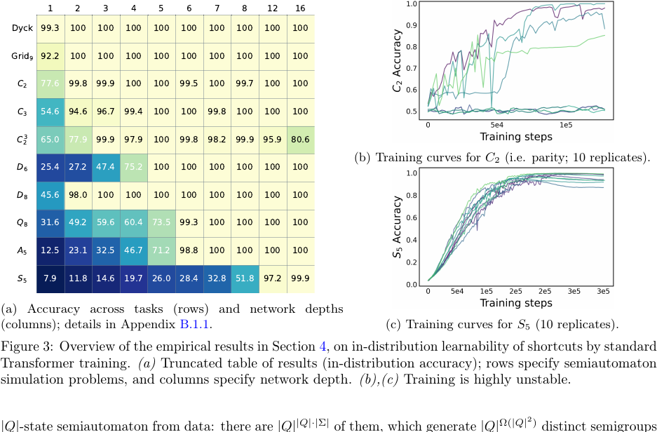

#### 2. 注意力图提供了机制层面的线索

在一维 Gridworld 上，部分注意力头呈现出清晰的最近边界检测行为：

- 某些注意力头近似均匀聚合；
- 某些注意力头专门定位最近左边界；
- 某些注意力头专门定位最近右边界。

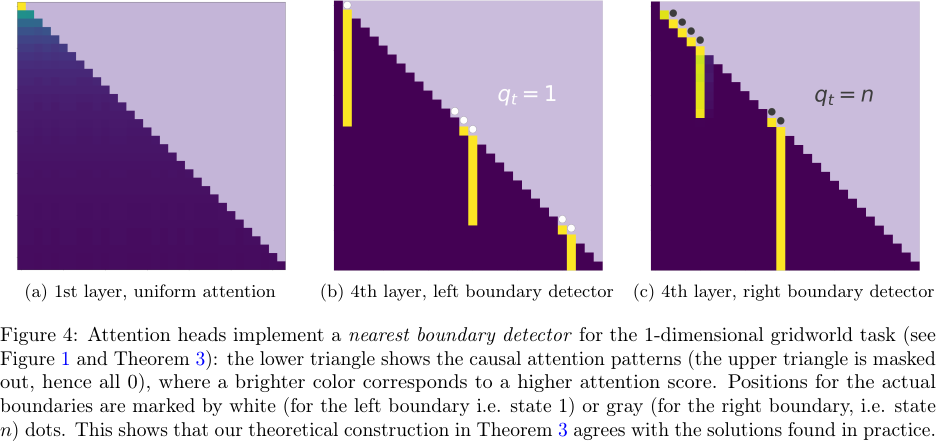

这与 Theorem 3 的构造一致，但仍不等于完整的因果机制证明。注意力可视化可以提供线索，却不能单独证明整个网络严格实现了理论算法。

#### 3. 间接监督与稀疏标签

当完整状态 $q_t$ 不可观察，只能看到某个投影：

$$
\widetilde{q}_t = \phi(q_t),
$$

Transformer 在部分设置下仍可获得较好分布内性能。但是，当训练序列中的状态标签越来越稀疏时，LSTM 明显比 Transformer 稳健。

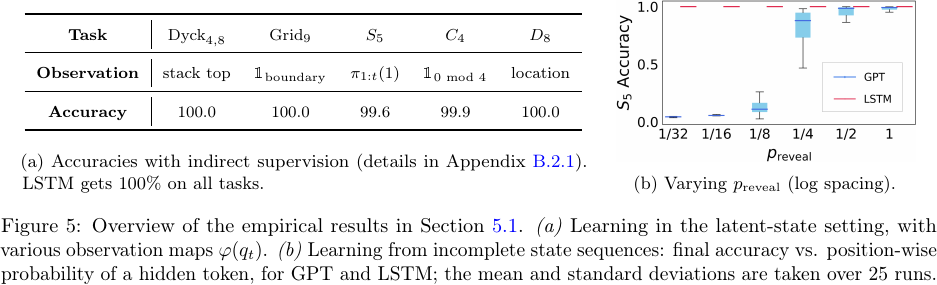

#### 4. 分布外泛化：shortcut 的统计脆弱性

以 parity 为例，一个 Transformer shortcut 可能先计算前缀中 1 的数量：

$$
c_t = \sum_{i=1}^{t} \sigma_i,
$$

再由 MLP 计算：

$$
q_t = c_t \bmod 2.
$$

这个解在训练分布内完全合理，但当测试数据产生训练期间罕见的计数值时，MLP 可能无法正确外推取模规律。相比之下，RNN 只需重复一个局部规则：

$$
q_t = q_{t-1} \oplus \sigma_t.
$$

局部规则不会因为累计计数变大而改变。

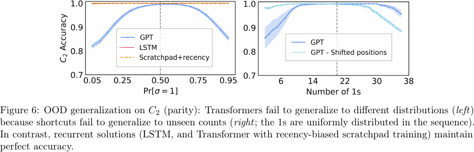

#### 5. 长度泛化：更长序列会暴露 shortcut 的盲区

当测试长度超过训练长度时，标准 Transformer 的准确率显著下降。随机平移位置编码、移除位置编码等方法可以改善结果，但并不能彻底修复问题。

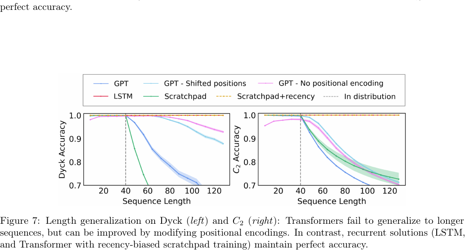

#### 6. Scratchpad + recency bias：用架构偏置换回递归解

作者将中间状态显式写入 scratchpad，并引入 recency bias，使模型更倾向于关注最近状态。这样可以引导 Transformer 学习类似 RNN 的局部迭代规则。

收益：

- 更稳健的分布外泛化；
- 更稳健的长度泛化。

代价：

- 放弃浅层 shortcut 的并行优势；
- 推理深度重新接近 $O(T)$。

### Insights

#### 1. 表示能力、优化可达性与泛化能力必须分开讨论

论文最重要的方法论价值不是“Transformer 能做自动机”，而是把三个问题拆开：

| 问题 | 论文中的回答 |
| --- | --- |
| 是否存在浅层参数解？ | 对任意半自动机存在 $O(\log T)$ 深度解 |
| SGD 是否能找到某些浅层解？ | 在合成任务上经常可以 |
| 找到的解是否稳健外推？ | 未必，OOD 与长度泛化可能较差 |

一个模型在训练集和同分布测试集上正确，不足以说明它学到了期望算法。它可能学到一个在局部数据覆盖范围内等价、但在边界条件下失效的替代程序。

#### 2. Shortcut 既可能是加速器，也可能是统计陷阱

shortcut 有两个互补含义：

- **计算 shortcut**：将 $T$ 步串行运算压缩为 $O(\log T)$ 或 $O(1)$ 层；
- **统计 shortcut**：依赖训练分布中的偶然规律，而非稳定因果机制。

本文的关键洞察是：二者可能是同一个解的两面。并行 shortcut 会创造新的中间变量，例如累计计数；这些变量若超出训练覆盖范围，就可能造成脆弱性。

#### 3. 深度下降并不保证总计算成本下降

并行时间与总工作量不是一回事。深度更像关键路径长度，宽度更像同时投入的计算资源。一个常数深度网络若需要指数宽度，可能理论上并行、工程上却不可部署。

因此，评估 shortcut 至少需要同时查看：

$$
\text{depth},\quad
\text{width},\quad
\text{parameter count},\quad
\text{precision},\quad
\text{memory traffic}.
$$

#### 4. 半自动机是研究算法推理的“显微镜”

真实语言任务混合了语义、噪声、世界知识与数据偏差。半自动机任务刻意去掉这些因素，只保留状态跟踪和组合结构。它不能直接替代真实任务，但可以用于检验模型究竟学到了：

- 局部递归更新；
- 全局计数；
- 边界检测；
- 条件重置；
- 依赖位置编码的插值规则。

### Critical Review

#### Strengths

- 理论结构统一：将 Transformer、半自动机、变换半群和电路复杂度连接起来。
- 结论层次清晰：从一般 $O(\log T)$ shortcut，到可解半自动机的 $O(1)$ shortcut，再到 Gridworld 的深度 2 特例。
- 实验与理论相互照应：注意力图中出现了与理论构造一致的边界检测模式。
- 没有回避负面结果：论文明确展示 OOD、长度泛化和训练稳定性问题。

#### Limitations

- 理论上的“存在”不等于工程上的“实用”。部分构造需要较大宽度、特殊激活函数或 max-pooling。
- shortcut 定义允许模型族 $\{f_T\}$ 随长度 $T$ 改变，因此不能直接推出同一个固定模型可以无限长度外推。
- 实验主要基于合成自动机，无法单独证明大型语言模型中的复杂推理也采用相同机制。
- 论文报告的主结果常取 20 次重复训练中的最佳模型，适合回答“是否能找到”，但不足以说明训练稳定性。
- 注意力模式与理论构造一致，但完整机制解释仍需要更强的因果干预或参数级分析。

### 不知道自己不知道

#### 1. Non-uniformity：长度相关的模型族

论文研究的是一族模型 $\{f_T\}$。这意味着长度为 100 与长度为 1000 的理论构造可以使用不同参数。读者若将结论理解为“训练一个固定 Transformer 后，它会自动推广到任意长度”，就会越过论文真正证明的边界。

#### 2. Hard attention 与 soft attention 的差异

理论构造中经常需要注意力高度集中到特定位置。真实 softmax attention 通常只能近似 hard attention。随着上下文长度增加，许多极小但非零的权重可能累计成不可忽略误差，因此长度外推还受数值精度和权重尺度影响。

#### 3. 位置编码不是中性配件

位置编码会改变模型可表示的规则，也会改变长度外推行为。论文显示随机位置平移和移除位置编码可以改善长度泛化，这说明失败未必只来自“算法没学会”，也可能来自坐标系统本身。

#### 4. 可观测状态与 next-token prediction 的距离

完整监督 $(q_1,\ldots,q_T)$ 比只给最终标签或 next-token 标签更强。真实语言建模通常看不到自动机内部状态。监督信号越弱，模型越难恢复稳定的局部递归规则。

#### 5. “找到 shortcut”不等于“找到唯一 shortcut”

同一输入输出函数可能存在多种互不相同的内部算法。理论给出了若干可行构造，实验只能说明训练后的行为与其中某些结构一致，不能说明优化必然选择某一种标准形式。

### 附录图表索引

以下图表来自论文附录，保留用于后续复查实验细节和证明构造。

#### 完整实验结果

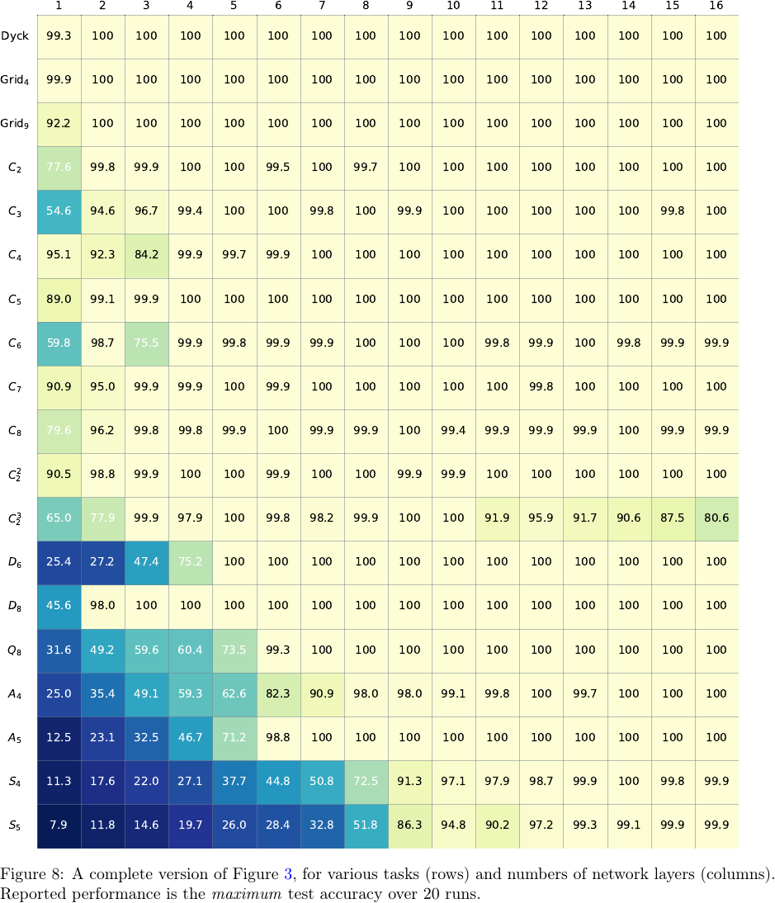

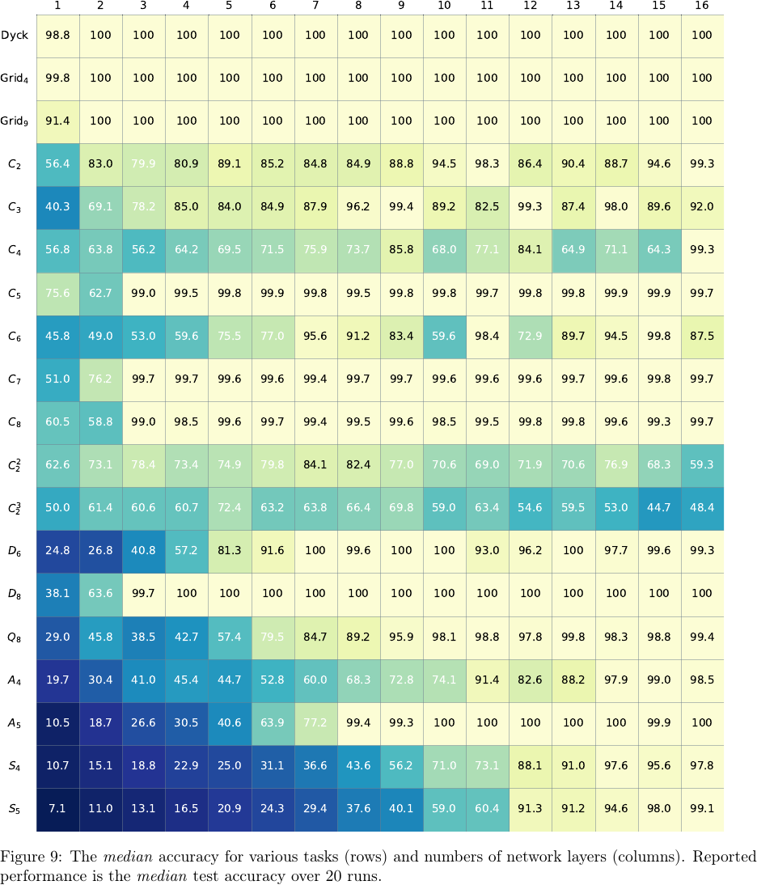

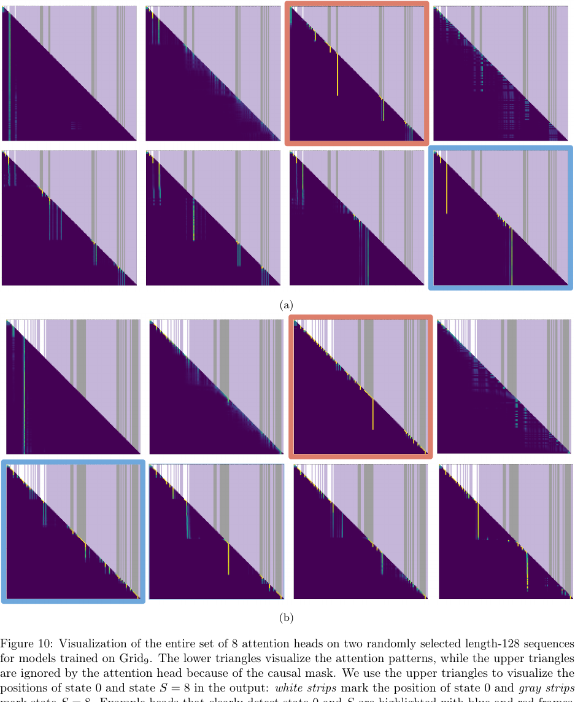

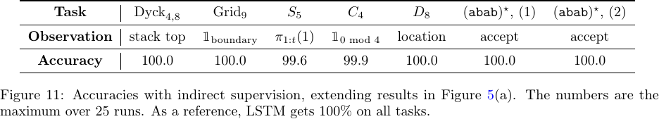

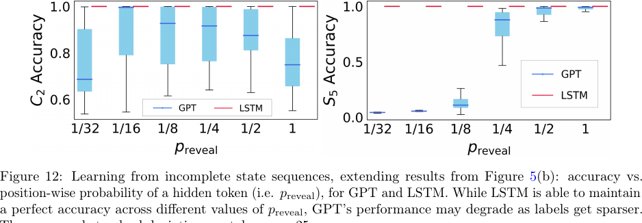

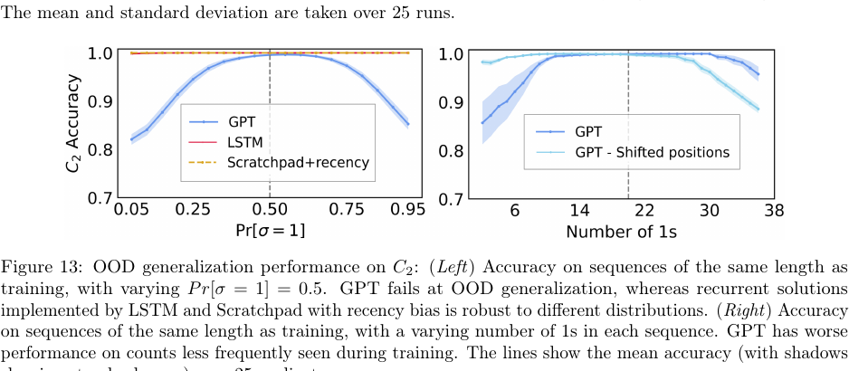

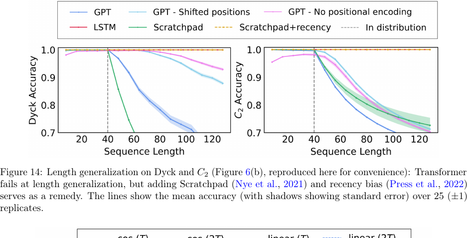

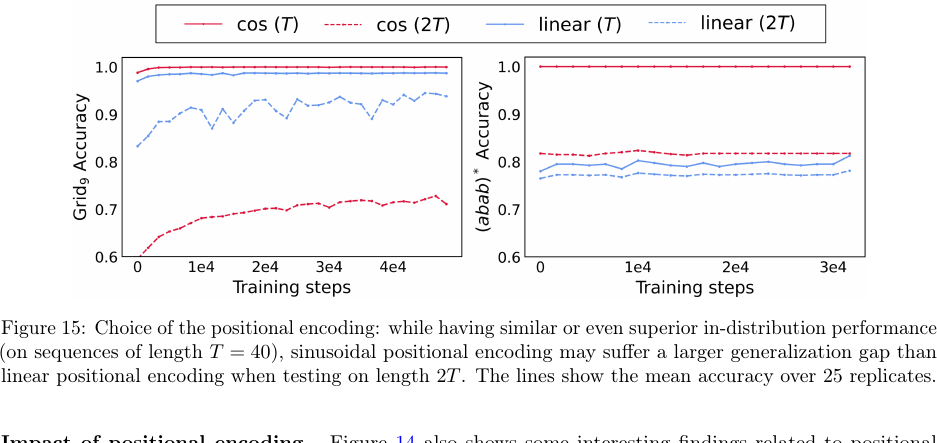

#### 证明构造

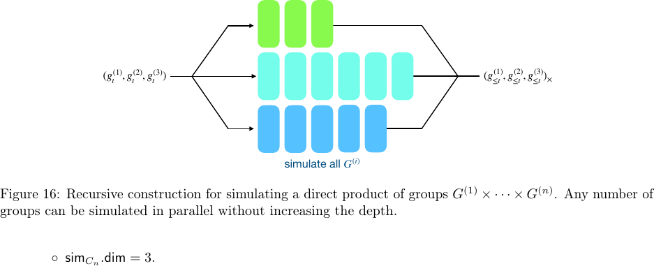

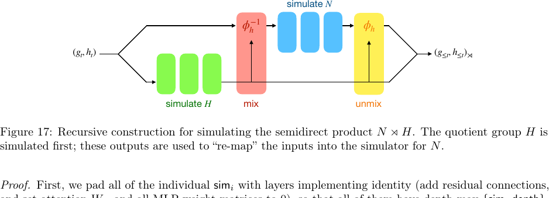

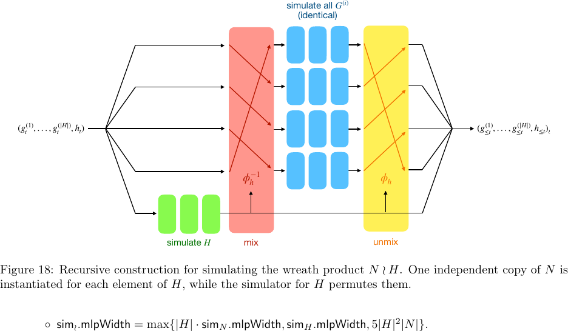

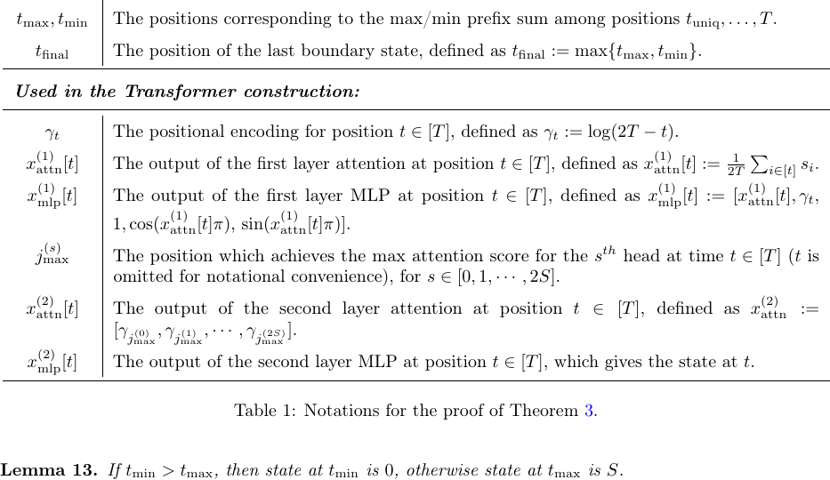

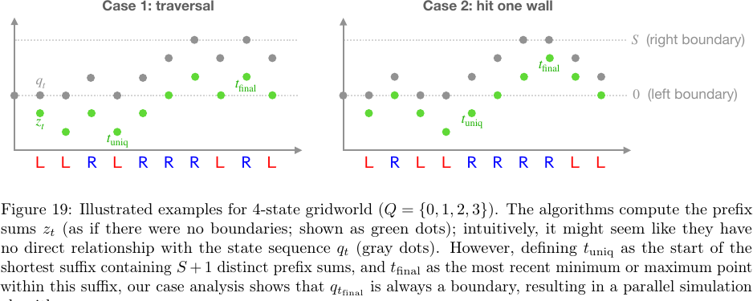

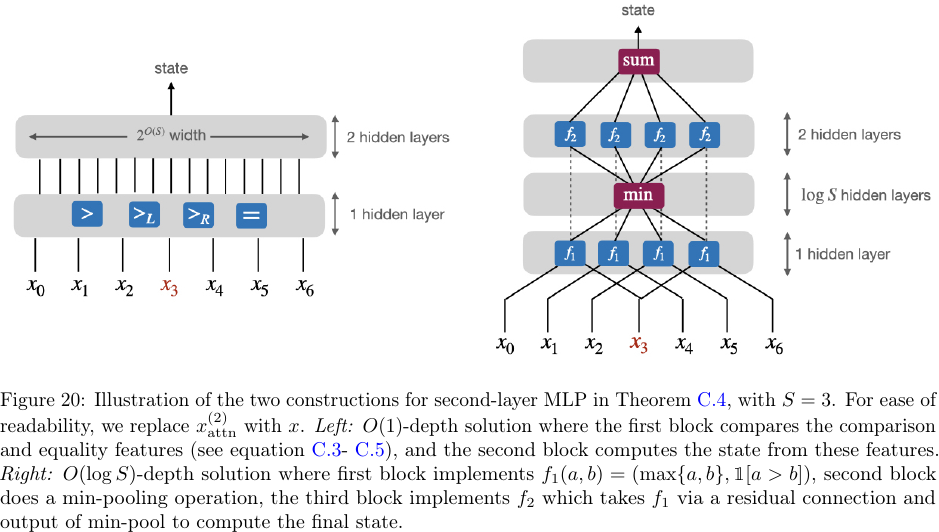

### 阅读后可追问的问题

- 哪些真实语言任务可以近似抽象为有限状态或低记忆动力学？
- 模型是否可以同时保留浅层 shortcut 的并行效率与递归解的长度泛化？
- 能否通过训练数据设计，让累计计数、边界位置等中间变量得到更充分覆盖？
- 能否通过因果干预验证注意力头确实承担了理论预测的边界检测功能？
- 对给定自动机，如何高效找到接近最短深度的 Transformer 构造？

