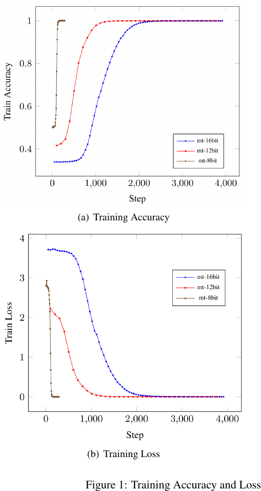
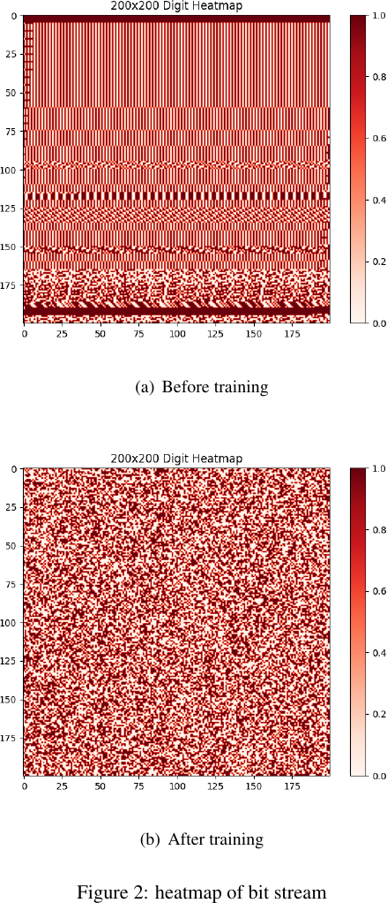
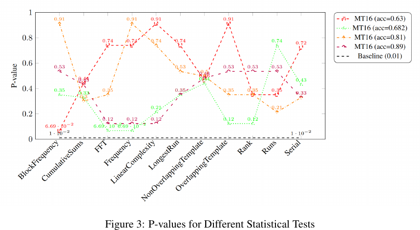
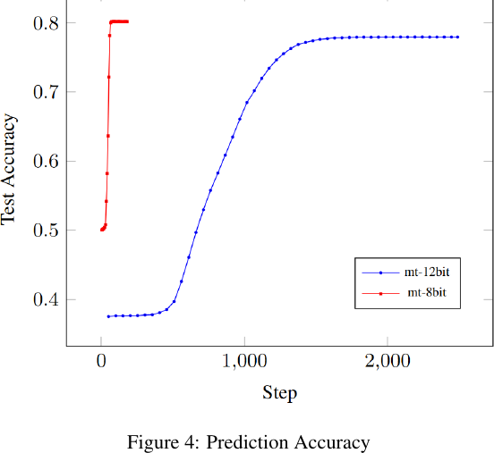

# Transformers in Pseudo-Random Number Generation: A Dual Perspective on Theory and Practice

原论文链接：[arXiv:2508.01134](https://arxiv.org/abs/2508.01134)

正式出版页：[AAAI 2026 official page](https://ojs.aaai.org/index.php/AAAI/article/view/39478)

本地 PDF：[Transformers in Pseudo-Random Number Generation - A Dual Perspective on Theory and Practice.pdf](../Transformers%20in%20Pseudo-Random%20Number%20Generation%20-%20A%20Dual%20Perspective%20on%20Theory%20and%20Practice.pdf)

上位地图：[[MOC - 计算机]]

相关主题：[[Transformer]]、[[伪随机数生成器]]、[[Mersenne Twister]]、[[预测攻击]]、[[NIST Statistical Test Suite]]、[[电路复杂度]]

### Abstract

这篇论文把 Transformer 放到伪随机数生成器（Pseudo-Random Number Generator, PRNG）的语境中考察，核心视角有两个：

- **构造视角**：Transformer 能不能生成看起来随机的伪随机序列。
- **攻击/评估视角**：Transformer 能不能学习既有 PRNG 的输出规律，从而预测后续值，并作为 PRNG 安全评估工具。

作者从理论和实验两侧推进。理论上，论文构造性地证明 decoder-only Transformer 在 Chain-of-Thought 式中间步骤帮助下，可以模拟 Linear Congruential Generator（LCG）和 Mersenne Twister（MT）这两类典型 PRNG。实验上，作者用 GPT-2 架构学习 MT 生成的序列，观察到 8-bit、12-bit、16-bit 设置下训练可以收敛；同时，对 Transformer 生成序列执行 NIST Statistical Test Suite，报告通过 11/15 项测试；最后，论文用 Transformer 预测 MT 输出，得到约 0.7 到 0.8 的预测准确率。

一句话概括：

> 这篇论文不是简单声称“Transformer 会生成随机数”，而是把 PRNG 看成一种确定性但高度非线性的序列函数，讨论 Transformer 是否能表达、模拟、生成和攻击这类函数。

#### 所要解决的问题：

- PRNG 是确定性算法，却要输出“看起来像随机”的序列；这种“确定性外壳 + 随机性外观”的结构是否适合被 Transformer 学习？
- Transformer 的 attention 与 FFN 能否模拟 PRNG 中常见的位运算、模运算、索引读取和状态更新？
- 如果 Transformer 能学习 PRNG 的输出规律，它究竟是新的生成器，还是新的攻击器？
- 通过 NIST 统计测试是否足以说明生成器安全？
- Transformer 的理论表达能力结论，能否转化为实际训练可学习性和密码学安全性结论？

####  主要贡献

- 证明 Transformer 可以模拟 LCG。
- 证明带 CoT 的 Transformer 可以模拟 MT。
- 给出 log-precision decoder-only Transformer 能表达 non-uniform AC0 的推论。
- 用 GPT-2 架构实验验证 MT 8-bit、12-bit、16-bit 序列可被学习到近似完美训练准确率。
- 用 NIST STS 检查 Transformer 生成序列，报告 11/15 项通过。
- 将 Transformer 用作预测攻击模型，报告对 MT 输出有 0.7 到 0.8 左右的预测准确率。

### Knowledge

#### 1. PRNG 与 TRNG

**TRNG（True Random Number Generator）** 从物理熵源中取随机性，例如热噪声、量子过程或硬件抖动。它像从现实世界的“湍流”中舀水，每次舀出的形状天然不可复现。

**PRNG（Pseudo-Random Number Generator）** 则是确定性算法：

$$
x_{t+1} = F(x_t; \theta)
$$

其中 $x_t$ 是内部状态或输出，$\theta$ 是算法参数，初始种子 $x_0$ 一旦确定，整条序列就被确定。PRNG 像一个足够复杂的钟表：外人看指针轨迹似乎难以预测，但内部齿轮并不随机。

关键边界：

- **统计随机性**：序列是否通过频率、游程、熵、傅里叶等统计检验。
- **密码学不可预测性**：攻击者即使看到大量输出，也不能有效预测下一位或恢复内部状态。
- **可复现性**：同一个 seed 必须产生同一条序列，这对模拟、采样、调试非常重要。

这三者不是同义词。一个序列可能通过很多统计测试，但仍然在密码学上不安全。

#### 2. Linear Congruential Generator（LCG）

LCG 是最经典的 PRNG 之一：

$$
x_{n+1} = (a x_n + c) \bmod m
$$

其中：

- $x_n$：第 $n$ 个状态或输出。
- $a$：乘数。
- $c$：增量。
- $m$：模数。
- $x_0$：seed。

LCG 的直观图像是“在一个环形表盘上按固定规则跳步”。模运算让状态永远留在有限集合中，乘加规则让它不断移动。它快、简单、可复现，但线性结构明显，通常不适合作为现代密码学安全 PRNG。

对偶概念：

- **线性递推**：结构简单，可分析，也更容易被攻击。
- **非线性混合**：结构更复杂，通常更难预测，但也更难证明安全。

#### 3. Mersenne Twister（MT）

Mersenne Twister 维护一个很长的状态数组，每次从数组中取几个旧状态，通过“拼接高低位、右移、异或、掩码”等位运算生成新状态，再对新状态做几轮扰动，输出一个伪随机数。

Mersenne Twister 是高质量非密码学 PRNG，典型版本 MT19937 的周期为：

$$
2^{19937} - 1
$$

它通过较大的内部状态、位级旋转、异或、移位和 tempering 操作生成输出。论文将 MT 的过程拆成两类操作：

- **Rotation / state transition**：更新内部状态。
- **Extraction / tempering**：通过位运算从状态中提取输出。

Twist

$$
t \leftarrow (x[i] \land upper) \lor (x[(i+1) \bmod n] \land lower)
$$

    拼接高低位  state[i]   =  高位部分  |  低位部分  state[i] = 高位部分 | 低位部分 取高位和低位进行拼接  作为t
$$
z \leftarrow x[(i+m) \bmod n] \oplus (t \gg 1) \oplus
\begin{cases}
0, & \text{if } t_0 = 0 \\
a, & \text{otherwise}
\end{cases}
$$
    t 右移 根据t~0~的值进行异或  在于x[i+m] 异或  作为z

Extraction 生成下一个伪随机数
$$
\begin{array}{rcll}
x[i] &\leftarrow& z & (7) \\
y &\leftarrow& x[i] & (8) \\
y &\leftarrow& y \oplus (y \gg u) & (9) \\
y &\leftarrow& y \oplus ((y \ll s) \land b) & (10) \\
y &\leftarrow& y \oplus ((y \ll t) \land c) & (11) \\
y &\leftarrow& y \oplus (y \gg l) & (12)
\end{array}
$$
MT 的关键误区是：周期长不等于密码学安全。MT 很适合仿真和一般随机采样，但如果攻击者恢复足够多内部状态，后续输出可以被预测。

#### 4. Circuit Complexity 电路复杂性

用简单逻辑电路堆叠，组成复杂电路  fan-in 一个门能接手多少输入  unbounded fan-in 一个门可以接受任意个输入  polynomial size 电路规模（n表示多项式的长度）

**TC^k−1^：带 Majority 门的电路类**

- 电路深度为：

O(log⁡k−1n)O(\log^{k-1} n)O(logk−1n)

- 电路规模是多项式大小；
- 允许使用 **unbounded fan-in MAJORITY gates**；
- NOT 门可以免费使用。

​      输入中哪个值出现得最多，就输出哪个值。

**AC^k−1^[m]：带 MOD 门的电路类 **  使用 AND OR MOD

* 常数深度或对数级相关深度；

* 多项式规模；

* unbounded fan-in；

**MOD~m~ **：输入1的个数为m的倍数 则为 1 否则为 0  用作非门

non-uniform 输入不同长度 可用不同电路

### Theoretical Results

#### 1. 理论路线：把 PRNG 拆成 Transformer 可模拟的基本操作

作者先证明 Transformer 层可以近似实现若干布尔操作：

- AND：$\phi(i) \land \phi(j)   $                $ ∥f (i, j) − φ(i) ∧ φ(j)∥∞ ≤ ε.$      主要 i，j有一个是0，我们就生成一个接近于0的数
- OR：$\phi(i) \lor \phi(j)$                   φ(i) 和 φ(j) 至少一个接近 1，则输出接近 1；
-  NOT：$\neg \phi(i)$                           ¬ϕ(i)=1−ϕ(i)
- XOR：$\phi(i) \oplus \phi(j)$                同理

这些操作是位级 PRNG 的“原子零件”。如果 attention 和 FFN 能拼出这些零件，再配合索引读取和多层组合，就可以模拟更复杂的状态转移。

##### Theorem 3.5：Transformer 模拟 LCG

LCG 的一步递推是：
$$
x_{i+1} = (a x_i + c) \bmod m
$$
论文声称可以构造一个 autoregressive Transformer 来生成 $n$ 个伪随机数，其配置为：

- hidden dimension：$d = O(n)$
- layer：1
- attention head：1
- parameters：$O(\text{poly}(n))$

核心逻辑：

1. attention 模块实现 $a x_i$ 这类与常数相乘的操作。
2. FFN 模块实现加法和模运算。
3. autoregressive 结构把上一步输出作为下一步输入。

直观上，LCG 像一条单线递推链，因此一层一头的构造就足够表达。

##### Theorem 3.6：带 CoT 的 Transformer 模拟 MT

MT 比 LCG 复杂得多，因为它需要维护较大状态数组，并在每一步读取多个状态位置：
$$
x[i], \quad x[(i+1) \bmod n], \quad x[(i+m) \bmod n]
$$
论文声称可以构造带 CoT 的 autoregressive Transformer 来模拟 MT：

- hidden dimension：$d = O(n)$
- layers：17
- attention heads：主文称每层至多 4 个
- parameters：$O(\text{poly}(n))$

模拟过程大致为：

1. 计算已生成随机数个数 $cnt$。
2. 根据 $cnt$ 计算当前需要访问的 MT 状态索引。
3. 用 attention 取回相关状态向量。
4. 用多层 Transformer 实现 rotation：
$$
t \leftarrow (x[i] \land upper) \lor (x[(i+1) \bmod n] \land lower)
$$
5. 再实现 extraction / tempering：
$$
y \leftarrow y \oplus (y \gg u)
$$

$$
y \leftarrow y \oplus ((y \ll s) \land b)
$$
6. 最后一层区分中间符号输出与真正伪随机数输出。

##### Corollary 3.7：Transformer 表达 non-uniform AC0

由于 Transformer 可以模拟 AND 和 OR 等基础门，论文进一步得到：
$$
\forall \{C_n\}_{n \in \mathbb{N}} \in AC0,
\exists \{T_n\}_{n \in \mathbb{N}}
\quad
T_n \text{ simulates } C_n
$$

#### 2. 实验路线：用 GPT-2 风格模型学习与生成 PRNG 序列

这一节的实验最好不要只看“通过了几个测试”或“准确率是多少”，而要把四张图连起来看成一条证据链：
$$
\text{能拟合 MT}
\rightarrow
\text{生成 bit stream 变得更像随机}
\rightarrow
\text{通过多数统计测试}
\rightarrow
\text{也能用于预测攻击}
$$
也就是说，论文实验的核心不是单点结果，而是 Transformer 在 PRNG 场景中的双重身份：它既像生成器，也像攻击器。

##### A. MT simulation：Transformer 是否能学会模拟 MT

数据来自 MT19937-32，再通过模运算转换为不同 bit-width：

| Dataset | Sequence Length | Training Set Size |
|---|---:|---:|
| mt19937-8bit | 256 | 256 |
| mt19937-12bit | 4096 | 4096 |
| mt19937-16bit | 4096 | 4096 |

模型配置采用 GPT-2 架构，主要参数：

| Parameter | Value |
|---|---:|
| n_embd | 768 |
| n_head | 12 |
| n_layer | 12 |
| n_positions | 1024 |
| vocab_size | 50257 |
| dropout | 0.1 |

**图 1** 

这张图说明：bit-width 越高，模型需要更长时间捕获 MT 输出规律。直观上，8-bit 任务像在小棋盘上找周期和局部模式，16-bit 任务像在更大的棋盘上找同一套隐藏规则；规则仍然存在，但搜索空间更大。

##### B. Bit stream heatmap：训练是否改变生成序列的可视结构

**图 2** 

- Figure 2(a) 是训练前的 bit stream，可见明显条纹、块状重复和规则结构。
- Figure 2(b) 是训练后的 bit stream，局部结构被打散，视觉上更接近均匀散布的噪声。

##### C. NIST Statistical Tests：生成序列是否通过统计随机性测试

训练了一个 Transformer 来生成伪随机序列，然后用 NIST STS 的 15 项随机性测试去检查这些序列。结果显示通过了 11/15 项测试，说明生成序列有一定随机性，但仍然存在明显缺陷。

利用16bit dataset 训练Transformer模型 -----> 保存不同训练率的checkpoint------>   对于不同训练度生成伪随机序列 ----> 使用NIST 进行测试

作者在 16-bit 数据集上保存不同准确率 checkpoint：

- 0.63
- 0.68
- 0.81
- 0.89

然后对每个 checkpoint 生成的 bit stream 执行 NIST STS。

##### D. Prediction Attack：Transformer 是否能预测 MT 输出

作者用 Transformer 预测 MT 输出，设置包括：

- 8-bit 与 12-bit 随机数序列。
- train:test 比例为 1:10 和 1:20。
- 预测准确率约 0.7 到 0.8。

**图 4 的读法：**

- 红线是 8-bit MT 预测任务，快速升到约 0.8。
- 蓝线是 12-bit MT 预测任务，起步更低、收敛更慢，但最终接近 0.78。
- bit-width 提升后，预测更难，但不是不可学。

这张图把论文的“攻击视角”具体化了：如果一个模型能够从历史输出中预测未来输出，那么它就不只是 PRNG 生成器的候选方案，也可以成为 PRNG 安全评估器。

### Critical Reading

#### 1. 贡献的强点

- 论文不是只做经验训练，而是给出了 LCG 与 MT 的构造性模拟证明。
- 将 Transformer 表达能力和 PRNG 这种具体算法族连接起来，比抽象地讨论“Transformer 很强”更有落点。
- 同时讨论生成和攻击，揭示了一个重要双面性：越能学习 PRNG 规律的模型，越可能成为评估 PRNG 弱点的工具。

#### 2. 需要谨慎的地方

**统计随机性不等于密码学安全。**

NIST STS 通过 11/15 项测试，只能说明在这些统计维度上没有明显异常。它不能证明攻击者无法预测，也不能证明模型适合密码学用途。

**训练准确率不等于算法理解。**

8-bit、12-bit、16-bit MT 的近似完美训练准确率说明模型能拟合实验设定中的序列，但仍需区分：

- reduced-bit 任务 vs 完整 MT19937 输出
- 训练集拟合 vs 未见 seed 泛化
- 序列预测准确率 vs 内部状态恢复能力

**生成器与攻击器身份存在张力。**

论文一方面展示 Transformer 可以生成随机性较强的序列，另一方面展示 Transformer 可以预测 MT 输出。这提示读者必须追问：

- Transformer 生成的序列是否也容易被另一个 Transformer 预测？
- 如果模型训练数据来自某个 PRNG，它是学习了“随机性”，还是学习了该 PRNG 的偏差？
- 生成器安全性是否需要 adversarial evaluator，而不仅是 NIST STS？

#### 3. 细读疑点

- 主文 Theorem 3.6 称 MT 构造中每层至多 4 个 attention heads；附录 C.2 的 Layer 3 描述中出现 “five attention heads”。这可能是写作错误、版本差异，或 head 计数口径不同。精读时需要核对原 LaTeX 或后续版本。
- Conclusion 中说生成序列表现出对 prediction attacks 的 resistance，但 Section 4.3 同时报告 Transformer 对 MT 输出可达到 0.7 到 0.8 的预测准确率。这里需要区分攻击对象是 MT、Transformer generator，还是不同实验设置下的序列。
- 论文没有在正文中充分展开 seed 泛化、跨参数泛化和完整密码学威胁模型。这些是从“PRNG 实验”走向“PRNG 安全”的关键缺口。

### 用户可能“不知道自己不知道”的背景

#### 1. PRNG 安全通常要看 next-bit unpredictability

密码学 PRNG 常用的强直觉是：给定前面很多输出，攻击者仍然不能有效预测下一 bit。形式化地，可以写成：
$$
\Pr[A(y_1,\dots,y_t)=y_{t+1}] \le \frac{1}{2} + \epsilon
$$
其中 $A$ 是任意多项式时间攻击者，$\epsilon$ 应该可忽略。NIST STS 检查的是统计偏差，而 next-bit unpredictability 更接近攻击者视角。

#### 2. “能模拟算法”与“能学到算法”是两回事

理论构造说存在某个 Transformer 参数配置 $T^\*$ 能模拟算法：
$$
\exists T^\*, \quad T^\*(x_{1:t}) = x_{t+1}
$$
训练问题问的是优化算法能否从数据中找到它：
$$
\text{SGD}(\mathcal{D}) \rightarrow T \approx T^\*
$$

前者是表达能力，后者是可学习性。很多论文的理论证明解决前者，但实验只能部分支持后者。

#### 3. non-uniform 结论通常比 uniform 结论弱

non-uniform 允许每个输入长度都有一套专门模型。它适合表达能力证明，但不一定对应一个现实中可扩展、可自动构造的算法流程。读这类结论时，需要问：

- 构造是否依赖输入长度？
- 参数是否需要为每个长度重设？
- 是否存在统一训练或生成过程？

#### 4. MT 本身不是密码学 PRNG

MT19937 在模拟、统计采样中很常用，但并不设计为密码学安全。用 MT 做 prediction attack 是合理的研究起点，但不能直接说明 Transformer 能攻击 AES-CTR、ChaCha20 或基于硬问题的 CSPRNG。

### Sources

- arXiv 页面：https://arxiv.org/abs/2508.01134
- AAAI 正式出版页：https://ojs.aaai.org/index.php/AAAI/article/view/39478
- 本地 PDF：`02_Papers/Transformers in Pseudo-Random Number Generation - A Dual Perspective on Theory and Practice.pdf`

## 标签

#status/进行中 #type/笔记 #type/论文
